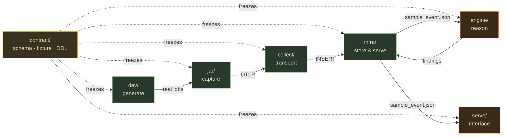

# Apex — The Pipeline

Apex is a 6-stage pipeline. Each stage is a directory, named for its role. The directory list *is* the data flow:

```
dev  →  jar  →  collect  →  infra  →  engine  →  serve
```

| # | Dir | Role | Language | Depends on | Brief |
|---|---|---|---|---|---|
| ① | [`dev/`](dev/) | **generate** — Spark/Delta lab producing real jobs with known pathologies | Python + Docker | contract | [docs/lanes/DEV.md](docs/lanes/DEV.md) |
| ② | [`jar/`](jar/) | **capture** — SparkListener → stage metrics + logical-plan fingerprint → OTLP | Scala | dev, contract | [docs/lanes/JAR.md](docs/lanes/JAR.md) |
| ③ | [`collect/`](collect/) | **transport** — OTLP :4318 → PII scrub → ClickHouse | YAML (otelcol) | contract | [docs/lanes/COLLECT.md](docs/lanes/COLLECT.md) |
| ④ | [`infra/`](infra/) | **store & serve** — ClickHouse + HyperDX (ClickStack) | SQL + Docker | contract | [docs/lanes/INFRA.md](docs/lanes/INFRA.md) |
| ⑤ | [`engine/`](engine/) | **reason** — deterministic SQL watchers + gated CrewAI correlation/judge → findings | Python/CrewAI | infra, contract | [docs/lanes/ENGINE.md](docs/lanes/ENGINE.md) |
| ⑥ | [`serve/`](serve/) | **interface** — MCP server (analyze_run/compare_runs/search_kb + suggest_fix) | Python/FastMCP | infra, contract | [docs/lanes/SERVE.md](docs/lanes/SERVE.md) |

## The contract holds it together

[`contract/`](contract/) is the frozen interface every stage obeys — the telemetry event shape, the ClickHouse DDL, the `Finding` schema, `job_id` threading. **Read [CONTRACT.md](CONTRACT.md) first.** A stage may *add* fields; it may never rename or repurpose one.



## Build order (solo micro-strategy)

**Do NOT build the dirs left-to-right to completion.** Two passes:

1. **Commit the contract first** — `contract/sample_event.json` + `contract/*.ddl.sql` + `CONTRACT.md`. This is commit #1; it unblocks everything.
2. **Tracer bullet** — the thinnest thing through all six dirs (one fake number, `dev` → ... → `serve` answer). Merge to a green `main`. The pipe is now proven.
3. **Two fronts, alternating** (one hot task-branch at a time):
   - **Plumbing (harder, bottom-up):** `dev` → `jar` → `collect` → `infra`.
   - **Brain (funner, against the fixture):** load `sample_event.json` into ClickHouse, build `engine` + `serve` **before `jar` is real**.
4. **Fuse** — swap the synthetic fixture for real rows. If the contract held, it just works.

## Workflow rules

- **Directories are permanent; branches are temporary.** Work on short-lived `dir/task` branches (e.g. `jar/T4-stage-metrics`), merge to `main` when the task's acceptance criterion passes.
- **Keep `main` green.** Lanes only touch at the contract, so a merge into `engine/` can't break `jar/` — merge often, fear nothing.
- **One repo.** Split a lane into its own repo only when it earns it (e.g. `jar/` becomes a public Maven artifact with external contributors). That's a later migration, not a day-one decision.
