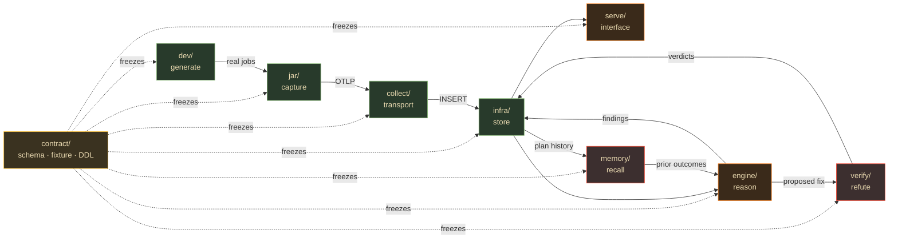

# Apex — The Pipeline

Apex is **eight lanes**. Each is a directory, named for its role. The first six are the data flow, in order; the last two are cross-cutting and read across runs rather than within one:

```
dev  →  jar  →  collect  →  infra  →  engine  →  serve
                              ↕
                      memory      verify
```

| # | Dir | Role | Language | Depends on | Brief |
|---|---|---|---|---|---|
| ① | [`dev/`](dev/) | **generate** — Spark/Delta lab producing real jobs with known pathologies | Python + Docker | contract | [DEV.md](docs/lanes/DEV.md) |
| ② | [`jar/`](jar/) | **capture** — SparkListener → stage metrics, plan fingerprint, AQE decisions, resolved conf → OTLP | Scala | dev, contract | [JAR.md](docs/lanes/JAR.md) |
| ③ | [`collect/`](collect/) | **transport** — OTLP :4318 → PII scrub → ClickHouse | YAML (otelcol) | contract | [COLLECT.md](docs/lanes/COLLECT.md) |
| ④ | [`infra/`](infra/) | **store** — ClickHouse + HyperDX (ClickStack); **owns all DDL application** | SQL + Docker | contract | [INFRA.md](docs/lanes/INFRA.md) |
| ⑤ | [`engine/`](engine/) | **reason** — deterministic watchers + gated CrewAI → findings | Python/CrewAI | infra, contract | [ENGINE.md](docs/lanes/ENGINE.md) |
| ⑥ | [`serve/`](serve/) | **interface** — read-only MCP server | Python/FastMCP | infra, contract | [SERVE.md](docs/lanes/SERVE.md) |
| ⑦ | [`memory/`](memory/) | **recall** — cross-job plan memory: "we have seen this shape, here is what worked" | Python | infra, contract v0.4 | [MEMORY.md](docs/lanes/MEMORY.md) |
| ⑧ | [`verify/`](verify/) | **refute** — predict a fix, replay it, certify mechanism and runtime separately | Python | infra, contract v0.4 | [VERIFY.md](docs/lanes/VERIFY.md) |

**⑦ and ⑧ were not in the original design.** Both were added mid-build in response to what the
first six uncovered: `memory` because a single run cannot distinguish *"this config is better"*
from *"this run was faster"*, and `verify` because Apex's own headline finding turned out to be a
false positive. `verify` is now the lane that most distinguishes the product.

## The contract holds it together

[`contract/`](contract/) is the frozen interface every lane obeys — the telemetry event shape, the ClickHouse DDL, the `Finding` schema, `job_id` threading. **Read [CONTRACT.md](CONTRACT.md) first.** A lane may *add* fields; it may never rename or repurpose one, and only a ratified change amends the contract.



Note the shape: **no lane imports another lane's code.** Every edge above is a ClickHouse table
defined by the contract. That is what made eight concurrent lanes possible with **zero merge
conflicts** across 50+ commits — and it is also why the one place a lane duplicated another's
logic (`serve` re-deriving skew severity) is exactly where the last correctness bug appeared.

## Build order (solo micro-strategy)

**Do NOT build the dirs left-to-right to completion.** Two passes:

1. **Commit the contract first** — `contract/sample_event.json` + `contract/*.ddl.sql` + `CONTRACT.md`. This is commit #1; it unblocks everything. Freeze the seam **before** fanning out; letting two parallel workers each define the shared interface guarantees a conflict in the most-imported file.
2. **Tracer bullet** — the thinnest thing through all six dirs (one fake number, `dev` → … → `serve` answer). Merge to a green `main`. The pipe is now proven.
3. **Two fronts, alternating** (one hot task-branch at a time):
   - **Plumbing (harder, bottom-up):** `dev` → `jar` → `collect` → `infra`.
   - **Brain (funner, against the fixture):** load `sample_event.json` into ClickHouse, build `engine` + `serve` **before `jar` is real**.
4. **Fuse** — swap the synthetic fixture for real rows. If the contract held, it just works.
5. **Then the cross-cutting lanes.** `memory` and `verify` need real history to be worth anything, so they come after the six are landing rows.

## Workflow rules

- **Directories are permanent; branches are temporary.** Work on short-lived `dir/task` branches (e.g. `jar/T4-stage-metrics`), merge to `main` when the task's acceptance criterion passes.
- **Keep `main` green.** `make test` runs every suite in one command (400 tests). Lanes only touch at the contract, so a merge into `engine/` can't break `jar/` — merge often, fear nothing.
- **`infra/` owns DDL application.** Other lanes ship the canonical DDL for tables they own; `infra` mirrors it and `make verify-ddl` enforces the match byte-for-byte. A lane creating its own tables is how schemas drift.
- **No silent green.** If a check could not run, it must say so and exit non-zero. Two of four cross-build cells went unverified for weeks behind a suite that reported green.
- **One repo.** Split a lane into its own repo only when it earns it (e.g. `jar/` becoming a public Maven artifact with external contributors). That's a later migration, not a day-one decision.
