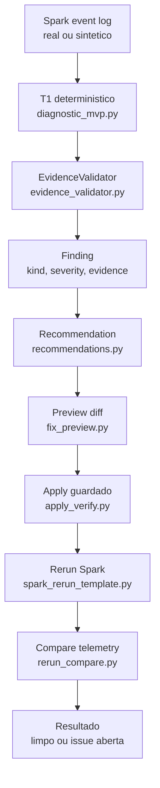

# Apex Codex Round2

Branch: `codex-round2`

Estado: solucao de diagnostico Spark com gates G0-G6 validados, stack autonoma exercitada, workflow remoto verde, loop autonomo G3/G5 em Spark 4.1.2 validado localmente e tambem em GitHub Actions self-hosted, com evidencias em `evidence/`.

## O Que Tem Nesta Branch

Esta branch evoluiu do slice `skew_on_join_30x` v4 para uma esteira de diagnostico e correcao assistida para Spark:

```text
event log -> detector deterministico -> EvidenceValidator -> finding
-> recomendacao -> preview de diff -> apply guardado -> rerun -> compare
```

Ela nao deve ser apresentada como V1 completa ainda. O que ela prova bem e o loop funcional com evidencia: detectar um problema real, gerar uma correcao revisavel, aplicar com seguranca, reexecutar e provar que o finding sumiu. A rodada de 14/07 provou a mesma logica em stack autonoma da propria branch; em 15/07, o G6 remoto ficou verde no campeonato. Em 18/07, o Commander definiu Spark 4.1.2 como alvo e o SparkListener JVM foi promovido para caminho oficial dos jobs. Em 19/07, o loop G3/G5 autonomo rodou verde no GitHub Actions self-hosted.

## Resumo Executivo

| Area | Status | Evidencia |
|---|---|---|
| Baseline negativo | Fechado | `evidence/g1-baseline.log` |
| Deteccao sintetica oficial | Fechado | `evidence/g2-cenarios.log` |
| Dado real Spark | Fechado | `evidence/g3-real.log` |
| Latencia T1 sem LLM | Fechado | `evidence/g4-t1.log` - 226.991 ms |
| Ciclo detectar -> fix -> rerun -> limpo | Fechado | `evidence/g5-ciclo.log` |
| Contrato `apply_fix` + MCP stdio local | Fechado localmente | `evidence/g6-apply-fix-mcp-smoke.log` |
| MCP subprocess, estilo cliente externo | Fechado localmente | `apex/commander/mcp_stdio_cli.py`; `evidence/g6-apply-fix-mcp-smoke.log` |
| Docker autonomo paralelo | Fechado localmente | `docker-compose.autonomous.yml`; `evidence/g3-autonomous-diagnosis.json`; `evidence/g5-autonomous-ciclo.log` |
| SparkListener JVM real | Fechado localmente/runtime smoke | `listener-jvm/`; `evidence/g9-listener-jvm-spark-submit.log`; `evidence/g9-listener-jvm-failsafe-spark-submit.log` |
| Spark 4.1.2 + listener oficial | Fechado localmente com G3/G5 real | `docker-compose.yml`; `docker-compose.autonomous.yml`; `docker/spark/spark-defaults.conf`; `docker/autonomous/spark/spark-defaults.conf`; `evidence/f7-spark412-g5-compare-memory-2026-07-18.log`; `evidence/f7-spark412-final-focused-tests-2026-07-18.log`; `ISSUES.md` CODEX-041 a CODEX-044 |
| Loop CI stack autonoma | Fechado local e remotamente: `Apex Scenario Gate` executou `real-stack` verde no runner self-hosted | `scripts/f7_autonomous_stack_loop.py`; `.github/workflows/scenario-gate.yml`; `tests/test_f7_autonomous_stack_loop.py`; `evidence/f7-autonomous-stack-loop-20260718-real-local-6.log`; `evidence/f7-remote-real-stack-run-29671461366-loop.log`; `ISSUES.md` CODEX-045/CODEX-046/CODEX-062 |
| Crew/Judge provider opcional | Fechado como tool read-only | `apex/commander/crew_judge.py`; `apex/commander/judge_contract.py`; `apex/commander/judge_providers.py`; `evidence/crew-judge-real-provider-smoke-2026-07-19.json`; `ISSUES.md` CODEX-064/CODEX-065 |
| Crew.ai external smoke | Bloqueado por credenciais, com flag ligada e sem chamada oculta | `tools/crew_judge_provider_smoke.py`; `evidence/crew-judge-external-llm-attempt-2026-07-19.json`; `ISSUES.md` CODEX-065/CODEX-067 |
| MCP/IDE subprocess smoke | Fechado localmente, incluindo `crew_judge_diagnose` | `tools/mcp_ide_subprocess_smoke.py`; `evidence/g6-mcp-ide-subprocess-smoke.jsonl`; `evidence/g6-mcp-crew-judge-subprocess-smoke-2026-07-19.jsonl`; `ISSUES.md` CODEX-066 |
| Claude Code project MCP | Fechado em IDE GUI real | `.mcp.json`; `evidence/g6-mcp-ide-gui-smoke-2026-07-18.log` |
| Playbook IDE GUI MCP | Executado no Claude Code | `docs/playbooks/mcp-ide-gui-approval-smoke-2026-07-18.md`; `evidence/g6-mcp-ide-gui-smoke-2026-07-18.log` |
| Telemetria via MCP GUI | Fechada em read-only | `evidence/g6-mcp-ide-gui-telemetry-compare-2026-07-18.log`; `evidence/f6-mcp-gui-telemetry-compare-local-2026-07-18.log`; `evidence/f6-mcp-gui-telemetry-compare-tests-2026-07-18.log` |
| G6 oracle/drift smoke | Fechado remoto | `tools/g6_oracle_drift_smoke.py`; `.github/workflows/scenario-gate.yml`; `evidence/g6-oracle-drift-smoke.log`; `evidence/g6-oracle-drift-summary.json`; `evidence/g6-remote-workflow-latest-summary.json` |
| Loop agentico local | Fechado para checks locais, sem LLM e sem mutacao | `apex/commander/agentic_loop.py`; `tools/agentic_validation_loop.py`; `evidence/agentic-validation-loop-report.json` |
| Product readiness UI + Judge local | Fechado localmente | `docs/presentations/apex-product-readiness-2026-07-19.html`; `evidence/apex-product-readiness-2026-07-19-summary.json`; `apex/commander/product_report.py`; `tools/generate_product_report.py`; `ISSUES.md` CODEX-063 |
| Especificacao tecnica 15/07 | Atualizada para juiz | `docs/specs/apex-codex-technical-spec-2026-07-15.md` |
| Comparacao campeonato 15/07 | Atualizada para juiz | `docs/architecture/llm-solution-validation-framework-2026-07-15.md`; `docs/presentations/llm-solution-validation-2026-07-15.html` |
| Apresentacao Codex 15/07 | Atualizada para juiz | `docs/presentations/apex-codex-solucao-end-to-end-2026-07-15.html` |
| Autoavaliacao | Fechada | `docs/autoavaliacao.md` |
| Catalogo de issues | Fechado/aberto conforme item | `ISSUES.md` |
| ADRs formais | Criadas | `docs/adr/ADR-001-onde-o-apex-roda.md`; `docs/adr/ADR-002-t1-antes-de-crew-judge.md`; `docs/adr/ADR-003-spark-alvo-da-branch-codex.md`; `docs/adr/ADR-004-mcp-ide-e-apply-fix-guardado.md` |
| Plano F0/F5 | Fechado | `PLANO.md` |

## Resultado Mais Importante

Caso real validado: skew em join.

| Metrica | Antes | Depois |
|---|---:|---:|
| `app_id` | `app-20260712053414-0001` | `app-20260712131734-0004` |
| Finding count | 1 | 0 |
| Severidade | high | n/a |
| Skew ratio valido | 29.4 | 0 |
| Shuffle read bytes | 1.157.481 | 0 |

Leitura: o Apex detectou skew real, gerou preview de correcao, aplicou com token/hash/verify, reexecutou o job e comprovou que o finding caiu para zero.

Rodada autonoma 14/07:

| Metrica | Antes autonomo | Depois autonomo |
|---|---:|---:|
| `app_id` | `app-20260714112858-0003` | `app-20260714113809-0004` |
| Finding count | 1 | 0 |
| Severidade | high | n/a |
| Skew ratio valido | 29.4 | 0 |
| Shuffle read bytes | 1.157.481 | 0 |

Leitura: o mesmo ciclo G3/G5 foi repetido na stack autonoma da branch, com event log novo e sem dependencia da stack historica `plat-v0`.

## Arquitetura Da Solucao



## Componentes Principais

| Componente | Caminho | Papel |
|---|---|---|
| Detectores deterministicos | `apex/commander/diagnostic_mvp.py` | Detecta skew, GC, shuffle/spill, OOM e cartesian product |
| Validador de evidencia | `apex/commander/evidence_validator.py` | Confere se o finding tem evidencia suficiente |
| Telemetria | `apex/commander/telemetry.py` | Normaliza `job_id`, `app_id`, stages, tasks e plano |
| ClickHouse adapter | `apex/commander/clickhouse_adapter.py` | Store local/fake para testes e persistencia |
| ClickHouse HTTP client | `apex/commander/clickhouse_http_client.py` | Cliente para ambiente ClickHouse real |
| MCP stdio | `apex/commander/mcp_stdio_server.py` | Exposicao local de tools para agente/IDE |
| Recomendacoes | `apex/commander/recommendations.py` | Converte finding em recomendacao |
| Preview de fix | `apex/commander/fix_preview.py` | Gera diff antes de qualquer apply |
| Apply guardado | `apex/commander/apply_verify.py` | Aplica com token, hash, root permitido e verificacao |
| Rerun/compare | `apex/commander/rerun_compare.py` | Compara telemetria antes/depois |
| Template Spark rerun | `apex/commander/spark_rerun_template.py` | Monta comando Spark para reexecucao controlada |

## Gates Validados

| Gate | O que prova | Artefato |
|---|---|---|
| G0 | Fundacao/testes/contratos iniciais | `evidence/g0-testes.log` |
| G1 | Baseline saudavel nao gera falso positivo | `evidence/g1-baseline.log` |
| G2 | Os 5 cenarios oficiais disparam severidade esperada | `evidence/g2-cenarios.log` |
| G3 | Job real Spark multicore bate o comportamento sintetico | `evidence/g3-real.log` |
| G4 | T1 deterministico roda abaixo de 1s sem LLM | `evidence/g4-t1.log` |
| G5 | Ciclo completo detectar -> aplicar -> reexecutar -> limpar | `evidence/g5-ciclo.log` |
| G5 autônomo | Mesmo ciclo na stack autônoma sem `plat-v0` | `evidence/g5-autonomous-ciclo.log` |
| G6 local | Contrato `apply_fix` e smoke MCP stdio local | `evidence/g6-apply-fix-mcp-smoke.log` |
| G7 local | Compose autônomo sobe sem `spark-plat-v0-*`, Spark grava event log, G3/G5 passam e listener JVM roda | `evidence/g3-autonomous-diagnosis.json`; `evidence/g5-autonomous-ciclo.log`; `evidence/g9-listener-jvm-spark-submit.log` |
| F7 loop | Runner orquestra G3/G5 autônomo em Spark 4.1.2, fechou execução real local e execução remota verde no GitHub Actions/self-hosted | `scripts/f7_autonomous_stack_loop.py`; `.github/workflows/scenario-gate.yml`; `evidence/f7-autonomous-stack-loop-20260718-real-local-6.log`; `evidence/f7-remote-real-stack-run-29671461366-loop.log` |
| G8 local | Política Crew/Judge futura sem LLM obrigatória | `evidence/g8-agentic-loop-python.log` |
| G9 local | Listener JVM compila, gera JAR, carrega via `spark-submit --jars`, emite NDJSON e não derruba job em fail-mode | `evidence/g9-listener-jvm-spark-submit.log`; `evidence/g9-listener-jvm-output.ndjson`; `evidence/g9-listener-jvm-failsafe-spark-submit.log` |

## Cenarios Oficiais Cobertos

Os cenarios vieram do pacote comum:

```text
pacote-comum/scenarios/no_skew_baseline.yaml
pacote-comum/scenarios/skew_on_join_30x.yaml
pacote-comum/scenarios/gc_pressure_25pct.yaml
pacote-comum/scenarios/shuffle_spill_disk.yaml
pacote-comum/scenarios/oom_on_aggregation.yaml
pacote-comum/scenarios/cartesian_product.yaml
```

Resultado G2:

| Cenario | Resultado esperado | Status |
|---|---|---|
| no skew baseline | zero warning+ | fechado |
| skew on join | high | fechado |
| GC pressure | critical | fechado |
| shuffle spill disk | critical | fechado |
| OOM aggregation | critical | fechado |
| cartesian product | critical | fechado |

## Seguranca Do Apply

O apply nao e uma edicao livre feita por agente. Ele passa por controles:

| Controle | Motivo |
|---|---|
| Preview obrigatorio | Mostra o diff antes de alterar arquivo |
| Approval token | Amarra aprovacao ao `job_id`, recomendacao, alvo e hashes |
| `apply_root` | Bloqueia escrita fora do workspace permitido |
| Hash antes/depois | Garante que o arquivo aplicado e exatamente o previsto |
| Verify | Confirma que o arquivo final bate com o hash esperado |
| Rerun/compare | Prova se a correcao melhorou a execucao |

## Documentacao Importante

| Documento | Uso |
|---|---|
| `PLANO.md` | Plano F0/F5, premissas L1-L9, gates e gaps |
| `ISSUES.md` | Catalogo formal CODEX-001 em diante |
| `docs/autoavaliacao.md` | Scorecard C1-C6 e Captain's Report |
| `docs/specs/skew-slice-v4.md` | Especificacao tecnica atualizada da solucao Codex Round2 |
| `docs/architecture/llm-solution-validation-framework-2026-07-14.md` | Comparacao atualizada entre Codex, Cowork, Kimi, Spike, Codex antiga e DataFlint |
| `docs/architecture/llm-solution-validation-framework-2026-07-15.md` | Comparacao final para juiz, com G6 remoto verde |
| `docs/specs/apex-codex-technical-spec-2026-07-15.md` | Especificacao tecnica reprodutivel da branch Codex |
| `docs/presentations/apex-codex-solucao-end-to-end-2026-07-14.html` | Apresentacao end-to-end da nossa solucao |
| `docs/presentations/apex-codex-solucao-end-to-end-2026-07-15.html` | Apresentacao final da nossa solucao para o juiz |
| `docs/presentations/apex-product-readiness-2026-07-19.html` | Relatorio HTML de prontidao produto/Judge local com score 90/100, before/after remoto, MCP GUI, T1 e gaps conhecidos |
| `docs/presentations/apex-codex-projeto-luan-2026-07-14.html` | Apresentacao executiva para o Luan |
| `docs/presentations/llm-solution-validation-2026-07-14.html` | Apresentacao comparativa atualizada das solucoes |
| `docs/presentations/llm-solution-validation-2026-07-15.html` | Apresentacao comparativa final para o juiz |

## Apresentacoes

Principais arquivos para apresentar:

```text
docs/presentations/apex-codex-solucao-end-to-end-2026-07-14.html
docs/presentations/apex-codex-solucao-end-to-end-2026-07-15.html
docs/presentations/apex-product-readiness-2026-07-19.html
docs/presentations/apex-codex-projeto-luan-2026-07-14.html
docs/presentations/llm-solution-validation-2026-07-14.html
docs/presentations/llm-solution-validation-2026-07-15.html
```

Sugestao:

1. Para falar so da nossa solucao no estado final: use `apex-codex-solucao-end-to-end-2026-07-15.html`.
2. Para mostrar prontidao de produto/Judge local com gaps honestos: use `apex-product-readiness-2026-07-19.html`.
3. Para explicar ao Luan em formato executivo: use `apex-codex-projeto-luan-2026-07-14.html`.
4. Para comparar LLMs/DataFlint no estado final: use `llm-solution-validation-2026-07-15.html`.

## Como Validar A Branch

Os logs crus ja estao em `evidence/`. Para nova validacao completa, use os gates do pacote comum e os scripts locais.

Leitura rapida:

```text
evidence/g1-baseline.log
evidence/g2-cenarios.log
evidence/g3-real.log
evidence/g4-t1.log
evidence/g5-ciclo.log
evidence/g6-apply-fix-mcp-smoke.log
evidence/agentic-validation-loop-report.json
docs/specs/apex-codex-technical-spec-2026-07-15.md
docs/architecture/llm-solution-validation-framework-2026-07-15.md
evidence/g7-autonomous-compose-config.log
evidence/g8-agentic-loop-python.log
evidence/g9-listener-jvm-environment.log
```

Suite historica:

```powershell
python -m pytest tests -q
```

Observacao: em Windows, alguns comandos antigos podem precisar de basetemp local por permissao no diretorio temporario do usuario. Isso foi registrado durante G5.

## O Que Ainda Nao Esta Pronto

| Gap | Impacto |
|---|---|
| SparkListener JVM real fail-safe | Fechado no smoke runtime: JAR carregado via `spark-submit --jars`, NDJSON emitido e falha interna nao derruba job |
| `docker compose up` autonomo da branch | Fechado localmente: compose autonomo sobe, grava event log em S3A/MinIO e repetiu G3/G5 sem plat-v0 |
| Crew.ai/Judge | Provider plugável existe como `crew_judge_diagnose`; `crewai` está instalado, `APEX_CREW_JUDGE_ENABLED=1` foi testado, mas execução com LLM externo real segue pendente de chaves aprovadas |
| IDE real | Fechado no Claude Code GUI: `.mcp.json` project-scoped reconhecido; `tools/list`, `recommend_fix`, `preview_recommendation`, `apply_fix` e `compare_job_telemetry` validados |
| G6 oraculo/drift | Smoke local verde contra `real_log.ndjson`; workflow semanal/manual definido; execucao remota observada no campeonato com workflow inteiro verde, incluindo `gate` e `g6-oracle-drift` |
| Loop agentico | Orquestrador deterministico local criado: coleta evidencia, julga status e recomenda proxima acao sem LLM/mutacao; apos smoke GUI, status local do loop ficou `pass` sem proximas acoes |

## Aderencia Ao Pedido Do Luan

| Pedido/criterio | Status |
|---|---|
| Baseline negativo | Cumpre |
| Detectores oficiais | Cumpre |
| Dado real Spark | Cumpre |
| Latencia sem LLM | Cumpre |
| Ciclo apply/rerun limpo | Cumpre funcionalmente |
| ClickHouse/job_id/app_id | Parcial |
| MCP/apply_fix local | Cumpre localmente |
| MCP subprocess estilo cliente externo | Cumpre localmente |
| IDE real | Fechado em Claude Code GUI: `tools/list`, `recommend_fix`, `preview_recommendation` e `apply_fix` |
| SparkListener real | Cumpre localmente/runtime smoke |
| Crew.ai/Judge | Parcial avançado: tool read-only, contrato anti-alucinação e provider Crew.ai opcional existem; falta observar execução com LLM externo |
| Plataforma Docker standalone | Cumpre localmente em Spark 4.1.2: compose sobe, listener oficial carrega, G3/G5 reais passam |

## Proximos Passos Recomendados

1. Decidir se o runner self-hosted `apex-local-GUSTUS` fica ativo para novas rodadas ou se deve ser removido apos a avaliacao.
2. Monitorar proximas execucoes agendadas do G6 e manter o job legado `gate` verde no CI remoto.
3. Revisar com o Commander as ADRs formais criadas em `docs/adr/`.
4. Decidir se a proxima entrega de produto sera UI/dashboard navegável ou execução Crew.ai com LLM externo configurado.
5. Manter Crew.ai/Judge sempre depois de T1 deterministico e EvidenceValidator, sem permitir apply direto pelo agente.

## Estado De Publicacao

Esta branch tem historico publicado em `campeonato/codex-round2`. Antes de publicar novas mudancas, confirme:

```powershell
git status --short --branch
git log --oneline --decorate -5
```

Nao faca push de alteracoes novas sem revisao quando a branch remota estiver sendo avaliada.
