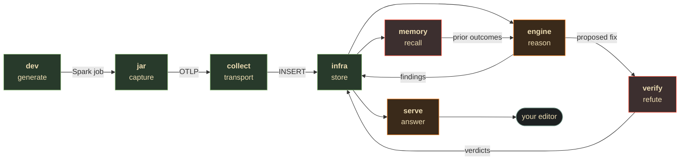

# Apex

### Spark performance intelligence that knows when to say nothing.

[](LICENSE)
[](#compatibility)
[](#compatibility)
[](#verify-everything)
[](CONTRACT.md)

Apex captures Spark telemetry from inside the JVM, lands it in ClickHouse you own, reasons over it with deterministic detectors, and answers questions through an MCP server — so you ask *"why was this job slow?"* in your editor and get an answer backed by measurements.

**It is built to be wrong less often, not to find more things.** Every other Spark tool competes on volume of alerts. Apex competes on refusing to guess.

---

## Table of contents

[Why Apex](#why-apex) · [Quick start](#quick-start) · [How it works](#how-it-works) · [What it will not do](#what-it-will-not-do) · [Verify everything](#verify-everything) · [Compatibility](#compatibility) · [Documentation](#documentation) · [Roadmap](#roadmap) · [License](#license)

---

## Why Apex

The first thing the verification lane ever did was **refute Apex's own headline demo**. Finding `189e3495` — *"critical 21.62× skew"* — failed four independent checks at once:

| Check | Result |
|---|---|
| **No-op gate** | the fix it recommended, `skewJoin.enabled=true`, was **already `true`** |
| **Bound analysis** | the stage is *work-bound* — a **perfect** fix returns **0.0 ms** |
| **Noise floor** | "21.62×" was 21.62 / 24.71 / 24.53 across three **byte-identical** runs |
| **Mechanism** | the stage moves **278 bytes/task** and its plan contains **no Join node at all** |

That is the industry's known failure mode — a confidently-suggested `repartition(20000)` that left a 3-hour job at 3 hours — reproduced inside Apex, caught by Apex, and refused.

**Refusal is a first-class output.** Four things follow from it:

- **A closed form, not a magic threshold.** A stage is tail-bound *iff* `p99/p50 > (n_tasks − 1) / (slots − 1)`. No tunable constant. A fixed 5×/10× threshold ignores how wide your cluster is — and volume cancels out of the derivation entirely.
- **Measured noise floors, never inherited ones.** The same system measured 5.8%, 9.2% and 37.7% depending on level and scale. A number carried across scales is wrong by up to 6.5×. Below the floor the magnitude is **withheld** — noise proves a delta *unresolvable*, never *zero*.
- **Honest unknowns.** `spark.executor.instances` appeared in **0 of 51** real config rows, so cluster width is usually unknowable. Apex answers *"tail-bound only above 5.8 slots"* instead of inventing a number.
- **Mechanism and magnitude are separate verdicts.** `mechanism_confirmed` ("the fix provably fired") is independent of `runtime_certified` ("and here is what it saved"). A small bench can honestly deliver the first and not the second.

### Live proof

From a real run, `app-20260729182801-0045`. Five stages carried a raw p99/p50 tail. Apex reported a skew finding on **none** of them:

| Stage | ratio | bytes/task | tasks | Verdict |
|---|---:|---:|---:|---|
| 29 | **16.71×** | 996,772 | 114 | **nothing** — 95% of the floor, see below |
| 6 | 10.02× ← *loudest per-stage claim* | **427** | 50 | **nothing** — scheduler noise, not a distribution |
| 33 | 7.68× | 6,837 | 100 | **nothing** — below the measurability floor |
| 11 | 7.19× | 4,268,400 | **2** | **nothing** — 2 tasks is not a distribution |
| 4 | 5.84× | 625 | 50 | **nothing** — below the floor |

A ratio-ranking tool leads with *"stage 6: 10× critical skew."* It moves **427 bytes per task.** Apex's single skew finding was **job-level**, sourced from Spark's own AQE re-planning decision at 0.97 confidence — and its recommendation read *"**Keep** `skewJoin.enabled=true`, then remove the skew at the source,"* because the captured config proved the flag was already on.

Stage 29 is the honest edge, and it is documented rather than hidden: it *is* the genuinely skewed stage, and it was excluded by a 5% margin because **AQE had already split it** — 114 tasks instead of the configured 100, diluting bytes/task below the floor. The threshold measured the *healed* state. That is [contract rule 7](CONTRACT.md), and fixing it properly needs an execution→stage map rather than a softer threshold.

---

## Quick start

**Prerequisites:** Docker, [`uv`](https://docs.astral.sh/uv/), and **JDK 17** (`brew install openjdk@17`).

```bash
git clone https://github.com/luanmorenommaciel/apex && cd apex

# 1 — stand up the store you own (ClickHouse + HyperDX)
cd infra && make apply-ddl && docker compose up -d --wait

# 2 — build the capture plugin
cd ../jar && sbt -java-home "$(../scripts/find-jdk.sh 17)" assembly

# 3 — run any Spark job with two extra flags
spark-submit \
  --jars /path/to/apex_4.0-0.1.0-assembly.jar \
  --conf spark.plugins=apex.ApexPlugin \
  --conf spark.apex.otlp.endpoint=http://localhost:4318 \
  your_job.py

# 4 — diagnose it
cd ../engine && uv run --extra clickhouse python -m apex_engine <app-id>
```

Then point any MCP client at `serve/` and ask about the run:

```bash
claude mcp add --scope project apex -- uvx --from ./serve apex-mcp
```

> **Try it without a Spark cluster.** `cd dev && make up && make run-pathology JOB=skew_join` builds a Spark + Delta + MinIO lab and generates a job with a *known* pathology, so you can watch the whole pipeline work before pointing it at anything real.

---

## How it works

Eight directories. The directory list **is** the data flow.



| Dir | Role | What it does | Stack |
|---|---|---|---|
| [`dev/`](dev/) | **generate** | Spark/Delta lab producing jobs with *known* pathologies, plus a balanced control | Python + Docker |
| [`jar/`](jar/) | **capture** | `SparkListener` → stage metrics, plan fingerprint, AQE decisions, resolved config → OTLP | Scala |
| [`collect/`](collect/) | **transport** | OTLP `:4318` → PII scrub → ClickHouse. Config only, no custom build | otelcol YAML |
| [`infra/`](infra/) | **store** | ClickHouse + HyperDX. Owns all DDL application | SQL + Docker |
| [`engine/`](engine/) | **reason** | Deterministic detectors; CrewAI gated behind confidence + severity | Python / CrewAI |
| [`serve/`](serve/) | **answer** | Read-only MCP server for Claude Code, Cursor, Codex | Python / FastMCP |
| [`memory/`](memory/) | **recall** | "We've seen this plan shape before — here's what worked" | Python |
| [`verify/`](verify/) | **refute** | Predicts a fix's effect, replays it, reports what can be certified | Python |

**No lane imports another lane's code.** Every arrow above is a ClickHouse table defined by [`CONTRACT.md`](CONTRACT.md) — the frozen interface, now at v0.4 with **seven cross-lane rules**, each discovered by an implementation contradicting the spec. That's what let all eight lanes be built concurrently with **zero merge conflicts**.

### Privacy: diagnosable, without your data

The plan is redacted **in-JVM before egress**, then again in the collector. Here is a real captured plan, verbatim:

```
'Aggregate [sum(none#1L) AS #0L, sum(none#0) AS #1]
+- 'Join Inner, (none#2L = cast(none#0 as bigint))
   :- Filter isnotnull(none#1)
   :  +- Relation [none#0L,none#1,none#2] parquet
   +- Filter isnotnull(none#0L)
      +- Relation [none#0L,none#1] parquet
```

Every operator is visible. Every column is `none#N`. Every literal is gone. Emails and IPs are masked with keyed HMAC-SHA256, `query_text` is one-way hashed, and `file_path` is dropped outright — because plain-hashing a low-entropy value is dictionary-reversible.

### The MCP tools

| Tool | Read-only | Purpose |
|---|:---:|---|
| `analyze_run` | ✅ | bottleneck stage, symptom, and any AQE decision corroborating it |
| `compare_runs` | ✅ | stage-by-stage diff aligned on literal-normalized plan fingerprint |
| `search_kb` | ✅ | token search over prior findings and redacted plan text |
| `suggest_fix` | ⚠️ | proposes a unified diff — **applies nothing**, `requires_human_approval` is always true |

Text from an observed Spark job is returned in a labelled `untrusted_fields[]` list. It is data, never instructions.

---

## What it will not do

Stating this plainly matters more here than in most projects, because the entire premise is knowing the limits of a measurement.

- **It will not invent a number it cannot measure.** If the effect is below the measured noise floor, you get `runtime_unresolved` and no percentage.
- **It will not guess your cluster width.** If `spark.executor.instances` is absent, it reports the break-even width the verdict *would* need.
- **It will not apply a fix.** `suggest_fix` returns a diff as data. Nothing is written, no git command runs, no PR is opened.
- **It will not read a ratio as skew below ~1 MiB/task.** Below that, `p99/p50` describes JVM warm-up and scheduler jitter. There is no claim there to attach a confidence to.
- **It will not replace the Spark UI.** It is not a prettier UI; it is a reasoning layer with an API.
- **It does not do live intervention.** Apex analyzes completed stages. It never touches a running job.
- **It is not multi-tenant.** Single-team self-hosted deployment is the v0.1 target.

---

## Verify everything

One command, whole repo, **401 tests**:

```bash
make test
```

```
engine 114 (+2 skipped) · serve 93 · memory 40 (+7 skipped) · verify 105 · gate 4  = 365 Python
apex_35(2.12) 9 · apex_35(2.13) 9 · apex_40 9 · apex_41 9                          =  36 Scala
```

Tests needing live ClickHouse **skip** rather than fail, so this is green with no infrastructure running. Each lane is a separate project with its own dependency set, so a single root `pytest` cannot work — the Makefile shells into each lane with `uv`, which also bootstraps a clean clone.

| Command | What it proves |
|---|---|
| `make test` | every suite, no infrastructure needed |
| `make jdk` | which JDK the jar will build with, and why |
| `make verify-ddl` | every ClickHouse table matches its contract DDL *(needs infra)* |
| `make verify-e2e JOB=<app-id>` | all six lanes agree on one real job *(needs infra)* |

**The six-lane gate has passed live against real Spark jobs** — [committed evidence](docs/e2e/evidence/six-lane-gate-app-20260729180235-0044.json), [full narrative](docs/e2e/CANONICAL_GATE.md). CI runs every lane plus the jar on **both JDK 17 and 21** on every push.

---

## Compatibility

The plugin cross-builds four `(Spark, Scala)` cells; every one is tested in CI.

| Spark | Scala | JDK | Status |
|---|---|---|---|
| 3.5.3 | 2.12 | 8 / 11 / 17 | ✅ tested |
| 3.5.3 | 2.13 | 8 / 11 / 17 | ✅ tested |
| 4.0.0 | 2.13 | 17 / 21 | ✅ tested |
| 4.1.2 | 2.13 | 17 / 21 | ✅ tested |

**JDK 17 is the only version supported by every cell** (Spark 3.5 supports 8/11/17; Spark 4.x supports 17/21), so local builds prefer it. `scripts/find-jdk.sh` locates one without changing anything global — including keg-only Homebrew JDKs, which are invisible to `PATH` and `/usr/libexec/java_home`.

| Platform | Status |
|---|---|
| Local / Standalone | ✅ verified end-to-end |
| EMR · Dataproc · K8s Spark Operator | ⚠️ untested — see [Roadmap](#roadmap) |
| Databricks | ❌ not targeted in v0.1 |

---

## Documentation

| Document | What's in it |
|---|---|
| **[CONTRACT.md](CONTRACT.md)** | The frozen interface + seven cross-lane rules. **Read this first.** |
| [PIPELINE.md](PIPELINE.md) | Lane map, dependency graph, build order |
| [docs/lanes/](docs/lanes/) | Research-backed build brief per lane |
| [docs/e2e/](docs/e2e/) | End-to-end entry points and recorded runs |
| [CHANGELOG.md](CHANGELOG.md) | What shipped — and what each fix cost to learn |

Every lane also carries its own `README.md` with as-built detail.

---

## Roadmap

v0.1 is complete and honest about its edges. Next, in order of value:

1. **Run on a real cluster.** Every run so far has been one master and one worker. `spark.executor.instances` was absent in 51 of 51 config rows, which means the `slots` term that makes the closed form work has **never been exercised with a real value**. This is the largest untested surface.
2. **Certify runtime magnitude.** A small bench puts a 17–37% floor under everything; effects below it are structurally unresolvable no matter how many repetitions run.
3. **Cross-host plan memory.** `memory/`'s corpus is a single environment, so its confidence is directionally right and magnitude-uncertain.
4. **Reconstruct pre-intervention shape** for AQE-reshaped stages (contract rule 7) — needs an execution→stage map, a v0.5 change.
5. **Publish the plugin to Maven Central** so installation is two `spark-submit` flags with no build step.

---

## Contributing

The contract is law: a lane may **add** a field, never rename or repurpose one, and only a ratified change amends [`CONTRACT.md`](CONTRACT.md). Work on short-lived `lane/task` branches and keep `main` green — `make test` must pass before a PR.

One house rule, learned the hard way: **no silent green.** If a check could not run, it must say so and exit non-zero. Two of four cross-build cells went unverified for weeks behind a suite that reported success.

## License

[Apache-2.0](LICENSE) — the same license as Apache Spark, and the patent grant matters for a tool you deploy against production workloads. Third-party attributions in [NOTICE](NOTICE).
