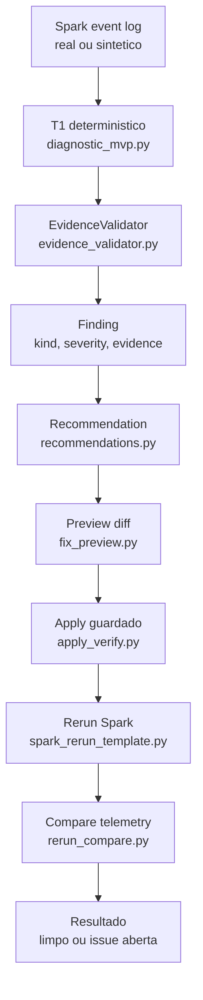

# Apex Codex Round2

Branch: `codex-round2`

Estado: solucao local de diagnostico Spark com gates G0-G5 validados e evidencias em `evidence/`.

## O Que Tem Nesta Branch

Esta branch evoluiu do slice `skew_on_join_30x` v4 para uma esteira de diagnostico e correcao assistida para Spark:

```text
event log -> detector deterministico -> EvidenceValidator -> finding
-> recomendacao -> preview de diff -> apply guardado -> rerun -> compare
```

Ela nao deve ser apresentada como V1 completa ainda. O que ela prova bem e o loop funcional com evidencia: detectar um problema real, gerar uma correcao revisavel, aplicar com seguranca, reexecutar e provar que o finding sumiu.

## Resumo Executivo

| Area | Status | Evidencia |
|---|---|---|
| Baseline negativo | Fechado | `evidence/g1-baseline.log` |
| Deteccao sintetica oficial | Fechado | `evidence/g2-cenarios.log` |
| Dado real Spark | Fechado | `evidence/g3-real.log` |
| Latencia T1 sem LLM | Fechado | `evidence/g4-t1.log` - 226.991 ms |
| Ciclo detectar -> fix -> rerun -> limpo | Fechado | `evidence/g5-ciclo.log` |
| Autoavaliacao | Fechada | `docs/autoavaliacao.md` |
| Catalogo de issues | Fechado/aberto conforme item | `ISSUES.md` |
| Plano F0/F5 | Fechado | `PLANO.md` |

## Resultado Mais Importante

Caso real validado: skew em join.

| Metrica | Antes | Depois |
|---|---:|---:|
| `app_id` | `app-20260712053414-0001` | `app-20260712131734-0004` |
| Finding count | 1 | 0 |
| Severidade | high | n/a |
| Skew ratio valido | 29.4 | 0 |
| Shuffle read bytes | 1.157.481 | 0 |

Leitura: o Apex detectou skew real, gerou preview de correcao, aplicou com token/hash/verify, reexecutou o job e comprovou que o finding caiu para zero.

## Arquitetura Da Solucao



## Componentes Principais

| Componente | Caminho | Papel |
|---|---|---|
| Detectores deterministicos | `apex/commander/diagnostic_mvp.py` | Detecta skew, GC, shuffle/spill, OOM e cartesian product |
| Validador de evidencia | `apex/commander/evidence_validator.py` | Confere se o finding tem evidencia suficiente |
| Telemetria | `apex/commander/telemetry.py` | Normaliza `job_id`, `app_id`, stages, tasks e plano |
| ClickHouse adapter | `apex/commander/clickhouse_adapter.py` | Store local/fake para testes e persistencia |
| ClickHouse HTTP client | `apex/commander/clickhouse_http_client.py` | Cliente para ambiente ClickHouse real |
| MCP stdio | `apex/commander/mcp_stdio_server.py` | Exposicao local de tools para agente/IDE |
| Recomendacoes | `apex/commander/recommendations.py` | Converte finding em recomendacao |
| Preview de fix | `apex/commander/fix_preview.py` | Gera diff antes de qualquer apply |
| Apply guardado | `apex/commander/apply_verify.py` | Aplica com token, hash, root permitido e verificacao |
| Rerun/compare | `apex/commander/rerun_compare.py` | Compara telemetria antes/depois |
| Template Spark rerun | `apex/commander/spark_rerun_template.py` | Monta comando Spark para reexecucao controlada |

## Gates Validados

| Gate | O que prova | Artefato |
|---|---|---|
| G0 | Fundacao/testes/contratos iniciais | `evidence/g0-testes.log` |
| G1 | Baseline saudavel nao gera falso positivo | `evidence/g1-baseline.log` |
| G2 | Os 5 cenarios oficiais disparam severidade esperada | `evidence/g2-cenarios.log` |
| G3 | Job real Spark multicore bate o comportamento sintetico | `evidence/g3-real.log` |
| G4 | T1 deterministico roda abaixo de 1s sem LLM | `evidence/g4-t1.log` |
| G5 | Ciclo completo detectar -> aplicar -> reexecutar -> limpar | `evidence/g5-ciclo.log` |

## Cenarios Oficiais Cobertos

Os cenarios vieram do pacote comum:

```text
pacote-comum/scenarios/no_skew_baseline.yaml
pacote-comum/scenarios/skew_on_join_30x.yaml
pacote-comum/scenarios/gc_pressure_25pct.yaml
pacote-comum/scenarios/shuffle_spill_disk.yaml
pacote-comum/scenarios/oom_on_aggregation.yaml
pacote-comum/scenarios/cartesian_product.yaml
```

Resultado G2:

| Cenario | Resultado esperado | Status |
|---|---|---|
| no skew baseline | zero warning+ | fechado |
| skew on join | high | fechado |
| GC pressure | critical | fechado |
| shuffle spill disk | critical | fechado |
| OOM aggregation | critical | fechado |
| cartesian product | critical | fechado |

## Seguranca Do Apply

O apply nao e uma edicao livre feita por agente. Ele passa por controles:

| Controle | Motivo |
|---|---|
| Preview obrigatorio | Mostra o diff antes de alterar arquivo |
| Approval token | Amarra aprovacao ao `job_id`, recomendacao, alvo e hashes |
| `apply_root` | Bloqueia escrita fora do workspace permitido |
| Hash antes/depois | Garante que o arquivo aplicado e exatamente o previsto |
| Verify | Confirma que o arquivo final bate com o hash esperado |
| Rerun/compare | Prova se a correcao melhorou a execucao |

## Documentacao Importante

| Documento | Uso |
|---|---|
| `PLANO.md` | Plano F0/F5, premissas L1-L9, gates e gaps |
| `ISSUES.md` | Catalogo formal CODEX-001 em diante |
| `docs/autoavaliacao.md` | Scorecard C1-C6 e Captain's Report |
| `docs/specs/skew-slice-v4.md` | Especificacao tecnica atualizada da solucao Codex Round2 |
| `docs/architecture/llm-solution-validation-framework-2026-07-13.md` | Comparacao entre Codex, Cowork, Kimi, Spike e DataFlint |
| `docs/presentations/apex-codex-solucao-end-to-end-2026-07-14.html` | Apresentacao end-to-end da nossa solucao |
| `docs/presentations/apex-codex-projeto-luan-2026-07-14.html` | Apresentacao executiva para o Luan |
| `docs/presentations/llm-solution-validation-2026-07-13.html` | Apresentacao comparativa das solucoes |

## Apresentacoes

Principais arquivos para apresentar:

```text
docs/presentations/apex-codex-solucao-end-to-end-2026-07-14.html
docs/presentations/apex-codex-projeto-luan-2026-07-14.html
docs/presentations/llm-solution-validation-2026-07-13.html
```

Sugestao:

1. Para falar so da nossa solucao: use `apex-codex-solucao-end-to-end-2026-07-14.html`.
2. Para explicar ao Luan em formato executivo: use `apex-codex-projeto-luan-2026-07-14.html`.
3. Para comparar LLMs/DataFlint: use `llm-solution-validation-2026-07-13.html`.

## Como Validar A Branch

Os logs crus ja estao em `evidence/`. Para nova validacao completa, use os gates do pacote comum e os scripts locais.

Leitura rapida:

```text
evidence/g1-baseline.log
evidence/g2-cenarios.log
evidence/g3-real.log
evidence/g4-t1.log
evidence/g5-ciclo.log
```

Suite historica:

```powershell
python -m pytest tests -q
```

Observacao: em Windows, alguns comandos antigos podem precisar de basetemp local por permissao no diretorio temporario do usuario. Isso foi registrado durante G5.

## O Que Ainda Nao Esta Pronto

| Gap | Impacto |
|---|---|
| SparkListener JVM real fail-safe | Ainda falta cumprir a parte real de listener da V1 |
| `docker compose up` autonomo da branch | G3/G5 validaram contra `plat-v0`/`spv0-*`; a branch ainda nao e plataforma propria completa |
| Crew.ai/Judge | Escalonamento LLM existe como decisao de design, nao como entrega funcional |
| Tool `apply_fix` | O ciclo existe como `apply_recommendation`; falta alinhar nome/contrato comum |
| IDE real | MCP stdio existe, mas ainda precisa smoke test em Cursor/VS Code/Claude Code |
| G6 oraculo/drift | Falta agendamento/validacao continua sintetico vs real |

## Aderencia Ao Pedido Do Luan

| Pedido/criterio | Status |
|---|---|
| Baseline negativo | Cumpre |
| Detectores oficiais | Cumpre |
| Dado real Spark | Cumpre |
| Latencia sem LLM | Cumpre |
| Ciclo apply/rerun limpo | Cumpre funcionalmente |
| ClickHouse/job_id/app_id | Parcial |
| MCP/IDE/apply_fix | Parcial |
| SparkListener real | Nao cumpre ainda |
| Crew.ai/Judge | Nao cumpre ainda |
| Plataforma Docker standalone | Parcial/nao completa |

## Proximos Passos Recomendados

1. Atualizar contrato MCP de `apply_recommendation` para `apply_fix`.
2. Fazer smoke test real com cliente MCP/IDE.
3. Integrar plataforma propria ou Spike/plat-v0 de forma controlada.
4. Implementar SparkListener JVM real fail-safe.
5. Promover ADRs formais para decisoes centrais.
6. Criar G6: oraculo agendado e controle de drift.
7. So depois expandir camada Crew.ai/Judge.

## Estado De Publicacao

Esta branch tem historico publicado em `campeonato/codex-round2`. Antes de publicar novas mudancas, confirme:

```powershell
git status --short --branch
git log --oneline --decorate -5
```

Nao faca push de alteracoes novas sem revisao quando a branch remota estiver sendo avaliada.
