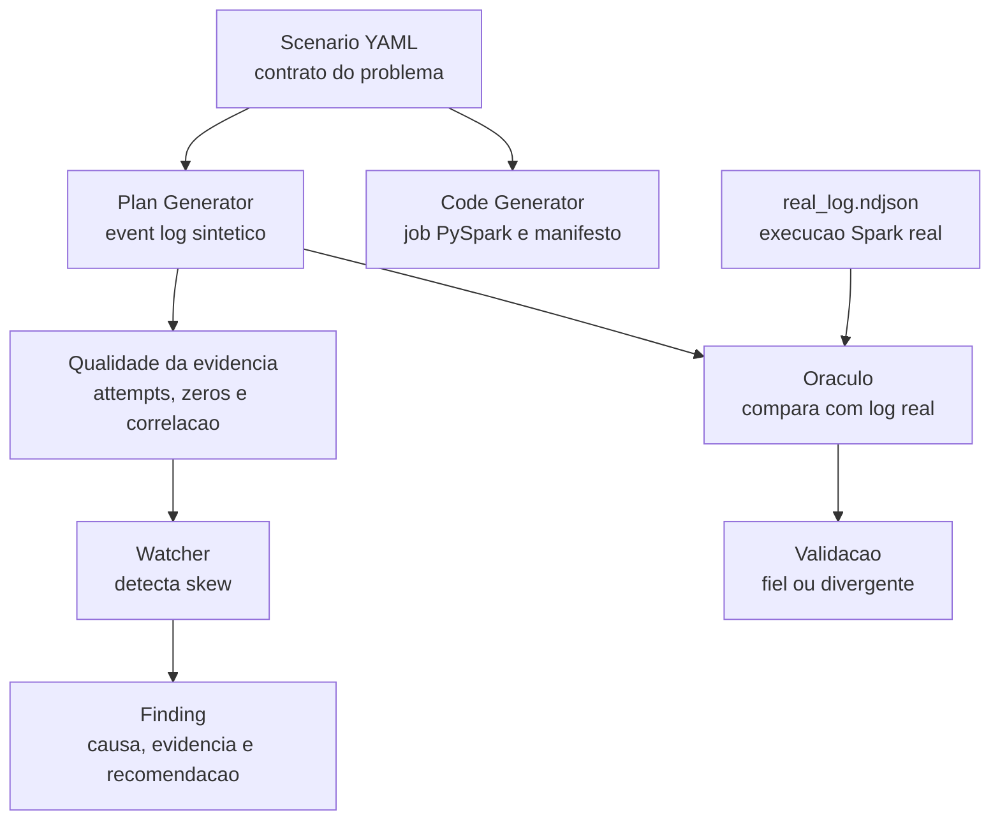

# Apex - Geradores, Watcher e Oraculo (v4 corrigido)

Slice vertical do diagnostico de performance Spark. Um contrato declarativo
(`scenario.yaml`) dirige dois geradores desacoplados:

- `generators/code_generator.py` gera um job PySpark com sentinela e manifesto.
- `generators/plan_generator.py` gera um event log sintetico sem executar Spark.

O Watcher confirma o anti-pattern no scenario controlado depois de validar a
distribuicao e a tentativa efetiva das tasks. O Oraculo compara sinais agregados
e informa divergencias estruturais contra um log real do Spark.

## Evidencia atual

Validado no Ubuntu/WSL sobre o `dataship-spark-plat-v0`:

```text
python -m pytest tests -q
40 passed

watcher: GATE VERDE
synthetic ratio: 27.9x
real ratio:      29.5x
oracle: sinais agregados calibrados; divergencias estruturais viram warnings
```

O documento de linhagem explica o caminho completo da melhoria:

```text
docs/apex-v4-lineage.md
```

Para apresentar ao time e conduzir a validacao:

```text
docs/team-validation-guide.md
```

## Estrutura do slice

```text
apex/apexlib.py                  # leitura de event logs, zstd, rolling logs, plano, skew, provenance
generators/code_generator.py     # scenario -> job.py + manifesto com scenario_hash
generators/plan_generator.py     # scenario -> event log sintetico com ratio realista
watchers/skew_watcher.py         # detecta skew e valida acceptance do scenario
oracle/compare.py                # compara sintetico vs log real
tests/test_slice.py              # parser, attempts, correlacao, provenance, watcher e oracle
scenarios/skew_on_join_30x.yaml  # contrato declarativo do anti-pattern
.github/workflows/scenario-gate.yml
```

## Fluxo didatico



Leitura curta: o `scenario.yaml` diz qual problema queremos simular; o gerador cria um log sintetico; o Watcher encontra o skew; o Oraculo confere se o sintetico bate com um log real.

## Como rodar

```bash
pip install -r requirements.txt
python3 -m pytest tests/test_slice.py -q
```

Fluxo operacional:

```bash
python3 generators/plan_generator.py scenarios/skew_on_join_30x.yaml /tmp/apex-synthetic.ndjson
python3 watchers/skew_watcher.py scenarios/skew_on_join_30x.yaml /tmp/apex-synthetic.ndjson
python3 oracle/compare.py scenarios/skew_on_join_30x.yaml /tmp/apex-synthetic.ndjson real_log.ndjson
```

Ou:

```bash
bash run_slice.sh
```

## O que a v4 corrigiu

| Antes | v4 corrigido |
|---|---|
| Sintetico gerava ratio `15392.3x` | Sintetico gera ratio `27.9x`, perto do real `29.5x` |
| Tasks falhas, retries e speculation podiam duplicar metricas | Uma tentativa efetiva por particao |
| Tasks zero eram removidas | Zeros preservados; mediana fria zero invalida a evidencia |
| `read_events` carregava arquivo inteiro | `iter_events` existe; migrar Watcher e Oracle ainda esta pendente |
| Um arquivo de log por vez | Aceita diretorio de rolling logs |
| Stage escolhido por maior volume | Correlacao por acumuladores; fallback fica explicito |
| Plano podia misturar execucoes | Plano associado por `executionId` |
| Provenance parcial | `scenario_hash` compartilhado entre manifesto e log sintetico |
| Oraculo comparava apenas volume e ratio | Tambem informa hot partition, task type e correlacao |
| CLIs quebravam em Windows `cp1252` | Saida de status ASCII portavel |

## Limite honesto

Este slice calibra o anti-pattern `skew_on_join_30x` contra um event log real
versionado. A correlacao por acumuladores foi provada no stage 2 do log real.
Ele ainda nao prova descoberta cega, falso positivo sem skew, processamento
incremental ou isolamento por aplicacao. Os proximos passos estao documentados
em `docs/apex-v4-lineage.md` e
`docs/architecture/validation-evidence-flow.md`.

## Relacao com o Apex

Este fork funciona como ambiente de evidencia reproduzivel. O produto Apex vive em:

```text
https://github.com/luanmorenommaciel/apex
```

Issues relacionadas: #9, #10, #16, #17, #19, #21, #23 e #25.

## Relacao com AgentSpec

Este slice segue o estilo do AgentSpec, projeto do Commander Luan:

```text
https://github.com/luanmorenommaciel/agentspec
```

Aplicamos a mesma ideia de trabalho orientado por especificacao:

```text
brainstorm -> define -> design -> build -> ship
```

No Apex, isso aparece como:

- `scenarios/skew_on_join_30x.yaml`: contrato declarativo;
- `docs/specs/skew-slice-v4.md`: especificacao tecnica;
- `docs/playbooks/skew-slice-v4.md`: operacao e verificacao;
- `docs/apex-v4-lineage.md`: evidencia e linhagem;
- `tests/test_slice.py`: quality gate executavel.
