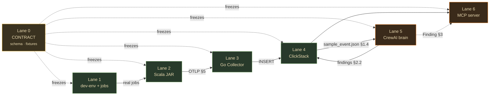

# Lane 0 — The Frozen Contract

> **This is the one file every other lane depends on. Freeze it first; change it only by explicit version bump.**
> It defines the data shapes that flow between lanes so each branch can be built independently and still fuse. If Lane 2 (JAR) and Lane 4 (ClickHouse) both obey this, they compose without either team seeing the other's code.

**Status:** contract v0.1 · **Owner:** you · **Consumed by:** all lanes (1–6)
**Golden rule:** a lane may add fields; it may not rename or repurpose one. Breaking changes = `v0.2` + a note here.

---

## 0. The end-to-end trace key

Everything is threaded by **`job_id`** — a stable identifier for one Spark application run. Every event, row, finding, and MCP call carries it. Example used throughout the docs: `job_id = "ax151sasadds114"`.

```
job.py  ──[job_id]──►  JAR  ──[job_id]──►  OTLP  ──[job_id]──►  ClickHouse  ──[job_id]──►  Finding  ──[job_id]──►  MCP
```

`job_id` = the Spark `applicationId` when available; otherwise a UUID injected via `spark.apex.job_id`. **Never** derive it downstream — the JAR stamps it once, everyone else reads it.

---

## 1. The telemetry event (JAR → Collector)

One event **per completed stage**. Emitted via **OTLP/HTTP** (protobuf or JSON) to the Collector on `:4318`. Modeled as an OTLP **Log record** (simplest for arbitrary attributes) OR structured span — Lane 2/3 pick one and record it here; default = **Log record with structured attributes**.

### 1.1 Identity fields (always present)

| Field | Type | Source | Notes |
|---|---|---|---|
| `job_id` | string | JAR stamps | the trace key |
| `app_id` | string | `SparkContext.applicationId` | |
| `app_name` | string | `spark.app.name` | |
| `stage_id` | int32 | `stageInfo.stageId` | |
| `stage_attempt` | int32 | `stageInfo.attemptNumber` | retries |
| `ts` | int64 (epoch millis) | stage completion time | → ClickHouse `DateTime64(3)` |

### 1.2 Stage metrics (from `stageInfo.taskMetrics`, pre-aggregated by Spark — free)

| Field | Type | Spark source |
|---|---|---|
| `shuffle_read_bytes` | int64 | `shuffleReadMetrics.totalBytesRead` |
| `shuffle_write_bytes` | int64 | `shuffleWriteMetrics.bytesWritten` |
| `spill_disk_bytes` | int64 | `diskBytesSpilled` |
| `spill_mem_bytes` | int64 | `memoryBytesSpilled` |
| `gc_time_ms` | int64 | `jvmGCTime` |
| `input_bytes` | int64 | `inputMetrics.bytesRead` |
| `output_bytes` | int64 | `outputMetrics.bytesWritten` |
| `peak_execution_mem_bytes` | int64 | `peakExecutionMemory` (or `onExecutorMetricsUpdate`) |
| `task_count` | int32 | number of tasks in the stage |
| `task_duration_p50_ms` | int64 | computed from per-task durations |
| `task_duration_p99_ms` | int64 | computed from per-task durations |

> **p50/p99 are the skew signal.** `p99/p50 > 10` = straggler/skew. The JAR computes these from the per-task durations it sees on `onTaskEnd`, or the watcher computes them in SQL — **decision recorded in Lane 2**; default = JAR computes, so the wire already carries them.

### 1.3 Plan capture (once per job, on first SQL execution)

| Field | Type | Notes |
|---|---|---|
| `plan_fingerprint` | string (hex) | **SHA-256 of the NORMALIZED LOGICAL plan** (`queryExecution.optimizedPlan`, canonicalized). **NOT the physical plan** — physical is unstable across AQE / Spark versions / data volume, which would break run-over-run comparison. |
| `plan_json` | string (JSON) | the logical plan tree with **redacted** `node.desc` (see §4) |

### 1.4 Canonical event (JSON fixture — build against this)

`fixtures/sample_event.json` — Lanes 3, 4, 5, 6 build against this **before the real JAR exists**:

```json
{
  "job_id": "ax151sasadds114",
  "app_id": "application_1718553600000_0042",
  "app_name": "daily_revenue",
  "stage_id": 7,
  "stage_attempt": 0,
  "ts": 1718553999000,
  "shuffle_read_bytes": 50465865728,
  "shuffle_write_bytes": 12123000000,
  "spill_disk_bytes": 8100000000,
  "spill_mem_bytes": 0,
  "gc_time_ms": 41200,
  "input_bytes": 88000000,
  "output_bytes": 240000000,
  "peak_execution_mem_bytes": 17179869184,
  "task_count": 200,
  "task_duration_p50_ms": 47000,
  "task_duration_p99_ms": 2478000,
  "plan_fingerprint": "2de5e5760399189a81ab5500a216db0bae5c67f72cf42c08bd9f62689b404cf0",
  "plan_json": "{\"class\":\"Join\",\"joinType\":\"Inner\",\"condition\":\"customer_id\",\"children\":[...]}"
}
```

---

## 2. ClickHouse tables (the store — Lane 4 owns DDL, everyone reads)

Database: **`apex`**.

### 2.1 `spark_events` — one row per stage

```sql
CREATE TABLE apex.spark_events (
  job_id                    String,
  app_id                    String,
  app_name                  String,
  stage_id                  Int32,
  stage_attempt             Int32,
  ts                        DateTime64(3),
  shuffle_read_bytes        Int64,
  shuffle_write_bytes       Int64,
  spill_disk_bytes          Int64,
  spill_mem_bytes           Int64,
  gc_time_ms                Int64,
  input_bytes               Int64,
  output_bytes              Int64,
  peak_execution_mem_bytes  Int64,
  task_count                Int32,
  task_duration_p50_ms      Int64,
  task_duration_p99_ms      Int64,
  plan_fingerprint          FixedString(64),
  plan_json                 String,
  attributes                Map(String, String)   -- extensibility escape hatch
)
ENGINE = MergeTree
PARTITION BY toYYYYMM(ts)
ORDER BY (job_id, stage_id, stage_attempt)
TTL toDateTime(ts) + INTERVAL 90 DAY;
```

### 2.2 `findings` — one row per detected issue (Lane 5 writes, Lane 6 reads)

```sql
CREATE TABLE apex.findings (
  finding_id     String,                 -- uuid
  job_id         String,
  stage_id       Int32,
  type           String,                 -- SKEW_ON_JOIN | SPILL | BAD_SHUFFLE | DRIVER_OOM | ...
  severity       Enum8('info'=1,'warning'=2,'critical'=3,'blocker'=4),
  evidence       String,                 -- "p99/p50 = 52.7x on customer_id"
  hot_key        String,                 -- "customer_id=12847" (nullable-ish, "")
  impact         String,                 -- "-38% runtime, -$211/run"
  fix            String,                 -- "enable AQE skew join"
  confidence     Enum8('LOW'=1,'MEDIUM'=2,'HIGH'=3),
  detected_by    String,                 -- "skew_watcher" | "correlation" | "judger"
  ts             DateTime64(3)
)
ENGINE = MergeTree
PARTITION BY toYYYYMM(ts)
ORDER BY (job_id, severity, ts);
```

---

## 3. The `Finding` object (Lane 5 → Lane 6, Pydantic)

The in-memory shape the agentic system produces and the MCP serves. **Field names match the `findings` table exactly.**

```python
from enum import Enum
from pydantic import BaseModel

class Severity(str, Enum):
    info = "info"; warning = "warning"; critical = "critical"; blocker = "blocker"

class Confidence(str, Enum):
    LOW = "LOW"; MEDIUM = "MEDIUM"; HIGH = "HIGH"

class Finding(BaseModel):
    finding_id: str
    job_id: str
    stage_id: int
    type: str                 # SKEW_ON_JOIN | SPILL | BAD_SHUFFLE | DRIVER_OOM
    severity: Severity
    evidence: str
    hot_key: str = ""
    impact: str
    fix: str
    confidence: Confidence
    detected_by: str
```

---

## 4. PII / redaction rules (enforced in TWO places)

Plan text and query text routinely contain literals, column values, table paths, emails → **PII must not leave the cluster in the clear.**

| Field | Rule | Where |
|---|---|---|
| `plan_json` node.desc literals | strip string/number literals → `?` | **in-JVM (Lane 2)** — primary |
| `query_text` (if ever captured) | salted SHA-256 hash | in-JVM (Lane 2) |
| `file_path` / paths | drop | in-JVM (Lane 2) |
| `user_email` | drop | Collector (Lane 3) — defense-in-depth |
| anything that slips through | Collector `transform` processor re-scrubs | Collector (Lane 3) |

**Primary redaction is in-JVM before egress; the Collector is a second net — never the only one.**

---

## 5. Transport details (Lane 2 ↔ Lane 3)

- **Protocol:** OTLP/HTTP → `http://<collector>:4318` (config key on the job: `spark.apex.endpoint`).
- **Encoding:** protobuf (default) or JSON — Lane 2/3 agree; default protobuf.
- **Mapping:** each stage event = one OTLP Log record; the §1 fields become log **attributes** (flat, snake_case, exactly the names above).
- **Resilience (Lane 2):** emission on a **bounded async queue** (drop-and-count on overflow) wrapped in `Try/recover` — a slow/failed Collector must **never** stall the Spark driver.

---

## 6. Activation contract (how a job turns Apex on) — Lane 1 & Lane 2

The install story = **two config lines** (plus the endpoint). This is the exact surface Lane 1's jobs use and Lane 2's JAR reads:

```python
SparkSession.builder
  .config("spark.jars.packages",   "io.dataship:apex_2.12:0.1.0")
  .config("spark.extraListeners",  "io.dataship.apex.ApexSparkListener")
  .config("spark.apex.endpoint",   "http://collector:4318")
  # optional: .config("spark.apex.job_id", "<uuid>")   # when applicationId isn't stable
```

---

## 7. Lane dependency graph



**The unlock:** because §1.4 (`sample_event.json`) and §2 (DDL) are frozen here, **Lanes 5 & 6 (the brain — the fun part) can be built against synthetic rows before Lanes 2/3/4 (the plumbing) are real.** Load `sample_event.json` into ClickHouse, and the brain is unblocked.

---

## 8. Build order (solo micro-strategy)

1. **Freeze this file.** Write `fixtures/sample_event.json` + the two `CREATE TABLE`s.
2. **Tracer bullet:** thinnest version of all 6 lanes, one fake number end-to-end (proves the pipe).
3. **Split:** plumbing bottom-up (L1→L2→L3→L4) **while** brain top-down (L5→L6) against the fixture.
4. **Fuse:** swap the fixture for real rows. If the contract held, it just works.

Each lane doc (`LANE-1` … `LANE-6`) is a self-contained branch brief. Hand each to an agent with this file as the shared dependency.
