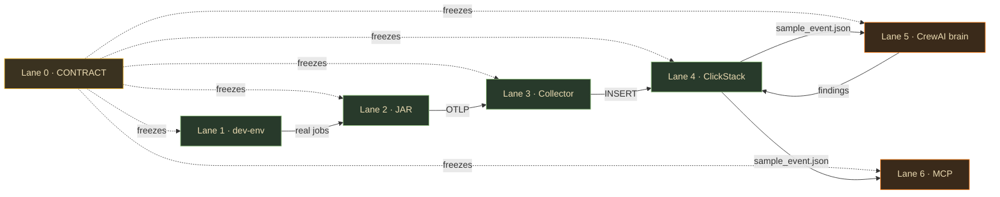

# Apex — Six Swim Lanes (branch-per-lane build plan)

> Solo-build plan for Apex, split into 6 independent lanes + 1 frozen contract. **Each `LANE-*.md` is a self-contained brief** you hand to a coding agent on its own git branch. All were research-backed via Exa/Tavily/Firecrawl/Context7 (2025–2026 versions) and anchored to one shared contract so the branches **fuse** when merged.

## The files

| File | Branch | Language | What it builds |
|---|---|---|---|
| [`LANE-0-CONTRACT.md`](LANE-0-CONTRACT.md) | *(no branch — shared dep)* | spec | The frozen data contract every lane obeys: `job_id` threading, telemetry event, `spark_events`/`findings` DDL, `Finding` shape, redaction, OTLP transport, activation |
| [`LANE-1-DEVENV.md`](LANE-1-DEVENV.md) | `feat/lane-1-devenv` | Python + Docker | Spark/Delta pathology lab — reproducible skewed jobs (skew/spill/bad-shuffle/OOM) + History Server + MinIO |
| [`LANE-2-JAR.md`](LANE-2-JAR.md) | `feat/lane-2-jar` | Scala (sbt) | The capture JAR — `SparkListener` stage metrics + normalized logical-plan fingerprint → OTLP, bounded/non-blocking |
| [`LANE-3-COLLECTOR.md`](LANE-3-COLLECTOR.md) | `feat/lane-3-collector` | YAML (otelcol-contrib) | OTLP :4318 → PII scrub → ClickHouse; MV bridge `otel_traces` → `spark_events` |
| [`LANE-4-CLICKSTACK.md`](LANE-4-CLICKSTACK.md) | `feat/lane-4-clickstack` | SQL + Docker | ClickStack (ClickHouse + HyperDX) store & serving; rollup MV + skew queries + dashboard |
| [`LANE-5-AGENTIC.md`](LANE-5-AGENTIC.md) | `feat/lane-5-agentic` | Python (CrewAI) | The brain — 5 deterministic SQL watchers + gated CrewAI correlation/Judger → `findings` |
| [`LANE-6-MCP.md`](LANE-6-MCP.md) | `feat/lane-6-mcp` | Python (FastMCP) | The MCP server — `analyze_run`/`compare_runs`/`search_kb` (read) + `suggest_fix` (write, human-merge) |

## The dependency graph



## The micro-strategy (how to actually build it solo)

**Do NOT build L1→L6 in order to completion.** Two passes:

1. **Freeze the contract first** ([`LANE-0`](LANE-0-CONTRACT.md)) — write `fixtures/sample_event.json` + the two `CREATE TABLE`s. This single act unlocks parallel work.
2. **Tracer bullet** — the thinnest version of all 6 lanes, one fake number end-to-end. Proves the pipe holds.
3. **Then split the work by "hot/fun" alternation:**
   - **Plumbing (bottom-up, harder):** L1 → L2 → L3 → L4. JVM/Go/SQL — the grind.
   - **Brain (against synthetic rows, funner):** L5 → L6. Load `sample_event.json` into ClickHouse and build the CrewAI brain + MCP **before the real JAR exists.**
4. **Fuse** — swap synthetic rows for real ones. If the contract held, it just works.

> **The key unlock:** because [`LANE-0`](LANE-0-CONTRACT.md) freezes `sample_event.json` + the DDL, **Lanes 5 & 6 (the fun part) don't wait on Lanes 2/3/4 (the plumbing).** They only meet at the contract.

## How to feed a lane to an agent

On a fresh branch, hand the agent **two files**: `LANE-0-CONTRACT.md` (the shared interface) + the one `LANE-N-*.md` (its mission). That's everything — each lane doc restates the slice of the contract it touches, has a mermaid diagram, key decisions with researched versions, verify-gated build steps, an atomic task checklist, starter code snippets, and verified pitfalls. Example:

```
git checkout -b feat/lane-2-jar
# agent prompt: "Build this branch per LANE-2-JAR.md. LANE-0-CONTRACT.md is the frozen
#  interface — obey its field names exactly. Work through the task checklist; each task's
#  acceptance criterion is your test."
```

## Version pins captured by the research (as of mid-2026)

| Lane | Key pins |
|---|---|
| 1 | Spark 4.0.1 + delta-spark 4.0.1 + hadoop-aws **3.4.x** (fallback Spark 3.5.6 / delta 3.3.2 / hadoop-aws 3.3.4) |
| 2 | `sbt-projectmatrix` (Spark 3.5 ×2.12/2.13, 4.0 ×2.13); OpenTelemetry Java SDK 1.5x; Spark `Provided` |
| 3 | `otel/opentelemetry-collector-contrib:0.156.0`; internal `sending_queue.batch` (not the batch processor) |
| 4 | `clickhouse/clickstack-*` images + `hdx-oss-v2`; `Map(String,String)` attrs; AggregatingMergeTree rollup |
| 5 | `crewai[anthropic]>=1.7,<2`; `clickhouse-connect>=0.8`; models `claude-haiku-4-5`/`claude-sonnet-5`/`claude-opus-4-8` |
| 6 | `mcp[cli]>=1.27,<2` (SDK-bundled FastMCP; **pin `<2`**); `clickhouse-connect>=1.4,<2`; stdio + `uvx` |

## The three cross-lane gotchas that will bite if ignored

1. **The ClickHouse exporter can't write custom columns** ([Lane 3](LANE-3-COLLECTOR.md)) — land in `otel_traces`, reshape into `spark_events` via a **Materialized View**. Don't point the exporter at `spark_events`.
2. **Fingerprint the LOGICAL plan, not physical** ([Lane 2](LANE-2-JAR.md)) — `optimizedPlan.canonicalized`, or AQE churn breaks `compare_runs` regression detection.
3. **Watchers are deterministic SQL, not agents** ([Lane 5](LANE-5-AGENTIC.md)) — CrewAI is used ONLY for gated correlation + the adversarial Judger, never for the 5 watchers.

---

*Generated from a 6-agent parallel research workflow (Exa/Tavily/Firecrawl/Context7) + a frozen-contract authoring pass. Each lane doc is independently buildable; the shared contract is what makes the branches compose.*
