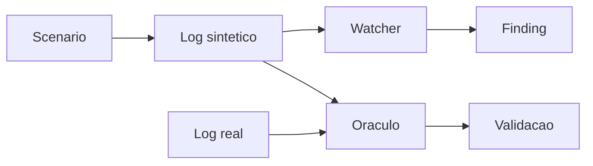
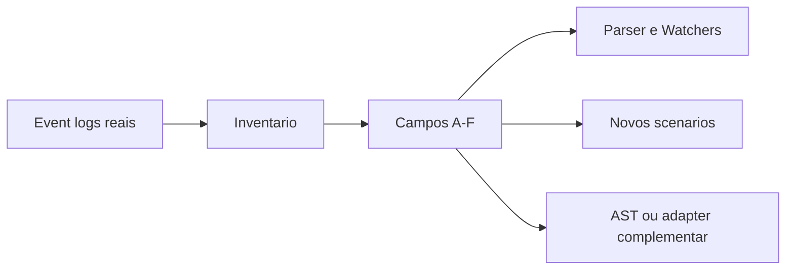

# Apex Docs

Este diretorio organiza o material do slice `skew_on_join_30x` v4 corrigido, a
rodada Codex Round2 e a comparacao do campeonato entre engines LLM.

## Leitura recomendada

1. [README da branch](../README.md) resume o que existe, evidencias e gaps.
2. [PLANO F0-F6](../PLANO.md) mapeia L1-L9 e gates contra artefatos.
3. [Issues formais](../ISSUES.md) guarda bugs, riscos, decisoes e evidencias.
4. [Autoavaliacao](autoavaliacao.md) traz o scorecard C1-C6 atual.
5. [Comparacao campeonato 14/07](architecture/llm-solution-validation-framework-2026-07-14.md) compara Codex, Cowork, Kimi, Spike, Codex antiga e DataFlint.
6. [Apresentacao da solucao Codex](presentations/apex-codex-solucao-end-to-end-2026-07-14.html) mostra fluxo end-to-end para o Commander.
7. [Apresentacao comparativa 14/07](presentations/llm-solution-validation-2026-07-14.html) mostra campeonato, scorecard e recomendacao.
8. [Guia de validacao](team-validation-guide.md) orienta a revisao com a Crew A.
9. [Rascunhos de ADR](adr-review-drafts.md) organiza a leitura antes de comentar oficialmente.
10. [Rascunhos de issues](github-issue-comment-drafts.md) guarda comentarios para validacao.
11. [Linhagem da v4](apex-v4-lineage.md) explica baseline, falhas, correcao e evidencia.
12. [Spec do slice de skew](specs/skew-slice-v4.md) define o contrato tecnico.
13. [Playbook do slice](playbooks/skew-slice-v4.md) mostra como rodar e interpretar.
14. [Fluxo de validacao e cadeia de evidencia](architecture/validation-evidence-flow.md) mantem arquitetura, sequencia, valor e rupturas sincronizados.
15. [Drill-down completo](architecture/apex-solution-drilldown.md) vai do contexto do produto ate task metrics e sequencias.

## Papel de cada documento

| Documento | Uso |
|---|---|
| `../README.md` | Resumo executivo da branch, mapa de evidencias e gaps |
| `../PLANO.md` | Estado L1-L9, gates comuns, gaps e reaproveitamento |
| `../ISSUES.md` | Catalogo formal de riscos, bugs, decisoes e evidencias |
| `autoavaliacao.md` | Scorecard C1-C6 atualizado da engine Codex |
| `architecture/llm-solution-validation-framework-2026-07-14.md` | Comparacao atualizada do campeonato e DataFlint |
| `team-validation-guide.md` | Material didatico para apresentar o slice ao time e conduzir decisao |
| `adr-review-drafts.md` | Leitura das ADRs, limites do estudo e comentarios sugeridos para revisao |
| `github-issue-comment-drafts.md` | Rascunhos de issue e comentarios para revisao da Crew A antes de publicar |
| `apex-v4-lineage.md` | Historia da melhoria e relacao com issues do Apex |
| `specs/skew-slice-v4.md` | Especificacao tecnica para implementacao e revisao |
| `playbooks/skew-slice-v4.md` | Passo a passo para operar e validar |
| `agentspec-alignment.md` | Encaixe com Spec-Driven Data Engineering |
| `presentations/apex-v2-aqe-learnings.html` | Apresentacao para alinhamento com o time |
| `specs/event-log-coverage-inventory-v1.md` | Contrato, classificacao A-F e limites do inventario |
| `specs/scenario-validation-criteria-v1.md` | Proposta de gate para validar evidencia antes do Watcher |
| `architecture/validation-evidence-flow.md` | Visao canonica do fluxo, arquitetura, sequencia, valor, gargalos e rupturas |
| `architecture/event-log-observability-boundary.md` | Arquitetura Spark, fronteira do event log e fontes complementares |
| `architecture/apex-solution-drilldown.md` | Visao L0-L5, sequencia validada, arquitetura alvo e matriz de comprovacao |
| `coverage/README.md` | Guia de execucao e leitura do relatorio |
| `coverage/apex-coverage-report-v1.md` | Evidencia produzida pelo corpus atual |

## Fluxo mental do slice



Para uma leitura menos tecnica, comece pelo `team-validation-guide.md`. Para revisao de engenharia, use a spec e o playbook.

## Fluxo do estudo de cobertura



O slice de skew prova um caso de diagnostico. O inventario mede quais sinais
podem sustentar os proximos casos.

Para apresentar a solucao do macro ao detalhe, use o
[drill-down completo](architecture/apex-solution-drilldown.md).

Para revisar qualquer mudanca em validacao, use o
[fluxo de validacao e cadeia de evidencia](architecture/validation-evidence-flow.md).
Esse documento deve ser atualizado junto com o contrato para impedir que codigo,
issues e desenhos descrevam arquiteturas diferentes.

## Evidencia principal

```text
G3 real spv0:          app-20260712053414-0001, ratio 29.4x
G5 real spv0:          finding_count 1 -> 0, shuffle 1.157.481 -> 0
G3 autonomo 14/07:     app-20260714112858-0003, ratio 29.4x
G5 autonomo 14/07:     app-20260714113809-0004, finding_count 0
G4 T1 sem LLM:         226.991 ms
MCP/IDE subprocess:    tools/list, recommend_fix, preview, apply_fix
```
