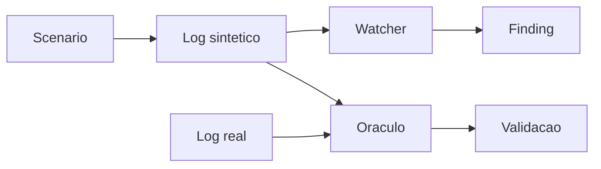
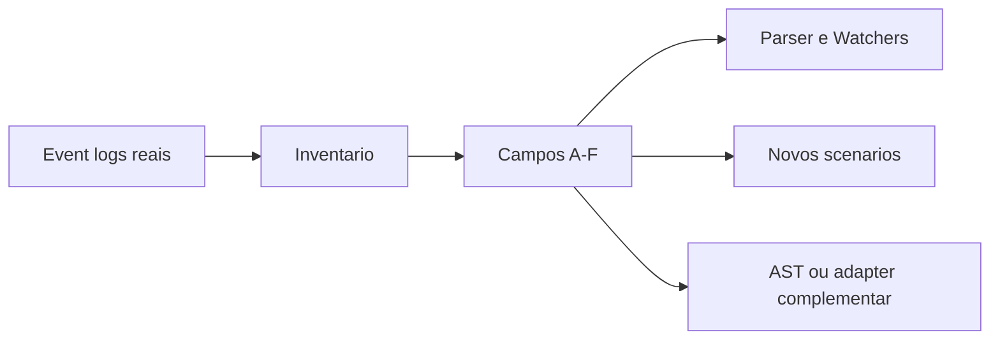

# Apex Docs

Este diretorio organiza o material do slice `skew_on_join_30x` v4 corrigido e o
estudo empirico da fronteira de observabilidade do Spark event log.

## Leitura recomendada

1. [Guia de validacao](team-validation-guide.md) orienta a revisao com a Crew A.
2. [Rascunhos de ADR](adr-review-drafts.md) organiza a leitura antes de comentar oficialmente.
3. [Rascunhos de issues](github-issue-comment-drafts.md) guarda comentarios para validacao.
4. [Linhagem da v4](apex-v4-lineage.md) explica baseline, falhas, correcao e evidencia.
5. [Spec do slice de skew](specs/skew-slice-v4.md) define o contrato tecnico.
6. [Playbook do slice](playbooks/skew-slice-v4.md) mostra como rodar e interpretar.
7. [Alinhamento com AgentSpec](agentspec-alignment.md) registra o modelo de organizacao.
8. [Apresentacao AQE](presentations/apex-v2-aqe-learnings.html) preserva os achados apresentados.
9. [Spec do inventario](specs/event-log-coverage-inventory-v1.md) define o contrato de cobertura.
10. [Proposta de validation criteria](specs/scenario-validation-criteria-v1.md) define o gate de qualidade da evidencia.
11. [Fronteira de observabilidade](architecture/event-log-observability-boundary.md) explica limites e fontes.
12. [Drill-down completo](architecture/apex-solution-drilldown.md) vai do contexto do produto ate task metrics e sequencias.
13. [Guia do inventario](coverage/README.md) ensina a executar e interpretar.
14. [Relatorio v1](coverage/apex-coverage-report-v1.md) registra o corpus atual.

## Papel de cada documento

| Documento | Uso |
|---|---|
| `team-validation-guide.md` | Material didatico para apresentar o slice ao time e conduzir decisao |
| `adr-review-drafts.md` | Leitura das ADRs, limites do estudo e comentarios sugeridos para revisao |
| `github-issue-comment-drafts.md` | Rascunhos de issue e comentarios para revisao da Crew A antes de publicar |
| `apex-v4-lineage.md` | Historia da melhoria e relacao com issues do Apex |
| `specs/skew-slice-v4.md` | Especificacao tecnica para implementacao e revisao |
| `playbooks/skew-slice-v4.md` | Passo a passo para operar e validar |
| `agentspec-alignment.md` | Encaixe com Spec-Driven Data Engineering |
| `presentations/apex-v2-aqe-learnings.html` | Apresentacao para alinhamento com o time |
| `specs/event-log-coverage-inventory-v1.md` | Contrato, classificacao A-F e limites do inventario |
| `specs/scenario-validation-criteria-v1.md` | Proposta de gate para validar evidencia antes do Watcher |
| `architecture/event-log-observability-boundary.md` | Arquitetura Spark, fronteira do event log e fontes complementares |
| `architecture/apex-solution-drilldown.md` | Visao L0-L5, sequencia validada, arquitetura alvo e matriz de comprovacao |
| `coverage/README.md` | Guia de execucao e leitura do relatorio |
| `coverage/apex-coverage-report-v1.md` | Evidencia produzida pelo corpus atual |

## Fluxo mental do slice



Para uma leitura menos tecnica, comece pelo `team-validation-guide.md`. Para revisao de engenharia, use a spec e o playbook.

## Fluxo do estudo de cobertura



O slice de skew prova um caso de diagnostico. O inventario mede quais sinais
podem sustentar os proximos casos.

Para apresentar a solucao do macro ao detalhe, use o
[drill-down completo](architecture/apex-solution-drilldown.md).

## Evidencia principal

```text
synthetic ratio: 27.9x
real ratio:      29.5x
oracle: sintetico fiel ao Spark real dentro da tolerancia
```
