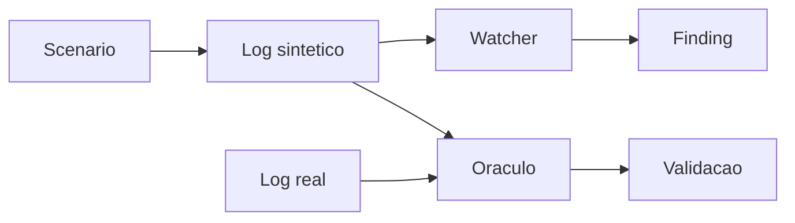

# Apex Docs

Este diretorio organiza o material do slice `skew_on_join_30x` v4 corrigido.

## Leitura recomendada

1. `team-validation-guide.md` guia a revisao com a Crew A: fluxo, arquitetura, evidencia e decisoes.
2. `apex-v4-lineage.md` explica a linhagem da melhoria: baseline antigo, falhas, correcao e evidencia.
3. `specs/skew-slice-v4.md` define o contrato tecnico do slice.
4. `playbooks/skew-slice-v4.md` mostra como rodar, validar e interpretar o resultado.
5. `agentspec-alignment.md` mostra como o slice segue o estilo AgentSpec.
6. `presentations/apex-v2-aqe-learnings.html` preserva a apresentacao tecnica usada para explicar os achados do AQE.

## Papel de cada documento

| Documento | Uso |
|---|---|
| `team-validation-guide.md` | Material didatico para apresentar o slice ao time e conduzir decisao |
| `apex-v4-lineage.md` | Historia da melhoria e relacao com issues do Apex |
| `specs/skew-slice-v4.md` | Especificacao tecnica para implementacao e revisao |
| `playbooks/skew-slice-v4.md` | Passo a passo para operar e validar |
| `agentspec-alignment.md` | Encaixe com Spec-Driven Data Engineering |
| `presentations/apex-v2-aqe-learnings.html` | Apresentacao para alinhamento com o time |

## Fluxo mental do slice



Para uma leitura menos tecnica, comece pelo `team-validation-guide.md`. Para revisao de engenharia, use a spec e o playbook.

## Evidencia principal

```text
synthetic ratio: 27.9x
real ratio:      29.5x
oracle: sintetico fiel ao Spark real dentro da tolerancia
```
