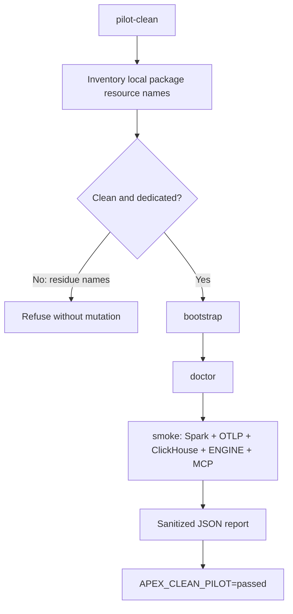

# Apex clean pilot - design

## Decision

The installation proof uses a fail-closed command on a fresh clone and
dedicated Docker runtime. It does not namespace a second stack and does not
delete an existing one.

## Preconditions

The pilot refuses execution when any of these are present:

- `.apex/` runtime configuration;
- tracked worktree changes;
- canonical APEX container names;
- `apex-infra-net`, `apex-collect-net` or `apex-dev_default`;
- canonical INFRA, COLLECT or DEV named volumes.

Only resource names are inspected. Container environments and volume contents
are never read by the pilot preflight.

## Flow

## Report contract

`evidence/clean-pilot-summary.json` contains:

- schema and pass status;
- UTC start/completion timestamps;
- branch and commit;
- Spark version and fresh `job_id`;
- container status/health;
- bootstrap, doctor, smoke and product-gate status;
- booleans proving that secret values, external LLM calls and automatic fixes
  are absent.

It never contains environment variables, credentials, prompts or source data.

## Rollback

There is no automatic rollback because the pilot never removes resources.
After a successful pilot, the operator may run `.\scripts\apex.ps1 down`,
which preserves volumes. Disposal of a dedicated runner or removal of its
volumes is an operator-owned infrastructure action outside the package.
