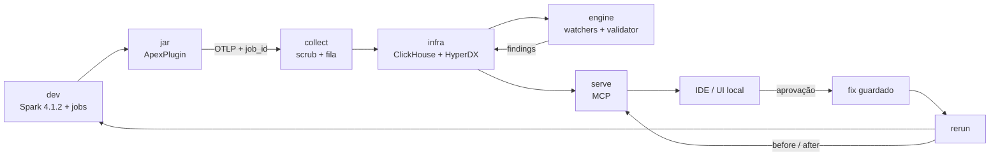

# Apex V1 por raias e PRs

> ## ⓘ HISTORICAL — the 6-lane design as approved on 2026-07-23.
>
> Preserved as the record of what was agreed. **v0.1 shipped eight lanes:** `memory/` (⑦) and
> `verify/` (⑧) were added mid-build in response to what the first six uncovered. The security
> boundaries and gates described here still hold; the lane inventory does not.
>
> **Current state:** [`../../PIPELINE.md`](../../PIPELINE.md) ·
> [`../../CONTRACT.md`](../../CONTRACT.md) (now v0.4, seven cross-lane rules) ·
> [`../lanes/`](../lanes/)

**Data:** 2026-07-23
**Captain:** Augusto Cezar
**Base central:** `origin/feat/base-project-e2e` em `9d51aca`
**Fonte técnica:** `gustocezar/feature/codex-base-e2e-convergencia`
**Escopo deste PR:** arquitetura e plano; nenhum código de raia

## Objetivo

Entregar a V1 descrita por Luan na reunião de 21/07:

1. um ambiente Spark reproduzível gera jobs reais;
2. um plugin Scala captura telemetria pelo SparkListener;
3. o Collector trata OTLP e o ClickStack armazena os dados;
4. o engine produz diagnóstico verificável;
5. o MCP explica o problema no IDE;
6. o usuário revisa uma correção, aprova a mudança e compara a nova execução.

O time deve conseguir entender e demonstrar esse fluxo em até três minutos.

## Decisões aprovadas

| Tema | Decisão |
|---|---|
| Base | todo PR nasce de `origin/feat/base-project-e2e` |
| Organização | seis raias: `dev`, `jar`, `collect`, `infra`, `engine`, `serve` |
| Contrato | `CONTRACT.md` v0.2 permanece congelado |
| Spark | Spark 4.1.2 passa a ser o padrão da V1 |
| Captura | `ApexPlugin` Scala é a única implementação de telemetria |
| Transporte | OTLP/HTTP na porta interna 4318 |
| Persistência | ClickHouse canônico; HyperDX cobre observabilidade operacional |
| Diagnóstico | detectores e validator determinísticos executam antes do LLM |
| Crew/Judge | opcional, read-only e obrigado a citar evidência existente |
| Correção | `suggest -> preview -> aprovação -> apply -> rerun -> compare` |
| UI | UI Apex complementa HyperDX com a jornada do diagnóstico |
| Segredos | o instalador solicita credenciais do operador; nenhuma chave pessoal entra no Git |

## Alternativas

### PR único com toda a convergência

O diff atual tem cerca de cem arquivos, mistura raias e inclui evidências
históricas extensas. A revisão perderia as fronteiras de responsabilidade.
Opção descartada.

### Cherry-pick direto dos 17 commits

Alguns commits locais atravessam `jar`, `dev`, `collect` e infraestrutura. O
histórico prova a evolução, mas não oferece unidades adequadas para revisão.
Os PRs reaproveitarão código e testes por seleção de arquivos, sem reescrever a
branch de evidência. Opção descartada como estratégia principal.

### PRs pequenos por raia

Cada PR parte da base central, altera uma raia e declara seu contrato de entrada
e saída. Um PR posterior integra as seis raias. Opção escolhida.

## Arquitetura V1

## Contratos entre raias

| Produtor | Consumidor | Contrato | Gate |
|---|---|---|---|
| `dev` | `jar` | job Spark 4.1.2 com `job_id` | app aparece no History Server |
| `jar` | `collect` | evento OTLP por stage, campos v0.2 | collector recebe sem bloquear driver |
| `collect` | `infra` | linhas sanitizadas em `apex.spark_events` | contagem por `job_id` confere |
| `infra` | `engine` | stages e transições consultados com parâmetros | cenário saudável não gera finding |
| `engine` | `infra` | `Finding` v0.2 validado | patologia gera finding esperado |
| `infra` | `serve` | telemetria e findings read-only | MCP retorna o mesmo `job_id` |
| `serve` | humano | recomendação, diff e token de aprovação | preview não altera arquivo |
| humano | `serve` | aprovação explícita | apply limitado ao arquivo autorizado |
| rerun | todas | novo `job_id` | comparação mostra melhora ou regressão |

## Segurança e governança

- O JAR remove PII antes do egress; o Collector aplica a segunda barreira.
- O engine trata `plan_json`, findings e texto do LLM como dados não confiáveis.
- SQL usa parâmetros; ferramentas não interpolam `job_id`.
- Crew/Judge não altera arquivos, executa comandos ou aprova sua própria saída.
- `apply_fix` recebe arquivo, hashes e token vinculados ao preview.
- O runner restringe o diretório de aplicação.
- A UI escapa conteúdo externo e não exibe ambiente ou credenciais.
- Logs detalhados de Spark ficam fora do Git. PRs levam resumos sanitizados.

## Evidência e ciclo de vida

Cada PR inclui:

1. testes da raia;
2. uma evidência sanitizada curta;
3. comando de reprodução;
4. limite conhecido;
5. rollback por `git revert`.

Execuções extensas seguem para artifacts do CI. O repositório guarda o resumo,
os identificadores e as métricas que sustentam a decisão.

## Critério de conclusão da V1

A V1 fecha quando uma instalação nova permite:

1. subir a stack com credenciais fornecidas pelo operador;
2. executar um job real no Spark 4.1.2;
3. consultar o mesmo `job_id` no ClickHouse e no MCP;
4. receber diagnóstico determinístico e revisão opcional do Judge;
5. visualizar evidência, recomendação e diff;
6. aprovar a mudança;
7. reexecutar e comparar telemetria;
8. repetir a demonstração seguindo apenas o README.

## Fora da V1

- intervenção durante uma execução ativa;
- previsão estatística do resultado de código ainda não executado;
- análise automática de pull requests;
- integração com GitHub do cliente;
- Databricks Serverless via system tables;
- operação distribuída multi-tenant.

Esses itens continuam como direção de produto, sem bloquear a primeira entrega.
