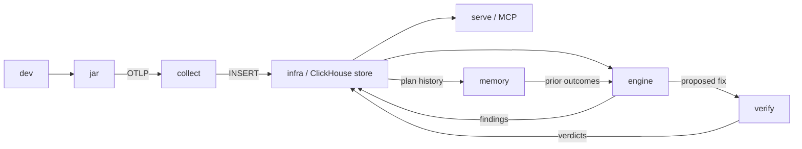

# Matriz de compatibilidade da telemetria

**Base observada:** `847d7a0f1fee1bd41737e2ba74d6c9cbf83bdbbc`.
**Método:** leitura estática e testes offline; nenhum processo de Docker, Spark,
ClickHouse, Collector ou MCP foi iniciado.

O contrato global declarado em `CONTRACT.md` é **v0.5** e nomeia `dev`, `jar`,
`collect`, `infra`, `engine`, `serve`, `memory` e `verify`. Esta matriz separa
fluxo principal, lanes transversais e implementação observada. É evidência
offline, não uma alegação de interoperabilidade em runtime.

## Topologia e ownership observados

O grafo reproduz `PIPELINE.md`: as seis primeiras lanes formam o fluxo principal
e `memory`/`verify` são transversais. Não existe uma cadeia serial
`Engine -> Serve/MCP -> Memory -> Verify`.



| Aresta observada | Papel | Fonte independente |
| --- | --- | --- |
| `dev -> jar -> collect -> infra/store` | Fluxo principal: job real, captura, OTLP e INSERT no store. | `PIPELINE.md` |
| `infra/store -> engine` e `engine -> infra/store` | Engine lê telemetria e devolve findings. | `PIPELINE.md`; `engine/src/apex_engine/clickhouse.py` |
| `infra/store -> serve/MCP` | Serve é leitor paralelo do store, não sucessor do Engine. | `PIPELINE.md`; `serve/src/apex_mcp/ch.py` |
| `infra/store -> memory -> engine` | Memory recebe histórico e fornece prior outcomes ao Engine. | `PIPELINE.md`; `memory/src/apex_memory/clickhouse.py` |
| `engine -> verify -> infra/store` | `PIPELINE.md` declara o retorno de verdicts ao store. A serialização Verify é observada, mas persistência não. | `PIPELINE.md`; `verify/ddl/fix_verifications.ddl.sql`; `verify/src/apex_verify/models.py` |

`infra/` **aplica toda a cadeia de DDL**. Outras lanes podem carregar DDL
canônico, mas não aplicam tabelas por conta própria.

## Manifesto estrutural verificável

O teste lê este JSON e compara seus fatos com arquivos independentes da base.

```json
{
  "contract_version": "v0.5",
  "runtime_caveat": "offline_unproven",
  "edges": [
    {"from": "dev", "to": "jar", "role": "primary", "payload": "real_jobs"},
    {"from": "jar", "to": "collect", "role": "primary", "payload": "OTLP"},
    {"from": "collect", "to": "store", "role": "primary", "payload": "INSERT"},
    {"from": "store", "to": "engine", "role": "primary", "payload": "telemetry"},
    {"from": "store", "to": "serve", "role": "primary", "payload": "telemetry"},
    {"from": "engine", "to": "store", "role": "primary", "payload": "findings"},
    {"from": "store", "to": "memory", "role": "cross_cutting", "payload": "plan_history"},
    {"from": "memory", "to": "engine", "role": "cross_cutting", "payload": "prior_outcomes"},
    {"from": "engine", "to": "verify", "role": "cross_cutting", "payload": "proposed_fix"},
    {"from": "verify", "to": "store", "role": "cross_cutting", "payload": "verdicts"}
  ],
  "owners": {
    "infra": {"responsibility": "apply_all_ddl"},
    "jar": {"emits": ["apex.stage", "apex.plan_transition", "apex.job_conf"]},
    "engine": {"writes": ["apex.findings"]},
    "memory": {"writes": ["apex.plan_memory", "apex.run_outcomes"]},
    "verify": {
      "declared_owner": "verify",
      "declared_output": "apex.fix_verifications",
      "serialization_observed": "Verdict.to_row",
      "persistence_observed": "absent"
    }
  },
  "mv_chain": {
    "initial": "infra/sql/020_mv_reshape.sql",
    "job_conf": "infra/sql/021_mv_job_conf.sql",
    "v05_evolution": [
      "infra/sql/034_stage_duration_max_additive.sql",
      "infra/sql/035_successful_task_sample_additive.sql",
      "infra/sql/036_task_termination_additive.sql",
      "infra/sql/037_task_shuffle_volume_additive.sql",
      "infra/sql/038_scheduler_failure_semantics_additive.sql",
      "infra/sql/039_executor_runtime_additive.sql"
    ]
  },
  "drifts": [
    {
      "id": "v05_sample_count_consumer_gap",
      "contract": "sample_count_zero_is_absent",
      "observed_consumers_without_sample_count": ["engine", "memory", "verify"],
      "legacy_p50_p99_consumers": ["engine", "memory"]
    },
    {
      "id": "verify_executor_runtime_claim_outdated",
      "verify_claim": "not_a_spark_events_column",
      "contradicted_by": [
        "infra/sql/039_executor_runtime_additive.sql",
        "engine/src/apex_engine/clickhouse.py"
      ]
    }
  ]
}
```

## JAR, OTLP, Collector e store

| Limite | Implementação observada | Compatibilidade declarada/operacional |
| --- | --- | --- |
| JAR -> OTLP | `jar/src/main/scala/apex/ApexOtelSink.scala` emite `apex.stage`, `apex.plan_transition` e `apex.job_conf` por OTLP/HTTP. | Endpoint com `/v1/traces`; `job_id` é a chave de rastreio. |
| OTLP -> Collector | `collect/config.yaml` e `infra/otel-collector-config.yaml` recebem HTTP em `:4318`; gRPC `:4317` é opcional. | `traces_table_name: otel_traces` e exporter ClickHouse TCP `:9000`. |
| Collector -> store | `infra/docker-compose.yml` inicializa o store e monta `infra/sql`. | Infra aplica a cadeia completa de DDL. |

### Evolução cumulativa DDL/MV

Não é correto atribuir todo o reshape a `020`.

| Arquivo | Papel observado |
| --- | --- |
| `infra/sql/020_mv_reshape.sql` | Shape inicial: cria `apex.mv_spark_events` para `apex.spark_events` e rota traces de stage. |
| `infra/sql/021_mv_job_conf.sql` | Cadeia separada para `apex.job_conf`. |
| `infra/sql/034_stage_duration_max_additive.sql` até `infra/sql/039_executor_runtime_additive.sql` | Evolução cumulativa v0.5: cada migração atualiza `apex.mv_spark_events`; `039` acrescenta `executor_run_time_ms`. |

## Contrato declarado versus implementação observada

`CONTRACT.md` declara globalmente os oito consumidores e lista sete tabelas
contratuais, além do fixture `sample_event.json`, mas não fornece uma matriz
por-tabela de leitores/escritores. A coluna
“declarado” preserva esse escopo; a última coluna é apenas código encontrado.

| Tabela/artifact | Declarado pelo contrato v0.5 | Produtor/owner observado | Consumo efetivo encontrado no código |
| --- | --- | --- | --- |
| `apex.spark_events` | Artifact v0.5; contrato global das oito lanes. | JAR produz `apex.stage`; infra aplica DDL/MV. | Engine, Serve e Memory consultam. |
| `apex.findings` | Artifact v0.5. | Engine escreve; infra aplica DDL. | Engine deduplica; Serve e Memory leem. |
| `apex.plan_transitions` | Artifact v0.5. | JAR produz `apex.plan_transition`; infra aplica DDL/MV. | Engine, Serve, Memory e Verify leem. |
| `apex.job_conf` | Artifact v0.5. | JAR produz `apex.job_conf`; infra aplica DDL/MV de `021`. | Engine, Memory e Verify leem. |
| `apex.plan_memory` | Artifact v0.5. | Memory escreve; infra aplica DDL. | Memory consulta. |
| `apex.run_outcomes` | Artifact v0.5. | Memory escreve; infra aplica DDL. | Memory consulta; Memory -> Engine leva prior outcomes. |
| `apex.fix_verifications` | Tabela contratual v0.5. | Owner/output declarado: Verify; infra aplica DDL. | `Verdict.to_row()` serializa uma linha; persistência por writer no código Verify está ausente. Não há classe `VerificationResult` neste SHA. |

### Drift v0.5: semântica de contagem ainda não consumida

O contrato v0.5 determina que `sample_count=0` significa **amostra ausente**,
não medição zero. Porém, Engine, Memory e Verify não contêm referência a
`*_sample_count` neste SHA. Engine e Memory continuam com consultas legadas de
`task_duration_p50_ms`/`task_duration_p99_ms`. Isto é gap de consumo, não uma
autorização para corrigir código, DDL ou contrato silenciosamente.

### Drift Verify: `executor_run_time_ms`

`verify/src/apex_verify/models.py` e `verify/src/apex_verify/predict.py` ainda
afirmam que `executor_run_time_ms` não é coluna de `apex.spark_events`. A
afirmação está desatualizada: `infra/sql/039_executor_runtime_additive.sql`
adiciona a coluna e atualiza a MV; `engine/src/apex_engine/clickhouse.py` a lê
com fallback para `attributes`. Verify continua em p50/p99 e trata W como não
medido; a matriz documenta, mas não corrige, esse gap.

### Drifts textuais de governança do contrato

Além dos drifts de consumo acima, os textos ainda divergem do inventário v0.5:

- `contract/job_conf.ddl.sql` continua marcado **“PROPOSED v0.4”**, embora
  `CONTRACT.md` v0.5 enumere `apex.job_conf` entre as sete tabelas contratuais.
- `memory/sql/030_plan_memory.sql` e `memory/sql/031_run_outcomes.sql` continuam
  marcados **“PROPOSED, not ratified”**, embora `CONTRACT.md` v0.5 enumere
  `apex.plan_memory` e `apex.run_outcomes` entre as sete tabelas contratuais.

Esses são gaps documentais; não foram alterados nesta worktree.

## Pins observáveis

| Componente | Pin/intervalo | Fonte |
| --- | --- | --- |
| OpenTelemetry Java do JAR | `1.43.0` | `jar/build.sbt` |
| Matriz Spark/Scala | Spark `3.5.3`, `4.0.0`, `4.1.2`; Scala `2.12.18`, `2.13.14`, `2.13.17` | `jar/build.sbt` |
| Collector | `otel/opentelemetry-collector-contrib:0.156.0` | `collect/docker-compose.yml`, `infra/docker-compose.yml` |
| ClickHouse | `clickhouse/clickhouse-server:24.8` | `collect/docker-compose.yml`, `infra/docker-compose.yml` |
| MCP do Serve | `mcp[cli]>=1.27,<2` | `serve/pyproject.toml` |

## Front-End e limites

**Front-End: absent/external.** Não há diretório, pacote ou runtime de Front-End
rastreado neste SHA. HyperDX em `infra/docker-compose.yml` é UI externa de
observabilidade; não cria uma lane Front-End APEX.

Gaps restantes: a prova não demonstra aplicação de DDL, entrega OTLP, retry,
interoperabilidade das versões, disponibilidade do MCP, nem correção runtime
dos drifts v0.5/Verify.
