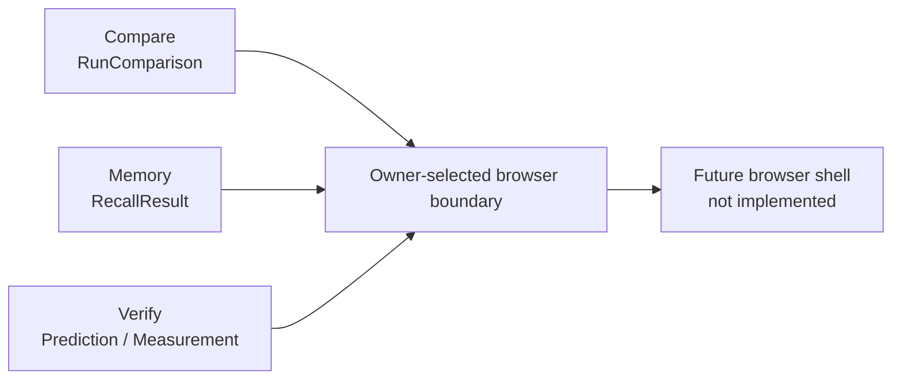
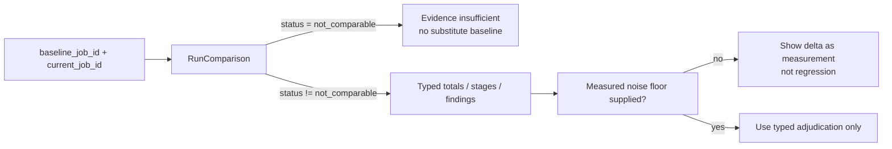
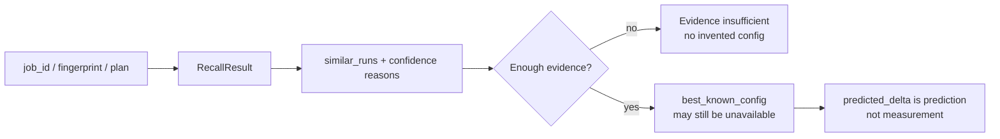
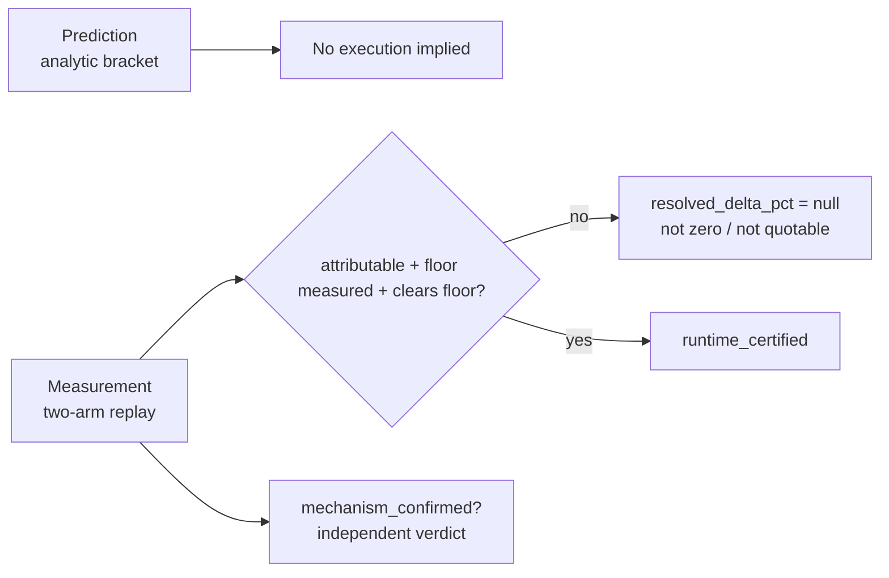

# UI43-B — Compare, Memory and Verify visual contracts

**Status:** offline design candidate for issue `#43`
**Task-Spec:** [`../task-specs/UI43-B-COMPARE-MEMORY-VERIFY-READ-ONLY.md`](../task-specs/UI43-B-COMPARE-MEMORY-VERIFY-READ-ONLY.md)

## Information architecture

The diagram names typed sources, not a running data path. Today Compare is MCP
over stdio; Memory is Python/CLI; Verify is an in-process evidence model. No
browser route, transport or endpoint exists in this increment.

## Screen/state contract

| Screen | Current typed source | `loading` | `empty` | `error` | `evidence_insufficient` | `result` |
|---|---|---|---|---|---|---|
| Compare | `RunComparison` | Preserve requested IDs; placeholders only | No comparable selection yet | Sanitized transport/result error; no IDs or secrets inferred | `not_comparable`, missing job telemetry, missing baseline | Status, totals, stages and findings exactly as typed; measurements remain distinct from regressions |
| Memory | `RecallResult` | Query placeholder only | No query submitted | Sanitized exposure/query error | No similar history, unavailable config, LOW confidence or no predicted delta | Similar runs, confidence reasons and an available recommendation exactly as typed |
| Verify | `Prediction`, `Guardrail`, `Measurement` | A future supplied record placeholder | No verification record supplied | Sanitized exposure/result error | Refused prediction, missing measurement, unmeasured floor or unattributable arms | Prediction bracket and guardrails; a measurement only under its own contract |

## Compare — truthful comparison

- `not_comparable` is a result, not an error.
- A changed plan fingerprint makes metric deltas non-like-for-like; do not make
  a browser-generated regression claim.
- `findings[].evidence` is untrusted text.

## Memory — historical evidence, not automation

- `ConfigRecommendation.available=false` is a valid refusal.
- Similarity tier and contributor count are evidence context, not causal proof.
- A LOW confidence result is for investigation, never automatic application.
- `similar_runs[].app_name` and outcome text are untrusted.

## Verify — evidence levels remain separate

- Never label a prediction as replayed or certified.
- `mechanism_confirmed` can coexist with `runtime_unresolved`; neither implies
  the other.
- No control starts a replay, selects runtime parameters or claims execution.
- A future browser surface must not render `resolved_delta_pct=null` as `0%`.

## Shared rendering and fixture policy

All dynamic strings — app names, findings, evidence, fixes, snippets, errors,
transition details and data names — are escaped plain text. They are never
interpreted as HTML, Markdown, links, commands or approvals.

After the owner decisions, PR2 fixtures must instantiate only the real typed
models, display **Demo data**, and exercise hostile content plus absence,
refusal and evidence-insufficient cases. They must not fabricate an endpoint,
runtime result, replay/certification, AQE stage attribution or execution-stage
relationship.

## Owner gate

No framework, dependency, package-manager choice or application shell is
selected. Before implementation, an owner must decide the browser transport,
stack, location, design system, and who owns a versioned browser exposure for
Memory and Verify. HyperDX remains outside this architecture: its localhost
port 8090 UI is not an APEX front-end surface.
