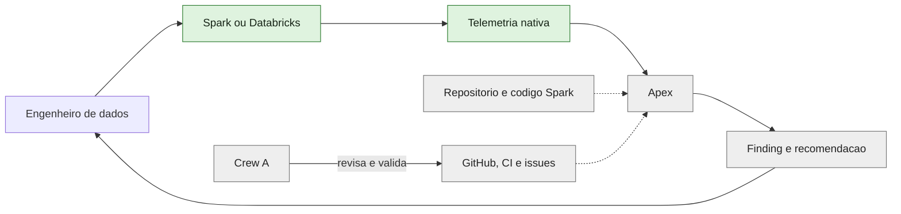
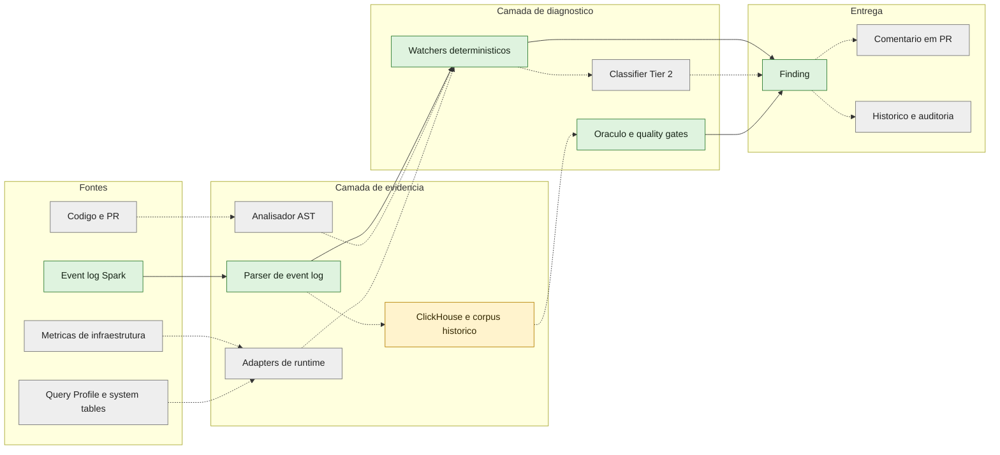
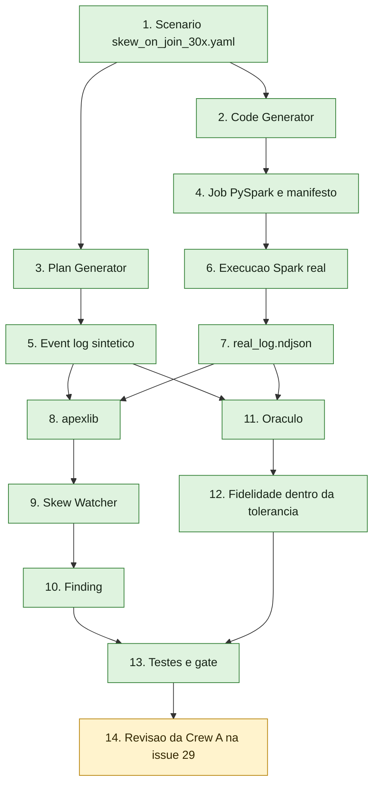
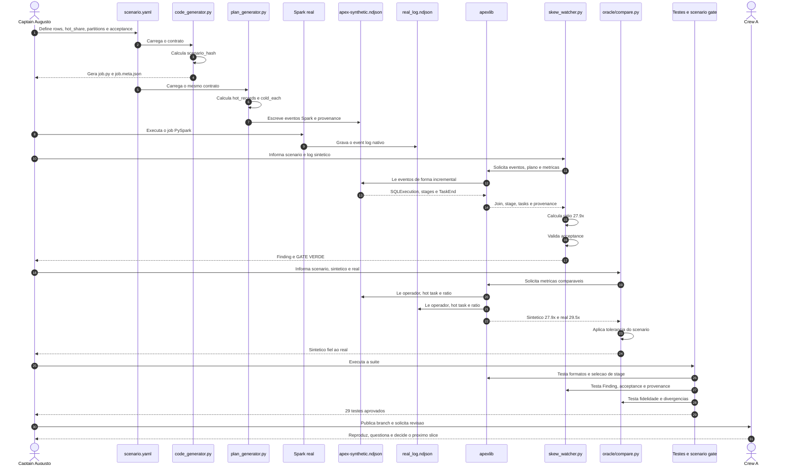
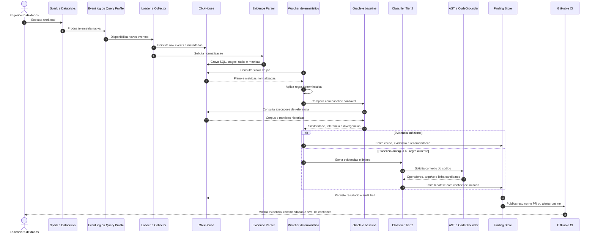
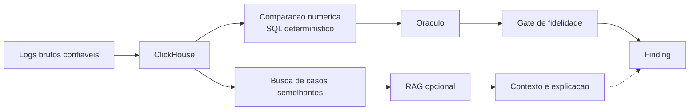
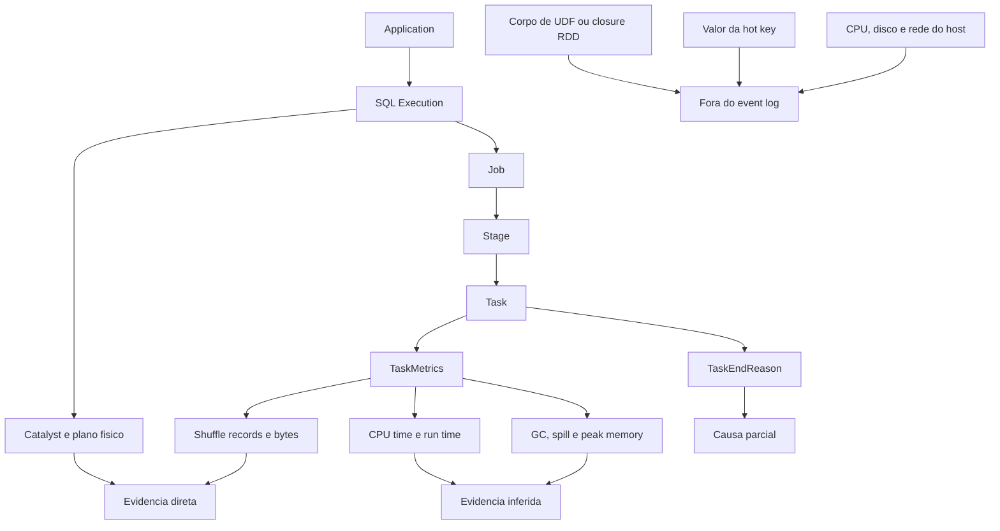
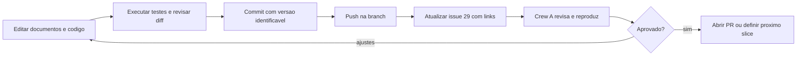

# Apex - Drill-down Completo da Solucao

Este documento apresenta o Apex do contexto de negocio ate a evidencia emitida
por uma task Spark. Cada nivel informa o que ja foi validado, o que foi apenas
observado e o que ainda pertence a arquitetura alvo.

## Legenda de maturidade

| Estado | Significado |
|---|---|
| Validado | Executado localmente, coberto por teste ou comparado com log real |
| Observado | Campo ou evento apareceu no corpus, mas ainda nao existe diagnostico validado |
| Proposto | Direcao arquitetural ou componente ainda sem prova executavel |
| Fora do event log | Exige codigo, profiler, telemetria de infraestrutura ou outra fonte |

## Estado atual em uma frase

```text
O Apex validou um slice deterministico de skew em join.
O inventario encontrou outros sinais no event log.
Os demais diagnosticos e integracoes ainda precisam de scenarios e testes.
```

## Visao visual geral


Esta imagem apresenta as camadas do Spark, os sinais capturados pelo event log e
as fontes complementares. Os diagramas abaixo fazem o drill-down da mesma
solucao. No GitHub, os blocos Mermaid aparecem renderizados dentro deste arquivo.

## Nivel 0 - Contexto do produto



Leitura:

- o cliente executa workloads Spark;
- a plataforma produz event logs ou outra telemetria;
- o Apex analisa a evidencia fora do ciclo de vida do job;
- a Crew A usa GitHub, testes e documentos para validar cada slice.

O slice atual prova apenas uma parte desse ciclo: event log, skew, Finding e
comparacao com log real.

## Nivel 1 - Fluxo macro da solucao



As linhas continuas representam o caminho exercitado no estudo. As linhas
tracejadas representam integracoes propostas.

## Nivel 2 - Componentes e responsabilidades

| Componente | Responsabilidade | Estado |
|---|---|---|
| Scenario YAML | Descrever dados, sinais esperados, tolerancia e acceptance | Validado para skew |
| Code Generator | Gerar job PySpark e manifesto a partir do scenario | Validado para skew |
| Plan Generator | Gerar event log sintetico com provenance | Validado para skew |
| Spark real | Produzir o log de referencia | Validado para um job de skew |
| `apexlib` | Ler logs, plano, stages, tasks e provenance | Validado no corpus atual |
| Coverage Inventory | Listar Spark emite x Apex consome x falta | Validado em uma aplicacao |
| Skew Watcher | Detectar shuffle skew e emitir Finding | Validado |
| Oraculo | Comparar sintetico com log real | Validado para skew |
| ClickHouse | Persistir eventos, evidencias e historico | Proposto para este slice |
| RAG | Recuperar casos e documentacao semelhantes | Proposto; nao substitui comparacao numerica |
| AST Classifier | Detectar UDF, RDD e `collect()` no codigo | Proposto |
| CodeGrounder | Ligar evidencia runtime a arquivo e linha | Proposto |
| Tier 2 | Analisar casos ambiguos ou fora das regras | Proposto; ADR continua bloqueada |
| CI Review | Executar Apex e comentar no PR | Gate inicial existe; comentario nao validado |

## Nivel 3 - Caminho validado do slice de skew



### Sequencia detalhada validada



## Nivel 4 - Arquitetura alvo com persistencia e Tier 2

Este nivel descreve a direcao em discussao. O slice atual nao executa esta
sequencia de ponta a ponta.



### Papel de ClickHouse, Oracle e RAG



O Oraculo deve usar comparacoes deterministicas para ratio, operador, volume e
tolerancia. Uma RAG pode recuperar execucoes parecidas, documentos e
recomendacoes anteriores. Ela nao deve decidir sozinha se o sintetico e fiel ao
real.

## Nivel 5 - Drill-down da evidencia



No slice validado, o Watcher usa:

```text
physicalPlanDescription
Stage ID e Stage Name
Shuffle Read Total Records Read por task
scenario_hash e provenance
```

O inventario observou outros campos, como CPU, GC, spill, input e shuffle
write. Esses campos ainda nao sustentam novos Findings testados.

## Skills e ferramentas de apoio

Skills ajudam a construir, revisar ou apresentar o projeto. Elas nao fazem parte
do runtime do Apex enquanto o time nao criar e validar uma integracao explicita.

| Recurso | Uso neste trabalho | Estado |
|---|---|---|
| WarpGrep | Busca assistida em repositorios | Instalado; nao validado como componente Apex |
| stop-slop | Revisao da escrita dos documentos | Usado na documentacao; sem relacao com diagnostico Spark |
| imagegen | Criacao do PNG de arquitetura | Usado e revisado visualmente |
| Mermaid | Diagramas versionados em Markdown | Usado na documentacao |
| AST Classifier | Cobrir UDF, RDD e `collect()` | Proposta arquitetural; nao implementada |
| CodeGrounder | Relacionar runtime a arquivo e linha | Proposta arquitetural; nao implementada |

O time deve avaliar skills como ferramenta de produtividade separadamente dos
componentes do Apex. O resultado validado continua sendo o slice de skew.

## Matriz final de comprovacao

| Capacidade | Evidencia atual | Estado |
|---|---|---|
| Gerar scenario de skew | YAML, geradores e testes | Validado |
| Detectar skew | Finding e GATE VERDE | Validado |
| Comparar sintetico com real | 27.9x contra 29.5x | Validado |
| Inventariar event log | 57 eventos e 18 tipos | Validado em um corpus |
| Detectar spill | Campos existem, valores zero | Observado |
| Classificar CPU-bound | CPU e run time existem | Observado; sem regra validada |
| Detectar UDF no plano | Nao exercitado no corpus | Proposto para novo scenario |
| Entender corpo de UDF | Ausente do event log | Exige AST ou profiler |
| Persistir no ClickHouse | ADR e comentario da issue | Proposto |
| Usar RAG de execucoes | Comentario da issue 29 | Proposto |
| Executar Tier 2 | ADR bloqueada | Proposto |
| Comentar em PR | Feature e gate inicial | Parcial |

## Fluxo de versionamento e validacao coletiva



Salvar um arquivo cria uma alteracao local. O commit cria a versao. O push
publica essa versao. A issue deve apontar para um commit ou para arquivos ja
publicados, evitando links para material que existe apenas na maquina do autor.
