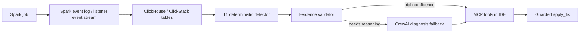

# Codex Branch Reassessment for Luan

Date: 2026-07-09
Branch: `gustocezar/feature/codex-desacoplamento-geradores`
Authoring note: this reassessment was prepared by Codex as the local integration proposal for the Commander/Luan direction.

## Executive Decision

The best solution for the Luan request is not to merge one remote branch wholesale. The safest path is a Codex integration branch that keeps the current validated `Commander V0.1` contract, then selectively absorbs the best pieces from the updated branches:

- Keep `origin/gustocezar/feature/desacoplamento-geradores` untouched while it is under review.
- Use this branch as the local Codex integration branch.
- Treat `spike/apex-v0.1` as the strongest platform-base candidate for V1, but do not raw-merge it into the evaluated branch.
- Use `cowork` for the product-facing closed loop: MCP tools, guarded `apply_fix`, ADR-005, and issue/status traceability.
- Use `kimi` for production discipline: deterministic T1, runbooks, evidence validation, and negative baseline coverage.
- Keep `estudo/dataflint` as benchmark/research input, not runtime code.

## Updated Branch Inventory

Latest remote refresh showed one material update:

```text
origin/gustocezar/feature/cowork-desacoplamento-geradores
2486074 -> 0ddb550
fix(ci): gate e oracle pulam cenários world B + scripts/fetch_real_log.py faltante
```

Second remote refresh showed one additional material update:

```text
origin/gustocezar/feature/cowork-desacoplamento-geradores
0ddb550 -> 1c675cd
docs: reavaliação 08/07 — Captain's Report, seção 7 no VALIDACAO.md e backlog P2-12
```

Only `cowork` moved. `desacoplamento-geradores`, `kimi`, `spike/apex-v0.1`, `estudo/dataflint`, and `reuniao/2026-06-30-commander-plan` remained at the previously evaluated commits.

No push was performed from the Codex branch.

| Branch | Current Role | Fit for Luan | Risk | Codex Recommendation |
| --- | --- | --- | --- | --- |
| `origin/gustocezar/feature/desacoplamento-geradores` | Evaluated base branch | Stable v4 skew/evidence slice | Must not be disturbed while under review | Treat as protected base/reference only |
| `gustocezar/feature/codex-desacoplamento-geradores` | Local Codex branch | Current safe place for the proposed solution | None remote; local only unless pushed later | Use as integration branch |
| `origin/gustocezar/feature/cowork-desacoplamento-geradores` | V1 product prototype plus Captain's Report | Best source for closed-loop IDE experience: MCP, `apply_fix`, ADR-005, issue mapping | Huge diff, tracked cache/archive files, bridge listener rather than true JVM listener, optional LLM key; new `VALIDACAO.md` section 7 is only a stub | Cherry-pick concepts/files selectively; keep Captain's Report as governance input |
| `origin/gustocezar/feature/kimi-desacoplamento-geradores` | Foundation/production proposal | Strong for validation, runbooks, deterministic triage | Less immediate product UX, Go core is larger than needed for first demo | Absorb runbooks, validator rules, negative baseline and T1 design |
| `origin/spike/apex-v0.1` | Standalone full-stack platform | Strongest candidate for the platform spine: Spark 4, MinIO, ClickHouse, HyperDX, Go loader, 5 detectors, diagnostics YAML, MCP | Very large restructure; deletes/replaces many root files; risky to merge into the branch under review | Use as platform-base candidate in a separate integration path, or import detector/config contracts surgically |
| `origin/estudo/dataflint` | Competitive research | Good benchmark against DataFlint | No runtime implementation | Keep as source for comparison docs |
| `origin/reuniao/2026-06-30-commander-plan` | Meeting action plan | Good traceability to Commander asks | Documentation only | Keep as governance reference |

## 2026-07-09 Reassessment Addendum

The new `cowork` commit is documentation and governance only. It adds:

- `docs/meetings/captains-report-2026-07-08.md`;
- a P2-12 backlog update saying `oracle-weekly.yml` is almost ready but still needs `MINIO_*` secrets and one manual run;
- a `VALIDACAO.md` section 7 stub, currently incomplete.

The Captain's Report is useful because it states the current blockers more honestly:

- weekly oracle still needs repository secrets and manual validation;
- multi-core validation with 8 real tasks has not run;
- `root_cause` still hardcodes `customer_id`;
- no `no_skew_baseline.yaml` exists in `cowork`;
- the branch itself now recommends a merged solution, not `cowork` alone.

This changes the Codex recommendation slightly:

```text
Before: spike is a reference only.
Now: spike is the best platform-base candidate, but still not a raw merge target for the evaluated branch.
```

In practice, the Commander decision should be framed as:

1. **If the team wants a full platform V1:** start from `spike/apex-v0.1` in a separate integration branch, then add Kimi validation and Cowork `apply_fix`.
2. **If the team wants the smallest safe next step:** continue from this Codex branch, keep the local harness, and import spike detector/config contracts without adopting the whole platform yet.
3. **Do not merge `cowork` wholesale:** its own report admits it lacks detector breadth, EvidenceValidator, negative baseline, and non-LLM deterministic diagnosis.

## What Luan Appears To Want

From the meeting direction and the existing branches, the target is a visible V1 loop:



The important product difference versus DataFlint is the closed loop. DataFlint detects and routes to a human. Apex should detect, validate evidence, reason when needed, expose the finding in the IDE, and propose or apply a fix under human approval.

## Selective Integration Plan

### Phase 0: Keep The Current Codex Harness

Already present in this branch:

- `apex/commander/telemetry.py`
- `apex/commander/clickstack_mvp.py`
- `apex/commander/diagnostic_mvp.py`
- `tools/commander_v01_demo.py`
- `tests/test_commander_v01.py`
- `docs/playbooks/commander-v01-local.md`

This proves the minimum contract:

```text
event log -> telemetry envelope -> store by job_id -> deterministic finding
```

### Phase 1: Decide Platform Spine

There are two safe paths:

| Path | When to choose | Action |
| --- | --- | --- |
| Platform-first | Commander approves larger V1 platform direction | Start a separate integration path from `spike/apex-v0.1`, then port Kimi validator/runbooks and Cowork `apply_fix` |
| Contract-first | Commander wants minimum risk while current branch is evaluated | Continue from this Codex branch and import only spike detector/config contracts behind `apex.commander` |

Do not raw-merge `spike/apex-v0.1` into `origin/gustocezar/feature/desacoplamento-geradores` while that branch is being evaluated.

### Phase 2: Bring Cowork Runtime Without The Noise

Bring only the V1 closed-loop pieces, preferably under `apex/commander/v1/` or `apex_runtime/` instead of copying the whole branch:

- `v1-skeleton/ingest/event_log_ingest.py`
- `v1-skeleton/ingest/log_poller.py`
- `v1-skeleton/analysis/crew_diagnose.py`
- `v1-skeleton/mcp/server.py`
- `v1-skeleton/schema/init.sql`
- `docs/adr/ADR-005-sparklistener-vs-zero-jar.md`
- `scripts/fetch_real_log.py`

Do not bring:

- `__pycache__` or `.pyc`
- large archive folders
- duplicated generated presentations unless explicitly needed
- root rewrites that collide with the branch under review

### Phase 3: Bring Kimi Validation Discipline

Bring the ideas first, then code where useful:

- runbooks for skew/spill as versioned policy
- negative baseline scenario for false-positive prevention
- evidence validator rules before the LLM is allowed to claim a diagnosis
- T1 deterministic path before CrewAI fallback

The Go implementation should remain a V2 candidate unless Commander chooses the platform-first path using `spike/apex-v0.1`.

### Phase 4: MCP Contract

The V1 MCP surface should be small:

| Tool | Purpose | Default Safety |
| --- | --- | --- |
| `debug_job(job_id)` | Return the best current finding for a job | Read-only |
| `explain_evidence(job_id)` | Show metrics, stage/task evidence and validator result | Read-only |
| `recommend_fix(job_id)` | Produce a concrete recommendation or patch preview | Read-only |
| `apply_fix(job_id, file_path)` | Apply patch to user code | Requires explicit opt-in and backup |

### Phase 5: Acceptance Criteria

The first Codex V1 should be accepted only when these pass locally:

- existing v4 tests pass;
- Commander local tests pass;
- a real or fixture event log produces one stored job keyed by `job_id`;
- `debug_job(job_id)` returns a deterministic finding without LLM;
- the same job can be escalated to CrewAI when credentials exist;
- `apply_fix` never runs by default and always creates a backup or patch preview.

## Current Recommendation

Use this branch as the single local branch for Codex integration. Do not push yet unless Luan explicitly asks to publish it.

Updated recommendation after the latest branch refresh:

- Present `spike/apex-v0.1` to Luan as the best full-platform base candidate.
- Present this Codex branch as the lowest-risk integration bridge.
- Present `cowork` as the source of closed-loop UX, not as the base.
- Present `kimi` as the source of validation discipline, not as the base.
- Ask Commander to choose between **platform-first** and **contract-first** before any large merge.
