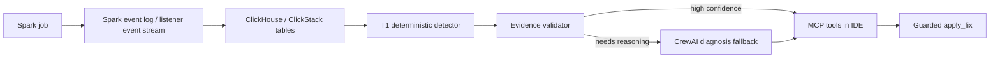

# Codex Branch Reassessment for Luan

Date: 2026-07-09
Branch: `gustocezar/feature/codex-desacoplamento-geradores`
Authoring note: this reassessment was prepared by Codex as the local integration proposal for the Commander/Luan direction.

## Executive Decision

The best solution for the Luan request is not to merge one remote branch wholesale. The safest path is a Codex integration branch that keeps the current validated `Commander V0.1` contract, then selectively absorbs the best pieces from the updated branches:

- Keep `origin/gustocezar/feature/desacoplamento-geradores` untouched while it is under review.
- Use this branch as the local Codex integration branch.
- Use `cowork` for the product-facing V1 experience: ClickHouse ingest, CrewAI diagnosis, MCP tools, and guarded `apply_fix`.
- Use `kimi` for production discipline: deterministic T1, runbooks, evidence validation, and negative baseline coverage.
- Use `spike/apex-v0.1` as a platform reference, not as a direct merge source.
- Keep `estudo/dataflint` as benchmark/research input, not runtime code.

## Updated Branch Inventory

Latest remote refresh showed one material update:

```text
origin/gustocezar/feature/cowork-desacoplamento-geradores
2486074 -> 0ddb550
fix(ci): gate e oracle pulam cenários world B + scripts/fetch_real_log.py faltante
```

No push was performed from the Codex branch.

| Branch | Current Role | Fit for Luan | Risk | Codex Recommendation |
| --- | --- | --- | --- | --- |
| `origin/gustocezar/feature/desacoplamento-geradores` | Evaluated base branch | Stable v4 skew/evidence slice | Must not be disturbed while under review | Treat as protected base/reference only |
| `gustocezar/feature/codex-desacoplamento-geradores` | Local Codex branch | Current safe place for the proposed solution | None remote; local only unless pushed later | Use as integration branch |
| `origin/gustocezar/feature/cowork-desacoplamento-geradores` | V1 product prototype | Highest short-term fit: ClickHouse, CrewAI, MCP, `apply_fix` | Huge diff, tracked cache/archive files, bridge listener rather than true JVM listener, optional LLM key | Cherry-pick concepts/files selectively |
| `origin/gustocezar/feature/kimi-desacoplamento-geradores` | Foundation/production proposal | Strong for validation, runbooks, deterministic triage | Less immediate product UX, Go core is larger than needed for first demo | Absorb runbooks, validator rules, negative baseline and T1 design |
| `origin/spike/apex-v0.1` | Standalone platform spike | Strong full-stack reference | Very large restructure; deletes/replaces many root files | Reference architecture only for now |
| `origin/estudo/dataflint` | Competitive research | Good benchmark against DataFlint | No runtime implementation | Keep as source for comparison docs |
| `origin/reuniao/2026-06-30-commander-plan` | Meeting action plan | Good traceability to Commander asks | Documentation only | Keep as governance reference |

## What Luan Appears To Want

From the meeting direction and the existing branches, the target is a visible V1 loop:



The important product difference versus DataFlint is the closed loop. DataFlint detects and routes to a human. Apex should detect, validate evidence, reason when needed, expose the finding in the IDE, and propose or apply a fix under human approval.

## Selective Integration Plan

### Phase 0: Keep The Current Codex Harness

Already present in this branch:

- `apex/commander/telemetry.py`
- `apex/commander/clickstack_mvp.py`
- `apex/commander/diagnostic_mvp.py`
- `tools/commander_v01_demo.py`
- `tests/test_commander_v01.py`
- `docs/playbooks/commander-v01-local.md`

This proves the minimum contract:

```text
event log -> telemetry envelope -> store by job_id -> deterministic finding
```

### Phase 1: Bring Cowork Runtime Without The Noise

Bring only the V1 runtime pieces, preferably under `apex/commander/v1/` or `apex_runtime/` instead of copying the whole branch:

- `v1-skeleton/ingest/event_log_ingest.py`
- `v1-skeleton/ingest/log_poller.py`
- `v1-skeleton/analysis/crew_diagnose.py`
- `v1-skeleton/mcp/server.py`
- `v1-skeleton/schema/init.sql`
- `docs/adr/ADR-005-sparklistener-vs-zero-jar.md`
- `scripts/fetch_real_log.py`

Do not bring:

- `__pycache__` or `.pyc`
- large archive folders
- duplicated generated presentations unless explicitly needed
- root rewrites that collide with the branch under review

### Phase 2: Bring Kimi Validation Discipline

Bring the ideas first, then code where useful:

- runbooks for skew/spill as versioned policy
- negative baseline scenario for false-positive prevention
- evidence validator rules before the LLM is allowed to claim a diagnosis
- T1 deterministic path before CrewAI fallback

The Go implementation should remain a V2 candidate until the Python V1 loop is stable.

### Phase 3: MCP Contract

The V1 MCP surface should be small:

| Tool | Purpose | Default Safety |
| --- | --- | --- |
| `debug_job(job_id)` | Return the best current finding for a job | Read-only |
| `explain_evidence(job_id)` | Show metrics, stage/task evidence and validator result | Read-only |
| `recommend_fix(job_id)` | Produce a concrete recommendation or patch preview | Read-only |
| `apply_fix(job_id, file_path)` | Apply patch to user code | Requires explicit opt-in and backup |

### Phase 4: Acceptance Criteria

The first Codex V1 should be accepted only when these pass locally:

- existing v4 tests pass;
- Commander local tests pass;
- a real or fixture event log produces one stored job keyed by `job_id`;
- `debug_job(job_id)` returns a deterministic finding without LLM;
- the same job can be escalated to CrewAI when credentials exist;
- `apply_fix` never runs by default and always creates a backup or patch preview.

## Current Recommendation

Use this branch as the single local branch for Codex integration. Do not push yet unless Luan explicitly asks to publish it. The next implementation step is to add a small, tested interface layer around the current Commander harness, then selectively import the Cowork/Kimi components behind that interface.
