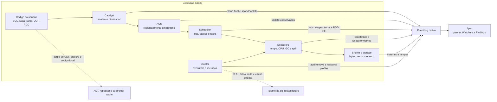
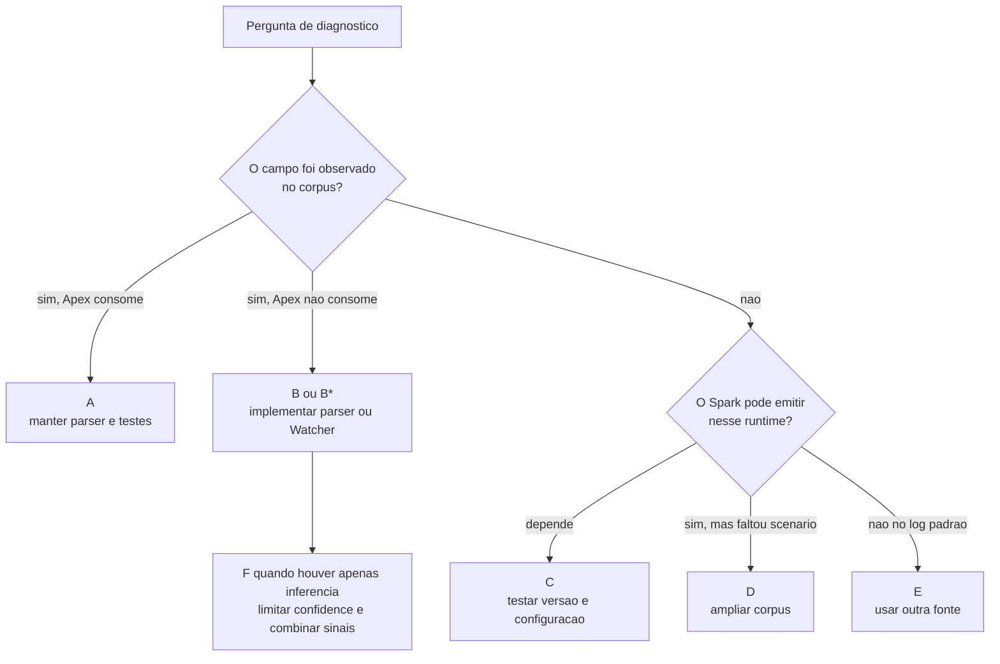
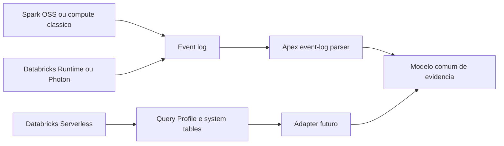

# Fronteira de Observabilidade do Spark Event Log

Este documento mostra onde o event log oferece evidencia direta, onde oferece
apenas sinais parciais e onde o Apex precisa de outra fonte.

O PNG serve para apresentacao. Os diagramas Mermaid abaixo sao a fonte
versionavel para revisao tecnica.

## Camadas do Spark

## Leitura por componente

| Componente | O event log entrega | O event log nao entrega |
|---|---|---|
| Codigo do usuario | Presenca de operadores SQL, Python UDF e lineage de RDD | Corpo da UDF, closure de RDD e codigo local entre actions |
| Catalyst | Plano fisico final e arvore `sparkPlanInfo` | Trilha completa de regras e alternativas descartadas |
| AQE | Atualizacoes de plano emitidas pelo runtime | Calculo completo que motivou cada decisao |
| Scheduler | Jobs, stages, tasks, dependencias, attempts e locality | Intencao de negocio do codigo |
| Executors | Run time, CPU time, GC, spill, memoria e resultado | Locks, profiling de metodo e heap detalhado |
| Shuffle e storage | Bytes, records, fetch wait, input e output | Valor das linhas e identidade da hot key, salvo quando o valor aparece incidentalmente no plano |
| Cluster | Executor add/remove e perfis registrados | Saturacao do host e causa externa conclusiva |

## Fronteira da evidencia

## Fontes por ambiente

O contrato nao-intrusivo continua valido: o Apex le telemetria produzida pela
plataforma. O tipo de fonte muda conforme o ambiente.

## Cobertura complementar

| Lacuna | Fonte complementar sugerida | Regra |
|---|---|---|
| Localizar UDF, RDD e `collect()` no codigo | AST e repositorio | Analise estatica, sem tocar no job |
| Ligar Finding a arquivo e linha | CodeGrounder | Exigir evidencia antes de afirmar causalidade |
| Entender host, disco e rede | Metricas de infraestrutura | Correlacionar por tempo e executor |
| Serverless sem event log equivalente | Query Profile e system tables | Adapter separado do parser Spark |
| Perfil interno de UDF ou JVM | Profiler opt-in | Nunca usar como coleta padrao |

## Consequencia para o roadmap

O time deve priorizar tres movimentos:

1. Extrair sinais B* que ja aparecem no log.
2. Criar scenarios para os sinais D.
3. Definir adapters ou analise estatica para os limites E.

Essa ordem preserva a coleta nao-intrusiva e separa evidencia direta de
inferencia.

O fluxo completo para transformar esses sinais em evidencia valida, invalida ou
indeterminada esta em
[`validation-evidence-flow.md`](validation-evidence-flow.md).

## Referencias tecnicas

- [SparkListener no Spark 4.1.2](https://github.com/apache/spark/blob/v4.1.2/core/src/main/scala/org/apache/spark/scheduler/SparkListener.scala)
- [RDDInfo no Spark 4.1.2](https://github.com/apache/spark/blob/v4.1.2/core/src/main/scala/org/apache/spark/storage/RDDInfo.scala)
- [TaskMetrics no Spark 4.1.2](https://github.com/apache/spark/blob/v4.1.2/core/src/main/scala/org/apache/spark/executor/TaskMetrics.scala)
- [Eventos SQL e AQE no Spark 4.1.2](https://github.com/apache/spark/blob/v4.1.2/sql/core/src/main/scala/org/apache/spark/sql/execution/ui/SQLListener.scala)
- [TaskEndReason no Spark 4.1.2](https://github.com/apache/spark/blob/v4.1.2/core/src/main/scala/org/apache/spark/TaskEndReason.scala)
- [Configuracao de event log do Spark](https://spark.apache.org/docs/latest/configuration.html)
- [Limitacoes do Databricks Serverless](https://docs.databricks.com/aws/en/compute/serverless/limitations)
