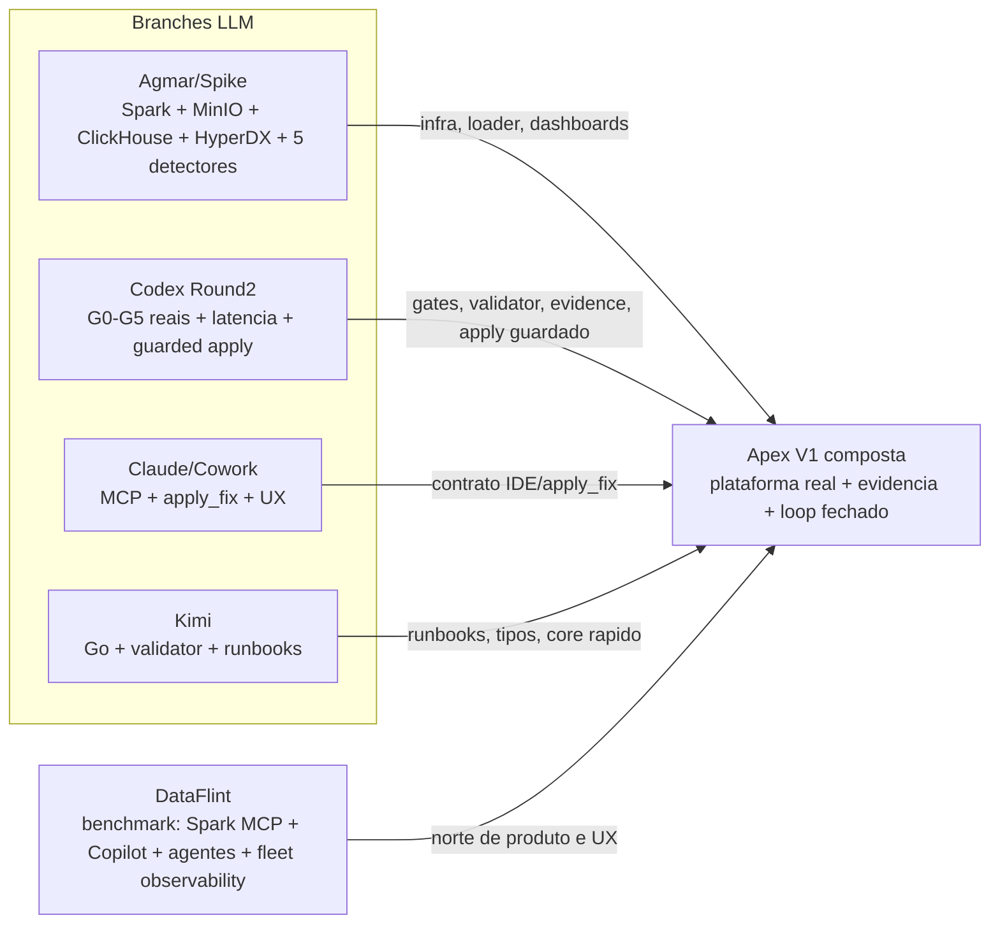
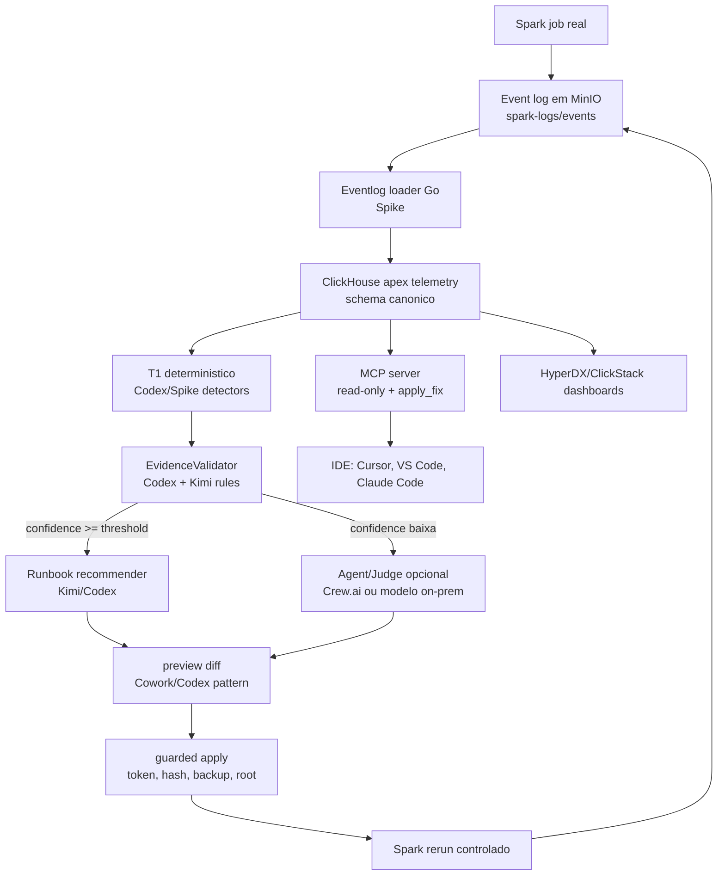
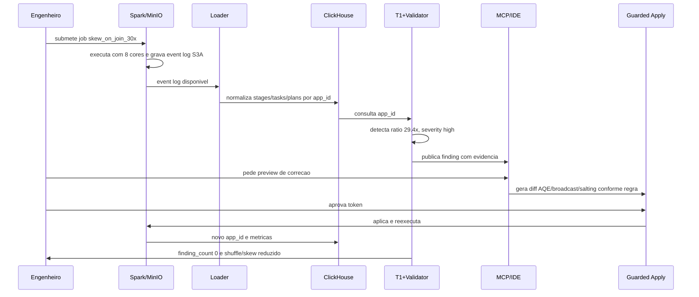

# Framework de Validacao das Solucoes LLM - 2026-07-13

Status: comparacao read-only das branches atualizadas, com DataFlint como benchmark externo.

## Resumo Executivo

A melhor solucao para Apex V1 nao e uma branch unica copiada em bloco. A leitura de 13/07 mostra quatro familias de contribuicao:

| Fonte | Melhor coisa | Principal problema | Como reaproveitar |
|---|---|---|---|
| Codex Round2 (`campeonato/codex-round2`) | Evidencia real G0-G5, baseline limpo, 5 detectores oficiais, latencia 226.991 ms sem LLM, ciclo guarded apply -> rerun -> limpo | Branch de evidencia nao e a mesma branch Codex antiga listada no manifesto; C1 ainda parcial e sem IDE real | Usar como linha de validacao deterministica e prova de gates |
| Codex antiga (`gustocezar/feature/desacoplamento-geradores`) | Slice v4 de skew bem explicado, scenario -> log sintetico -> watcher -> oracle | Nao contem entregaveis Round2 nem G0-G5 completos | Reaproveitar docs de fronteira de observabilidade e geradores |
| Claude/Cowork (`gustocezar/feature/cowork-desacoplamento-geradores`) | Melhor UX: MCP + `apply_fix`, ADRs, reports e proposta mais proxima do loop IDE | Poucos detectores, dependencia forte de LLM/Crew.ai, evidencias G1-G5 nao aparecem como logs do manifesto | Reaproveitar contrato de ferramenta, UX e guardrails de apply |
| Kimi (`gustocezar/feature/kimi-desacoplamento-geradores`) | Disciplina: Go, validator, runbooks, CLI/MCP HTTP, linguagem de arquitetura | Historicamente documentou build/test fracos; nao prova produto ponta a ponta | Reaproveitar modelos, validator/runbooks e desenho de core rapido |
| Agmar/Spike (`spike/apex-v0.1`) | Plataforma mais completa: Spark 4.1.2, MinIO, ClickHouse, HyperDX, eventlog-loader Go, 5 detectores, workloads | Merge bruto e arriscado; nao fecha apply_fix nem EvidenceValidator formal | Reaproveitar infra, loader, dashboards e detectores |
| DataFlint | Benchmark de mercado: OSS Spark UI, SaaS/agents, Spark MCP, Copilot IDE, Cluster Agent, Review Agent, Fleet Observability | Produto externo; parte SaaS/proprietaria; arquitetura usa JAR/enriched logs; menos transparente/customizavel | Usar como norte de produto, UX, observabilidade e agentes production-aware |

Minha recomendacao tecnica: criar a V1 como composicao controlada, nao como escolha de vencedor. A base de aceitacao deve ser Codex Round2 (gates provados), a plataforma deve vir do Spike, a experiencia IDE deve absorver o melhor do Cowork/DataFlint, e o rigor de contratos/validator pode herdar ideias da Kimi.

## Escopo E Metodologia

Esta validacao foi feita sem checkout destrutivo das branches avaliadas. A inspeccao usou referencias remotas e artefatos existentes.

| Solucao | Ref inspecionada | Commit |
|---|---|---|
| Claude/Cowork | `origin/gustocezar/feature/cowork-desacoplamento-geradores` | `8bd5672` |
| Kimi | `origin/gustocezar/feature/kimi-desacoplamento-geradores` | `116be23` |
| Codex antiga | `origin/gustocezar/feature/desacoplamento-geradores` | `bd8a08b` |
| Agmar/Spike | `origin/spike/apex-v0.1` | `ae890f8` |
| Codex Round2 | `campeonato/codex-round2` | `c82adca` |

Nota importante: o mapeamento enviado para "codex" aponta para `gustocezar/feature/desacoplamento-geradores`, uma branch antiga/slice. A execucao completa F0-F5 feita pela engine Codex nesta rodada esta em `campeonato/codex-round2`. Por honestidade, este documento separa as duas linhas.

## O Que Seria Testado

Para decidir a melhor solucao sem depender de narrativa, eu testaria as branches com a mesma bancada comum:

| Teste | Objetivo | Entrada oficial | Criterio de aceite |
|---|---|---|---|
| Manifesto Round2 | Ver se a branch entregou o pacote comparavel | `docs/specs/manifest-rodada2.json` | `PLANO.md`, `ISSUES.md`, `evidence/g0..g5`, `docs/autoavaliacao.md` presentes |
| G0 | Build/testes limpos | `python -m pytest tests/ -q` ou equivalente da branch | Exit 0 e log cru salvo |
| G1 | Baseline negativo | `no_skew_baseline.yaml` | Zero finding severity >= warning |
| G2 | Deteccao sintetica oficial | 5 cenarios: skew, GC, shuffle/spill, OOM, cartesian | Severidade esperada por cenario, sem baixar threshold |
| G3 | Dado real Spark | `skew_on_join_30x.yaml` no plat-v0 com 8 cores | Ratio real dentro da tolerancia do sintetico e event log novo |
| G4 | Latencia deterministica | Mesmo event log real do G3 | T1 < 1s, sem chamada LLM obrigatoria |
| G5 | Loop de correcao | Finding real skew high | preview -> apply guardado -> rerun -> zero findings e metrica antes/depois melhora |
| MCP/IDE smoke | Usabilidade real | Cliente MCP local ou IDE | Tool discovery, read-only tools e apply guardado funcionando |
| Seguranca | Evitar auto-edicao perigosa | arquivos fora do root, token invalido, path traversal | apply bloqueia tudo fora do escopo e exige confirmacao |
| Observabilidade | Operacao | ClickHouse + dashboards/logs | app_id/job_id rastreaveis do log ao finding |
| Proveniencia | Honestidade de origem | git log/documentos comparativos | Declarar conceitos herdados ou inspirados em outras solucoes |

## Matriz De Evidencia

Legenda: `V` validado com log/teste; `P` parcial/documentado; `N` nao encontrado; `E` externo/produto.

| Dimensao | Claude/Cowork | Kimi | Codex antiga | Codex Round2 | Agmar/Spike | DataFlint |
|---|---|---|---|---|---|---|
| Plataforma Spark/MinIO/ClickHouse | P | P | N | P | V | E |
| Event log real | P | P | V para skew | V G3 | V | E |
| ClickHouse source of truth | P | P | N | V local/adapter | V | E |
| Detectores oficiais | P, pouco amplo | P | P, skew | V, 5 cenarios | V, 5 detectores | E, alertas/produto |
| Baseline negativo | P | N/P | N | V | P | E |
| EvidenceValidator | V/P | P | P | V | N | E, forma proprietaria |
| T1 sem LLM | P | P | V para slice | V, 226.991 ms | P | N/A, plataforma agentica |
| LLM/agentico | V/P via Crew.ai | P | N | P, gap declarado | P opcional | E, foco principal |
| MCP | V/P | P HTTP | N | V stdio local | P stdio | E Spark MCP |
| apply_fix/apply guardado | V/P | N | N | V funcional, nome desalinhado | N | E, one-click/code fixes declarados |
| Rerun/compare | P | N/P | P oracle | V G5 | P | E, close loop no produto |
| Docs/ADRs/reports | V | V | V | V | P | E |
| Proveniencia declarada | P | P | N/A | V, CODEX-001/007 | N/P | N/A |

## Scorecard C1-C6

Pontuacao: 0 a 5. A nota mede a evidencia disponivel hoje, nao o potencial.

| Criterio | Claude/Cowork | Kimi | Codex antiga | Codex Round2 | Agmar/Spike | DataFlint |
|---|---:|---:|---:|---:|---:|---:|
| C1 Arquitetura V1 | 3 | 3 | 1 | 2 | 4 | 4 |
| C2 Cobertura de deteccao | 2 | 2 | 1 | 5 | 5 | 5 |
| C3 Confiabilidade | 3 | 2 | 3 | 4 | 3 | 4 |
| C4 Loop IDE/apply | 5 | 1 | 0 | 3 | 1 | 5 |
| C5 Qualidade de engenharia | 4 | 3 | 3 | 4 | 4 | 4 |
| C6 Custo/latencia | 2 | 4 | 4 | 5 | 3 | 3 |
| Total | 19/30 | 15/30 | 12/30 | 23/30 | 20/30 | 25/30 |

Leitura honesta:

- DataFlint tem a melhor nota como produto/benchmark, mas nao e uma branch Apex nem prova controle local do codigo.
- Codex Round2 e a melhor evidencia local e reproduzivel, mas ainda nao e plataforma completa.
- Spike e a melhor fundacao operacional.
- Cowork e a melhor experiencia de produto/IDE.
- Kimi e boa como disciplina de core/validator, nao como entrega final isolada.

## Diagrama De Comparacao



## Arquitetura Alvo Recomendada



## Fluxo De Caso De Uso: Skew Em Join



## Comparacao Por Funcionalidade

| Funcionalidade | Melhor fonte hoje | Evidencia | Decisao recomendada |
|---|---|---|---|
| Docker/Spark/MinIO/ClickHouse/HyperDX | Agmar/Spike | `apex-v0.1/build/docker-compose.yml`, README | Portar com cuidado, sem merge bruto |
| Eventlog loader | Agmar/Spike | loader Go e ClickHouse no stack | Usar como ingest principal |
| Detectores amplos | Agmar/Spike + Codex Round2 | Spike tem 5 detectores; Codex validou 5 cenarios oficiais | Unificar thresholds do pacote comum |
| Baseline negativo oficial | Codex Round2 | `evidence/g1-baseline.log` | Manter como gate obrigatorio |
| Severidade oficial G2 | Codex Round2 | `evidence/g2-cenarios.log` | Gate de aceitacao para qualquer detector novo |
| Dado real G3 | Codex Round2 + Spike platform | `evidence/g3-real.log` | Rodar sempre no plat-v0/spv0 |
| Latencia T1 | Codex Round2 | 226.991 ms em `evidence/g4-t1.log` | Regressao automatica < 1s |
| apply_fix/apply guardado | Cowork conceito + Codex implementacao | CODEX-007 declara origem; G5 prova loop | Renomear contrato para `apply_fix` e manter guardrails |
| Validator/runbooks | Kimi + Codex | Go validator/runbooks; EvidenceValidator testado | Consolidar regras em contrato comum |
| MCP/IDE | Cowork + DataFlint como norte | Cowork MCP/apply; DataFlint Spark MCP/IDE | Smoke test com cliente MCP real |
| Produto/UX | DataFlint | Copilot, Cluster Agent, Review Agent, Fleet Observability | Copiar padrao de experiencia, nao codigo |

## DataFlint Como Benchmark

DataFlint hoje precisa ser tratado em duas camadas:

1. DataFlint OSS: plugin/tab no Spark Web UI, run summary, cluster status, error handling, visualizacao de plano SQL, heat map, alertas e integracoes. A documentacao oficial mostra instalacao como plugin Spark e artefatos Maven `0.9.9` para Spark 3.x e 4.x.
2. DataFlint plataforma agentica: site atual posiciona a solucao como agentes production-aware para Apache Spark, usando enriched Spark logs, Spark MCP server, Agentic Spark Copilot, Cluster Agent, Review Agent e Fleet Observability.

Fontes oficiais usadas:

- https://www.dataflint.io/
- https://www.dataflint.io/resources/how-it-works
- https://www.dataflint.io/product/spark-copilot
- https://dataflint.gitbook.io/dataflint-for-spark/overview/our-features
- https://github.com/dataflint/spark

### O Que DataFlint Faz Que Apex Deve Perseguir

| Capacidade DataFlint | Implicacao para Apex |
|---|---|
| Spark MCP server com contexto de producao | MCP do Apex precisa consultar app_id/job_id real, nao apenas docs |
| Copilot dentro do IDE | `apply_fix` deve ser uma experiencia de desenvolvedor, nao so CLI |
| Cluster Agent | Futuro Apex pode recomendar/right-size recursos, mas so depois de dados confiaveis |
| Review Agent | Integrar diagnostico com PR e regressao de performance |
| Fleet Observability | HyperDX/ClickStack do Spike e caminho natural |
| Compressao/enriquecimento de logs | ClickHouse + EvidenceValidator precisam separar sinal de ruido |
| Alertas com sugestoes de fix | Findings Apex devem ter evidence, confidence, runbook e patch preview |

### Onde Apex Pode Ser Diferente E Melhor

| Dimensao | DataFlint | Diferencial Apex possivel |
|---|---|---|
| Transparencia | SaaS/produto com partes proprietarias | Codigo aberto, regras e thresholds auditaveis |
| Controle local | Produto externo | On-prem/local-first para ambientes sensiveis |
| Aplicacao de fix | One-click fixes declarados no produto | Apply guardado com diff, hash, backup, token e rerun verificavel |
| Protocolo de evidencia | Produto decide internamente | EvidenceValidator versionado e testavel |
| Julgamento de confianca | Contexto enriquecido interno | Tiers de confidence visiveis, com motivo por regra |
| Custo | Dependente de licenca/volume | Stack local com custo previsivel |
| Customizacao | Limitada ao produto | Detectores/runbooks YAML/JSON e extensao por branch |

## Riscos De Seguranca E Governanca

| Risco | Onde aparece | Controle recomendado |
|---|---|---|
| Auto-edicao indevida de codigo | apply_fix/apply_recommendation | Root permitido, backup, diff, hash, approval token, dry-run obrigatorio |
| LLM inventar diagnostico | Crew.ai/agentes | T1 deterministico + EvidenceValidator antes de qualquer LLM |
| Vazamento de dados sensiveis | logs, planos, MCP context | Minimizar payload, mascarar paths/tabelas, modo on-prem, auditoria |
| Path traversal no MCP | ferramentas de apply | bloquear qualquer path fora do workspace autorizado |
| Threshold drift | detectores por branch | `diagnostics.yaml` canonico e G1/G2 obrigatorios |
| Merge bruto de spike/cowork/kimi | integracao | portar componente por componente, com gate antes/depois |
| Proveniencia contaminada | comparativos entre LLMs | registrar origem conceitual e commits, como CODEX-001/CODEX-007 |
| Dependencia de SaaS | DataFlint ou LLM externo | camada opcional; caminho deterministico local deve continuar verde |

## Plano De Composicao

### Etapa 1 - Base de aceitacao

Usar Codex Round2 como linha de gate: G0-G5 precisam continuar verdes em qualquer composicao.

### Etapa 2 - Plataforma

Trazer do Spike somente o necessario: Docker/Compose, MinIO, ClickHouse, HyperDX, eventlog-loader Go e detectores. Cada bloco entra com teste.

### Etapa 3 - Contratos

Normalizar schema ClickHouse, `job_id`/`app_id`, severidades e `apply_fix` conforme pacote comum.

### Etapa 4 - UX IDE

Absorver contrato Cowork/DataFlint: tool MCP clara, preview, apply, verify, rerun, compare.

### Etapa 5 - Core/Validator

Consolidar EvidenceValidator Codex com regras/runbooks Kimi. Se Go for usado, so depois de `go test ./...` e benchmark.

### Etapa 6 - Produto

Subir dashboards, reports de PR e fleet observability. Aqui DataFlint vira norte: nao basta detectar, precisa ajudar a decidir.

## Decisao Recomendada

Nao escolher "a melhor branch" como destino final. Escolher "a melhor composicao":

```text
Apex V1 = Spike platform + Codex gates/evidence + Cowork apply_fix UX + Kimi validator/runbooks + DataFlint product benchmark
```

A primeira integracao deveria ser pequena: Spike platform + Codex G0-G5. So depois entrar `apply_fix` como contrato MCP formal. Assim a solucao fica real sem virar uma colagem fragil.

## Apresentacao Comparativa

Uma apresentacao HTML complementar foi criada em:

```text
docs/presentations/llm-solution-validation-2026-07-13.html
```
