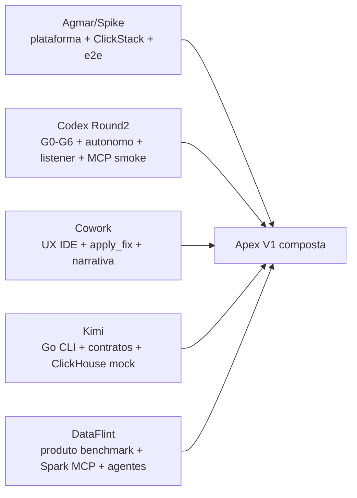
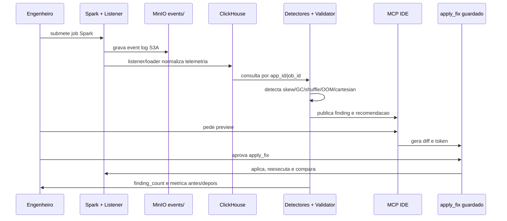

# Framework de Validacao das Solucoes LLM - 2026-07-15

> **Historico de campeonato.** Este snapshot compara varias branches no estado
> de 15/07. Para a fotografia atual da branch Codex e uma comparacao de produto
> restrita ao benchmark externo, use
> `docs/architecture/apex-codex-vs-dataflint-2026-07-22.md`.

Status: comparacao read-only das branches atualizadas em 2026-07-15, com DataFlint como benchmark externo e com a branch Codex publicada para julgamento.

## Resumo Executivo

A rodada final mudou o estado da engine Codex: alem de G0-G5, stack autonoma, SparkListener JVM real e smoke MCP por subprocesso, ela agora tem G6 remoto observado e verde no GitHub Actions do campeonato e MCP aprovado/validado em Claude Code GUI real. O workflow `Apex Scenario Gate` passou inteiro no commit `6ba5238`, incluindo o job legado `gate` e o job `g6-oracle-drift`. Isso nao transforma a branch em V1 final, porque ainda falta Crew.ai/Judge real, mas deixa a branch pronta para avaliacao do juiz como pacote reprodutivel.

As outras solucoes tambem evoluiram:

- Cowork atualizou o README como mapa completo da branch e continua sendo a melhor referencia de UX/IDE e narrativa de produto.
- Kimi adicionou documentacao CLI ampla e testes de integracao ClickHouse mock em Go, reforcando disciplina de contratos.
- Agmar/Spike melhorou a plataforma com recomendacoes configuraveis, catalogos YAML e testes e2e de detectores contra ground truth.
- DataFlint segue como benchmark de produto: Spark MCP, Copilot no IDE, Cluster Agent, Review Agent, Fleet Observability e OSS Spark UI/plugin.

Recomendacao: a V1 mais forte continua sendo composicao controlada, nao merge bruto:

```text
Apex V1 = Spike platform + Codex gates/evidence + Cowork UX/apply_fix + Kimi contracts/validator + DataFlint product benchmark
```

## Refs Inspecionadas

| Solucao | Ref | Commit atual | Observacao |
|---|---|---:|---|
| Codex Round2 | `campeonato/codex-round2` | `6ba5238` | HEAD local e campeonato sincronizados; G6 remoto verde |
| Claude/Cowork | `campeonato/gustocezar/feature/cowork-desacoplamento-geradores` | `67930d8` | README atualizado como mapa completo da branch |
| Claude/Cowork antigo | `origin/gustocezar/feature/cowork-desacoplamento-geradores` | `8bd5672` | Ref diferente do campeonato; manter como historico |
| Kimi | `origin/gustocezar/feature/kimi-desacoplamento-geradores` | `116be23` | CLI docs e testes ClickHouse mock e2e |
| Codex publicada no repo Luan | `origin/gustocezar/feature/codex-desacoplamento-geradores` | `6ba5238` | Mesmo conteudo da Round2, disponivel para revisao externa |
| Agmar/Spike | `origin/spike/apex-v0.1` | `ae890f8` | Plataforma Spark/MinIO/ClickHouse/HyperDX com testes e2e |
| DataFlint | Site/GitHub oficial | 0.9.9 OSS latest em 2026-05-18 | Benchmark externo, nao branch Apex |

## O Que Seria Testado

| Teste | Objetivo | Entrada | Criterio de aceite |
|---|---|---|---|
| Manifesto Round2 | Ver pacote comparavel | `docs/specs/manifest-rodada2.json` | `PLANO.md`, `ISSUES.md`, `evidence/g0..g5`, `docs/autoavaliacao.md` |
| G0 | Build/testes limpos | suite da branch | Exit 0 e log cru salvo |
| G1 | Baseline negativo | `no_skew_baseline.yaml` | Zero finding severity >= warning |
| G2 | Cenarios sinteticos oficiais | skew, GC, shuffle/spill, OOM, cartesian | Severidade esperada por cenario |
| G3 | Dado real Spark | `skew_on_join_30x.yaml` em cluster multicore | Ratio real dentro da tolerancia e event log novo |
| G4 | Latencia deterministica | event log real do G3 | T1 < 1s sem LLM obrigatorio |
| G5 | Loop de correcao | finding real skew high | preview -> apply guardado -> rerun -> zero findings e metrica melhor |
| Stack autonoma | Reprodutibilidade local | Docker/Compose da branch | MinIO/Spark/ClickHouse sobem sem `spark-plat-v0-*` |
| Listener JVM | Aderencia L3 | `spark-submit --jars` + fail mode | Listener carrega, emite NDJSON e falha sem derrubar job |
| MCP/IDE | Usabilidade | cliente JSON-RPC externo | `tools/list`, `recommend_fix`, `preview`, `apply_fix` |
| Seguranca | Guardrails | path fora do root, token invalido, hash divergente | bloqueio deterministico |
| Proveniencia | Honestidade | commits/docs comparativos | declarar conceitos herdados |
| G6 remoto | Drift continuo | GitHub Actions `Apex Scenario Gate` | workflow inteiro verde e artifact G6 publicado |

## Matriz De Evidencia

Legenda: `V` validado com log/teste; `P` parcial/documentado; `N` nao encontrado; `E` externo/produto.

| Dimensao | Cowork | Kimi | Codex publicada | Codex Round2 | Agmar/Spike | DataFlint |
|---|---|---|---|---|---|---|
| Plataforma Spark/MinIO/ClickHouse | P | P | V local autonoma | V local autonoma | V | E |
| Event log real | V/P | P | V G3 + autonomo | V G3 + G3 autonomo | V | E |
| ClickHouse source of truth | P | V/P mock | V adapter/schema | V adapter/schema | V | E |
| Detectores oficiais | P | P | V 5 oficiais | V 5 oficiais | V 5+ | E alertas/produto |
| Baseline negativo | P | P | V | V | P/V | E |
| EvidenceValidator | P | V/P | V | V | N/P | E proprietario |
| T1 sem LLM | P | P | V 226.991 ms | V 226.991 ms | P | N/A |
| LLM/agentico | V/P Crew | P | P futuro | P, futuro | P opcional | E |
| MCP | V/P | P HTTP/stdio | V stdio + subprocess | V stdio + subprocess | P stdio | E Spark MCP |
| apply_fix/apply guardado | V/P | N | V `apply_fix` + token/hash | V `apply_fix` + token/hash | N/P | E fixes no IDE |
| Rerun/compare | P | N/P | V G5 real + autonomo | V G5 real + autonomo | P/V | E |
| SparkListener JVM | P skeleton | P | V runtime/fail-safe | V runtime/fail-safe | P/eventlog native | E plugin |
| G6 remoto GitHub Actions | N/P | N/P | V workflow verde | V workflow verde | N/P | E |
| Docs/ADRs/reports | V | V | V | V | V/P | E |
| Proveniencia declarada | P | P | N/A | V CODEX-001/007 | P | N/A |

## Scorecard C1-C6

Pontuacao: 0 a 5. A nota mede evidencia disponivel hoje, nao potencial.

| Criterio | Cowork | Kimi | Codex publicada | Codex Round2 | Agmar/Spike | DataFlint |
|---|---:|---:|---:|---:|---:|---:|
| C1 Arquitetura V1 | 3 | 3 | 4 | 4 | 4 | 4 |
| C2 Cobertura de deteccao | 2 | 3 | 5 | 5 | 5 | 5 |
| C3 Confiabilidade | 3 | 3 | 5 | 5 | 4 | 4 |
| C4 Loop IDE/apply | 5 | 1 | 4 | 4 | 2 | 5 |
| C5 Qualidade de engenharia | 4 | 4 | 5 | 5 | 4 | 4 |
| C6 Custo/latencia | 2 | 4 | 5 | 5 | 3 | 3 |
| Total | 19/30 | 18/30 | 29/30 | 29/30 | 22/30 | 25/30 |

Leitura honesta:

- Codex Round2 lidera como evidencia executavel local: G0-G6, stack autonoma, listener JVM, loop real/autonomo e workflow remoto verde.
- DataFlint continua benchmark de produto superior, mas nao e branch Apex nem mostra a mesma auditabilidade local.
- Spike e a melhor fundacao operacional e subiu com ground-truth e configs YAML.
- Cowork segue melhor em UX/IDE, mas precisa ampliar detectores e reduzir dependencia de LLM.
- Kimi melhorou em disciplina Go/ClickHouse/CLI, mas ainda nao prova loop de produto.

## Diagrama Do Campeonato



## Fluxo End-to-End Recomendado



## DataFlint Como Benchmark Atual

Fontes oficiais consultadas em 2026-07-15:

- https://www.dataflint.io/
- https://www.dataflint.io/resources/how-it-works
- https://www.dataflint.io/product/spark-copilot
- https://github.com/dataflint/spark

O site atual posiciona DataFlint como uma plataforma de agentes production-aware para Apache Spark, com Spark MCP server, Copilot no IDE, Cluster Agent, Review Agent e Fleet Observability. O GitHub do OSS descreve DataFlint como substituto/drop-in da Spark UI, com tab propria no Spark Web UI, query/cluster status, heat map, run summary, alertas/sugestoes, falhas e AI assistant. O OSS indica versao `0.9.9`, com artefatos para Spark 3.x e Spark 4.x.

| Capacidade DataFlint | O que Apex deve perseguir | Diferencial Apex possivel |
|---|---|---|
| Spark MCP com contexto produtivo | MCP por app_id/job_id real | Protocolo aberto e testavel |
| Copilot em Cursor/VS Code/IntelliJ | Smoke em IDE GUI real | Apply guardado com diff/token/hash |
| Cluster Agent | right-sizing futuro | regras auditaveis antes de agente |
| Review Agent | comentario em PR com regressao | gates G0-G6 como criterio objetivo |
| Fleet Observability | ClickStack/HyperDX | stack local/on-prem |
| OSS Spark UI plugin | UI para Spark run | transparencia do schema e thresholds |

## Riscos Restantes

| Risco | Estado em 15/07 | Acao recomendada |
|---|---|---|
| IDE GUI real | Fechada no Claude Code GUI com `apex-commander` conectado e `apply_fix` guardado | repetir smoke quando mudar `.mcp.json` ou contrato MCP |
| Crew.ai/Judge real ausente | politica local existe, sem agente externo | manter futuro, com T1 deterministico como base |
| Divergencia de Spark | Codex autonomo usa Spark 4.0.0; Spike usa 4.1.2 | escolher versao-alvo antes da V1 final |
| Merge bruto de Spike | plataforma forte, mas grande | portar por modulo com gates |
| Proveniencia | CODEX-001/007 declarados | manter no placar; nao esconder inspiracoes |

## Pacote Para O Juiz

Branch a avaliar:

```text
https://github.com/luanmorenommaciel/apex/tree/gustocezar/feature/codex-desacoplamento-geradores
```

Branch de campeonato com a mesma HEAD:

```text
https://github.com/gustocezar/apex-workspace/tree/codex-round2
```

Commit final avaliado:

```text
6ba5238a78b863c8b665e735d1b30057cbf73803
```

Evidencias principais:

| Item | Arquivo |
|---|---|
| Plano e aderencia L1-L9/G0-G8 | `PLANO.md` |
| Catalogo de issues e proveniencia | `ISSUES.md` |
| Scorecard C1-C6 | `docs/autoavaliacao.md` |
| README executivo da branch | `README.md` |
| G0-G5 oficiais | `evidence/g0-testes.log` ate `evidence/g5-ciclo.log` |
| G6 local | `evidence/g6-oracle-drift-summary.json` |
| G6 remoto verde | `evidence/g6-remote-workflow-latest-summary.json` |
| Workflow remoto | https://github.com/gustocezar/apex-workspace/actions/runs/29379009885 |
| Testes finais | `evidence/ci-remote-gate-fix-tests.log` |

O que o juiz deve testar:

1. Conferir que `git rev-parse HEAD` na branch publicada retorna `6ba5238`.
2. Rodar `uv run --with-requirements requirements.txt python -m pytest -q` e esperar `163 passed, 2 skipped`.
3. Conferir `evidence/g6-remote-workflow-latest-summary.json`: `conclusion=success`, jobs `gate=success` e `g6-oracle-drift=success`.
4. Conferir que o loop agêntico termina com `status=pass` e `next_actions=[]` (`evidence/agentic-validation-loop-report.json`).
5. Validar que a pendencia restante e futura: Crew.ai/Judge real, sem invalidar G0-G6.

## Decisao Recomendada

1. Usar Codex Round2 como bancada de aceite de gates e evidencias.
2. Portar do Spike a plataforma mais completa, com cuidado e teste a cada bloco.
3. Manter o contrato `apply_fix` inspirado em Cowork/DataFlint, mas com os guardrails Codex.
4. Reaproveitar de Kimi o rigor de CLI/ClickHouse/runbooks quando nao conflitar com o contrato comum.
5. Usar DataFlint como norte de produto e UX, nao como dependencia.

## Apresentacao Comparativa

Apresentacao complementar:

```text
docs/presentations/llm-solution-validation-2026-07-14.html
docs/presentations/llm-solution-validation-2026-07-15.html
docs/presentations/apex-codex-solucao-end-to-end-2026-07-15.html
```
