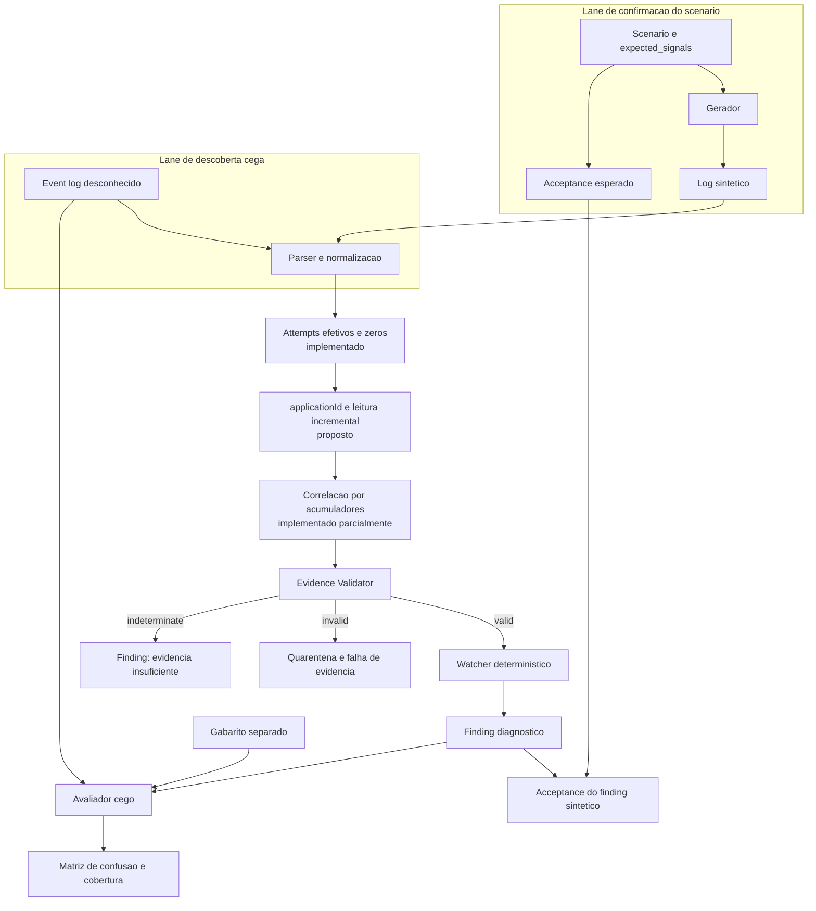
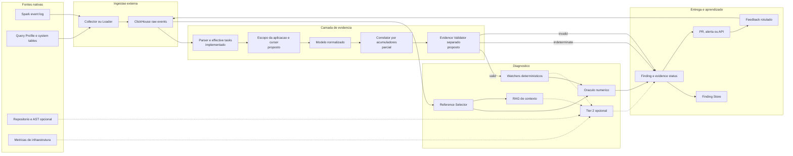
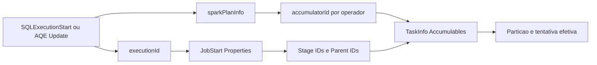
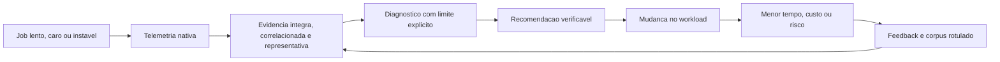
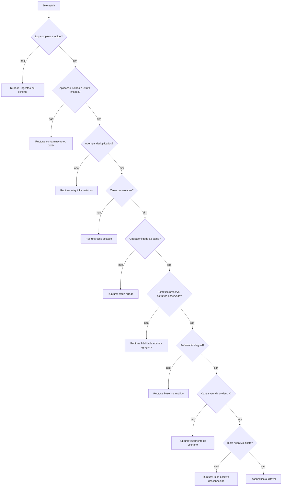

# Fluxo de Validacao e Cadeia de Evidencia

## Status

```text
snapshot historico do slice v4
o fluxo atual da branch esta em README.md e no macro-flow de 2026-07-22
```

Este documento consolida a proposta visual para evoluir o slice de skew sem
confundir confirmacao de scenario com descoberta em log desconhecido.

Implementado nesta branch:

- uma tentativa efetiva por particao, descartando falhas e duplicatas especulativas;
- preservacao de tasks com zero registros;
- `evidence_status` para colapso e mediana fria zero;
- correlacao operador-stage por `sparkPlanInfo.accumulatorId` e
  `TaskInfo.Accumulables`;
- fallback de maior volume exposto como evidencia indeterminada no Watcher;
- Oracle com particao quente, tipo de task e metodo de correlacao;
- saida ASCII portavel nos CLIs.

Ainda proposto neste desenho historico: processamento incremental no Watcher e
Oracle, isolamento por aplicacao e descoberta cega. O `EvidenceValidator`
separado, baseline sem skew, MCP guardado e rerun/compare foram implementados
na Round2; consulte `PLANO.md` e as evidencias G1-G5 para o estado atual.

Referencias de governanca:

- [Issue #29](https://github.com/luanmorenommaciel/apex/issues/29): validacao do slice atual;
- [Issue #30](https://github.com/luanmorenommaciel/apex/issues/30): divisao dos pods;
- [Issue #32](https://github.com/luanmorenommaciel/apex/issues/32): contrato de `validation_criteria`;
- [Issue #5](https://github.com/luanmorenommaciel/apex/issues/5): Apex externo via ClickHouse;
- [Issue #7](https://github.com/luanmorenommaciel/apex/issues/7): estado historico no ClickHouse.

## Premissas

1. A coleta continua externa e nao-intrusiva.
2. Evidencia incompleta nao pode virar causa raiz afirmativa.
3. O scenario pode orientar geracao e acceptance, mas nao pode fornecer a
   resposta para uma descoberta cega.
4. RAG pode recuperar referencias e contexto. A decisao de fidelidade do
   Oraculo deve permanecer deterministica e auditavel.
5. O resultado do gate de evidencia precisa ter tres estados:
   `valid`, `invalid` e `indeterminate`.
6. A analise deve isolar uma aplicacao e operar com memoria limitada; disponibilizar
   um iterador nao basta se Watcher e Oraculo materializam todos os eventos.
7. Arquivos devem usar UTF-8 e a saida dos CLIs deve ser portavel entre hosts.

## Fluxo de validacao



Leitura:

- no modo de confirmacao, o scenario pode verificar se o gerador produziu o
  comportamento declarado;
- no modo cego, o Watcher recebe somente a evidencia;
- o gabarito entra apenas no avaliador, depois da inferencia;
- `invalid` significa evidencia corrompida ou contraditoria;
- `indeterminate` significa evidencia insuficiente para concluir.

## Arquitetura proposta



### Correlacao minima de evidencia

O correlator nao deve depender do texto de `Stage Name`. A cadeia recomendada e:



Se essa cadeia nao puder ser fechada para o operador alvo, o resultado deve ser
`indeterminate`, nao um fallback silencioso para o stage de maior volume.

## Diagrama de sequencia

```mermaid
sequenceDiagram
    autonumber
    actor Engineer as Engenheiro
    participant Spark as Spark
    participant Collector as Collector
    participant CH as ClickHouse
    participant Parser as Evidence Parser
    participant Correlator as Evidence Correlator
    participant Validator as Evidence Validator
    participant Watcher as Watcher
    participant Selector as Reference Selector
    participant Oracle as Oracle
    participant RAG as RAG
    participant Finding as Finding Store

    Engineer->>Spark: Executa workload
    Spark->>Collector: Produz telemetria nativa
    Collector->>CH: Persiste raw events e metadados
    Parser->>CH: Le eventos da execucao
    Parser->>Correlator: Entrega plano, jobs, stages, tasks e attempts
    Correlator->>Correlator: Liga executionId, stage, operador e accumulatorId
    Correlator->>Validator: Entrega evidence bundle
    Validator->>Validator: Valida escopo, completude, attempts, zeros e estrutura
    Note over Parser,Validator: Atual: attempts, zeros e acumuladores no apexlib; cursor, app scope e validador separado ainda propostos

    alt Evidencia invalida
        Validator->>Finding: Registra invalid e motivos
    else Evidencia indeterminada
        Validator->>Finding: Registra indeterminate e campos ausentes
    else Evidencia valida
        Validator->>Watcher: Entrega evidence bundle validado
        Watcher->>Watcher: Aplica regra sem ler gabarito
        Watcher->>Selector: Solicita referencias elegiveis
        Selector->>CH: Filtra runtime, operador, escala e configuracao
        CH-->>Selector: Retorna baselines candidatos
        Selector->>Oracle: Entrega referencias qualificadas
        Watcher->>Oracle: Entrega sinais observados
        Oracle->>Oracle: Compara estrutura, distribuicao e aplica tolerancia
        Selector->>RAG: Envia casos semelhantes para contexto
        RAG-->>Finding: Sugere explicacao e links
        Oracle->>Finding: Registra decisao auditavel
    end

    Finding-->>Engineer: Entrega diagnostico ou limite da evidencia
```

## Cadeia de valor



O valor nao termina no Finding. A cadeia so fecha quando a recomendacao pode ser
testada e o resultado volta como feedback para o corpus.

## Gargalos e pontos de ruptura



| Ponto | Risco | Controle | Estado atual | Dono sugerido |
|---|---|---|---|---|
| Log truncado ou schema divergente | Diagnostico sobre evidencia parcial | checksum, schema version e `indeterminate` | Aberto | Parser / Evidence |
| CLI herda `cp1252` no Windows | Simbolos Unicode encerram processos | saida ASCII portavel | Implementado | Runtime / CI |
| Watcher e Oraculo usam `read_events` | Log inteiro e materializado; risco de OOM | agregacao incremental por aplicacao | Aberto | Parser / Evidence |
| Mais de uma aplicacao no input | IDs iguais contaminam metricas | particionar por `applicationId` | Aberto | Parser / Evidence |
| Retry, tentativa falha ou especulacao | Ratio falso | selecionar tentativa efetiva por particao | Implementado | Parser / Evidence |
| Tasks com zero removidas | Falso colapso | preservar zeros e invalidar mediana zero | Implementado | Validator |
| Stage com nome generico | Stage errado | correlacao por acumuladores | Parcial; fallback e sinalizado | Parser / Evidence |
| AQE muda o plano | Operador inicial difere do executado | preferir plano final | Implementado | Parser / Evidence |
| Sintetico usa particao `0`/`ShuffleMapTask`; real usa `3`/`ResultTask` | Ratio mascara estrutura divergente | reproduzir estrutura ou declarar limite | Detectado pelo Oracle; gerador aberto | Generator / Oracle |
| Oracle compara estrutura | Divergencia estrutural passa despercebida | particao, task type e correlacao | Implementado como warning | Oracle |
| Scenario fornece chave ou hot value | Confirmacao vira descoberta | separar lane cega e gabarito | Aberto | Watcher / Oracle |
| Baseline sem contexto | Workloads incompatíveis | Reference Selector deterministico | Aberto | Oracle |
| RAG decide fidelidade | Resultado nao reproduzivel | RAG apenas para busca e explicacao | Regra arquitetural | Oracle / Tier 2 |
| Confidence baseada apenas no ratio | Alta confianca em evidencia ruim | qualidade, cobertura e estabilidade | Parcial; evidencia invalida recebe zero | Watcher |
| CI roda apenas sintetico | Regressao no real passa | baseline negativo e Oracle agendado | Aberto | Oracle / CI |
| Diagramas divergem do contrato | Arquitetura antiga | teste documental e checklist | Implementado | Docs / ADR |
| Proveniencia ou licenca indefinida | Bloqueio de integracao | resolver issue #33 | Aberto | Governanca |

## Decisoes recomendadas para a issue #32

| Pergunta | Recomendacao |
|---|---|
| Onde roda o gate? | Em `Evidence Validator` separado e reutilizavel |
| O que fica no schema comum? | Integridade, attempts, correlacao e estados de saida |
| O que fica no scenario? | Thresholds e requisitos especificos do caso |
| `min_tasks: 8` e global? | Nao; pertence a este scenario |
| Como localizar o stage? | Descoberta estruturada; stage declarado serve apenas como assertion sintetica |
| Como validar o sintetico? | Comparar tambem hot partition, task type e correlacao do stage |
| Como processar logs grandes? | Cursor incremental, estado limitado e isolamento por aplicacao |
| O que fazer com evidencia invalida? | Bloquear diagnostico e registrar motivos |
| O que fazer com evidencia insuficiente? | Retornar `indeterminate`, sem causa raiz afirmativa |
| Baseline sem skew entra junto? | Sim; e requisito para medir falso positivo |

## Responsabilidades sugeridas por pod

| Pod | Entrega principal |
|---|---|
| Generator / Scenarios | baseline negativo, seeds, hash de particao e paridade estrutural |
| Parser / Evidence | normalizacao incremental, escopo por aplicacao, attempts e correlacao |
| Watchers / Diagnostics | descoberta sem gabarito e Finding tipado |
| Oracle / Quality Gates | referencias elegiveis, matriz de confusao e CI |
| Platform / Storage | ingestao e schemas ClickHouse |
| Docs / ADR | diagramas, decisoes e rastreabilidade entre issue, codigo e prova |

## Regra de manutencao

Toda alteracao em validacao, fonte, estado de evidencia, componente ou
responsabilidade deve revisar, no mesmo PR:

1. fluxo de validacao;
2. arquitetura proposta;
3. diagrama de sequencia;
4. cadeia de valor;
5. gargalos e pontos de ruptura.

Quando uma visao nao mudar, o PR deve registrar explicitamente que ela foi
revisada e permaneceu valida.
