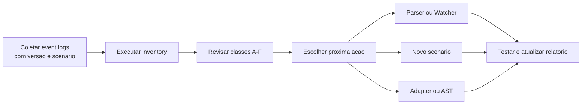

# Inventario de Cobertura

Este diretorio guarda relatorios empiricos produzidos pelo
[script de inventario](../../tools/coverage_inventory.py).

## Para que serve

O inventario responde:

```text
O Spark emitiu o sinal?
O Apex ja consome o campo?
Falta parser, scenario, configuracao ou outra fonte?
```

Ele nao responde se um job esta saudavel. Essa responsabilidade pertence aos
Watchers.

## Fluxo de uso



## Comando rapido

No Linux ou WSL:

```bash
cd /mnt/c/Users/Guest/Documents/project/codex/apex/apex-official
source .venv/bin/activate
PYTHONPATH=. python3 tools/coverage_inventory.py \
  real_log.ndjson \
  --md docs/coverage/apex-coverage-report-v1.md
```

Se o ambiente virtual estiver em outro repositorio, ative-o antes de entrar no
diretorio do Apex ou use o Python que ja possui as dependencias do projeto.

## Como ler o relatorio

| Secao | Pergunta |
|---|---|
| A | O que o Apex ja le? |
| B* | Que campos observados merecem prioridade? |
| B | Que outros campos apareceram? |
| C | O que varia por configuracao ou runtime? |
| D | Que scenario ainda falta no corpus? |
| E | O que exige outra fonte? |
| F | O que podemos inferir sem afirmar causa? |

## Regras para novos corpus

Registre junto do log:

- scenario executado;
- Spark ou Databricks Runtime;
- versao;
- configuracoes relevantes;
- data da coleta;
- resultado esperado.

Nao misture ambientes sem identificar a origem. Um campo presente no Spark OSS
pode mudar de nome ou disponibilidade no Databricks Runtime, Photon ou
Serverless.

## Relatorios

| Arquivo | Escopo |
|---|---|
| [Relatorio v1](apex-coverage-report-v1.md) | Uma aplicacao de join com skew; 57 eventos e 18 tipos |

O relatorio v1 e uma linha de base. Ele ainda nao representa a cobertura total do
Apex.
