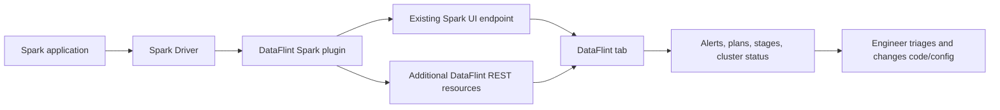
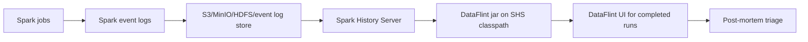
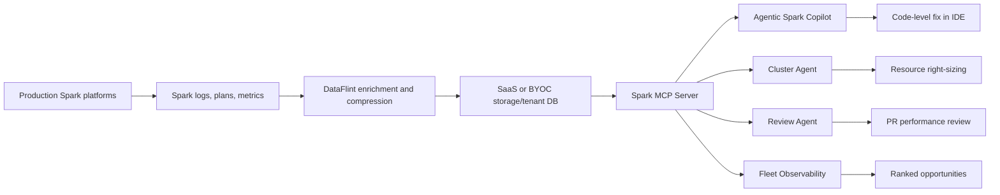
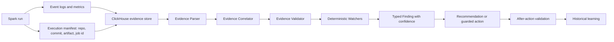
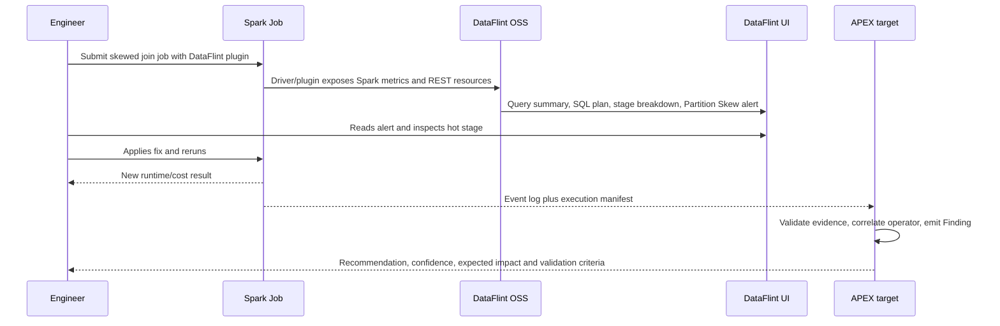

# DataFlint x APEX - Deep Dive

Este documento foi conduzido pelo Codex para o estudo DataFlint do time APEX.

Data da pesquisa: 2026-07-01.

## Criterio de confianca

Este estudo separa tres tipos de afirmacao:

- **Fato oficial DataFlint**: informacao publicada em GitHub, GitBook ou site oficial da DataFlint.
- **Sinal publico de comunidade**: GitHub issues, AWS Blog, Cloudera Community, Medium ou outro material publico relacionado ao uso da ferramenta.
- **Oportunidade APEX**: inferencia nossa sobre como o APEX pode se diferenciar. Esta parte nao deve ser lida como afirmacao sobre DataFlint.

Observacao de versao: o GitHub oficial aponta `0.9.9` como release mais recente em 2026-05-18. Algumas paginas GitBook ainda mostram exemplos com `0.8.8`. Para uso pratico, tratar o README do GitHub e Maven como fonte de versao corrente, e a GitBook como fonte de padrao de instalacao.

## Fontes principais

| Tipo | Fonte |
| --- | --- |
| OSS | https://github.com/dataflint/spark |
| Features OSS | https://dataflint.gitbook.io/dataflint-for-spark/overview/our-features |
| Como funciona OSS | https://dataflint.gitbook.io/dataflint-for-spark/overview/how-it-works |
| Seguranca OSS | https://dataflint.gitbook.io/dataflint-for-spark/overview/security-and-stability |
| Versoes suportadas | https://dataflint.gitbook.io/dataflint-for-spark/overview/supported-versions |
| Release notes | https://dataflint.gitbook.io/dataflint-for-spark/overview/release-notes |
| Instalacao Spark | https://dataflint.gitbook.io/dataflint-for-spark/getting-started/install-on-spark |
| Instalacao History Server | https://dataflint.gitbook.io/dataflint-for-spark/getting-started/install-on-spark-history-server |
| Alertas | https://dataflint.gitbook.io/dataflint-for-spark/advanced/alerts |
| SaaS e agentes | https://www.dataflint.io/ |
| Arquitetura SaaS/MCP | https://www.dataflint.io/resources/how-it-works |
| Copilot | https://www.dataflint.io/product/spark-copilot |
| Seguranca SaaS | https://dataflint.gitbook.io/dataflint-for-spark/saas/saas-security-and-stability |
| BYOC | https://dataflint.gitbook.io/dataflint-for-spark/byoc-bring-your-own-account/byoc-customer-onboarding |
| Gartner | Nao encontrei mencao publica confiavel a DataFlint em Gartner, Gartner Peer Insights ou Magic Quadrant nesta pesquisa. |

## O que e agentico e autonomo

**Agentico** significa que o sistema usa contexto, ferramentas e um objetivo para raciocinar e propor ou executar passos. No caso DataFlint SaaS, a fonte oficial descreve agentes com contexto de producao via Spark MCP Server. O site cita quatro frentes: Agentic Spark Copilot, Cluster Agent, Review Agent e Fleet Observability.

**Autonomo** significa que o sistema executa uma acao sem depender de uma decisao humana para cada evento. No site oficial, o Cluster Agent e descrito como capaz de right-size em tempo real. Essa promessa exige governanca: politica de limites, aprovacao, rollback, trilha de auditoria, janela de mudanca e criterio de sucesso.

Para o APEX, a palavra chave deve ser **autonomia guardada**. O APEX pode raciocinar, recomendar e agir, mas cada acao precisa carregar evidencia, limite, rollback e validacao pos-acao.

## DataFlint OSS - o que faz

| Area | O que DataFlint faz oficialmente | Fonte |
| --- | --- | --- |
| UI Spark | Adiciona uma aba DataFlint/DataFlint OSS na Spark Web UI. | GitHub README, Usage |
| Plugin Spark | Usa `spark.plugins=io.dataflint.spark.SparkDataflintPlugin`. | GitHub README, Install on Spark |
| Live monitoring | Mostra status de query e cluster em tempo real. | Features |
| Run summary | Mostra resumo da aplicacao e queries que consumiram mais recursos. | Features |
| Cluster status | Mostra executores ao longo do tempo e configuracao de recursos. | Features |
| Error handling | Extrai erro de query e mostra o ponto provavel no plano. | Features, Alerts |
| Plano SQL | Visualiza plano SQL, nos, estagios e alertas por node. | Features |
| Stage breakdown | Mostra distribuicao de duracao/input/output das tasks por stage. | Features |
| Heat map | Mostra onde a query gastou mais tempo, com aviso oficial de WIP e possivel imprecisao. | Features |
| Modos de plano | Advanced, IO-only, joins, broadcasts, repartitions e sorts. | Features, Release notes |
| Alertas | Nomeia problemas e sugere ajustes de configuracao/codigo. | Alerts |
| DCU | Calcula DataFlint Compute Unit com base em core/hour e memory/hour. | DCU calculation |
| Iceberg | Coleta metricas extras de escrita/leitura e alerta small files. | Apache Iceberg |
| History Server | Carrega DataFlint no Spark History Server por jar/classpath. | Install on Spark History Server |
| Plataformas | Spark 3.2+, Spark 4, batch, streaming, EMR, Dataproc, K8s, standalone, local e Databricks live. | Supported Versions, GitHub README |

## DataFlint SaaS - o que faz

| Modulo oficial | Papel | Como aparece nas fontes |
| --- | --- | --- |
| Enriched Spark Logs | Compacta/enriquece logs Spark para contexto de producao. | Site "How DataFlint Works" |
| Spark MCP Server | Serve contexto Spark para agentes e IDEs via MCP. | Site e Copilot docs |
| Agentic Spark Copilot | IDE extension para Cursor, VS Code e IntelliJ; root-cause, fix e otimizacao de codigo. | Site e Copilot |
| Cluster Agent | Right-size de clusters em tempo real. | Site |
| Review Agent | Revisa PRs com contexto de producao para evitar regressao de performance/custo. | Site |
| Fleet Observability | Dashboard de custo/performance para jobs, clusters e oportunidades de otimizacao. | Site |
| SaaS Web Client | Portal SaaS com OAuth/Auth0 para monitorar aplicacoes. | SaaS Security |
| BYOC | Opcao Bring Your Own Account com CloudFormation e role IAM. | BYOC docs |

## Fluxo oficial DataFlint OSS

Ponto importante: no OSS, DataFlint melhora a leitura e o diagnostico. A acao continua com o engenheiro.

## Fluxo oficial DataFlint no History Server

Limitacao operacional oficial: o History Server nao carrega packages via Ivy como uma aplicacao live; o jar precisa ser baixado e colocado no classpath. A documentacao tambem aponta limites em persistent History Server em alguns ambientes.

## Fluxo oficial DataFlint SaaS

Ponto de cautela: a DataFlint informa que processa metadados de performance, nao dados de negocio. Mesmo assim, logs Spark e planos SQL podem conter literais, nomes de tabela, paths, emails, filtros e outros dados sensiveis se a aplicacao registrar isso.

## Fluxo alvo APEX

Diferenca proposta: DataFlint entrega leitura e agentes com contexto de producao. O APEX pode competir por cadeia de custodia, validacao de evidencia, confidence score, rollback e medicao antes/depois.

## Principais problemas de seguranca

| Risco | Onde aparece | Impacto | Mitigacao APEX |
| --- | --- | --- | --- |
| Plugin dentro do Driver/SHS | DataFlint OSS roda local no driver ou History Server. | A organizacao precisa confiar no jar e na cadeia Maven. | Modo padrao externo, sem plugin obrigatorio; se houver plugin, exigir pin de versao, checksum e SBOM. |
| Novos recursos HTTP | DataFlint diz usar endpoint Spark UI existente e expor recursos REST adicionais. | Spark UI sem auth vira superficie sensivel. | APEX deve consumir storage interno e expor UI/API propria com auth/RBAC. |
| Telemetria | OSS coleta Spark version e app id via MixPanel, com flag de opt-out. | App id pode ser metadado interno sensivel. | Telemetria opt-in, documentada, desligada por padrao em ambientes regulados. |
| PII em Spark logs | Artigo linkado pela propria doc SaaS alerta que event logs podem conter PII em planos SQL. | Mesmo sem dados de negocio, metadata pode vazar literais sensiveis. | Scanner/redactor antes de persistir ou enviar contexto para LLM/MCP. |
| SaaS e egress | SaaS exporta metadados de performance para S3/DataFlint ou usa API Databricks/EMR read-only. | Requer revisao de IAM, API tokens, tenant isolation e data residency. | APEX pode oferecer local-first/on-prem por padrao. |
| BYOC com admin | Onboarding BYOC pede AWS admin para criar CloudFormation e IAM role. | Processo forte para PoC; demanda governanca de cloud. | Instalacao APEX por leitor de event logs e manifest com permissoes minimas. |
| Agente autonomo | Cluster Agent promete right-size em tempo real. | Mudanca automatica de recursos pode afetar SLA se nao houver guardrails. | Politicas declarativas, dry-run, approval gates, limites e rollback. |
| Heat map WIP | Doc oficial diz que heat map pode errar duracao de node. | Diagnostico visual pode induzir conclusao errada. | Evidence Validator marca evidencias ambiguas como `indeterminate`. |
| Iceberg reporter | Doc oficial cita conflito com metric reporter existente e bug de classloader. | Metrica pode nao ser coletada ou gerar warning. | APEX deve aceitar ausencia de metrica e degradar com estado `missing evidence`. |
| Performance de UI | Issue #44 reporta freeze com muitas queries. | UI client-side pode travar em apps grandes. | APEX deve processar incrementalmente e paginar agregados no backend. |

## Sinais publicos da internet

| Fonte publica | Sinal observado | Oportunidade APEX |
| --- | --- | --- |
| GitHub issue #44 | Com muitas queries, a summary page pode travar por processamento de payload grande no browser. | Backend incremental, pre-agregacao, paginacao e ClickHouse. |
| GitHub issue #34 | Pedido de tema claro para combinar com Spark UI. | UX consistente com ambientes corporativos e acessibilidade desde o inicio. |
| AWS Big Data Blog | Centralizar SHS multi-cluster exige S3 central, EKS, Load Balancer, Private CA, Route 53, Client VPN e controles de auth. | APEX pode nascer como control plane de observabilidade externa, com seguranca e multi-tenant como parte do produto. |
| Cloudera Community | Integracao CDP exige jar no parcel, safety valve e restart de History Server; erro comum e jar no local errado. | APEX pode reduzir instalacao para leitura de logs e manifests. |
| Dataminded | Revisar manualmente milhares de apps e impraticavel; eles precisaram de bulk analysis e priorizacao por custo/eficiencia. | APEX pode tratar fleet triage como primeira classe, nao apenas UI por run. |
| Medium/System Weakness | Spark logs podem vazar PII por filtros e metadata de planos; redaction nativa pode nao cobrir tudo. | APEX pode incluir redaction/scanner antes de indexar, enviar a LLM ou expor contexto. |
| Pesquisa Reddit/Gartner | Nao encontrei corpus publico confiavel sobre DataFlint em Reddit nem mencao publica Gartner nesta pesquisa. | Nao vender com autoridade de Gartner; registrar como lacuna de pesquisa. |

## Correlacao com versoes

| Versao | Evolucao registrada nas release notes | Leitura para APEX |
| --- | --- | --- |
| 0.0.1 | Status, Summary, Configuration e Alerts. | Comecou por UI e diagnostico. |
| 0.0.7 | Heat map. | Visualizacao e util, mas precisa de confianca/calibracao. |
| 0.1.1 | Resource tab e grafico de executores. | Custo/recurso entrou cedo. |
| 0.1.2 | Telemetry opt-out e wasted cores. | Telemetria precisa ser governada. |
| 0.1.3 | Suporte SaaS e Partition Skew alert. | Skew e SaaS apareceram cedo como valor central. |
| 0.2.0 | Large number of small tasks. | Alertas cresceram por padroes operacionais. |
| 0.2.3 | Large data broadcast e long filter conditions. | Catalogo evolui com casos concretos. |
| 0.3.1 | Distinct, skewed join, coalesce; melhor history sorting. | Stage/operator correlation e ponto dificil. |
| 0.3.2 | Cross joins, broadcast small table, large partition size. | Join/cost/shuffle viraram familia de alertas. |
| 0.4.0 | Short recommendation, stage failures, stage identification. | Recomendacao curta e boa, mas APEX pode medir resultado. |
| 0.4.2 | UDF python names, partition pruning, Generate node. | Contexto de codigo melhora diagnostico. |
| 0.6.0 | Spark 4, stage identification por metricas/statistics. | Compatibilidade de versao e central. |
| 0.6.1 | Delta support e maven dependency fixes. | Lakehouse formats ampliam superficie. |
| 0.7.0 | Delta collector experimental. | Recursos experimentais precisam aparecer como tal. |
| 0.8.0 | Novo flow graph, stage parent nodes, task indicators, otimizacoes de UI. | Escala de UI virou tema explicito. |
| 0.8.3 | Instrumentacao mapInArrow/mapInPandas e UDF duration. | O produto avanca para sinais que Spark nao entrega nativamente. |
| 0.9.9 | GitHub marca como latest em 2026-05-18. | Tratar como versao corrente em novos testes. |

## Caso de uso ilustrativo - Join com skew

### Cenario

Um job PySpark le eventos de usuarios, agrega por `customer_id` e faz join com uma tabela de clientes. Um cliente concentrado gera particao quente. O job termina, mas demora muito, consome shuffle alto e desperdica cores.

### Como DataFlint OSS funciona no caso

| Passo | DataFlint | Evidencia oficial | O que nao existe ou nao fica claro | Diferencial APEX |
| --- | --- | --- | --- | --- |
| 1. Instalar | Engenheiro adiciona jar/package e `spark.plugins`. | Install on Spark, GitHub README. | Modo OSS exige mudanca de configuracao Spark ou SHS. | APEX pode consumir event logs externos sem alterar Spark. |
| 2. Rodar job | Plugin roda no driver e aparece na Spark UI. | How It Works, Usage. | A execucao precisa carregar o plugin para live UI. | APEX pode trabalhar post-mortem com logs ja existentes. |
| 3. Abrir summary | UI mostra queries, custo/DCU e warnings. | Features, DCU. | O alerta e visual, nao um contrato de evidencia versionado. | APEX gera Finding tipado com evidencias e confidence. |
| 4. Ver plano | Plano SQL mostra join, exchanges, stages e alertas por node. | Features. | Correlacao com codigo/commit nao e garantida no OSS. | APEX usa execution manifest para ligar run a repo/commit/artifact. |
| 5. Ver stage | Stage breakdown mostra distribuicao de task duration/input/output. | Features. | UI pode sofrer com muitos eventos/queries, como indica issue #44. | APEX pre-agrega em backend e usa ClickHouse. |
| 6. Diagnosticar | Alert `Partition Skew` aponta problema e sugere ajuste. | Alerts. | Resolucao fica com humano no OSS. | APEX Watcher pode sugerir salting, AQE skew join, repartition ou mudanca de chave com criterio de aceite. |
| 7. Corrigir | Engenheiro muda codigo/config e roda de novo. | Inferencia baseada no fluxo OSS. | Nao ha validacao automatica antes/depois no OSS. | APEX mede runtime, shuffle, skew ratio, custo e regressao apos a acao. |
| 8. Aprender | DataFlint SaaS promete contexto historico e agentes. | Site DataFlint. | OSS nao entrega memoria historica central. | APEX pode registrar todos os Findings, decisoes e resultados em ClickHouse. |

### Fluxo do caso

## Todos os casos oficiais de uso e oportunidade APEX

| Caso oficial DataFlint | DataFlint hoje | Possivel lacuna | Como APEX pode ser diferente |
| --- | --- | --- | --- |
| Live Spark UI | Aba DataFlint em `http://YOUR_SPARK_URL/dataflint`. | Exige plugin no driver. | Modo externo como default; plugin so opcional. |
| Spark History Server | Jar no classpath do SHS para runs concluidas. | Instalacao manual e limitacoes em persistent SHS. | Leitura direta de event log store/ClickHouse. |
| Spark Submit | `--packages` e `--conf spark.plugins`. | Requer internet Maven ou jar pre-baixado. | Agente coletor separado ou ingestao offline. |
| PySpark session | Configs no builder. | Altera bootstrap da app. | Sem alteracao de codigo para diagnostico post-mortem. |
| Scala app | Dependencia Maven/SBT/Gradle e plugin. | Mudanca no pacote da app. | APEX usa manifest e logs. |
| K8s Spark Operator | `deps.packages` no SparkApplication. | Egress Maven em runtime ou imagem custom. | Sidecar/collector ou leitura do bucket de logs. |
| EMR | Via package/jar e acesso pelo Resource Manager proxy. | Operacao varia por EMR/SHS. | Padrao unico de ingestao multi-plataforma. |
| Databricks live | Suportado live; artifact especifico para DBR 17.3+. | GitHub README indica Databricks History Server nao suportado. | Integracao por jobs API/export/event logs quando permitido. |
| Dataproc | Suporte live e History Server. | Governanca depende do ambiente. | IAM minimo e pipeline padronizado. |
| Standalone/local | Suporte live e History Server. | Bom para dev, limitado para fleet. | Dev + producao no mesmo modelo de evidencia. |
| Streaming | Suporte Spark mode streaming. | Alertas oficiais focam muitos padroes batch/SQL. | Watchers especificos para lag, state store, microbatch e checkpoint. |
| Run Summary | Mostra resumo, queries custosas e warnings. | Visual/run-centric. | Ranking cross-run e cross-app por impacto. |
| Cluster Status | Grafico de executores e configuracao. | Diagnostico depende do olhar humano no OSS. | Resource Watcher com recomendacao e guardrails. |
| SQL plan | Plano visual com nodes e metricas. | Pode nao ligar ao commit/codigo executado. | CodeGrounder/manifest para commit, arquivo, funcao e linha. |
| Stage Breakdown | Distribuicao por task duration/input/output. | UI pode travar em payload grande. | Pre-agregacao e consulta incremental. |
| Heat Map | Visualiza tempo por parte do plano. | Doc oficial marca WIP e possivel imprecisao. | Mostrar confianca e motivo da atribuicao. |
| Query Failures | Extrai erro e lugar provavel no plano. | Resolucao humana. | Error Watcher com runbook e PR suggestion. |
| Reading Small Files | Alerta small files em leitura. | Nao faz compactacao. | Recomendacao com plano de compaction e simulacao de ganho. |
| Writing Small Files | Alerta small files em escrita. | Nao valida depois. | After-action validation por tamanho medio/quantidade de arquivos. |
| Iceberg inefficient replace | Identifica replace ineficiente. | Requer metric reporter. | Degradar se metric reporter ausente e sugerir instrumentacao minima. |
| Partition Skew | Alerta skew. | OSS nao fecha acao. | Watcher com skew ratio, stage/operator e criterio de correcao. |
| Small Tasks | Alerta muitas tasks pequenas. | Ajuste manual. | Sugerir coalesce/repartition/partition sizing com limite. |
| Memory Over-Provisioning | Alerta memoria em excesso. | Pode depender de decisao humana. | Right-size com dry-run e rollback. |
| Memory Under-Provisioning | Alerta memoria insuficiente. | Pode virar tentativa por tentativa. | Detectar spill/OOM, sugerir memoria ou mudanca de plano. |
| High wasted cores rate | Alerta baixa atividade de core. | OSS aponta, humano prioriza. | Priorizacao por custo mensal e SLA. |
| Large Data Broadcast | Alerta broadcast grande. | Correcao manual. | Sugerir remover hint, ajustar threshold, rever cardinalidade. |
| Broadcast small table in Sort Merge Join | Alerta oportunidade de broadcast. | Depende de conhecimento do dado. | Validar tamanho real e gerar patch/hint quando seguro. |
| Large Cross Join Scan | Alerta cross join pesado. | Pode precisar contexto semantico. | Exigir evidence + explain why + owner approval. |
| Large Partition Size | Alerta particao grande. | Ajuste de particionamento manual. | Recomendacao ligada a layout/tabela/custo historico. |
| Long Filter Conditions | Alerta filtros longos. | Pode ter risco de PII em plano. | Redaction scanner e sugestao de join/semi-join. |
| DCU | Unidade de custo comparavel. | Nao necessariamente igual ao custo real fora EMR serverless. | Cost model configuravel por plataforma e contrato. |
| Iceberg write metrics | Coleta metricas que Spark nao mostra nativamente. | Possivel conflito com reporter existente. | Interface de evidencia plugavel por lakehouse format. |
| Spark instrumentation | Instrumenta UDF/mapInPandas/mapInArrow para duracao. | Modo experimental/intrusivo. | Instrumentacao opcional, com contrato de overhead. |
| Spark Copilot SaaS | IDE com contexto de producao via MCP. | Requer SaaS/MCP/context export. | Copilot local com contexto curado e redigido. |
| Cluster Agent SaaS | Right-size automatico. | Autonomia precisa de governanca forte. | Autonomia guardada por policy, limite e rollback. |
| Review Agent SaaS | PR review com contexto de producao. | Depende de acesso a repos/PRs e contexto. | Review baseado em Findings historicos e regras deterministicas. |
| Fleet Observability SaaS | Dashboard cross-org de custo/performance. | Produto comercial, nao OSS. | ClickHouse local-first com ranking de oportunidades. |
| Analyze one job | Plano gratuito para upload de logs e analise por email/MCP. | Upload de logs levanta governanca de dados. | Analise local/offline por default. |
| BYOC | CloudFormation cria IAM role e policy boundary. | Requer admin e revisao cloud. | Instalacao com permissoes read-only no bucket de event logs. |

## Onde APEX pode superar

| Aposta APEX | Por que importa | Como medir |
| --- | --- | --- |
| External-first | Evita jar/plugin em jobs criticos. | Diagnosticar logs existentes sem mudar Spark config. |
| Evidence Validator | Evita alerta sobre evidencia ruim. | `valid`, `invalid`, `indeterminate` por Finding. |
| Execution manifest | Liga metrica ao codigo certo. | Todo Finding referencia repo, commit, artifact e app id. |
| Watchers deterministicos | Evita LLM inventar causa raiz. | Testes com baseline positivo e negativo. |
| Redaction before AI | Reduz risco de PII em logs/plans. | Scanner bloqueia ou redige campos sensiveis antes de MCP/LLM. |
| Fleet triage | Ajuda times com milhares de jobs. | Ranking por custo evitavel, frequencia e confianca. |
| After-action validation | Mostra se a recomendacao funcionou. | Antes/depois por runtime, shuffle, spill, DCU/custo e skew ratio. |
| Governance de autonomia | Permite acao segura. | Dry-run, approval, policy, rollback e audit trail. |
| Local-first/sovereign | Atende ambientes com restricao de egress. | Modo offline sem SaaS obrigatorio. |
| Source-aware recommendation | Sai do alerta generico para patch viavel. | Sugestao aponta arquivo, funcao, linha e criterio de teste. |

## Proximos passos recomendados no APEX

1. Criar `no_skew_baseline.yaml` para medir falso positivo.
2. Extrair `Evidence Validator` de dentro do watcher atual.
3. Adicionar `validation_criteria` nos cenarios.
4. Definir `execution_manifest` com repo, commit, artifact, entrypoint, app id e job id.
5. Desenhar schema ClickHouse para raw events, evidence, findings e after-action metrics.
6. Criar redaction scanner para planos SQL, paths, literais e configs sensiveis.
7. Priorizar Watchers na ordem: skew, small files, small tasks, memory, wasted cores, broadcast, cross join, query failure.
8. Criar tabela de lacunas DataFlint x APEX por caso oficial, mantendo fonte e versao.
