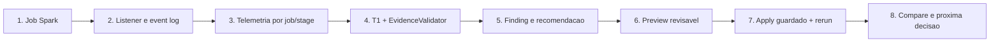

# Fluxo Didatico do Apex Commander (2026-07-22)

Use este guia para explicar a solucao sem abrir dezenas de documentos. O caso
de demonstracao e `job-42`; as execucoes que sustentam o before/after sao
`before-job` e `after-job`.

| Passo | O que acontece | Como demonstrar |
|---|---|---|
| 1. Executar | Um job Spark gera evento e metricas. | Mostre o caso de skew em `job-42`. |
| 2. Coletar | Event log e listener JVM fornecem a telemetria. | Cite `listener-jvm/` e os logs G3/F7. |
| 3. Normalizar | `job_id`, `app_id`, stages e planos entram no modelo do Commander. | Abra a UI em **Telemetria por Stage**. |
| 4. Diagnosticar | Detectores T1 e `EvidenceValidator` produzem finding apenas com evidencia suficiente. | Mostre severidade, ratio e citacoes. |
| 5. Recomendar | O contrato MCP gera recomendacao deterministica; Judge e opcional/read-only. | Use `recommend_fix` no MCP ou a Demo MCP Segura. |
| 6. Revisar | `preview_fix` mostra o diff e calcula hashes sem mutar arquivo. | Mostre o painel **Fix Center**. |
| 7. Aplicar com guarda | Fora da UI, `apply_fix` exige token, raiz permitida e hash esperado; depois ha rerun controlado. | Cite o smoke Claude Code GUI. |
| 8. Comparar | Before/after decide se houve melhoria ou se abre issue. | Mostre `29.4 -> 0.0` e `1 -> 0`. |

## Regra de seguranca

Nenhum LLM pode pular os passos 4, 6 ou 7. A UI e read-only; o apply fica no
MCP e requer aprovacao humana. Se a evidencia estiver incompleta, o resultado
correto e `manual_review`, nao uma causa raiz inventada.

## Roteiro de cinco minutos

1. Abra o one-slide e explique o resultado `29.4 -> 0.0`.
2. Inicie a UI com `python tools/run_commander_ui.py`.
3. Navegue por evidencias, before/after e Crew/Judge do `job-42`.
4. Mostre recomendacao e preview; explique que a UI nao aplica codigo.
5. Feche pedindo ao time o proximo job real para repetir o mesmo ciclo.
