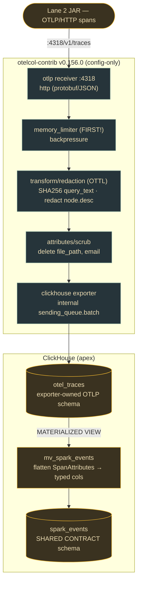

# Lane 3 — The Collector: OTLP → PII scrub → ClickHouse

> **Branch:** `feat/apex-collect` · **Language:** YAML config (no custom Go build) · **Depends on:** [`CONTRACT.md`](../../CONTRACT.md)
> **Hand this whole file to a coding agent.** Self-contained; the only external dependency is the frozen contract.

> **Status note (2026-07-24):** This is the original build brief; its task
> checkboxes are intentionally historical. Delivery status and current E2E
> evidence are tracked in [`../convergence/C10-AUGUSTO-E2E-READINESS-2026-07-24.md`](../convergence/C10-AUGUSTO-E2E-READINESS-2026-07-24.md).

## Mission & exit criterion

Build a **config-only** OpenTelemetry Collector (`otelcol-contrib` v0.156.0 — no custom build) that receives OTLP/HTTP on `:4318`, applies `memory_limiter` for backpressure, scrubs PII (SHA-256 `query_text`, delete `file_path`/`email`, redact plan `node.desc`), and exports to ClickHouse database `apex`.

**Exit criterion:** the collector ingests Spark telemetry on `:4318`, drops/hashes the named PII fields, and lands rows queryable by `job_id` end-to-end.

> ⚠️ **The discovery that shapes this lane:** the `clickhouseexporter` writes ONLY to its fixed OTLP-shaped tables (`otel_traces`/`otel_logs`) — it **cannot** target the custom-column `spark_events` table. So the pattern is: **land in `otel_traces` → reshape into `spark_events` via a ClickHouse Materialized View.** Do not try to point the exporter at `spark_events` directly.



## Key decisions (researched)

| Decision | Choice | Why |
|---|---|---|
| **Distribution** | Prebuilt `otel/opentelemetry-collector-contrib:0.156.0`, **config-only** — no OCB build. | contrib already bundles otlp receiver, memory_limiter, transform, attributes, redaction, clickhouseexporter. Custom build only warranted to shrink the binary/add non-contrib — none needed. |
| **Batching location** | The **exporter's internal `sending_queue.batch`** (`min_size ~5000`, `flush_timeout 5s`). **Do NOT** add the standalone `batch` processor. | Current README (PR #49424, 2026) recommends internal batching to avoid data loss on shutdown + hit ClickHouse's "insert ≥5000 rows or ≤1 req/sec" guidance. |
| **PII engine** | `transform` (OTTL `SHA256()`) for `query_text` + `node.desc` redaction; `attributes` `action:delete` for `file_path`/`email`; optional `redaction` (`hmac-sha256`) for email/IP value patterns. | OTTL `SHA256()` = stable one-way hash for high-entropy `query_text`; `delete` cleanly drops keys; `hmac-sha256` handles low-entropy PII where plain hashing is dictionary-reversible. |
| **ClickHouse protocol** | Native TCP `tcp://clickhouse:9000?compress=lz4&async_insert=1`, database `apex`, `create_schema:false` in prod. | Native TCP = throughput; `create_schema:false` lets you own partitioning/TTL and avoids collectors racing DDL. |
| **Custom schema mapping** | Land in `otel_traces` (exporter-owned), then reshape into `spark_events`+`findings` via a **Materialized View**. | The exporter's INSERT is bound to fixed OTLP column names — it can't map to `shuffle_read_bytes` etc. A MV is the ClickHouse-idiomatic reshape. |

## Build steps (with verify gates)

1. **Scaffold** (`otel-collector/config.yaml` + compose w/ contrib:0.156.0 + clickhouse-server; ports 4318, 13133). → *Verify:* `curl localhost:13133` → 200; logs "Everything is ready".
2. **OTLP HTTP receiver :4318** (`include_metadata:true`). → *Verify:* POST a sample OTLP/HTTP JSON to `/v1/traces` → 200 in debug logs.
3. **`memory_limiter` FIRST** in every pipeline. → *Verify:* under load, logs memory-pressure + returns retryable errors instead of OOM.
4. **PII scrub** (`transform` hash+redact → `attributes` delete). → *Verify:* send a span with `query_text`/`file_path`/`email`/`plan_json` → `query_text` is 64-hex, `file_path`/`email` absent, `node.desc` redacted.
5. **`clickhouseexporter`** (internal batch + retry + file-storage queue). → *Verify:* rows in `apex.otel_traces`; kill+restart ClickHouse mid-load → queued batches replay from disk (no loss).
6. **Own the schema** (`create_schema:false`; pre-create `otel_traces`/`otel_logs` + `spark_events` + `findings`). → *Verify:* `SHOW TABLES FROM apex` lists all four; `DESC` matches exporter INSERT columns.
7. **MV bridge** `otel_traces` → `spark_events`. → *Verify:* emit a full stage event → `SELECT * FROM apex.spark_events WHERE job_id='ax151sasadds114'` → one typed row, `plan_fingerprint` preserved.
8. **Wire pipelines + `validate`.** → *Verify:* `otelcol-contrib validate --config` passes; `job_id` joinable across `otel_traces` and `spark_events`.

## Task checklist (branch work items)

- [ ] **T1** — Pin `contrib:0.156.0` + clickhouse-server compose; expose 4318 + 13133 + queue volume. *Accept:* `up` green; `:13133` → 200.
- [ ] **T2** — OTLP/HTTP receiver `:4318` (`include_metadata:true`). *Accept:* POST to `/v1/traces` → 200 + debug log.
- [ ] **T3** — `memory_limiter` first in every pipeline. *Accept:* load test logs pressure + retryable errors, no OOM.
- [ ] **T4** — Hash `query_text` (OTTL `SHA256`, guarded `where != nil`). *Accept:* stored as 64-hex; identical inputs hash identically.
- [ ] **T5** — Redact plan `node.desc` in `plan_json` (`replace_pattern`). *Accept:* no raw `node.desc`; `plan_fingerprint` unchanged.
- [ ] **T6** — Drop `file_path`+`email` (`attributes delete`) + `redaction/pii` (hmac) for value patterns. *Accept:* keys absent; embedded emails/IPs only as HMAC.
- [ ] **T7** — `clickhouseexporter` → db `apex` (`tcp://…?compress=lz4&async_insert=1`, `create_schema:false`). *Accept:* rows in `otel_traces`; no DDL at startup.
- [ ] **T8** — Internal `sending_queue.batch` (5000/5s); confirm **no** `batch` processor. *Accept:* `system.query_log` shows batched INSERTs.
- [ ] **T9** — Crash-safe `file_storage` queue + `block_on_overflow:true`. *Accept:* restart ClickHouse mid-load → replays from disk, zero loss.
- [ ] **T10** — `retry_on_failure` (5s→30s, 300s cap). *Accept:* transient outage <300s auto-recovers with backoff logs.
- [ ] **T11** — Pre-create exporter-owned `otel_traces`/`otel_logs` DDL. *Accept:* `DESC` matches INSERT columns; inserts succeed with `create_schema:false`.
- [ ] **T12** — Create `spark_events` + `findings` (contract §2). *Accept:* `SHOW TABLES` lists both; names/types match contract.
- [ ] **T13** — MV `otel_traces` → `spark_events` (flatten `SpanAttributes`). *Accept:* one stage span → one typed row, correct metrics + fingerprint.
- [ ] **T14** — Wire pipelines + extensions + `validate`. *Accept:* `validate` passes; both signals flow.
- [ ] **T15** — E2E `job_id` traceability. *Accept:* all stages of `job_id` joinable across `otel_*` and `spark_events`.
- [ ] **T16** — README the custom-schema constraint. *Accept:* states the MV bridge so nobody sets `traces_table_name: spark_events`.

## Starter snippets

**`config.yaml`** (otelcol-contrib v0.156.0)
```yaml
extensions:
  health_check: { endpoint: 0.0.0.0:13133 }
  file_storage: { directory: /var/lib/otelcol/queue }   # crash-safe sending queue
receivers:
  otlp:
    protocols:
      http: { endpoint: 0.0.0.0:4318, include_metadata: true }   # OTLP/HTTP (protobuf or JSON)
processors:
  memory_limiter:                        # MUST be first in each pipeline
    check_interval: 1s
    limit_mib: 2048
    spike_limit_mib: 512
  transform/redaction:
    error_mode: ignore
    trace_statements:
      - set(span.attributes["query_text"], SHA256(span.attributes["query_text"])) where span.attributes["query_text"] != nil
      - replace_pattern(span.attributes["plan_json"], "\"desc\":\"[^\"]*\"", "\"desc\":\"[REDACTED]\"")
  attributes/scrub:
    actions:
      - { key: file_path, action: delete }
      - { key: email,     action: delete }
  redaction/pii:                         # low-entropy PII (emails/IPs) — reversible-resistant
    allow_all_keys: true
    blocked_values: ["[a-zA-Z0-9._%+-]+@[a-zA-Z0-9.-]+\\.[a-zA-Z]{2,}", "(?:[0-9]{1,3}\\.){3}[0-9]{1,3}"]
    hash_function: hmac-sha256
    hmac_key: ${env:REDACTION_SECRET_KEY}
exporters:
  clickhouse:
    endpoint: tcp://clickhouse:9000?compress=lz4&async_insert=1
    database: apex
    ttl: 720h
    create_schema: false                 # own the schema in prod
    traces_table_name: otel_traces
    logs_table_name: otel_logs
    timeout: 10s
    sending_queue:
      enabled: true
      num_consumers: 10
      queue_size: 10000
      sizer: items
      block_on_overflow: true            # backpressure instead of silent drop
      storage: file_storage
      batch: { min_size: 5000, flush_timeout: 5s, sizer: items }   # internal, NOT the batch processor
    retry_on_failure: { enabled: true, initial_interval: 5s, max_interval: 30s, max_elapsed_time: 300s }
service:
  extensions: [health_check, file_storage]
  pipelines:
    traces:
      receivers: [otlp]
      processors: [memory_limiter, transform/redaction, attributes/scrub]
      exporters: [clickhouse]
    logs:
      receivers: [otlp]
      processors: [memory_limiter, transform/redaction, attributes/scrub, redaction/pii]
      exporters: [clickhouse]
```

**MV: reshape `otel_traces` → `spark_events`**
```sql
-- clickhouseexporter writes to apex.otel_traces (fixed OTLP schema).
-- This MV flattens SpanAttributes into the typed shared-contract columns.
CREATE MATERIALIZED VIEW apex.mv_spark_events TO apex.spark_events AS
SELECT
  SpanAttributes['job_id']                                  AS job_id,
  SpanAttributes['app_id']                                  AS app_id,
  toInt32OrZero(SpanAttributes['stage_id'])                 AS stage_id,
  toInt32OrZero(SpanAttributes['attempt'])                  AS stage_attempt,
  Timestamp                                                 AS ts,
  toInt64OrZero(SpanAttributes['shuffle_read_bytes'])       AS shuffle_read_bytes,
  toInt64OrZero(SpanAttributes['spill_disk_bytes'])         AS spill_disk_bytes,
  toInt64OrZero(SpanAttributes['gc_time_ms'])               AS gc_time_ms,
  toInt64OrZero(SpanAttributes['task_duration_p99_ms'])     AS task_duration_p99_ms,
  toFixedString(SpanAttributes['plan_fingerprint'], 64)     AS plan_fingerprint,
  SpanAttributes['plan_json']                               AS plan_json
  /* ...remaining contract fields... */
FROM apex.otel_traces
WHERE SpanAttributes['job_id'] != '';
```

**Docker run (pin + validate)**
```bash
docker run --rm -p 4318:4318 -p 13133:13133 \
  -e REDACTION_SECRET_KEY=$REDACTION_SECRET_KEY \
  -v $PWD/config.yaml:/etc/otelcol-contrib/config.yaml:ro \
  -v otel-queue:/var/lib/otelcol/queue \
  otel/opentelemetry-collector-contrib:0.156.0 --config /etc/otelcol-contrib/config.yaml
# validate config without starting:
docker run --rm -v $PWD/config.yaml:/c.yaml:ro \
  otel/opentelemetry-collector-contrib:0.156.0 validate --config /c.yaml
```

## Pitfalls (verified — read before building)

- **Do NOT set `traces_table_name: spark_events`.** The exporter's INSERT is bound to fixed OTLP columns (`Timestamp`, `TraceId`, `SpanAttributes`, …). Reshape via a Materialized View instead.
- **Do NOT use the standalone `batch` processor** with this exporter — use the internal `sending_queue.batch` (README PR #49424) to avoid data loss on shutdown.
- **`memory_limiter` must be FIRST** in each pipeline, or backpressure applies *after* PII scrubbing already consumed memory.
- **`sending_queue` is in-memory by default → lost on restart.** Set `storage: file_storage` for at-least-once.
- **`block_on_overflow` defaults to false → silent drop** when `queue_size` exceeded. Set `true` for real backpressure.
- **`ttl` on the exporter only affects tables it CREATES.** With `create_schema:false` you set TTL yourself in DDL (`ttl_only_drop_parts=1`); the exporter `ttl` is cosmetic.
- **`clickhouseexporter` metrics support is only alpha** at v0.156.0 (traces/logs are beta). Model Spark metrics as **spans/logs** with numeric `SpanAttributes`, not OTLP metrics.
- **`SHA256()` errors on nil** — guard with `where … != nil` or `error_mode: ignore`.
- **`plan_fingerprint` is computed upstream (Lane 2)** — redaction of `plan_json` must NOT alter/recompute it; pass it as an opaque attribute.
- **ClickHouse native = 9000, HTTP = 8123** (unrelated to the collector's 4318). Scheme (`tcp://` vs `http://`) selects the protocol; mixing (`tcp://host:8123`) fails.
- **Plain hashing is dictionary-reversible for low-entropy PII** (emails/IPs) — use `hmac-sha256` with a secret `hmac_key` from env.

## References
`opentelemetry-collector-contrib` READMEs (clickhouseexporter, transformprocessor, attributesprocessor, redactionprocessor, OTTL funcs) · ClickHouse "integrating OpenTelemetry" · contrib v0.156.0 release notes · Context7 `/open-telemetry/opentelemetry-collector-contrib`.
