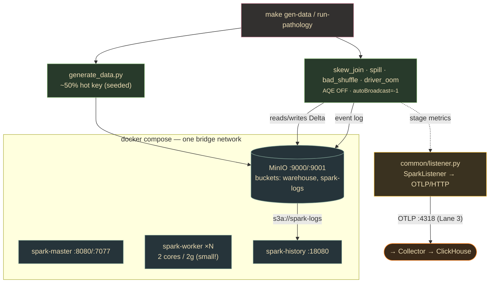

# Lane 1 — Dev-Env: Spark/Delta Pathology Lab

> **Branch:** `feat/apex-dev` · **Language:** Python + Docker · **Depends on:** [`CONTRACT.md`](../../CONTRACT.md)
> **Hand this whole file to a coding agent.** It is self-contained; the only external dependency is the frozen contract.

## Mission & exit criterion

Build a fully local, reproducible **Spark performance-pathology lab** via Docker Compose: standalone Spark master + N workers + Spark History Server + MinIO (S3). On top sits (a) a **deterministic skewed-data generator** (one hot join key = ~50% of rows, seeded → byte-identical across runs) and (b) four **parametrized pathology jobs** — `skew_join.py`, `spill.py`, `bad_shuffle.py`, `driver_oom.py` — each reliably triggering its named failure with AQE disabled so it isn't silently auto-healed.

**Exit criterion:** `docker compose up` → green cluster where `make run-pathology JOB=skew_join` (and the other three) completes, the run appears in the History Server at `:18080`, **and** (once Lanes 3+4 are up) a `spark_events` row per stage lands in `apex.spark_events` keyed by the same `job_id`.

> **This lane is the P0 unlock.** Everything else needs *real jobs producing real telemetry*. Build this first; it's the thing that ends synthetic-only validation.



## Key decisions (researched — use these versions)

| Decision | Choice | Why |
|---|---|---|
| **Spark + Delta pair** | **Primary:** Spark 4.0.1 + delta-spark 4.0.1 (Scala 2.13, JDK 17, Hadoop 3.4.x, hadoop-aws **3.4.x**). **Fallback:** Spark 3.5.6 + delta-spark 3.3.2 (hadoop-aws **3.3.4**). | Delta 4.0.x *requires* Spark 4.0.x + Hadoop 3.4.x (3.3.x conflicts). Keep `hadoop-aws` **exactly equal** to the bundled Hadoop version — mismatch is the #1 cause of `ClassNotFoundException: S3AFileSystem`. |
| **Base image** | `apache/spark:4.0.1-scala2.13-java17-python3-ubuntu`, **one image** reused for master/worker/history (override `command` per service). | Guarantees identical JARs across driver/executor/history. Avoid `bitnami/spark` for 4.x (lags). |
| **S3A / MinIO** | Bake `hadoop-aws` + `aws-java-sdk-bundle` into `$SPARK_HOME/jars` via a thin Dockerfile; set `fs.s3a.endpoint=http://minio:9000`, `path.style.access=true`, `connection.ssl.enabled=false`, `s3a.impl=...S3AFileSystem`. | MinIO needs path-style + plaintext on the docker net. Baking JARs (not `--packages`) makes the History Server work offline + deterministic startup. |
| **Event-log location** | `spark.eventLog.dir` = `spark.history.fs.logDirectory` = `s3a://spark-logs/events/` (identical). History Server gets its own `SPARK_HISTORY_OPTS` with s3a creds. | Both must point at the same bucket/prefix; MinIO storage mirrors real S3. |
| **Disable AQE + broadcast** *per pathology job* | `spark.sql.adaptive.enabled=false` + `spark.sql.autoBroadcastJoinThreshold=-1` in the jobs (NOT base conf). | AQE's skewJoin/coalescePartitions and auto-broadcast would **auto-heal the exact pathologies** we're trying to reproduce. |
| **Skew generation** | Plain Spark: `spark.range(N)` + `when(rand(seed)<0.5, HOT_KEY).otherwise(uniform)`. dbldatagen optional. Seed everything. | `rand(seed)` → byte-reproducible; `<0.5` → exactly ~50% hot key, no extra deps. |
| **Telemetry capture** | Python `SparkListener` (via `sc._gateway`) on `onStageCompleted` → OTLP/HTTP; `plan_fingerprint` from `queryExecution.optimizedPlan().canonicalized()` (LOGICAL, not physical) → SHA-256. | `onStageCompleted` exposes every contract field. Logical plan is stable across AQE/versions (contract §1.3). |

## Build steps (each with a verify gate)

1. **Scaffold + pin versions.** `infra/` (Dockerfile, docker-compose.yml, conf/spark-defaults.conf, .env), `jobs/` (generate_data.py, the 4 pathologies, common/session.py, common/listener.py), Makefile. → *Verify:* `.env` shows one consistent version quartet.
2. **Build the Spark image.** Curl matching `hadoop-aws` + `aws-java-sdk-bundle` + `delta-spark` + `delta-storage` into `$SPARK_HOME/jars`; `pip install` pinned deps. → *Verify:* `docker run --rm IMG ls /opt/spark/jars | grep -E 'hadoop-aws|delta-spark'` lists both.
3. **Compose with 5 services** (minio, minio-init, spark-master, spark-worker, spark-history). Workers small (2c/2g). → *Verify:* `:8080` shows workers, `:9001` shows both buckets, `:18080` loads.
4. **`common/session.py` + `common/listener.py`.** Session builds Delta+s3a+eventlog conf, mints `job_id`, stashes it in `spark.apex.job_id`; listener POSTs OTLP on stage completion. → *Verify:* smoke Delta write+read to `s3a://warehouse/_smoke` prints `job_id`.
5. **`generate_data.py`.** Deterministic ~50% hot-key fact + dim Delta tables. → *Verify:* `groupBy(join_key).count()` shows HOT_KEY ≈ 50%; identical across two seeded runs.
6. **The four pathology jobs** (see snippet). → *Verify:* each `make run-pathology JOB=<name>` completes (or OOMs intentionally); `spill.py` shows `spill_disk_bytes>0`; `skew_join` shows p99 ≫ p50.
7. **Event logs → History Server.** → *Verify:* after a run, `:18080` lists the app with full stage/task timeline; skew visible in task-time distribution.
8. **Confirm contract telemetry reaches ClickHouse** (once Lanes 3+4 up). → *Verify:* `SELECT job_id, stage_id, spill_disk_bytes, task_duration_p99_ms FROM apex.spark_events WHERE job_id='<id>'` returns one row per stage; fingerprint stable across re-runs, differs between pathologies.

## Task checklist (branch work items)

- [ ] **T1** — Create branch + repo skeleton + version pins (`.env` with the version quartet). *Accept:* tree matches layout; one consistent quartet.
- [ ] **T2** — Spark Dockerfile with S3A + Delta JARs baked in. *Accept:* `docker build` OK; `ls /opt/spark/jars` shows all four JARs.
- [ ] **T3** — `docker-compose.yml` (master, worker, history, minio, minio-init). *Accept:* `up -d` green; ports 8080/9001/18080 respond.
- [ ] **T4** — `conf/spark-defaults.conf` for MinIO + event logging + Delta. *Accept:* smoke job's event log appears in MinIO + `:18080`.
- [ ] **T5** — `common/session.py` (SparkSession factory + `job_id`). *Accept:* smoke Delta read/write; logs `job_id`+`app_id`.
- [ ] **T6** — `common/listener.py` (SparkListener → OTLP/HTTP). *Accept:* collector receives one record per stage, all contract fields populated.
- [ ] **T7** — `plan_fingerprint` over the **normalized logical** plan. *Accept:* same query → same fingerprint; skew_join ≠ bad_shuffle; not from physical plan.
- [ ] **T8** — `generate_data.py` (deterministic ~50% hot key). *Accept:* HOT_KEY ≈ 50%; byte-identical across seeded runs.
- [ ] **T9** — `skew_join.py` (+ `--fix` = AQE-on/salting). *Accept:* one shuffle partition dominates; p99 ≫ p50; History Server shows one long task.
- [ ] **T10** — `spill.py` (low mem + small shuffle partitions). *Accept:* `spill_disk_bytes>0` in stage metrics.
- [ ] **T11** — `bad_shuffle.py` (`shuffle.partitions=2` vs `--fix`). *Accept:* 2 huge tasks + longer wall time; `--fix` balanced.
- [ ] **T12** — `driver_oom.py` (`collect()` on multi-GB, `driver.memory=512m`, `--safe` guard). *Accept:* default OOMs reproducibly; listener flushes stages emitted **before** the collect.
- [ ] **T13** — Makefile (`up build gen-data run-pathology logs-check scale down`). *Accept:* full happy path runs; `scale WORKERS=3` adds workers.
- [ ] **T14** — E2E verify vs History Server + ClickHouse. *Accept:* each job visible at `:18080` AND produces `apex.spark_events` rows.
- [ ] **T15** — README run book + pathology explanations. *Accept:* fresh clone → logged pathology run following only the README.

## Starter snippets

**`conf/spark-defaults.conf`** (Spark 4.0.1)
```properties
# --- Delta ---
spark.sql.extensions                       io.delta.sql.DeltaSparkSessionExtension
spark.sql.catalog.spark_catalog            org.apache.spark.sql.delta.catalog.DeltaCatalog
# --- MinIO / S3A ---
spark.hadoop.fs.s3a.impl                   org.apache.hadoop.fs.s3a.S3AFileSystem
spark.hadoop.fs.s3a.endpoint               http://minio:9000
spark.hadoop.fs.s3a.access.key             minioadmin
spark.hadoop.fs.s3a.secret.key             minioadmin
spark.hadoop.fs.s3a.path.style.access      true
spark.hadoop.fs.s3a.connection.ssl.enabled false
# --- Event logging → History Server reads the same path ---
spark.eventLog.enabled                     true
spark.eventLog.dir                         s3a://spark-logs/events/
spark.history.fs.logDirectory              s3a://spark-logs/events/
# Jobs override at submit time: spark.sql.adaptive.enabled=false ; autoBroadcastJoinThreshold=-1
```

**`generate_data.py`** — deterministic ~50% hot key
```python
import pyspark.sql.functions as F
HOT_KEY, NUM_KEYS, SEED = 7, 10_000, 42
fact = (spark.range(0, ROWS)
    .withColumn("join_key",
        F.when(F.rand(SEED) < 0.5, F.lit(HOT_KEY))               # ~50% hot
         .otherwise((F.rand(SEED+1) * NUM_KEYS).cast("int")))
    .withColumn("amount", (F.rand(SEED+2) * 1000).cast("double")))
fact.write.format("delta").mode("overwrite").save("s3a://warehouse/fact")
dim = (spark.range(0, NUM_KEYS).withColumnRenamed("id","join_key")
         .withColumn("attr", F.concat(F.lit("k_"), F.col("join_key"))))
dim.write.format("delta").mode("overwrite").save("s3a://warehouse/dim")
```

**`common/listener.py`** — SparkListener → contract fields
```python
class ApexListener:  # attached via sc._gateway proxy on onStageCompleted
    def onStageCompleted(self, e):
        si = e.stageInfo(); m = si.taskMetrics()
        if m is None: return
        rec = dict(
          job_id=JOB_ID, app_id=APP_ID, stage_id=si.stageId(),
          stage_attempt=si.attemptNumber(), ts=now_millis(),
          shuffle_read_bytes=m.shuffleReadMetrics().totalBytesRead(),
          shuffle_write_bytes=m.shuffleWriteMetrics().bytesWritten(),
          spill_disk_bytes=m.diskBytesSpilled(),
          spill_mem_bytes=m.memoryBytesSpilled(),
          gc_time_ms=m.jvmGCTime(), task_count=si.numTasks(),
          peak_execution_mem_bytes=m.peakExecutionMemory(),
          input_bytes=m.inputMetrics().bytesRead(),
          output_bytes=m.outputMetrics().bytesWritten())
        post_otlp_http("http://otel-collector:4318/v1/logs", rec)
# plan_fingerprint (LOGICAL, not physical):
# canon = df._jdf.queryExecution().optimizedPlan().canonicalized().toString()
# plan_fingerprint = hashlib.sha256(canon.encode()).hexdigest()
```

**Pathology submit flags** — what makes each deterministic
```bash
# skew_join: force sort-merge on the hot key, no auto-heal
spark-submit --conf spark.sql.adaptive.enabled=false \
  --conf spark.sql.autoBroadcastJoinThreshold=-1 jobs/skew_join.py
# spill: starve memory + fat partitions
spark-submit --conf spark.sql.adaptive.enabled=false \
  --conf spark.executor.memory=1g --conf spark.sql.shuffle.partitions=8 jobs/spill.py
# bad_shuffle: far too few partitions
spark-submit --conf spark.sql.adaptive.enabled=false \
  --conf spark.sql.shuffle.partitions=2 jobs/bad_shuffle.py
# driver_oom: pull everything to a tiny driver
spark-submit --conf spark.driver.memory=512m jobs/driver_oom.py   # df.collect()
```

## Pitfalls (verified — read before building)

- **`hadoop-aws` MUST equal the bundled Hadoop version.** Spark 4.0.1 → 3.4.x; Spark 3.5.x → 3.3.4. Mismatch → `ClassNotFoundException: S3AFileSystem`. Never mix.
- **Delta 4.0.x needs Hadoop 3.4.x + JDK 17 + Scala 2.13** (drops 2.12). Delta 4.0 on Hadoop 3.3.x conflicts.
- **MinIO needs `path.style.access=true` AND `connection.ssl.enabled=false`** on the docker net; without path-style, S3A tries virtual-host `bucket.minio:9000` and fails DNS.
- **AQE silently auto-heals your pathologies** (`adaptive.skewJoin` splits the hot partition; `coalescePartitions` fixes bad_shuffle). Set `adaptive.enabled=false` per pathology job.
- **`autoBroadcastJoinThreshold` defaults to 10MB** → a small dim gets broadcast → skew join produces NO shuffle. Set `-1` for `skew_join.py` and `spill.py`.
- **Use `optimizedPlan().canonicalized()`** — NOT `executedPlan()`/`sparkPlan()` (physical), or the fingerprint churns across environments/partition counts.
- **History Server won't show an app until the `.inprogress` log is finalized.** `driver_oom.py` crashes the driver → may leave `.inprogress`. Flush listener records **before** the `collect()`; expect an incomplete History entry.
- **MinIO buckets must exist before the first write** → add a one-shot `minio-init` (`mc mb warehouse spark-logs`) with `depends_on`, else `NoSuchBucket`.
- **Keep `SPARK_WORKER_MEMORY/CORES` low (2g/2c)** — on a beefy host, generous executors absorb the spill/OOM you're trying to trigger.
- **dbldatagen Zipf/skew distributions only apply to INTEGER ranges** (float columns fold to uniform). Use the plain-Spark `rand()<0.5` recipe for the guaranteed 50% split.

## References
Spark monitoring · Delta releases/quick-start · `mvnrepository/io.delta/delta-spark` · `guptaakashdeep/spark-minio-project` · `LucaCanali/sparkMeasure` · `databrickslabs/dbldatagen` (distributions/categorical docs) · Databricks AQE docs · cazpian.ai SparkListener/DriverPlugin post.
