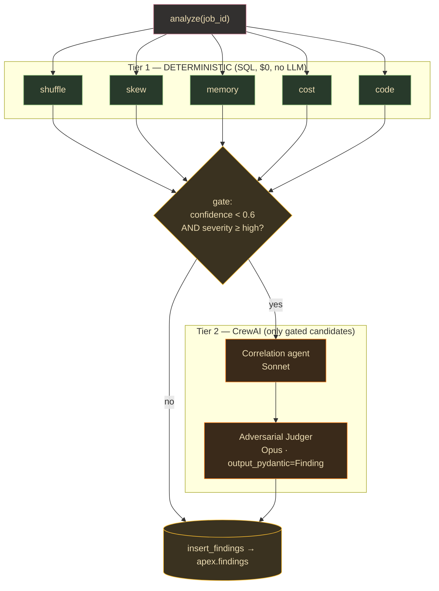

# Lane 5 — The Brain: CrewAI Agentic Analysis

> **Branch:** `feat/apex-engine` · **Language:** Python (CrewAI + clickhouse-connect) · **Depends on:** [`CONTRACT.md`](../../CONTRACT.md)
> **Hand this whole file to a coding agent.** Self-contained; the only external dependency is the frozen contract.
> **This is the lane you can build FIRST against synthetic rows** — load `fixtures/sample_event.json` into ClickHouse and the whole brain is unblocked before the JAR/collector are real.

> **Status note (2026-07-24):** This is the original build brief; its task
> checkboxes are intentionally historical. Delivery status and current E2E
> evidence are tracked in [`../convergence/C10-AUGUSTO-E2E-READINESS-2026-07-24.md`](../convergence/C10-AUGUSTO-E2E-READINESS-2026-07-24.md).

## Mission & exit criterion

Build a Python analysis service that reads `apex.spark_events` from ClickHouse and produces validated `Finding` rows in `apex.findings`. **The core architectural discipline:**
- **Tier 1 — five DETERMINISTIC SQL watchers** (Shuffle/Skew/Memory/Cost/Code) as plain Python functions running parameterized `clickhouse-connect` queries. **No LLM. No CrewAI.** These are rules, not agents.
- **Tier 2 — CrewAI used ONLY** for cross-signal correlation + an adversarial "Judger", **gated** so LLM calls fire only when a candidate has `confidence < 0.6 AND severity >= high`.
- **Model tiering:** Haiku (triage) → Sonnet (correlation) → Opus (adversarial judge).

**Exit criterion:** given a `job_id`, run all five watchers deterministically, optionally escalate ambiguous high-severity candidates through the gated crew, and insert validated `Finding` rows into `apex.findings` keyed by `job_id` — a clean job inserts 0 rows and makes **0 LLM calls**.



## Key decisions (researched)

| Decision | Choice | Why |
|---|---|---|
| **CrewAI version** | `crewai[anthropic]>=1.7,<2` + `crewai-tools>=1.9`. | 1.x is GA/maintained; removed mandatory LiteLLM for native providers. The `[anthropic]` extra installs the native provider. |
| **Where the 5 watchers live** | Plain Python functions running **parameterized ClickHouse SQL** — NOT CrewAI agents, NOT `@tool`-wrapped. | They're deterministic threshold rules. LLM watchers would be non-deterministic, slow, expensive, and would defeat the gating design. |
| **What CrewAI is for** | A small crew: Correlation agent + adversarial Judger, invoked **only** on gated candidates. | Cross-signal correlation ("shuffle+skew+spill on one stage → data-skew root cause") and adversarial critique are the only LLM-worthy tasks. Gating keeps cost bounded — most findings emit straight from Tier 1. |
| **Model tiering** | **Haiku (`claude-haiku-4-5`)** triage → **Sonnet (`claude-sonnet-5`)** correlation → **Opus (`claude-opus-4-8`)** judge, via `LLM(model="anthropic/<id>")`. | Cost/latency ladder: cheap Haiku decides *if* to escalate; Sonnet does multi-signal reasoning; Opus is the final adversarial gate. Per-agent `llm=` is first-class in CrewAI. |
| **Structured output** | Pydantic v2 `Finding`; enforce via `Task(output_pydantic=Finding)` for crew tasks + `LLM(response_format=Finding)` for triage. Tier-1 constructs `Finding` directly. | `output_pydantic` guarantees `result.pydantic` is a validated `Finding`; Tier-1 findings are Pydantic-validated on construction, no LLM. |
| **ClickHouse driver** | `clickhouse-connect>=0.8` — server-side `{name:Type}` binding for reads; native `client.insert(...)` for writes. | Official HTTP driver; server-side binding is injection-safe (SELECT only); native insert is faster than INSERT-VALUES and returns `written_rows` for verification. |

## Build steps (with verify gates)

1. **Scaffold + pin deps** (`apex_analysis/{schema,ch_client,watchers/,crew/,gate,sink,pipeline}.py`; env `ANTHROPIC_API_KEY`, `CLICKHOUSE_*`). → *Verify:* `import crewai` shows 1.x; `crewai.LLM` + `clickhouse_connect` import.
2. **`Finding` schema** (`schema.py`, Pydantic v2 + enums + `to_clickhouse_row()`). → *Verify:* round-trips; `confidence>1.0` raises `ValidationError`; row keys == `findings` columns.
3. **`apex.findings` DDL.** → *Verify:* `EXISTS TABLE apex.findings` → 1; `DESCRIBE` matches `to_clickhouse_row()`.
4. **ClickHouse client wrapper** (`ch_client.py`, `query_rows` binding + `insert_findings`). → *Verify:* parameterized `SELECT` OK; one synthetic insert → `written_rows==1`.
5. **The 5 deterministic watchers** (`watchers/`, each `run(job_id, ch) -> list[Finding]`). → *Verify:* seeded skewed stage → exactly one HIGH skew Finding; clean job → zero; no LLM.
6. **Escalation gate** (`gate.py`, `confidence<0.6 AND severity>=HIGH`). → *Verify:* 0.9/high not escalated; 0.4/high escalated; 0.4/low not escalated.
7. **Gated correlation+judger crew** (`crew/`, Sonnet→Opus, `output_pydantic=Finding`). → *Verify:* `kickoff` on a synthetic candidate → `result.pydantic` is a valid `Finding` with adjusted confidence; judger can flip a false positive.
8. **Pipeline + sink** (`analyze(job_id)`: watchers → gate → gated crew → merge → insert, all traced by `job_id`). → *Verify:* seeded job inserts N≥1; `count() WHERE job_id` matches; clean job → 0 rows + 0 LLM calls.

## Task checklist (branch work items)

- [ ] **T1** — Pin CrewAI 1.x + clickhouse-connect + env. *Accept:* imports resolve; 1.x version.
- [ ] **T2** — `Finding` Pydantic v2 schema (contract fields, `ge/le` confidence, `to_clickhouse_row()`). *Accept:* round-trips; out-of-range raises; row keys match DDL.
- [ ] **T3** — `apex.findings` MergeTree (`PARTITION toYYYYMM(ts)`, `ORDER BY (job_id,type,ts)`). *Accept:* `EXISTS`→1; `DESCRIBE` matches.
- [ ] **T4** — ClickHouse client wrapper (binding + native insert). *Accept:* param SELECT OK; synthetic insert → `written_rows==1`.
- [ ] **T5** — Shuffle watcher (deterministic). *Accept:* seeded high-shuffle → Finding; clean → none; no LLM.
- [ ] **T6** — Skew watcher (`p99/p50 > 5 med, > 10 high`). *Accept:* skewed → one HIGH; balanced → zero.
- [ ] **T7** — Memory watcher (spill/GC/peak-mem rules). *Accept:* spill>0 + high GC → Finding; clean → none.
- [ ] **T8** — Cost watcher (input vs output / duration). *Accept:* wasteful stage → Finding; efficient → none.
- [ ] **T9** — Code watcher (duplicate `plan_fingerprint` / non-normalized plans). *Accept:* dup fingerprint → Finding; unique → none.
- [ ] **T10** — Escalation gate. *Accept:* 0.9/high not escalated; 0.4/high escalated; 0.4/low not.
- [ ] **T11** — Tiered LLMs (Haiku/Sonnet/Opus, `anthropic/` prefix). *Accept:* each resolves; triage returns typed Finding without a full crew.
- [ ] **T12** — Correlation+judger crew (`output_pydantic`, `context=[correlate_task]`). *Accept:* `kickoff` → `result.pydantic` valid Finding with adjusted confidence.
- [ ] **T13** — Read-only ClickHouse `@tool` for the correlation agent (bounded, param, LIMIT). *Accept:* returns rows for job/stage; rejects non-SELECT.
- [ ] **T14** — Pipeline `analyze(job_id)`. *Accept:* seeded → N≥1 inserted; clean → 0 rows + 0 LLM calls.
- [ ] **T15** — E2E trace + verification query. *Accept:* trace shows watcher→gate→crew→sink under one `job_id`; count matches.
- [ ] **T16** — Seed fixtures + integration test. *Accept:* expected findings per fixture; correct escalation; correct row counts.

## Starter snippets

**`Finding` schema (Pydantic v2)**
```python
from enum import Enum
from pydantic import BaseModel, Field

class FindingType(str, Enum):
    SHUFFLE="shuffle"; SKEW="skew"; MEMORY="memory"; COST="cost"; CODE="code"
class Severity(str, Enum):
    LOW="low"; MEDIUM="medium"; HIGH="high"; CRITICAL="critical"
    def __ge__(self, other):                       # needed so Severity.HIGH >= Severity.HIGH works
        order=["low","medium","high","critical"]; return order.index(self.value) >= order.index(other.value)
class Evidence(BaseModel):
    stage_id: int; shuffle_read_bytes: int = 0; spill_disk_bytes: int = 0; gc_time_ms: int = 0
    task_duration_p50_ms: float = 0.0; task_duration_p99_ms: float = 0.0; plan_fingerprint: str | None = None
class Finding(BaseModel):
    job_id: str; app_id: str; type: FindingType; severity: Severity; evidence: Evidence
    impact: str; fix: str; confidence: float = Field(..., ge=0.0, le=1.0)
    def to_clickhouse_row(self) -> dict:
        return {"job_id": self.job_id, "app_id": self.app_id, "type": self.type.value,
                "severity": self.severity.value, "stage_id": self.evidence.stage_id,
                "evidence": self.evidence.model_dump_json(), "impact": self.impact,
                "fix": self.fix, "confidence": self.confidence}
```

**Deterministic skew watcher (Tier 1, parameterized SQL, no LLM)**
```python
SKEW_SQL = """
SELECT stage_id, app_id,
       max(shuffle_read_bytes) AS shuffle_read_bytes, max(spill_disk_bytes) AS spill_disk_bytes,
       max(gc_time_ms) AS gc_time_ms, max(task_duration_p50_ms) AS p50,
       max(task_duration_p99_ms) AS p99, any(plan_fingerprint) AS plan_fingerprint
FROM apex.spark_events WHERE job_id = {jid:String}
GROUP BY stage_id, app_id
HAVING p99 / nullIf(p50, 0) > 5        -- deterministic skew rule
"""
def run(job_id: str, client) -> list[Finding]:
    res = client.query(SKEW_SQL, parameters={"jid": job_id})   # server-side binding, injection-safe
    out = []
    for r in res.named_results():
        ratio = r["p99"] / max(r["p50"], 1)
        out.append(Finding(
            job_id=job_id, app_id=r["app_id"], type=FindingType.SKEW,
            severity=Severity.HIGH if ratio > 10 else Severity.MEDIUM,
            evidence=Evidence(stage_id=r["stage_id"], shuffle_read_bytes=r["shuffle_read_bytes"],
                spill_disk_bytes=r["spill_disk_bytes"], gc_time_ms=r["gc_time_ms"],
                task_duration_p50_ms=r["p50"], task_duration_p99_ms=r["p99"],
                plan_fingerprint=r["plan_fingerprint"]),
            impact=f"Stage {r['stage_id']} p99/p50={ratio:.1f}x — stragglers dominate runtime",
            fix="Salt the skewed key or enable AQE skew join (spark.sql.adaptive.skewJoin.enabled)",
            confidence=0.9 if ratio > 10 else 0.55))   # <0.6 → eligible for the LLM gate
    return out
```

**Gated CrewAI correlation + adversarial Judger (Tier 2)**
```python
from crewai import Agent, Task, Crew, Process, LLM
analysis_llm = LLM(model="anthropic/claude-sonnet-5", temperature=0.1)
judge_llm    = LLM(model="anthropic/claude-opus-4-8", temperature=0.0)

correlator = Agent(role="Spark Signal Correlator",
    goal="Correlate shuffle/skew/memory signals on one stage into a root-cause finding",
    backstory="Staff data engineer who reasons across telemetry signals.", llm=analysis_llm, allow_delegation=False)
judger = Agent(role="Adversarial Finding Judge",
    goal="Aggressively challenge the finding; reject false positives, recalibrate confidence",
    backstory="Skeptic who assumes every finding is wrong until evidence proves it.", llm=judge_llm, allow_delegation=False)

correlate_task = Task(description="Given candidate {candidate} and raw stage metrics {evidence}, produce a corrected Finding.",
    expected_output="A validated Finding", agent=correlator, output_pydantic=Finding)
judge_task = Task(description="Adversarially verify the correlated finding. Lower confidence or reject if evidence is weak.",
    expected_output="Final judged Finding", agent=judger, context=[correlate_task], output_pydantic=Finding)

crew = Crew(agents=[correlator, judger], tasks=[correlate_task, judge_task], process=Process.sequential)
def judge_candidate(c: Finding) -> Finding:
    return crew.kickoff(inputs={"candidate": c.model_dump(), "evidence": c.evidence.model_dump()}).pydantic
```

**Batch insert back to ClickHouse (native insert)**
```python
def insert_findings(client, findings: list[Finding]) -> int:
    if not findings: return 0
    s = client.insert(table="findings", database="apex",
        data=[f.to_clickhouse_row() for f in findings],
        column_names=["job_id","app_id","type","severity","stage_id","evidence","impact","fix","confidence"])
    return s.written_rows            # assert == len(findings)
```

## Pitfalls (verified — read before building)

- **CrewAI model strings REQUIRE a provider prefix** — `anthropic/claude-sonnet-5`, not the bare id. Install `crewai[anthropic]` + set `ANTHROPIC_API_KEY` or the native provider won't load.
- **`output_pydantic` takes the CLASS, not an instance** (`output_pydantic=Finding`, never `Finding()`). Read via `result.pydantic`.
- **clickhouse-connect `{name:Type}` binding is SELECT-only** (server-side). For writes use native `client.insert(...)` — also much faster than INSERT-VALUES.
- **Do NOT turn the 5 watchers into agents/`@tool` LLM steps** — they're deterministic SQL. That would defeat the whole gating design.
- **The gate is BOTH conditions** (`confidence<0.6 AND severity>=high`). Implement `__ge__` on the `Severity` enum or string comparison won't order correctly.
- **`DateTime64` `ts`:** prefer a server `DEFAULT now64(3)` on `apex.findings.ts` so you don't marshal Python datetimes.
- **`Process.hierarchical` REQUIRES a `manager_llm`** — for correlate→judge, `Process.sequential` with `context=[correlate_task]` is simpler and cheaper.
- **Model IDs:** current family is `claude-haiku-4-5`, `claude-sonnet-5`, `claude-opus-4-8` (undated aliases). Never invent date suffixes on undated aliases.
- **Verify inserts via `QuerySummary.written_rows`** — a silent type mismatch (Float32 vs float, LowCardinality enum values) can drop rows. Assert `written_rows == len(findings)`.
- **Keep the correlation agent's ClickHouse `@tool` READ-ONLY + bounded** (parameterized, LIMIT). Only Tier-1 Python and the sink should write.

## References
Context7 `/crewaiinc/crewai` (Agent/Task/Crew, `output_pydantic`, `LLM(response_format=)`, sequential vs hierarchical, `@tool`, per-agent `llm`, litellm-removal) · `/clickhouse/clickhouse-connect` (`get_client`, `{name:Type}` binding, `insert()` API, `command()`, `DT64Param`) · `/pydantic/pydantic` (v2 `BaseModel`, `Field(ge/le)`) · CrewAI 1.x release notes · bundled `claude-api` skill (model catalog + structured outputs).
