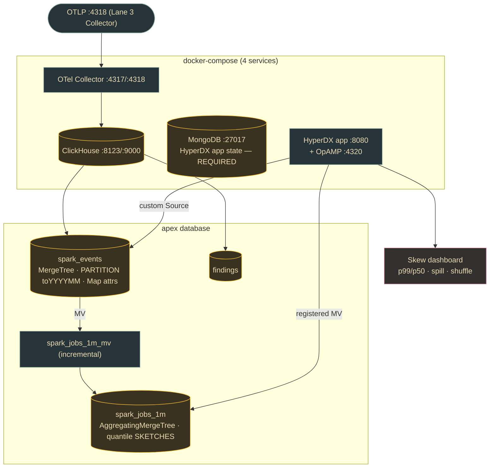

# Lane 4 — ClickStack: Store & Serving (ClickHouse + HyperDX)

> **Branch:** `feat/apex-infra` · **Language:** SQL / Docker Compose · **Depends on:** [`CONTRACT.md`](../../CONTRACT.md)
> **Hand this whole file to a coding agent.** Self-contained; the only external dependency is the frozen contract.

## Mission & exit criterion

Stand up **ClickStack (ClickHouse + HyperDX + OTel Collector + MongoDB)** as the storage + visualization backend. Ship the `apex` DDL: `spark_events` (MergeTree, monthly partitions, `Map` attributes, TTL), `findings`, an `AggregatingMergeTree` rollup `spark_jobs_1m` + incremental MV to roll stage rows up to job-level summaries, and canonical skew-detection SQL (p99/p50 via quantile sketches). Point HyperDX at the custom tables via a **custom Source**.

**Exit criterion:** `curl` an OTLP/HTTP payload → row lands in `apex.spark_events` → a HyperDX dashboard tile **and** a skew query both return it, traced end-to-end by `job_id`.

> 🔗 **Ownership boundary with Lane 3:** **Lane 4 owns the canonical `spark_events` + `findings` DDL** (it's the serving side). Lane 3's Materialized View (`mv_spark_events`) must `TO apex.spark_events` using *these* column names/types. If the two ever diverge, this file wins. Both trace back to [contract §2](../../CONTRACT.md#2-clickhouse-tables-the-store--lane-4-owns-ddl-everyone-reads).



## Key decisions (researched)

| Decision | Choice | Why |
|---|---|---|
| **Topology** | **docker-compose** (ClickHouse + HyperDX app + OTel Collector + MongoDB) as the buildable target; all-in-one only for smoke tests. | All-in-one bundles everything in ONE container (dev only) and **loses state on restart**. HyperDX **requires MongoDB** to persist dashboards/alerts/sources/users. |
| **Images** | `clickhouse/clickstack-*` (all-in-one, collector) + `clickhouse/hdx-oss-v2`. | Renamed in 2025 from `docker.hyperdx.io/hyperdx/*` — old names pull stale builds. |
| **`attributes` type** | `Map(String, String)` — **NOT** the beta JSON type. | ClickStack docs: JSON "not recommended for observability"; it's gated behind feature flags. `Map` is the proven type the OTel exporter uses. |
| **Rollup engine** | `AggregatingMergeTree` target + incremental MV using `*State`/`*Merge`; store **quantile sketches** (`quantilesState`), not final values. | Lets you query *any* percentile later (p50 + p99 from one sketch) and lets HyperDX auto-accelerate. |
| **HyperDX → custom table** | Create a **custom Source** (Team Settings → Sources), manually mapping `Timestamp=ts`, `Service=app_id`, `attributes=attributes`, `Trace Id=job_id`. | HyperDX auto-infers only the *default* OTel schema. `spark_events` is custom → every expression must be set explicitly or the source returns nothing. |
| **Rollup granularity** | 1-minute buckets (`toStartOfMinute`). | Composes cleanly with 15-min charts/alerts; **avoid 10-min** (incompatible with 15-min charts). |
| **MV column naming** | Strict `<aggFn>__<sourceColumn>` (`quantiles__task_duration_p99_ms`, `sum__shuffle_read_bytes`). | HyperDX auto-maps queries to MV columns by this convention; deviating breaks acceleration. |

## Build steps (with verify gates)

1. **Scaffold** (`clickstack/` with compose, `.env`, `otel-collector-config.yaml`, `sql/001..005`). → *Verify:* `docker compose config` parses; `ls sql/` shows 5 files.
2. **Smoke-test all-in-one** (confirm images pull + ports bind). → *Verify:* `:8080` shows HyperDX login; `curl :8123/ping` → `Ok.`
3. **Bring up compose** (ClickHouse, MongoDB, HyperDX app, collector; volumes). → *Verify:* all 4 healthy; login loads; collector logs OpAMP connection.
4. **Apply `apex` DDL** (001–004). → *Verify:* `system.tables WHERE database='apex'` lists `spark_events`, `findings`, `spark_jobs_1m`, `spark_jobs_1m_mv`.
5. **Collector routing to `apex`.** → *Verify:* POST a sample OTLP/HTTP to `:4318` → `count() FROM apex.spark_events` increments.
6. **HyperDX custom Source** (map the expressions). → *Verify:* Search returns rows; filter by `job_id` works.
7. **Register the rollup MV in HyperDX** (granularity 1min, min date = `min(ts)`). → *Verify:* a time tile shows the GREEN accelerated bolt; optimization modal names `spark_jobs_1m`.
8. **Skew dashboard + validate SQL** (005). → *Verify:* skew query returns stages with ratio > threshold; tile matches SQL for the same `job_id`.
9. **E2E trace check (exit).** → *Verify:* `SELECT job_id, count() … GROUP BY job_id` + matching HyperDX search + matching findings row, all one `job_id`.

## Task checklist (branch work items)

- [ ] **T1** — `docker-compose.yml` (4 services, volumes, OpAMP 4320, OTLP 4317/4318). *Accept:* all 4 healthy; login at `:8080`; `:8123/ping` → `Ok`.
- [ ] **T2** — `.env` (`HYPERDX_API_KEY`, DB `apex`, log level). *Accept:* no hardcoded secrets; `compose config` resolves.
- [ ] **T3** — `sql/002` `spark_events` MergeTree DDL (contract cols, `Map` attrs, `PARTITION toYYYYMM`, `ORDER BY (job_id, stage_id)`, TTL 90d, `plan_fingerprint FixedString(64)`). *Accept:* `DESCRIBE` shows every field; partition + TTL in `SHOW CREATE`.
- [ ] **T4** — `sql/003` `findings` DDL. *Accept:* `SHOW CREATE` includes partition + TTL; sample INSERT succeeds.
- [ ] **T5** — `sql/004` `AggregatingMergeTree` rollup + incremental MV (`<aggFn>__<col>` naming, `quantilesState(0.5,0.99)`). *Accept:* after inserts, `quantilesMerge(...)` returns finite p50/p99; MV auto-populates.
- [ ] **T6** — `sql/005` skew queries (raw + rollup, `nullIf` guards). *Accept:* seeded data → ≥1 flagged stage, no divide-by-zero.
- [ ] **T7** — `otel-collector-config.yaml` routing to `apex`. *Accept:* POST OTLP → row count increases; export logs OK.
- [ ] **T8** — Seed/fixture script (~50 rows, ≥2 `job_id`s, skewed stages). *Accept:* `count()`≥50, `uniq(job_id)`≥2, ≥1 over threshold.
- [ ] **T9** — Document HyperDX custom Source setup. *Accept:* README reproduces a working source; search filterable by `job_id`.
- [ ] **T10** — Document MV registration in HyperDX. *Accept:* time chart shows GREEN bolt; modal names `spark_jobs_1m`.
- [ ] **T11** — Skew dashboard definition. *Accept:* tiles match `sql/005` output for same job/window.
- [ ] **T12** — Healthcheck/verify script (exit criterion). *Accept:* exits 0, prints the single `job_id` threading `spark_events → spark_jobs_1m → findings`.
- [ ] **T13** — `clickstack/README.md` runbook. *Accept:* fresh clone → `up` → apply sql → working dashboard following only the README.

## Starter snippets

**`spark_events`** (MergeTree — serving side, canonical)
```sql
CREATE DATABASE IF NOT EXISTS apex;
CREATE TABLE IF NOT EXISTS apex.spark_events (
    job_id String, app_id String, stage_id Int32, attempt Int32,
    ts DateTime64(9) CODEC(Delta, ZSTD),
    shuffle_read_bytes UInt64, shuffle_write_bytes UInt64,
    spill_disk_bytes UInt64, spill_mem_bytes UInt64, gc_time_ms UInt64,
    task_count UInt32, task_duration_p50_ms UInt64, task_duration_p99_ms UInt64,
    peak_execution_mem_bytes UInt64, input_bytes UInt64, output_bytes UInt64,
    plan_fingerprint FixedString(64),          -- SHA-256 hex of NORMALIZED LOGICAL plan
    plan_json String CODEC(ZSTD(3)),
    attributes Map(String, String),
    INDEX idx_job job_id TYPE bloom_filter GRANULARITY 4
)
ENGINE = MergeTree
PARTITION BY toYYYYMM(ts)
ORDER BY (job_id, stage_id)
TTL toDateTime(ts) + INTERVAL 90 DAY DELETE
SETTINGS index_granularity = 8192;
```

**Rollup — `AggregatingMergeTree` + incremental MV (quantile sketches)**
```sql
CREATE TABLE IF NOT EXISTS apex.spark_jobs_1m (
    bucket DateTime, job_id String, app_id String,
    count__ SimpleAggregateFunction(sum, UInt64),
    sum__shuffle_read_bytes SimpleAggregateFunction(sum, UInt64),
    sum__spill_disk_bytes   SimpleAggregateFunction(sum, UInt64),
    max__gc_time_ms         SimpleAggregateFunction(max, UInt64),
    max__peak_execution_mem_bytes SimpleAggregateFunction(max, UInt64),
    quantiles__task_duration_p99_ms AggregateFunction(quantiles(0.5, 0.99), UInt64)
) ENGINE = AggregatingMergeTree ORDER BY (bucket, job_id, app_id);

CREATE MATERIALIZED VIEW IF NOT EXISTS apex.spark_jobs_1m_mv TO apex.spark_jobs_1m AS
SELECT toStartOfMinute(ts) AS bucket, job_id, app_id,
    countState() AS count__,
    sumSimpleState(shuffle_read_bytes) AS sum__shuffle_read_bytes,
    sumSimpleState(spill_disk_bytes)   AS sum__spill_disk_bytes,
    maxSimpleState(gc_time_ms)         AS max__gc_time_ms,
    maxSimpleState(peak_execution_mem_bytes) AS max__peak_execution_mem_bytes,
    quantilesState(0.5, 0.99)(task_duration_p99_ms) AS quantiles__task_duration_p99_ms
FROM apex.spark_events GROUP BY bucket, job_id, app_id;
```

**Skew detection — p99/p50 ratio**
```sql
-- Per-stage skew from raw events
SELECT job_id, stage_id, max(attempt) AS attempt,
    argMax(task_duration_p50_ms, ts) AS p50_ms,
    argMax(task_duration_p99_ms, ts) AS p99_ms,
    round(argMax(task_duration_p99_ms, ts) / nullIf(argMax(task_duration_p50_ms, ts), 0), 2) AS skew_ratio,
    sum(spill_disk_bytes) AS spill_disk_bytes
FROM apex.spark_events
WHERE ts >= now() - INTERVAL 6 HOUR
GROUP BY job_id, stage_id
HAVING skew_ratio > 5                 -- flag p99 > 5x median
ORDER BY skew_ratio DESC LIMIT 50;

-- From the rollup sketch (recompute p50/p99 from stored state)
SELECT bucket, job_id,
    quantilesMerge(0.5, 0.99)(quantiles__task_duration_p99_ms) AS q,
    round(q[2] / nullIf(q[1], 0), 2) AS p99_over_p50
FROM apex.spark_jobs_1m WHERE bucket >= now() - INTERVAL 24 HOUR
GROUP BY bucket, job_id HAVING p99_over_p50 > 4 ORDER BY p99_over_p50 DESC;
```

**`docker-compose.yml`** (skeleton)
```yaml
services:
  clickhouse:
    image: clickhouse/clickhouse-server:24.8
    ports: ["8123:8123", "9000:9000"]
    volumes: ["./.volumes/ch_data:/var/lib/clickhouse"]
    ulimits: { nofile: { soft: 262144, hard: 262144 } }
  db:                                   # MongoDB — REQUIRED for HyperDX app state
    image: mongo:6
    volumes: ["./.volumes/mongo:/data/db"]
  app:                                  # HyperDX UI + API
    image: clickhouse/hdx-oss-v2:latest
    depends_on: [db, clickhouse]
    ports: ["8080:8080", "4320:4320"]   # 4320 = OpAMP
    environment:
      MONGO_URI: mongodb://db:27017/hyperdx
      HYPERDX_API_KEY: ${HYPERDX_API_KEY}
  otel-collector:
    image: clickhouse/clickstack-otel-collector:latest
    depends_on: [clickhouse, app]
    ports: ["4317:4317", "4318:4318"]
    environment:
      CLICKHOUSE_ENDPOINT: http://clickhouse:8123
      HYPERDX_OTEL_EXPORTER_CLICKHOUSE_DATABASE: apex
      OPAMP_SERVER_URL: http://app:4320
# all-in-one (dev/smoke only):
#   docker run -p 8123:8123 -p 8080:8080 -p 4318:4318 clickhouse/clickstack-all-in-one:latest
```

## Pitfalls (verified — read before building)

- **Image names changed in 2025** — use `clickhouse/clickstack-*`, not `docker.hyperdx.io/hyperdx/*`.
- **All-in-one loses ALL state on restart** unless you mount `/data/db`, `/var/lib/clickhouse`. HyperDX stores dashboards/sources/users in **MongoDB**, not ClickHouse — use compose for anything real.
- **HyperDX auto-infers only the default OTel schema.** For `spark_events` (custom) you MUST set every source expression (Timestamp, Service, Implicit/Body, attributes) or the source silently returns nothing.
- **Incremental MVs are BETA and NOT auto-backfilled** — they only contain data inserted *after* creation. Set the source's "min date" correctly; avoid `POPULATE` (can miss rows).
- **MV columns must follow `<aggFn>__<sourceColumn>`** exactly or HyperDX can't auto-map.
- **Avoid 10-minute MV granularity** (incompatible with 15-min charts). Use 1-min or 1-hour.
- **Store quantile STATES, not finalized values** (`quantilesState`/`quantilesMerge`) — else you can only read the exact percentiles you materialized. Always `nullIf(p50, 0)` to avoid divide-by-zero.
- **`Map(String,String)`, not JSON** — JSON needs both `BETA_CH_OTEL_JSON_SCHEMA_ENABLED` + collector feature-gate and isn't recommended.
- **OpAMP (4320) is how HyperDX manages the collector** — omitting `OPAMP_SERVER_URL` on a standalone collector disables secure ingestion unless you set `OTLP_AUTH_TOKEN`.
- **`plan_fingerprint` = SHA-256 of the NORMALIZED LOGICAL plan** — use `FixedString(64)`; keep `plan_json` redacted + ZSTD (can be large).

## References
ClickStack docs (clickstack, architecture, getting-started/oss, config, materialized_views) · ClickHouse MergeTree / custom-partitioning / AggregatingMergeTree / incremental-MV / quantiles / Map docs · `clickhouseexporter` · Context7 `/websites/clickhouse`.
