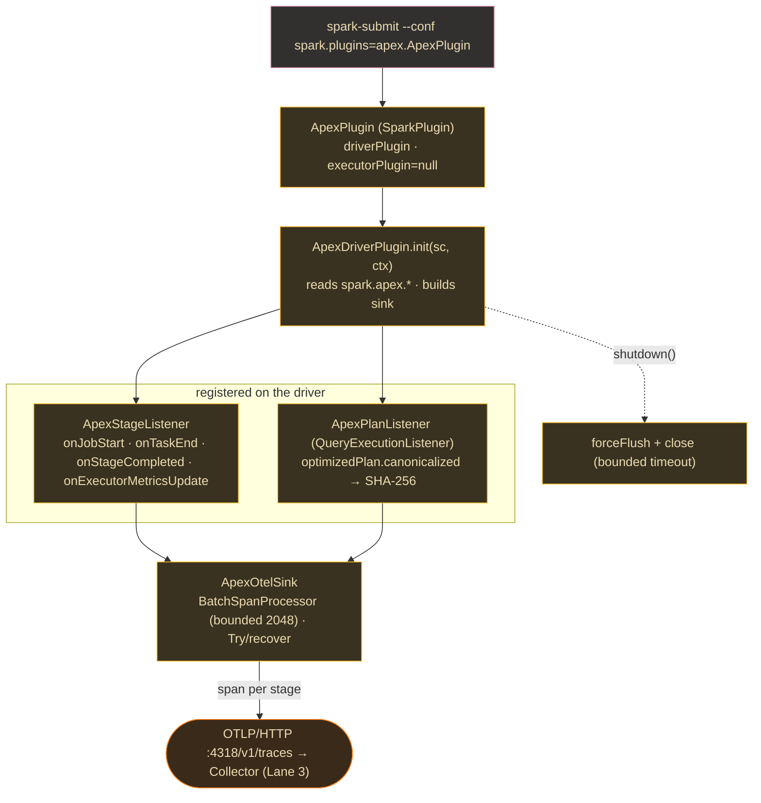

# Lane 2 — The JAR: Scala Spark Plugin (capture)

> **Branch:** `feat/apex-jar` · **Language:** Scala (sbt) · **Depends on:** [`CONTRACT.md`](../../CONTRACT.md)
> **Hand this whole file to a coding agent.** Self-contained; the only external dependency is the frozen contract.

> **Status note (2026-07-24):** This is the original build brief; its task
> checkboxes are intentionally historical. Delivery status and current E2E
> evidence are tracked in [`../convergence/C10-AUGUSTO-E2E-READINESS-2026-07-24.md`](../convergence/C10-AUGUSTO-E2E-READINESS-2026-07-24.md).

## Mission & exit criterion

Build a self-contained **Scala Spark plugin JAR** (modeled on sparkMeasure + DataFlint) that registers a `SparkListener` on the driver, aggregates per-stage `TaskMetrics` on `onStageCompleted`, captures a **SHA-256 fingerprint of the normalized LOGICAL plan** (`optimizedPlan.canonicalized` — not physical, to survive AQE re-optimization), and ships each event as an **OTLP span** via the OpenTelemetry Java SDK through a **bounded** `BatchSpanProcessor` queue so a slow/down collector never stalls the driver — every path wrapped in `Try/recover`.

**Exit criterion:** on `spark-submit --conf spark.plugins=apex.ApexPlugin`, every completed stage produces one OTLP event carrying the [contract §1](../../CONTRACT.md#1-the-telemetry-event-jar--collector) fields, landing as a row in `apex.spark_events` keyed by `job_id` — with **zero added driver latency** and **no driver crash if the collector is down**.



## Key decisions (researched)

| Decision | Choice | Why |
|---|---|---|
| **Activation** | **Primary:** `SparkPlugin` via `spark.plugins` (`DriverPlugin.init(sc, ctx)` gets the live `SparkContext` + `PluginContext`). **Fallback:** `spark.extraListeners=apex.ApexStageListener` (single-arg `SparkConf` ctor). | `init` gives a clean lifecycle (`shutdown` to flush the exporter) + config/appId access. `extraListeners` has no clean shutdown hook → lighter fallback. Both call `sc.addSparkListener`. |
| **Where metrics come from** | Aggregate in **`onStageCompleted`** from `stageInfo.taskMetrics` (already stage-summed). `onTaskEnd` → per-task durations for p50/p99 only. `onJobStart` → `stageId→jobId` map. **Live peak memory from `onExecutorMetricsUpdate`.** | `stageInfo.taskMetrics` is the exact per-task sum — free. **Critical:** `onStageExecutorMetrics` is **history-server-replay-only, never called live** — so live peak memory *must* come from `onExecutorMetricsUpdate.executorUpdates`. |
| **Plan fingerprint** | SHA-256 over `queryExecution.optimizedPlan.canonicalized.toString` (normalized LOGICAL). **Never** `executedPlan`/`sparkPlan`. | Physical plan is unstable under AQE (`AdaptiveSparkPlan` rewrites SMJ→BHJ at runtime; `isFinalPlan` flips mid-run). `.canonicalized` normalizes ExprIds so semantically-identical queries hash identically. Redact literals before storing `plan_json`. |
| **Transport** | `OtlpHttpSpanExporter` (http/protobuf) to `http://<collector>:4318/v1/traces`; one span per stage named `apex.stage`, contract fields as attributes, correlated by `job_id`. | OTLP/HTTP :4318 is the contract transport; the Collector's `clickhouseexporter` writes spans to MergeTree. Spans (not metrics) because the pipeline is *traced by job_id*. |
| **Backpressure** | `BatchSpanProcessor` with `setMaxQueueSize(2048)`, `setMaxExportBatchSize(512)`, `setScheduleDelay(1s)`, `setExporterTimeout(5s)`. Enqueue + all SDK calls in `Try`; on failure log-and-drop. `forceFlush`+`close` in `shutdown()` with bounded timeout. | Bounded queue **drops** (never blocks) when full → "slow listener never stalls the driver." Export runs on the SDK's own thread → `onStageCompleted` returns immediately. |
| **Cross-build** | `sbt-projectmatrix`: rows `(Spark 3.5 × Scala 2.12)`, `(3.5 × 2.13)`, `(4.0 × 2.13)`. Spark `Provided`. Artifacts carry the Spark version. | Spark 4.0 dropped Scala 2.12 (2.13 only, Java 17/21); 3.5 supports 2.12+2.13 (Java 8/11/17). `crossScalaVersions` can't vary the Spark dep per row — projectmatrix can. |

## Build steps (with verify gates)

1. **Scaffold sbt-projectmatrix** (3 cells, OTel BOM, Spark `Provided`, Java 11 for 3.5 / 17 for 4.0). → *Verify:* `sbt "+compile"` builds all three; `moduleName` shows `_3.5_2.12`/`_3.5_2.13`/`_4.0_2.13`.
2. **Implement `ApexStageListener`** (job map, task-duration buffer, stage-metric read, live peak mem). → *Verify:* local shuffle+spill query emits one event/stage with non-zero `shuffle_read_bytes`, `p50<=p99`.
3. **Implement plan fingerprint** (`QueryExecutionListener.onSuccess` → `optimizedPlan.canonicalized` → SHA-256, redact literals for `plan_json`). → *Verify:* same query with different literals + AQE on → **identical** fingerprint; different query → different.
4. **Implement `ApexOtelSink`** (bounded `BatchSpanProcessor`, `/v1/traces` full path, config keys). → *Verify:* against a local collector, spans arrive with all attrs; against a dead port, the job **still completes**, no exception, spans dropped.
5. **Wire `ApexPlugin` + shutdown flush** (+ `extraListeners` fallback ctor). → *Verify:* both `--conf spark.plugins=apex.ApexPlugin` and `--conf spark.extraListeners=apex.ApexStageListener` produce the same events.
6. **Provision Collector→ClickHouse + DDL** (coordinate with Lanes 3+4; DDL from contract §2). → *Verify:* `SELECT count() ... WHERE job_id='<id>'` equals the job's stage count; monthly partitions.
7. **Cross-publish to Maven** (sonatype metadata, `+publishSigned`, Jackson aligned, Spark/Jackson `Provided`). → *Verify:* `+publishLocalSigned` yields all 3 artifacts with provided-scope POMs.

## Task checklist (branch work items)

- [ ] **T1** — sbt-projectmatrix skeleton (3 cells, Spark provided, OTel BOM). *Accept:* `+compile` OK for all 3; suffixed artifact ids.
- [ ] **T2** — `ApexStageEvent` case class with **exactly** the contract fields. *Accept:* names match contract §1 verbatim; each maps to an OTel `AttributeKey`.
- [ ] **T3** — `onJobStart` stage→job mapping + capture `job_id`/`app_id`. *Accept:* 2-stage job populates the map; each stage resolves its `job_id`.
- [ ] **T4** — Aggregate stage metrics in `onStageCompleted`. *Accept:* shuffle+spill query → `shuffle_read_bytes>0`, `spill_mem_bytes>0`, `task_count==numTasks`.
- [ ] **T5** — p50/p99/max from `onTaskEnd` buffer keyed by `(stageId,attempt)`; clear after. *Accept:* known set → correct percentiles/max; buffer emptied.
- [ ] **T6** — Live peak memory via `onExecutorMetricsUpdate` (NOT `onStageExecutorMetrics`). *Accept:* memory-heavy stage → `peak_execution_mem_bytes>0` in a **live** run.
- [ ] **T7** — Normalized logical plan fingerprint + redacted `plan_json`. *Accept:* same query diff literals + AQE → identical; diff query → different.
- [ ] **T8** — Build OTel SDK + `OtlpHttpSpanExporter` (`/v1/traces`, `service.name`). *Accept:* local OTLP endpoint receives a span with resource `service.name`.
- [ ] **T9** — Bounded `BatchSpanProcessor` + `Try/recover`. *Accept:* collector down → 100-stage job completes, no exception, drops (wall-clock not inflated).
- [ ] **T10** — `ApexPlugin` + `DriverPlugin` lifecycle + shutdown flush. *Accept:* `spark.plugins` emits events; shutdown flushes within timeout.
- [ ] **T11** — `extraListeners` fallback ctor. *Accept:* `spark.extraListeners` produces identical events (minus clean flush).
- [ ] **T12** — OTel Collector config for ClickHouse (coordinate Lane 3). *Accept:* collector accepts a test span → row in `apex`.
- [ ] **T13** — ClickHouse DDL (contract §2) + attribute→column mapping. *Accept:* events queryable by `job_id`; monthly partitions.
- [ ] **T14** — End-to-end `job_id` trace test. *Accept:* `count() WHERE job_id=?` == stage count; `plan_fingerprint` populated.
- [ ] **T15** — Cross-publish 3 cells to Maven. *Accept:* `+publishLocalSigned` → 3 artifacts, provided-scope POMs.
- [ ] **T16** — README: both activation paths + every `spark.apex.*` key. *Accept:* copy-paste `spark-submit` for both paths.

## Starter snippets

**`ApexPlugin` (primary activation — `init` gets the live `SparkContext`)**
```scala
package apex
import org.apache.spark.SparkContext
import org.apache.spark.api.plugin.{DriverPlugin, ExecutorPlugin, PluginContext, SparkPlugin}
import java.util.{Collections, Map => JMap}

class ApexPlugin extends SparkPlugin {
  override def driverPlugin(): DriverPlugin = new ApexDriverPlugin
  override def executorPlugin(): ExecutorPlugin = null            // driver-side only
}
class ApexDriverPlugin extends DriverPlugin {
  private var sink: ApexOtelSink = _
  override def init(sc: SparkContext, ctx: PluginContext): JMap[String, String] = {
    val endpoint = sc.getConf.get("spark.apex.otlp.endpoint", "http://localhost:4318")
    sink = new ApexOtelSink(endpoint, sc.getConf.get("spark.apex.service.name", "apex-spark"))
    sc.addSparkListener(new ApexStageListener(sink, sc.applicationId))
    sc.listenerManager.register(new ApexPlanListener(sink))       // QueryExecutionListener
    Collections.emptyMap()
  }
  override def shutdown(): Unit = if (sink != null) sink.close()
}
// Activate:  --conf spark.plugins=apex.ApexPlugin
// Fallback:  --conf spark.extraListeners=apex.ApexStageListener   (needs a SparkConf ctor)
```

**Stage metric capture + LIVE peak memory**
```scala
override def onStageCompleted(e: SparkListenerStageCompleted): Unit = {
  val si = e.stageInfo; val tm = si.taskMetrics               // ALREADY summed across tasks
  val key = (si.stageId, si.attemptNumber())
  val durs = taskDur.remove(key).getOrElse(Nil).sorted
  sink.emit(ApexStageEvent(
    job_id = stageToJob.getOrElse(si.stageId, ""), app_id = appId,
    stage_id = si.stageId, attempt = si.attemptNumber(),
    ts = si.completionTime.getOrElse(System.currentTimeMillis()),
    shuffle_read_bytes  = tm.shuffleReadMetrics.totalBytesRead,
    shuffle_write_bytes = tm.shuffleWriteMetrics.bytesWritten,
    spill_disk_bytes = tm.diskBytesSpilled, spill_mem_bytes = tm.memoryBytesSpilled,
    gc_time_ms = tm.jvmGCTime, task_count = si.numTasks,
    task_duration_p50_ms = pct(durs, 0.50), task_duration_p99_ms = pct(durs, 0.99),
    task_duration_max_ms = durs.lastOption.getOrElse(0L),
    peak_execution_mem_bytes = math.max(tm.peakExecutionMemory, stagePeakMem.getOrElse(key, 0L)),
    input_bytes = tm.inputMetrics.bytesRead, output_bytes = tm.outputMetrics.bytesWritten,
    plan_fingerprint = planForStage.getOrElse(si.stageId, ""),
    plan_json = planJsonForStage.getOrElse(si.stageId, "")))
}
// onStageExecutorMetrics is HISTORY-SERVER-REPLAY-ONLY — use onExecutorMetricsUpdate for LIVE peak:
override def onExecutorMetricsUpdate(u: SparkListenerExecutorMetricsUpdate): Unit =
  u.executorUpdates.foreach { case ((stageId, attempt), m) => if (stageId >= 0)
    stagePeakMem.update((stageId, attempt),
      math.max(stagePeakMem.getOrElse((stageId, attempt), 0L), m.getMetricValue("JVMHeapMemory"))) }
```

**Normalized LOGICAL plan fingerprint (AQE-stable)**
```scala
class ApexPlanListener(sink: ApexOtelSink) extends QueryExecutionListener {
  override def onSuccess(fn: String, qe: QueryExecution, ns: Long): Unit = {
    val canonical = qe.optimizedPlan.canonicalized      // post-Catalyst LOGICAL, ExprIds normalized
    // Do NOT use qe.executedPlan/sparkPlan — AdaptiveSparkPlan rewrites them at runtime.
    sink.setPlanContext(sha256(canonical.toString), redact(canonical.treeString))
  }
  override def onFailure(fn: String, qe: QueryExecution, ex: Exception): Unit = ()
}
def sha256(s: String) = java.security.MessageDigest.getInstance("SHA-256")
  .digest(s.getBytes("UTF-8")).map("%02x".format(_)).mkString
```

**Bounded, non-blocking OTLP sink**
```scala
class ApexOtelSink(endpoint: String, service: String) {
  private val exporter = OtlpHttpSpanExporter.builder()
    .setEndpoint(s"$endpoint/v1/traces")   // MUST include full path; SDK does NOT append it
    .setTimeout(Duration.ofSeconds(5)).build()
  private val processor = BatchSpanProcessor.builder(exporter)
    .setMaxQueueSize(2048)                 // BOUNDED → drops when full, never blocks the driver
    .setMaxExportBatchSize(512).setScheduleDelay(Duration.ofSeconds(1)).build()
  private val sdk = OpenTelemetrySdk.builder().setTracerProvider(
    SdkTracerProvider.builder()
      .setResource(Resource.builder().put("service.name", service).build())
      .addSpanProcessor(processor).build()).build()
  private val tracer = sdk.getTracer("apex")
  def emit(ev: ApexStageEvent): Unit = Try {
    tracer.spanBuilder("apex.stage").startSpan()
      .setAttribute("job_id", ev.job_id).setAttribute("stage_id", ev.stage_id.toLong)
      .setAttribute("shuffle_read_bytes", ev.shuffle_read_bytes)
      .setAttribute("plan_fingerprint", ev.plan_fingerprint) /* ...all contract fields... */ .end()
  }.recover { case t => logger.warn(s"apex: dropped stage ${ev.stage_id}: ${t.getMessage}") }
  def close(): Unit = { Try(sdk.getSdkTracerProvider.forceFlush().join(5, TimeUnit.SECONDS)); Try(sdk.close()) }
}
```

## Pitfalls (verified — read before building)

- **`onStageExecutorMetrics` is NEVER called live** — only replayed by the History Server. Live peak memory **must** come from `onExecutorMetricsUpdate.executorUpdates` (keyed by `(stageId, attemptNum)`, read via `getMetricValue`). Confirmed Spark 3.5 + 4.0 Javadoc.
- **Do NOT fingerprint the physical plan.** Under AQE the root `AdaptiveSparkPlan`'s `isFinalPlan` flips false→true mid-run and nodes rewrite (SMJ→BHJ) — physical string differs run-to-run. Use `optimizedPlan.canonicalized`.
- **`optimizedPlan.canonicalized` still embeds literals** — hash it for the fingerprint but **redact literals before storing `plan_json`**, or you leak data.
- **`OtlpHttpSpanExporter.setEndpoint` does NOT append `/v1/traces`** — it stores the string as-is. Passing only `http://host:4318` POSTs to the wrong path and silently fails. Include the full path.
- **A `SparkListener` that throws is removed from the bus** (you lose all further events). Every metric read + OTLP call inside `Try/recover`.
- **Use `BatchSpanProcessor`, never `SimpleSpanProcessor`** — Simple exports synchronously on the calling thread and *will* stall the driver. Keep `setMaxQueueSize` bounded so full-queue drops instead of growing driver heap.
- **Spark 4.0 removed Scala 2.12** (2.13 only, Java 17/21); 3.5 = 2.12+2.13 (Java 8/11/17). Use `sbt-projectmatrix` rows (as Delta Lake does), not a single `crossScalaVersions`.
- **Keep Jackson aligned + `Provided`** (2.15.x for Spark 3.5) via `dependencyOverrides` — bundling/mismatching Jackson → `NoSuchMethodError` inside Spark. (sparkMeasure marks `jackson-module-scala` Provided for this.)
- **`stageInfo.taskMetrics` is the SUM across tasks** — don't re-sum `onTaskEnd` into the stage total (double-count). Use `onTaskEnd` only for the p50/p99 distribution.
- **`executorCpuTime` and `shuffleWriteMetrics.writeTime` are NANOseconds**; `jvmGCTime`/`executorRunTime` are already ms. Divide ns fields by 1e6 before emitting `*_ms` fields (sparkMeasure does this).

## References
Spark `SparkListener`/`DriverPlugin` Javadoc (3.5 + 4.0) · `LucaCanali/sparkMeasure` (build.sbt, StageInfoRecorderListener, FlightRecorder, TaskMetrics) · madhukaraphatak spark-plugin series · SPARK-47177 (AQE plan instability) · `open-telemetry/opentelemetry-java` (OtlpHttpSpanExporter, BatchSpanProcessor) · `opentelemetry-collector-contrib/clickhouseexporter` · ClickHouse "integrating OpenTelemetry" · Spark 4.0.1 building docs (Scala 2.13 only) · szakallas.net sbt-projectmatrix multi-Spark guide.
