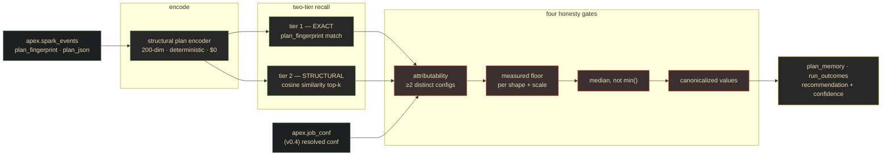

# Lane 7 — Cross-Job Plan Memory (memory)

> **Branch:** `feat/apex-memory` · **Language:** Python · **Depends on:** [`CONTRACT.md`](../../CONTRACT.md) v0.5
> **Status: AS-BUILT.** This brief documents the lane as shipped in v0.1, not work to be done.
> Implementation: [`../../memory/`](../../memory/) · 47 tests · [`../../memory/README.md`](../../memory/README.md)

## Mission & exit criterion

Answer one question the other lanes structurally cannot: **"have we seen this plan shape before,
and what configuration worked?"**

Every other lane reasons about a single run. `memory` reasons *across* runs — which is the only
way to distinguish *"this config is better"* from *"this run happened to be faster."*

**Exit criterion (met):** given a `job_id`, return prior runs of the same plan shape with a
recommended configuration and a confidence score that is **defensible** — with the lane refusing
to recommend anything when the evidence cannot support it.

**Delivered result:** HIGH confidence 0.9971 — 17 exact-fingerprint matches across 4 **distinct**
configurations, a real winning config, and a 69.2% improvement measured against a noise floor
derived from that shape's own repeated runs. Verified independently in SQL before being believed.



## Key decisions (researched)

### A structural encoder, not a text embedder

**Research basis:** [ZEST (arXiv 2503.03826)](https://arxiv.org/abs/2503.03826) — embed the
logical plan, take cosine-similarity top-k, average their configs. Reported **93.3% of the tuning
gain of one trial execution, at zero executions.**

**Decision:** a deterministic 200-dimensional **structural** encoder over operators, functions,
and plan edges — not a learned text embedding. Rationale: it costs $0, it is reproducible
byte-for-byte across runs (so a fingerprint is stable evidence rather than a model artifact), and
the signal genuinely is structural. A text embedder would add cost and nondeterminism without
addressing the actual limitation below.

### ZEST cold-start seeding: built, not seeded — and the claim is kept falsifiable

The upstream dataset at `s3://l6lab/sparktune/raw` returns **`403 AccessDenied`**. The loader is
implemented, but the live probe that proves the bucket is unreachable is **kept in the code** so
the claim cannot quietly become false. Cold-start seeding is therefore **not** a v0.1 capability,
and is not claimed as one.

### `median`, not `min()`, over prior runs

`min()` is a **biased estimator**: it drifts lower as history accumulates, so the "best config"
appears better the more data you collect — exactly backwards. Median over ≥2 runs is used
instead. This is subtle enough that most systems would ship the bug.

## The four honesty gates

These are the lane, more than the encoder is. Each became a **cross-lane contract rule**.

| Gate | Rule | Why |
|---|---|---|
| **Attributability** | fewer than **2 distinct configs** ⇒ any spread is variance, not effect | contract rule 3. An 18.65% spread on byte-identical work clears a 5.8% floor and would have shipped as a confident win **with nothing to credit it to** |
| **Canonicalization** | `'5.0'` ≡ `'5'`, but `'8m'` vs `'67108864b'` is a real 8× gap | contract rule 3. Counting one setting in two spellings **invents** config variation |
| **Measured floor** | per shape, per scale — never a global constant | contract rule 2. Re-measured over 65 cells / 308 runs: **median 15.9%, p90 76.4%, max 114.8%.** A distribution whose p90 is 5× its median is badly described by any single number |
| **Median over min** | ≥2 runs, median | avoids the biased estimator above |

The floor re-measurement explicitly ruled out JVM warmup **and** small-sample artifacts rather
than assuming either — which is what makes it usable as a contract rule.

## Pitfalls (verified — read before extending)

- **Six fingerprints collapse to cosine 1.0.** This is **not** an encoder defect: redaction
  erased the difference at source — six distinct MD5s with identical operators, functions, and
  edges. The exact tier covers it, and `n_distinct_fingerprints` keeps it visible. A text
  embedder would **not** fix this; only less aggressive redaction would.
- **The 69.2% is directionally right, magnitude-uncertain.** One lab, one shared host,
  within-config noise at median 15.9% / p90 76.4%. Contract rule 4 gives this the right
  vocabulary, but the corpus is still a single environment — **cross-host history** is what would
  firm it up.
- **`argMax(col, ts) AS col` is `ILLEGAL_AGGREGATION`** when referenced in `WHERE`. It fails
  *silently* in a broad `except`, making every floor read as unmeasured.
- **`FixedString(64)` returns `bytes`**, so `str(value)` yields `"b'11e45…'"` and every shape key
  silently misses — with no exception at all.

## Contract surface

Owns `apex.plan_memory` and `apex.run_outcomes` (ratified in contract v0.4;
`memory/sql/030_`, `031_`). DDL is **applied by [`infra/`](../../infra/)**, which owns
application — `memory` ships the canonical source, `infra` mirrors it byte-for-byte and
`make verify-ddl` enforces the match.

Reads `apex.spark_events` (fingerprint, plan) and `apex.job_conf` (the v0.4 resolved-config
allowlist — without it, attributability is unanswerable).

## Run it

```bash
make test-memory                                    # 47 tests, no infrastructure
cd memory && uv run python tools/recall_gate.py     # 28-check live gate (needs ClickHouse)
```

## References

- ZEST — [arXiv 2503.03826](https://arxiv.org/abs/2503.03826)
- [`../../CONTRACT.md`](../../CONTRACT.md) rules 2, 3, 4
- [`../../memory/README.md`](../../memory/README.md) — as-built detail
