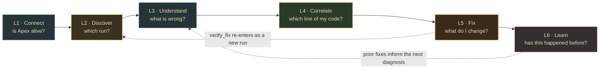

# SERVE lane — legs

> **Companion to [`SERVE.md`](SERVE.md).** `SERVE.md` is the frozen build brief for what
> already shipped (T1–T14, four tools). This file is the **forward plan**: the lane
> decomposed into six legs of user-facing work, each broken into candidate features.
> **Snapshot:** 2026-08-12 · branch `feat/base-project-e2e` · head `093c677` · 87 tests green.

## What the lane is today

| | |
|---|---|
| **Shipped** | `apex-mcp` — stdio MCP server, four tools: `analyze_run`, `compare_runs`, `search_kb`, `suggest_fix` |
| **Proven** | contract DDL conformance, `argMax` latest-attempt, param binding vs `' OR 1=1 --`, injection hardening, `applied=False` as `Literal[False]`, cross-validated `21.62x` skew against the engine lane's independent watcher |
| **Code** | `src/apex_mcp/{server,ch,models,diagnose}.py` — 1832 LOC · tests 1133 LOC · two live gates |

## The user we are building for

A Spark/data engineer whose job got slow, working inside an MCP client (Claude Code /
Cursor / Codex). Apex's promise is **non-intrusive code↔execution correlation**. Every
feature below is judged against one question:

> *Does this shorten the distance between "this job is slow" and "this line is why"?*

## Two structural facts that shape every leg

1. **`create_server()` registers four `@mcp.tool` and nothing else** (`server.py:51-149`).
   No MCP `resources`, no `prompts`. Apex uses one of the protocol's primitives.
2. **Every tool takes a `job_id` the user must already possess.** `ReadStore` exposes
   `stages` / `findings` / `plan_transitions` / `search` (`ch.py:206-254`) — there is no
   "list runs", no lookup by `app_name` or time. **The lane can diagnose a run but cannot
   help you find one.**



---

## L1 · Connect — "is Apex alive?"

**Today:** five env vars; `uvx --from <path>` because the package is not on PyPI; a
deliberately lazy client (`ch.py:302`) so the server finishes `initialize` and lists its
tools even when ClickHouse is down. Correct for protocol reasons — and it means a
misconfigured user sees four healthy-looking tools that fail on every call.

| # | Feature | Note |
|---|---|---|
| F1.1 | `apex_status()` — connected, database, run count, latest ingest age, contract columns present | the first call any user makes; today there isn't one |
| F1.2 | Publish to PyPI → plain `uvx apex-mcp` | removes `--from`; listed as a known limit in `VALIDATION.md` |
| F1.3 | Connection errors that name the missing setting | `_sanitize()` (`ch.py:274`) correctly hides the password — it also hides the fix |
| F1.4 | Root `.mcp.json` + Cursor/Codex parity | the file exists in `serve/`, not at the repo root where clients look |

→ Broken into atomic tasks in [`L1_tasks.md`](L1_tasks.md).

---

## L2 · Discover — "which run?"  ← **the unlock**

**Today:** nothing. Every entry point demands a `job_id` that must come from outside
Apex. This is the single highest-leverage leg: no other leg is reachable without it.

| # | Feature | Note |
|---|---|---|
| F2.1 | `list_runs(limit, since, app_name?, status?)` | recent runs with health at a glance |
| F2.2 | `find_run(app_name)` | "my nightly_etl" — `app_name` is already a column on `spark_events` |
| F2.3 | `latest_run()` | "what just ran?" |
| F2.4 | `apex://runs` as an MCP **resource** | browsable without spending a tool call |
| F2.5 | Auto-baseline: last healthy run, same `app_name` + `plan_fingerprint` | makes `compare_runs` usable with one argument instead of two |

**Safety note:** `list_runs` / `find_run` introduce new *user-influenced* query surfaces.
They inherit the server-side parameter binding discipline already enforced by
`tests/test_ch.py`; no f-string may reach a `WHERE` clause.

---

## L3 · Understand — diagnosis readability

**Today:** `analyze_run` is strong — `status="not_found"` is already distinct from
`"healthy"` (`diagnose.py:279`), AQE ground truth is narrated, `untrusted_fields` marks
observed text as data. The UX problem is **volume**: the real P0 run returns 17 stages
plus every finding in one payload.

| # | Feature | Note |
|---|---|---|
| F3.1 | `detail` level — `summary` / `stages` / `full` | the default answer should be three lines, not 17 stages |
| F3.2 | Coverage + freshness in the payload | turns "healthy" into "healthy, **and here is what I actually saw**" |
| F3.3 | `explain_stage(job_id, stage_id)` | drill-down instead of one fat response |
| F3.4 | Critical-path framing | `analyze()` already sums `p99_ms` as tail time — surface it as a path, not a list |

---

## L4 · Correlate — "which line of my code did this?"

The north star, and the thinnest part of the lane. serve is where the correlation
*surfaces*, but the linkage is earned upstream in the jar and contract lanes.

| # | Feature | Note |
|---|---|---|
| F4.1 | Stage → source line / notebook cell | the actual Apex thesis |
| F4.2 | Per-`stage_id` plan-transition linkage | today `(job_id, execution_id)`; flagged as a contract enhancement in `VALIDATION.md` |
| F4.3 | "AQE did X, your config says Y" | `_apply_ground_truth()` (`diagnose.py:224`) already knows the difference |

**Blocked on:** contract work outside this lane. Sequence it last.

---

## L5 · Fix — close the loop

**Today:** `suggest_fix` returns a diff and a PR body, then stops. Correct, and an
incomplete *experience*: the human applies it, reruns, and is on their own. The generated
PR body already asks for a `compare_runs` re-check **by hand**.

| # | Feature | Note |
|---|---|---|
| F5.1 | `verify_fix(before_job_id, after_job_id)` | thin framing over `compare_runs` — "did it work?" |
| F5.2 | Surface confidence provenance | `source=findings_table` vs heuristic exists internally; the user never sees which |
| F5.3 | Ranked candidate fixes | one recipe today |
| F5.4 | MCP **prompts** → `/apex:diagnose`, `/apex:fix` | slash commands in the client instead of tool-call archaeology |

---

## L6 · Learn — memory across runs

**Today:** `search_kb` is LIKE/token search over `findings` + redacted `plan_json`
(`ch.py:125-183`). The embedding path is a declared, unimplemented interface.

| # | Feature | Note |
|---|---|---|
| F6.1 | Implement the embedding backend | the interface is already pluggable |
| F6.2 | "This happened before, here is what fixed it" | auto-link finding → prior occurrence → applied remedy |
| F6.3 | Fleet view: recurring symptoms across apps | the compounding-value feature |

---

## Cross-cutting rail — the safety guarantees stay visible

Not a leg; an invariant no leg may break.

- `applied` is `Literal[False]` — a suggestion claiming otherwise **cannot be constructed**.
- Observed Spark text stays in typed data fields; `tests/test_injection_hardening.py`
  patches `subprocess.*`, `os.system/popen/remove/unlink/rmdir` and write-mode `open()`
  to fail the test if any is called.
- Driver exceptions are replaced with short codes — the password, host and port of the
  connection string never reach the model.
- **stdout is the JSON-RPC channel.** Nothing in `src/apex_mcp/` may `print()`.

Every new tool inherits the read-only annotation discipline and the param-binding tests.

---

## Sequencing

| Order | Leg | Why here |
|---|---|---|
| 1 | **L2 Discover** | the lane is unusable without a `job_id` sourced from outside the system |
| 2 | **L1 Connect** | cheap, and it is the first thing a new user hits |
| 3 | **L3 Understand** | payload volume is the loudest complaint once people can actually reach a run |
| 4 | **L5 Fix** | `verify_fix` is a thin wrapper with outsized value |
| 5 | **L6 Learn** | compounding, but needs run volume first |
| 6 | **L4 Correlate** | depends on contract/jar work outside this lane |

**L1 is being built first by decision**, ahead of L2 — see [`L1_tasks.md`](L1_tasks.md).

---

## Correction to a standing document

`docs/WEAKNESSES-AND-OPEN-QUESTIONS.md:83` records *"`serve`: `analyze_run` returns an
empty diagnosis"* for a dropped `job_id` (W1). **That is stale.** `diagnose.analyze()`
returns `status="not_found"` with an explicit message, distinct from `"healthy"`:

```python
# diagnose.py:279
if not stages:
    return Diagnosis(job_id=job_id, status="not_found", summary=(
        "No stage telemetry exists for this job_id. Check the id, or "
        "confirm the jar/collect lanes shipped this run."))
```

W1 remains real for the **engine** lane and for the six-lane gate. It is not a serve
defect and should not be scheduled here.
