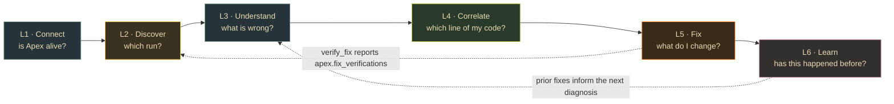

# SERVE lane — legs

> **Companion to [`SERVE.md`](SERVE.md).** `SERVE.md` is the frozen build brief for what
> already shipped (T1–T14). This file is the **forward plan**: the lane
> decomposed into six legs of user-facing work, each broken into candidate features.
> **Snapshot:** 2026-08-12 · branch `feat/base-project-e2e` · head `093c677` · 87 tests green.

## What the lane is today

| | |
|---|---|
| **Shipped** | `apex-mcp` — stdio MCP server, eight tools (`analyze_run`, `explain_stage`, `compare_runs`, `list_runs`, `search_kb`, `recall_similar_runs`, `verify_fix`, `suggest_fix`) and one resource (`apex://runs`) |
| **Proven** | contract DDL conformance, `argMax` latest-attempt, param binding vs `' OR 1=1 --`, injection hardening, `applied=False` as `Literal[False]`, cross-validated `21.62x` skew against the engine lane's independent watcher |
| **Code** | `src/apex_mcp/{server,ch,models,diagnose}.py` — 1832 LOC · tests 1133 LOC · two live gates |

## The user we are building for

A Spark/data engineer whose job got slow, working inside an MCP client (Claude Code /
Cursor / Codex). Apex's promise is **non-intrusive code↔execution correlation**. Every
feature below is judged against one question:

> *Does this shorten the distance between "this job is slow" and "this line is why"?*

## Two structural facts that shape every leg

1. **`create_server()` registers four `@mcp.tool` and nothing else** (`server.py:51-149`).
   No MCP `resources`, no `prompts`. Apex uses one of the protocol's primitives.
2. **Every tool takes a `job_id` the user must already possess.** `ReadStore` exposes
   `stages` / `findings` / `plan_transitions` / `search` (`ch.py:206-254`) — there is no
   "list runs", no lookup by `app_name` or time. **The lane can diagnose a run but cannot
   help you find one.**



---

## L1 · Connect — "is Apex alive?"

**Today:** five env vars; `uvx --from <path>` because the package is not on PyPI; a
deliberately lazy client (`ch.py:302`) so the server finishes `initialize` and lists its
tools even when ClickHouse is down. Correct for protocol reasons — and it means a
misconfigured user sees four healthy-looking tools that fail on every call.

| # | Feature | Note |
|---|---|---|
| F1.1 | `apex_status()` — connected, database, run count, latest ingest age, contract columns present | the first call any user makes; today there isn't one |
| F1.2 | Publish to PyPI → plain `uvx apex-mcp` | removes `--from`; listed as a known limit in `VALIDATION.md` |
| F1.3 | Connection errors that name the missing setting | `_sanitize()` (`ch.py:274`) correctly hides the password — it also hides the fix |
| F1.4 | Root `.mcp.json` + Cursor/Codex parity | the file exists in `serve/`, not at the repo root where clients look |

→ Broken into atomic tasks in [`L1_tasks.md`](L1_tasks.md).

---

## L2 · Discover — "which run?"  ✅ **DELIVERED** (branch `serve/l2-discover`)

**Was:** nothing. Every entry point demanded a `job_id` that had to come from outside
Apex. This was the single highest-leverage leg: no other leg was reachable without it.

| # | Feature | Delivered as |
|---|---|---|
| F2.1 | `list_runs(limit, since, app_name?, status?)` | ✅ `list_runs(limit, since_hours, app_name)` |
| F2.2 | `find_run(app_name)` | ✅ **subsumed** — `list_runs(app_name=…)` |
| F2.3 | `latest_run()` | ✅ **subsumed** — `list_runs(limit=1)` |
| F2.4 | `apex://runs` as an MCP **resource** | ✅ the lane's first resource |
| F2.5 | Auto-baseline: same `app_name` + `plan_fingerprint` | ✅ `compare_runs` with `baseline_job_id` optional |

**Why three features became one tool.** `find_run` and `latest_run` differ from
`list_runs` only by a `WHERE` clause and a `LIMIT`. Tool names are flat across every
server a client has loaded, and each tool is another user-influenced surface on
something a model can call. One filtered tool expresses all three; three tools would
have been API bloat bought with three injection surfaces.

**Auto-baseline refuses rather than guesses.** With no prior run sharing the current
plan shape, `compare_runs` returns `not_comparable` and says why. Comparing across a
plan change measures the plan, not the regression, and a silently wrong baseline
produces a confident wrong answer — the exact failure this lane exists to prevent.

**Safety.** `app_name` is set by the observed Spark job and now reaches both a `WHERE`
clause and the model's context. It binds server-side, is echoed only inside typed
fields, and never into a string Apex composes. Proven live: `' OR 1=1 --` returns 0 rows.

**What the live gate caught that no fake could.** Two defects survived a green unit
suite — a SQL alias collision that made every filtered query fail, and a
`datetime`/`str` mismatch that made every real row fail validation. `FakeClient` does
not parse SQL and every fake supplied string timestamps. See
[`serve/VALIDATION.md`](../../serve/VALIDATION.md).

**Follow-up:** `RUNS_SQL` does not carry `plan_fingerprint`, so auto-baseline costs up
to 10 extra stage queries. Adding it collapses that to one.

---

## L3 · Understand — diagnosis readability

**Was:** `analyze_run` was already strong — `status="not_found"` distinct from
`"healthy"`, AQE ground truth narrated, `untrusted_fields` marking observed text as
data. The UX problem was **volume**: the real P0 run returned 17 stages plus every
finding in one payload.

| # | Feature | Delivered as |
|---|---|---|
| F3.1 | `detail` level — `summary` / `stages` / `full` | ✅ `analyze_run(job_id, detail="summary")`, defaulting to the verdict |
| F3.2 | Coverage + freshness in the payload | ✅ `Diagnosis.coverage` on every verdict path |
| F3.3 | `explain_stage(job_id, stage_id)` | ✅ the lane's sixth tool |
| F3.4 | Critical-path framing | ✅ `StageView.tail_share` + `Diagnosis.tail_dominant_stage_ids` |

**One analysis, three widths.** `diagnose.trim()` narrows an already-computed
`Diagnosis`; it never re-analyses. Two callers asking at different detail levels
therefore cannot be handed different verdicts for the same run, and `full` is
literally the identity, so the widest payload cannot drift from `analyze()`'s own
output.

**A trimmed array is not an empty one.** Every narrowed level appends a note naming
what was dropped and how much of it there was. Without it, `findings: []` at summary
reads as "engine found nothing" — the opposite of the truth for the run that motivated
the work. `coverage` survives every level for the same reason.

**"Healthy" now says what it saw.** `Diagnosis.coverage` reports stages observed,
findings observed, transitions observed and the age of the newest event. That closes
W1, where a dropped `job_id` and a genuinely clean run produced the same confident
verdict. The age is **reported and never judged**: a nightly batch and a streaming job
disagree about what an hour means, so Apex owns no staleness threshold and a false
"stale" would be worse than no claim.

**Share of tail, not a critical path.** `analyze()` already summed `p99_ms` to rank
stages and then threw the shape away. It is surfaced as each stage's share of the tail
plus the smallest set owning most of it — and deliberately **not** called a critical
path, in the field descriptions and in the note. Stages overlap, and `p99` is a
per-task percentile standing in for stage wall time the contract does not carry. A
flat run names nothing rather than nominating whichever stage came first in a tie.

**Follow-up:** `STAGES_SQL` resolves each column with `argMax(col, ts)` and projects no
`ts`, so `coverage.newest_event_age_seconds` is `null` on the live path today. Null
reads UNKNOWN, not fresh, and the payload says so. Projecting a `ts` in `ch.py` closes
it — outside the write surface of the unit that surfaced it.

---

## L4 · Correlate — "which line of my code did this?"

The north star, and the thinnest part of the lane. serve is where the correlation
*surfaces*, but the linkage is earned upstream in the jar and contract lanes.

| # | Feature | Note |
|---|---|---|
| F4.1 | Stage → source line / notebook cell | the actual Apex thesis |
| F4.2 | Per-`stage_id` plan-transition linkage | today `(job_id, execution_id)`; flagged as a contract enhancement in `VALIDATION.md` |
| F4.3 | "AQE did X, your config says Y" | `_apply_ground_truth()` (`diagnose.py:224`) already knows the difference |

**Blocked on:** contract work outside this lane. Sequence it last.

---

## L5 · Fix — close the loop  *(shipped 2026-08-20, branch `serve/l5-fix`)*

> **Read this before touching L5.** The original plan below assumed serve would build
> `verify_fix` itself, as a thin framing over `compare_runs`. **That was wrong, and
> building it would have duplicated an entire lane.** The [`verify/`](VERIFY.md) lane
> already predicts, replays and safety-gates proposed fixes — 105 tests — and already
> writes its verdicts to **`apex.fix_verifications`** (contract v0.3, additive; DDL owned
> by verify, applied by infra). L5 is the **MCP surface over that table**, not a second
> implementation of the judgement it holds.

**The integration surface is `apex.fix_verifications`, not an import.** serve reads the
verify lane's verdicts exactly the way it reads the engine lane's findings out of
`apex.findings`: through ClickHouse. `serve/pyproject.toml` still depends only on `mcp`,
`clickhouse-connect` and `pydantic`, and a test greps the package to keep it that way.

**What shipped:**

| # | Feature | Status |
|---|---|---|
| F5.1 | `verify_fix(job_id, finding_id?)` → `FixVerdict` | **done** — reads `apex.fix_verifications`; reports the predicted range, any replayed measurement, the safety verdict and the confidence. Read-only. It reports a judgement; it does not make one |
| F5.2 | Surface confidence provenance | **done** — `suggest_fix` now carries the verification for its finding. A fix the verify lane **refused** leads the warnings and gets **no diff**: proposing a fix verify refused is the worst output this lane can produce |
| F5.3 | Ranked candidate fixes | still one recipe |
| F5.4 | MCP **prompts** → `/apex:diagnose`, `/apex:fix` | not started |

**Three distinctions the surface must keep** (collapsing any of them loses the point):

- `status="not_assessed"` ≠ "the fix is fine". No row means nothing was predicted and
  nothing was measured — an absence of evidence.
- `blocked=true` ≠ low confidence. A safety block is a refusal to **execute**; it is its
  own field and it leads the summary.
- `measured_delta_pct = null` ≠ `0.0`. Null means never replayed; `0.0` means replayed
  and unchanged.

**Deltas are SIGNED and negative means FASTER**, per the v0.3 DDL. The interval bounds are
ordered numerically, so `predicted_low_pct` is the *most* improvement. Every delta field
states the convention in its published JSON-schema description, because that description
is what a client actually reads. `diagnose._delta_phrase()` is the only place the sign is
turned into words.

`apex.fix_verifications` is additive, so `ReadStore.table_exists()` probes it once and a
pre-v0.3 cluster degrades to `not_assessed` instead of failing the call.

**Still open:** neither live gate has been run against a cluster with the v0.3 DDL
applied, so `VERIFICATIONS_SQL` has not yet met a real ClickHouse parser — the same class
of defect that L2 only found live.

---

## L6 · Learn — memory across runs  ✅ **DELIVERED** (branch `serve/l6-learn`)

**Was:** every tool on this server reasoned about exactly one run. `search_kb` is
LIKE/token search over `findings` + redacted `plan_json`, which finds *text*, not
*shapes* — it cannot answer "have we run this plan before, and what did it do".

**The correction this leg records.** The earlier plan for L6 read *"implement the
embedding backend"*. That work already exists, in the **memory lane**: a
structural encoder, an L2-normalised embedding table, a measured similarity
threshold and a measured per-shape noise floor. Building a second one here would
have duplicated a lane with 47 tests and produced a second, disagreeing answer to
the same question. **L6 is an MCP surface over the memory lane, not a
reimplementation.**

| # | Feature | Delivered as |
|---|---|---|
| F6.1 | Implement the embedding backend | ❌ **withdrawn** — the memory lane owns encoding; serve reads its output |
| F6.2 | "This happened before, here is what fixed it" | ✅ `recall_similar_runs(job_id, top_k, noise_floor_pct?)` |
| F6.3 | Fleet view: recurring symptoms across apps | deferred — needs run volume, and the read layer it would sit on now exists |

**The integration surface is the contract, not an import.** serve reads
`apex.plan_memory` (one row per plan shape, carrying an L2-normalised
`embedding` and the decoded features that let a human say *why* two plans
matched) and `apex.run_outcomes` (one row per shape per run: the six typed
config columns, the wall clock, and how it went). It imports nothing from the
memory lane, so this package still depends only on `mcp`, `clickhouse-connect`
and `pydantic`. Similarity is computed **in ClickHouse** — the embedding is
already normalised, so `1 - cosineDistance` is the cosine similarity and serve
needs no encoder of its own. The embedding width is read from the queried
shape's own `dim` rather than assumed; the encoder's width is the memory lane's
to change.

**Both tables are contract v0.3 ADDITIVE**, so a cluster that has not applied
them is a normal older deployment. Every read degrades to empty and the tool
answers `memory_unavailable` — *no history to read*, which is a different fact
from *no history*. Only a missing schema degrades: a store that is **down**
still raises, because answering "no prior runs" for an unreachable ClickHouse
would be a lie in the one place this lane cannot afford one.

**The floor rule is the whole leg.** Cross-run memory is worth having only if it
distinguishes *this config is better* from *this run happened to be faster*.
Rank a shape's prior runs by wall clock and the top row **looks** like the best
configuration when nothing of the sort has been measured. So prior runs are
reported as measurements, and `better` is reachable only through a
caller-supplied `noise_floor_pct` measured for this shape at this scale
(CONTRACT.md rule 2) — and then only when the history holds two distinct
**captured** configurations to credit the difference to (rule 3). Below the
floor the answer is "indistinguishable from run-to-run variation", which is not
"no change".

**Honest provenance.** `config_source` never defaults to `observed`. Apex
captures no SparkConf today — the v0.3 DDL says so explicitly — so most
`run_outcomes` rows are `unknown` and carry a `config_unavailable` note instead
of six nulls a reader could skim as "defaults". Closing that gap is a jar-lane
change, not this lane's.

**Retrieval is two-tiered and says which tier it used.** EXACT
`plan_fingerprint` equality needs no embedding at all and is the strongest
evidence available; STRUCTURAL similarity means the plans are indistinguishable
after redaction, which is weaker and is labelled. Neighbours below the
similarity threshold are dropped rather than returned as the nearest available
thing — when nothing matches, the honest answer is that nothing matches.

**Follow-up:** the tool takes `noise_floor_pct` from the caller. The memory lane
already computes a per-shape floor from its own history; wiring serve to read it
would close the last manual step, and needs a contract surface for the figure.

---

## Cross-cutting rail — the safety guarantees stay visible

Not a leg; an invariant no leg may break.

- `applied` is `Literal[False]` — a suggestion claiming otherwise **cannot be constructed**.
- Observed Spark text stays in typed data fields; `tests/test_injection_hardening.py`
  patches `subprocess.*`, `os.system/popen/remove/unlink/rmdir` and write-mode `open()`
  to fail the test if any is called.
- Driver exceptions are replaced with short codes — the password, host and port of the
  connection string never reach the model.
- **stdout is the JSON-RPC channel.** Nothing in `src/apex_mcp/` may `print()`.

Every new tool inherits the read-only annotation discipline and the param-binding tests.

---

## Sequencing

| Order | Leg | Why here |
|---|---|---|
| 1 | **L2 Discover** | the lane is unusable without a `job_id` sourced from outside the system |
| 2 | **L1 Connect** | cheap, and it is the first thing a new user hits |
| 3 | **L3 Understand** | payload volume is the loudest complaint once people can actually reach a run |
| 4 | **L5 Fix** ✅ | `verify_fix` is a thin wrapper with outsized value — over the *verify lane*, not over `compare_runs` (**shipped**) |
| 5 | **L6 Learn** ✅ | compounding, and delivered ahead of its slot once the memory lane made it a read rather than a build |
| 6 | **L4 Correlate** | depends on contract/jar work outside this lane |

**L1 is being built first by decision**, ahead of L2 — see [`L1_tasks.md`](L1_tasks.md).

---

## Correction to a standing document

`docs/WEAKNESSES-AND-OPEN-QUESTIONS.md:83` records *"`serve`: `analyze_run` returns an
empty diagnosis"* for a dropped `job_id` (W1). **That is stale.** `diagnose.analyze()`
returns `status="not_found"` with an explicit message, distinct from `"healthy"`:

```python
# diagnose.py:279
if not stages:
    return Diagnosis(job_id=job_id, status="not_found", summary=(
        "No stage telemetry exists for this job_id. Check the id, or "
        "confirm the jar/collect lanes shipped this run."))
```

W1 remains real for the **engine** lane and for the six-lane gate. It is not a serve
defect and should not be scheduled here.
