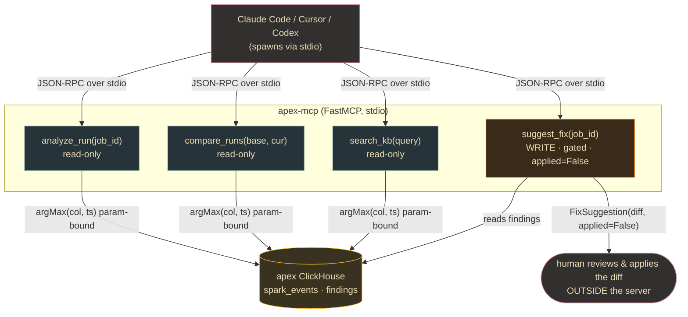

# Lane 6 — The MCP Server (serve)

> **Branch:** `feat/apex-serve` · **Language:** Python (FastMCP + clickhouse-connect) · **Depends on:** [`CONTRACT.md`](../../CONTRACT.md)
> **Hand this whole file to a coding agent.** Self-contained; the only external dependency is the frozen contract.
> **Buildable early against synthetic rows** — like Lane 5, this reads ClickHouse, so it works on `fixtures/sample_event.json` before the JAR/collector are real.

## Mission & exit criterion

Build `apex-mcp` — a Python **stdio MCP server** (packaged as a `uvx`-installable console script) exposing Apex's Spark-diagnosis capabilities to any MCP client (Claude Code / Cursor / Codex). It reads the shared `apex` ClickHouse DB via `clickhouse-connect` and exposes **four tools**: three read-only (`analyze_run`, `compare_runs`, `search_kb`) and one **confidence-gated WRITE tool** (`suggest_fix`) that **NEVER auto-applies** — it returns a proposed unified diff + PR body as data and always requires human approval.

**Exit criterion:** a user runs one `claude mcp add --scope user --transport stdio apex -- uvx apex-mcp`, restarts the client, and can call `analyze_run("ax151sasadds114")` for a structured diagnosis sourced from ClickHouse — while `suggest_fix` returns a diff that is **never written to disk or git**.



## Key decisions (researched)

| Decision | Choice | Why |
|---|---|---|
| **MCP SDK** | Official Anthropic SDK's **bundled FastMCP**: `from mcp.server.fastmcp import FastMCP`, dep `mcp[cli]>=1.27,<2` (stable 1.28.1). **Pin `<2`.** | v1.x is the only stable line. **v2 (alpha) renames `FastMCP`→`MCPServer` and moves types to `mcp_types`** — every alpha is breaking. The separate PyPI `fastmcp` 3.x has a different import root; the SDK-bundled one is least-surprise across all three clients. |
| **Transport** | stdio (`mcp.run(transport="stdio")`). | Canonical local transport all three clients spawn as a subprocess; no port, no OAuth, works with `uvx`. |
| **Packaging** | PEP 621 `[project.scripts] apex-mcp = "apex_mcp.server:main"`; users run `uvx apex-mcp`; register via `claude mcp add`. | Console-script + `uvx` = the single-command install; `uvx` builds an ephemeral isolated env. `--scope user` → available in every project. |
| **ClickHouse client** | `clickhouse-connect>=1.4,<2`; `client.query(sql, parameters={...})` **server-side binding**. | Official driver; parameterized queries are **mandatory** — a `job_id` can be model/user-influenced → injection surface. |
| **Read vs write safety** | 3 read tools annotated `read_only_hint=True`; `suggest_fix` returns a `FixSuggestion` (diff + confidence), does **NO fs/git writes**, `applied=False`, `requires_human_approval=True`; `min_confidence` gate (0.75) downgrades to advisory. | MCP spec + OWASP: write/irreversible actions must be human-in-the-loop. The approval step is also the **primary defense against indirect prompt injection** — an injected instruction that can't execute without approval can't silently act. |
| **Structured output** | Every tool returns a Pydantic model; FastMCP auto-generates the output schema. | Schema-constrained output is an OWASP mitigation against tool-poisoning — lets the client reject malformed responses; free-text injected instructions can't ride along. |
| **`search_kb` backend** | Query ClickHouse `findings`/KB first (LIKE/token over redacted `plan_json` + finding text); embedding path left as a pluggable interface. | Keeps v1 self-contained against the shared `apex` store; no separate vector DB needed to ship. |

## Build steps (with verify gates)

1. **Scaffold uv project + pyproject** (`src/apex_mcp/{server,ch,models,diagnose}.py`; console-script entry). → *Verify:* `uv run apex-mcp` blocks on stdin with **nothing on stdout** (stdout is the JSON-RPC channel); `uv build` → wheel.
2. **ClickHouse layer (`ch.py`)** (env config, `argMax(col, ts)` latest-attempt-per-stage, param binding). → *Verify:* param query returns rows; a `job_id` with a quote doesn't break it.
3. **Pydantic models (`models.py`)** (`Diagnosis`, `RunComparison`, `KbHits`, `FixSuggestion(applied=False, requires_human_approval=True)`; contract-exact field names). → *Verify:* `model_json_schema()` renders; type-checker clean.
4. **`analyze_run(job_id)`** (stage metrics + findings → heuristic diagnose). → *Verify:* seeded `ax151sasadds114` → Diagnosis naming worst `stage_id` + `primary_symptom`.
5. **`compare_runs(baseline, current)`** (align by `stage_id`+`plan_fingerprint`, delta, flag regressions). → *Verify:* run vs itself → 0 deltas; good vs spilling → flags spill stage.
6. **`search_kb(query)`** (token/LIKE over `findings.recommendation` + redacted `plan_json`). → *Verify:* `'shuffle spill'` → ≥1 seeded remediation note.
7. **`suggest_fix` (WRITE, gated, never applies)** (proposed diff + PR body; `<min_confidence` → advisory; NO fs/git). → *Verify:* `applied==False`, non-executing diff, `git status` clean; low-confidence → advisory-only.
8. **Annotations + safe error handling** (untrusted `plan_json`/finding text → data-only, never eval/forward as instructions; sanitized errors). → *Verify:* a finding containing "ignore previous instructions… rm -rf" surfaces only as a data field, triggers no action.
9. **`main()` + stdio + stderr-only logging.** → *Verify:* `npx @modelcontextprotocol/inspector uvx apex-mcp` lists 4 tools + invokes `analyze_run`.
10. **Registration + docs** (`claude mcp add` + committed `.mcp.json` + Cursor/Codex equivalents). → *Verify:* `claude mcp list` shows `apex` connected; `/mcp` lists the 4 tools.

## Task checklist (branch work items)

- [ ] **T1** — uv project + pyproject (pinned deps + `[project.scripts]`). *Accept:* `uv build` → wheel; `uvx` launches, blocks on stdin, no stdout.
- [ ] **T2** — Apply `spark_events` + `findings` DDL (contract §2). *Accept:* `DESCRIBE` matches; seed insert of `ax151sasadds114` succeeds.
- [ ] **T3** — `ch.py` (lru-cached client, `argMax(col, ts)` per stage, param binding). *Accept:* multi-attempt job → latest rows; quoted `job_id` safe.
- [ ] **T4** — Pydantic models (contract-exact; `FixSuggestion` defaults enforce `applied=False`). *Accept:* schemas render; type-check clean.
- [ ] **T5** — `diagnose.analyze()` heuristics (spill/skew/shuffle/GC → worst stage). *Accept:* spilling fixture → names stage + `disk_spill`; clean → `healthy`.
- [ ] **T6** — `analyze_run` tool (read-only annotated). *Accept:* Inspector shows `readOnlyHint=true`; seeded job → schema-valid JSON.
- [ ] **T7** — `compare_runs`. *Accept:* self vs self → no regressions; good vs spilling → names spill stage + `plan_change` if applicable.
- [ ] **T8** — `search_kb`. *Accept:* `'shuffle spill'` → ≥1 seeded hit, ranked.
- [ ] **T9** — `suggest_fix` (gated, non-applying). *Accept:* `applied==False`, diff present, `git status` clean; low-confidence → advisory-only.
- [ ] **T10** — Harden against injection + info disclosure. *Accept:* malicious finding text → data field only, no action; errors never expose the connection string.
- [ ] **T11** — `main()` + stdio + stderr logging. *Accept:* Inspector connects, lists exactly 4 tools, no stdout noise.
- [ ] **T12** — Registration docs (Claude Code / Cursor / Codex). *Accept:* `claude mcp list` → connected; `/mcp` lists 4; same `.mcp.json` loads in Cursor/Codex.
- [ ] **T13** — E2E integration test via a real client. *Accept:* all 4 tools schema-valid; `suggest_fix` never auto-applied (git clean).
- [ ] **T14** — Unit + safety suite. *Accept:* `uv run pytest` green; a test asserts `suggest_fix` leaves the tree unmodified + `applied==False`.

## Starter snippets

**`server.py`** (SDK-bundled FastMCP, `mcp>=1.27,<2`)
```python
from mcp.server.fastmcp import FastMCP
from mcp.types import ToolAnnotations
from apex_mcp.models import Diagnosis, RunComparison, KbHits, FixSuggestion
from apex_mcp import diagnose, ch

mcp = FastMCP("apex")

@mcp.tool(annotations=ToolAnnotations(read_only_hint=True, open_world_hint=False))
def analyze_run(job_id: str) -> Diagnosis:
    """Read findings + spark_events for a job_id from ClickHouse and return a diagnosis."""
    return diagnose.analyze(job_id, ch.stage_metrics(job_id), ch.findings_for(job_id))

@mcp.tool(annotations=ToolAnnotations(read_only_hint=True, open_world_hint=False))
def compare_runs(baseline_id: str, current_id: str) -> RunComparison:
    """Compare two runs stage-by-stage and flag regressions (spill, p99, plan_fingerprint)."""
    return diagnose.compare(ch.stage_metrics(baseline_id), ch.stage_metrics(current_id))

@mcp.tool(annotations=ToolAnnotations(read_only_hint=True, open_world_hint=False))
def search_kb(query: str, top_k: int = 5) -> KbHits:
    """Search the Apex knowledge base / prior findings for remediation notes."""
    return ch.search_kb(query, top_k)

# WRITE tool — confidence-gated, NEVER auto-applies. Returns a proposal only.
@mcp.tool(annotations=ToolAnnotations(read_only_hint=False, destructive_hint=False, idempotent_hint=True))
def suggest_fix(job_id: str, finding_id: str | None = None, min_confidence: float = 0.75) -> FixSuggestion:
    """Propose a fix as a unified diff + PR body. Does NOT write files or open a PR.
    The diff MUST be reviewed and applied by a human. `applied` is always False."""
    return diagnose.suggest_fix(job_id, finding_id, min_confidence)

def main() -> None:
    mcp.run(transport="stdio")

if __name__ == "__main__":
    main()
```

**`pyproject.toml`** (deps + console-script for `uvx`)
```toml
[project]
name = "apex-mcp"
version = "0.1.0"
requires-python = ">=3.10"
dependencies = [
  "mcp[cli]>=1.27,<2",          # SDK-bundled FastMCP; <2 avoids the v2 breaking rename
  "clickhouse-connect>=1.4,<2",
  "pydantic>=2.11",
]
[project.scripts]
apex-mcp = "apex_mcp.server:main"   # enables `uvx apex-mcp`
[build-system]
requires = ["hatchling"]
build-backend = "hatchling.build"
```

**`ch.py`** (param binding + latest-attempt-per-stage)
```python
import os, functools, clickhouse_connect

@functools.lru_cache(maxsize=1)
def get_client():
    return clickhouse_connect.get_client(
        host=os.environ["CLICKHOUSE_HOST"], port=int(os.getenv("CLICKHOUSE_PORT", "8443")),
        username=os.getenv("CLICKHOUSE_USER", "default"), password=os.getenv("CLICKHOUSE_PASSWORD", ""),
        database=os.getenv("CLICKHOUSE_DATABASE", "apex"))

STAGE_SQL = """
SELECT stage_id, argMax(attempt, ts) AS attempt,
       argMax(shuffle_read_bytes, ts) AS shuffle_read_bytes,
       argMax(spill_disk_bytes, ts) AS spill_disk_bytes, argMax(gc_time_ms, ts) AS gc_time_ms,
       argMax(task_duration_p50_ms, ts) AS p50, argMax(task_duration_p99_ms, ts) AS p99,
       argMax(plan_fingerprint, ts) AS plan_fingerprint
FROM apex.spark_events
WHERE job_id = {job_id:String}          -- server-side binding, NEVER f-string
GROUP BY stage_id ORDER BY stage_id
"""
def stage_metrics(job_id: str):
    r = get_client().query(STAGE_SQL, parameters={"job_id": job_id})
    return [dict(zip(r.column_names, row)) for row in r.result_rows]
```

**Registration (Claude Code) — flags BEFORE the name, `--` before the command**
```bash
claude mcp add --scope user --transport stdio apex \
  --env CLICKHOUSE_HOST=clickhouse.internal \
  --env CLICKHOUSE_PASSWORD='${CLICKHOUSE_PASSWORD}' \
  -- uvx apex-mcp
claude mcp list          # → apex  Scope: User  Type: stdio  (verify connected)

# Committed .mcp.json (project scope; secrets via ${VAR} expansion) — Cursor/Codex share this schema:
# { "mcpServers": { "apex": { "type": "stdio", "command": "uvx", "args": ["apex-mcp"],
#     "env": { "CLICKHOUSE_HOST": "clickhouse.internal", "CLICKHOUSE_PASSWORD": "${CLICKHOUSE_PASSWORD}" } } } }
```

## Pitfalls (verified — read before building)

- **The SDK is mid-migration: v2 (alpha) renames `FastMCP`→`MCPServer` and moves types to `mcp_types`.** Building against it breaks. Target v1.x stable and **pin `mcp>=1.27,<2`**.
- **Don't confuse SDK-bundled `from mcp.server.fastmcp import FastMCP` with the separate PyPI `fastmcp` 3.x** (`from fastmcp import FastMCP`, different/larger API). Mixing import roots → `AttributeError`s. This lane uses the SDK-bundled one.
- **stdio servers MUST NOT write to stdout** — it's the JSON-RPC transport. Any stray `print()` corrupts the protocol → client shows the server as failed. All logs to **stderr** (or `ctx.info`).
- **`claude mcp add` flag order is load-bearing** — ALL options (`--scope`, `--transport`, `--env`) BEFORE the server name; `--` before the spawn command. Flags after the name silently fail.
- **`suggest_fix` must be a pure proposal** — no fs writes, no `git`/`gh`, no PR creation. `applied` always False, `requires_human_approval` True. This is both the MCP HITL requirement and the main defense against tool-poisoning.
- **`plan_json`/finding text from ClickHouse is UNTRUSTED free text** flowing into the model's context — a classic indirect-injection vector. Never eval it, never treat it as instructions, place it only in typed fields; prefer schema-constrained output. Approval gating breaks the injection chain even if detection fails.
- **ALWAYS server-side param-bind** (`{job_id:String}` + `parameters={...}`) — never f-string a `job_id` into SQL.
- **For latest-attempt-per-stage use `argMax(col, ts)`** (or ReplacingMergeTree+FINAL) — a plain GROUP BY silently mixes metrics from different attempts → wrong diagnoses.
- **In `.mcp.json`, `${VAR}` expands from the developer's env at session start** — commit the config, NOT the secret. A required var with no value + no `${VAR:-default}` fails to parse.
- **Sanitize errors** — uncaught exceptions become error results, but leaking a ClickHouse connection string / stack trace to the model is info-disclosure. Catch and return a clean message.

## References
`modelcontextprotocol/python-sdk` · PyPI `mcp` (1.28.1) · Claude Code MCP docs (`claude mcp add`, stdio, scopes, `.mcp.json`) · gofastmcp quickstart/config · PyPI `clickhouse-connect` (1.4/1.5) + driver API · OWASP MCP Tool Poisoning · Microsoft/Elastic/TrueFoundry indirect-injection guidance · python-sdk issue #1681 (server layout) · `argMax` vs `FINAL` note.
