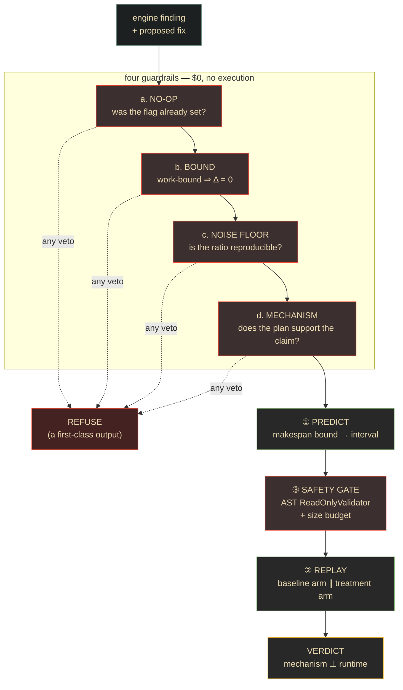

# Lane 8 — Fix Verification (verify)

> **Branch:** `feat/apex-verify` · **Language:** Python · **Depends on:** [`CONTRACT.md`](../../CONTRACT.md) v0.5
> **Status: AS-BUILT.** This brief documents the lane as shipped in v0.1, not work to be done.
> Implementation: [`../../verify/`](../../verify/) · 105 tests · [`../../verify/README.md`](../../verify/README.md)

## Mission & exit criterion

Decide whether a recommended fix would **actually work** — and refuse when it would not.

Every other lane makes Apex find more. This lane makes Apex **wrong less often**, which is worth
more: a confidently bad recommendation costs a user hours and costs the product its credibility.

**Exit criterion (met):** predict a fix's effect analytically at zero execution cost, replay it on
the bench, and emit `mechanism_confirmed` / `runtime_certified` / `runtime_unresolved` as
**separate** verdicts — including a live refutation of Apex's own headline finding.



## The refutation that justified the lane

`189e3495…` · `SKEW_ON_JOIN` · stage 4 of `app-20260724160310-0000` · *"critical 21.62×"* —
Apex's own marquee finding, failing **all four** guardrails at once:

| Guardrail | Finding |
|---|---|
| **a. no-op** | `spark.sql.adaptive.skewJoin.enabled=true` was **already `true`** |
| **b. bound** | stage 4 is **work-bound** on 2 slots — a *perfect* fix returns **0.0 ms** |
| **c. noise floor** | 21.62 / 24.71 / 24.53 across three **byte-identical** runs; job CV 5.8% |
| **d. mechanism** | **278 bytes/task**, and the plan contains **no Join node** — it is Delta transaction-log processing |

This is DataFlint's published SimilarWeb failure (a suggested `repartition(20000)` that left a
3-hour job at 3 hours) reproduced inside Apex. **Refusing beats guessing.**

## Key decisions (researched)

### The makespan bound, not a regression model

For `n` tasks on `slots` slots, list-scheduling gives `T ≈ max(p99, W/slots)`. A skew fix
*redistributes* work rather than removing it, so `W` is conserved and a perfect fix yields
`T_after = W/slots`:

```
Δ_stage = W/slots − max(p99, W/slots)      # exactly 0 whenever W/slots ≥ p99
```

Rearranged, this **is** contract rule 1: `tail-bound ⟺ p99/p50 > (n−1)/(slots−1)`. Volume
cancels; there is no tunable constant. A regression model would have needed training data and
could not have produced a *provable* zero.

`W` is not measured — `executor_run_time_ms` is **not** a column in `apex.spark_events` (verified
against `system.columns`) — so `W` is **bracketed** between two task-distribution models and the
prediction is an **interval**. Agreement at both ends is what makes a verdict quotable.

### The safety gate, derived from OptiSpark with two corrections

**Research basis:** [OptiSpark 0.2.0](https://pypi.org/project/optispark/). Two things the source
verified against the original brief:

- OptiSpark's **primary** defense is an AST `ReadOnlyValidator` raising *before* `exec()`, **not**
  the size check. For Apex's *never touch customer data* rule that matters more, so it runs first
  and cannot be skipped.
- OptiSpark's `stats().sizeInBytes()` check is **conditional** on a high-risk operator. Apex
  applies it **unconditionally** — "could this OOM the bench?" is not operator-conditional.

> **The `Long.MaxValue` trap.** `stats().sizeInBytes()` falls back to
> `spark.sql.defaultSizeInBytes` = `Long.MaxValue` (8 EiB) when Catalyst has **no statistics**.
> A naive `size > budget` blocks *everything* while looking like a working gate. The sentinel
> means **"stats absent"**, not "8 exabytes."

### Mechanism and runtime are separate verdicts — contract rule 4

A laptop bench with ~1.2 s of fixed overhead on a ~2 s stage puts a **17–37% floor** under
everything, so a ~10% effect is **structurally uncertifiable regardless of repetitions**. And on a
shared host repetitions are **not independent**, so shrinking a standard error measures the wrong
thing.

Emitting `mechanism_confirmed` + `runtime_unresolved` together is more useful *and* more honest
than a fabricated percentage — and it means a laptop bench is not useless: it certifies mechanism
today and defers magnitude.

## The positive control, and why it was kept failing

A verification lane needs a control that *should* show an effect, or "no effect detected" is
unfalsifiable. The first control failed **twice** and was left **armed and failing** rather than
tuned green.

Diagnosis — **mis-specified, not mis-scaled**: AQE `skew_split` coalesced 100 partitions → 17 and
median task time went 61–92 ms → 508–792 ms, so **`W` was not conserved.** It was a
repartitioning, not a pure tail redistribution — a fix class `classify_fix` is *designed* to
refuse.

The re-specified control holds partition count constant (106 tasks = 100 + split subpartitions),
conserving `W`, and **passes**. It still cannot clear the runtime floor, which per rule 4's
corollary is the honest conclusion: **laptop scale cannot certify small runtime effects.**

## Live result

`app-20260728211208-0042`, stage 21 — 100 tasks, p50 = 100 ms, p99 = 2033 ms → **20.3×** against
14.14, tail-bound on the plugin's own statistic:

> **MECHANISM CONFIRMED, RUNTIME UNRESOLVED** — the AQE `skew_split` fired (3/3); tail ratio
> 19.4× → 10.4× (−46.4%) beyond its ±13.7% floor. The measured **+8.1%** is inside the **±57.5%**
> floor on `dev:skew_join`: magnitude deferred, not denied. Confidence HIGH (0.90).

The **coherence check** is worth more than the number: the analytic predictor, blind on the same
stage, independently returned **−0.7% [−1.5 .. 0.0]**. Two different methods, same conclusion.

## Pitfalls (verified)

- **A fixed 5×/10× skew threshold is wrong** — it ignores cluster width. Use the closed form.
- **A noise floor carried across levels is wrong by up to 6.5×** (5.8% → 37.7% on one system).
  Measure per shape, per scale.
- **Below `MIN_REPS_FOR_FLOOR` samples, no delta may be quoted at all** — the floor is UNMEASURED,
  which is not the same as zero.
- **`plan_json` is written by the observed Spark job**, not by Apex — untrusted input throughout
  (the indirect-injection vector in [`../../serve/README.md`](../../serve/README.md)).
- **2 slots is provably never tail-bound**; 4 fails, 6 passes at ~1.1× margin, 8 is the shipping
  bench. Choosing a bench without checking rule 1 first means measuring nothing.

## Contract surface

Owns `apex.fix_verifications`
([`../../verify/CONTRACT-EXTENSION-v0.3.md`](../../verify/CONTRACT-EXTENSION-v0.3.md), ratified).
DDL is **applied by [`infra/`](../../infra/)** — `verify` deliberately does not create it.

Reads `apex.spark_events`, `apex.plan_transitions` (the AQE mechanism signal),
`apex.job_conf` (the no-op gate), and `apex.findings`.

## Run it

```bash
make test-verify                                              # 105 tests, no infrastructure
cd verify && uv run --extra dev python scripts/run_replay.py --help
```

## References

- OptiSpark — [pypi.org/project/optispark](https://pypi.org/project/optispark/)
- [`../../CONTRACT.md`](../../CONTRACT.md) rules 1, 2, 4
- [`../../verify/README.md`](../../verify/README.md) — as-built detail
