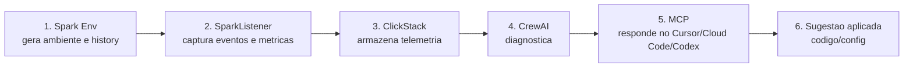

# Reuniao 2026-06-30 - Plano Commander

Fonte: transcricao da ultima reuniao da Crew A sobre APEX.

Este documento consolida os pontos orientados pelo Luan, atuando como Commander, e transforma a conversa em um backlog executavel.

## Leitura executiva

O Luan reposicionou o trabalho para uma V0.1 simples, integrada e demonstravel.

O foco imediato nao e copiar o DataFlint nem resolver Databricks Serverless. O foco e construir um fluxo Spark proprio que gere evidencia, capture telemetria, armazene no ClickStack e permita uma primeira experiencia agentica via CrewAI/MCP.

Fluxo Commander para a V0.1:

## Problemas identificados na reuniao

| Problema | Evidencia na conversa | Acao recomendada |
| --- | --- | --- |
| Time sem artefato fixo | Luan disse que a equipe ainda estava na parte de pensamento. | Criar uma V0.1 pequena com fluxo fim a fim. |
| Escopo girando em circulo | DataFlint, listener, Spark History, CrewAI, MCP, UI e offline apareceram juntos. | Separar agora V0.1, pos-V0.1 e fora de escopo. |
| Falta de denominador comum | Luan disse que o Apex e o tema mais complexo e precisa de agreement. | Registrar spec Commander e dividir pods depois do baseline. |
| Branches e trabalhos paralelos | Augusto citou branch com fork do trabalho do Gabriel; Luan pediu para revisar. | Inventariar branches, evidencias e decidir o que entra no baseline. |
| Risco de alucinacao da IA | Augusto citou AgentSpec, contratos e o ponto de parar antes de fugir do escopo. | Exigir contratos, definicoes de pronto e fontes para cada componente. |
| DataFlint virou benchmark, nao alvo imediato | Luan reforcou foco no Spark e disse para nao atacar DataFlint/Databricks Serverless agora. | Usar DataFlint para benchmark e comparativo, nao como dependencia da V0.1. |
| Falta de divisao de pods | Jaime sugeriu pods; Luan concordou, mas pediu primeiro um baseline unico. | Abrir issue de pods apos o escopo V0.1 ficar fixo. |
| Necessidade de seguranca/offline | Augusto perguntou como rodar agente em empresa que nao permite cloud. | Criar spike de modo offline/on-prem e governanca de agentes. |
| UI/replay e DAG sao desejaveis, mas grandes | Luan falou de interface local, DAG, replay e simular novo codigo. | Registrar como spike pos-V0.1, sem bloquear o fluxo inicial. |

## Como agir seguindo o Commander

1. Fechar a V0.1 antes de abrir novas frentes.
2. Usar DataFlint como benchmark de mercado, nao como dependencia tecnica.
3. Criar ambiente Spark reproduzivel e organizado dentro do repo.
4. Implementar um SparkListener minimo para capturar eventos e metricas.
5. Enviar telemetria para ClickStack.
6. Ler o ClickStack com CrewAI e produzir diagnostico inicial.
7. Expor o diagnostico por MCP para Cursor, Cloud Code, Codex ou ferramenta equivalente.
8. Demonstrar a experiencia com um `job_id`: "debuga esse job e sugere uma correcao".
9. Somente depois dividir pods de ambiente, SparkListener, infraestrutura e camada agentica.
10. Manter contratos curtos e verificaveis para impedir alucinacao e escopo infinito.

## Backlog Commander

| Ordem | Issue | Objetivo | Status |
| --- | --- | --- | --- |
| 1 | [#34](https://github.com/luanmorenommaciel/apex/issues/34) - [COMMANDER] Consolidar escopo Apex V0.1 da reuniao 2026-06-30 | Fixar o minimo demonstravel e separar fora de escopo. | Aberta |
| 2 | [#35](https://github.com/luanmorenommaciel/apex/issues/35) - [TASK] Construir Spark Env reproduzivel para Apex V0.1 | Entregar ambiente que gera jobs e history/event logs. | Aberta |
| 3 | [#36](https://github.com/luanmorenommaciel/apex/issues/36) - [TASK] Implementar SparkListener MVP para telemetria Apex | Capturar eventos/metricas e emitir envelope minimo. | Aberta |
| 4 | [#37](https://github.com/luanmorenommaciel/apex/issues/37) - [TASK] Integrar SparkListener ao ClickStack MVP | Persistir telemetria capturada para diagnostico. | Aberta |
| 5 | [#38](https://github.com/luanmorenommaciel/apex/issues/38) - [TASK] Criar diagnostico CrewAI/MCP por job_id | Gerar primeira recomendacao baseada no job capturado. | Aberta |
| 6 | [#39](https://github.com/luanmorenommaciel/apex/issues/39) - [TASK] Coletar percepcao DataFlint de cada membro da Crew A | Compilar visoes curtas do que usar, evitar e superar. | Aberta |
| 7 | [#40](https://github.com/luanmorenommaciel/apex/issues/40) - [TASK] Inventariar branches e evidencias existentes para V0.1 | Revisar trabalhos de Gabriel, Augusto, Philo e outros. | Aberta |
| 8 | [#41](https://github.com/luanmorenommaciel/apex/issues/41) - [TASK] Definir contratos agenticos: memoria, RAG, skills, harness e contexto | Amarrar a camada agentica para evitar alucinacao. | Aberta |
| 9 | [#42](https://github.com/luanmorenommaciel/apex/issues/42) - [SPIKE] Definir modo offline/on-prem seguro para agentes Apex | Mapear como rodar em empresas com restricao de cloud/egress. | Aberta |
| 10 | [#43](https://github.com/luanmorenommaciel/apex/issues/43) - [SPIKE] Desenhar UI local de DAG, replay e simulacao | Registrar visao futura sem bloquear V0.1. | Aberta |

## Definicao de pronto da V0.1

A V0.1 so deve ser considerada pronta quando:

- um job Spark roda no ambiente local;
- o ambiente gera history/event logs;
- o SparkListener captura ao menos um conjunto minimo de eventos e metricas;
- o ClickStack recebe e persiste a telemetria;
- um componente CrewAI ou equivalente le o `job_id` e retorna um diagnostico;
- o diagnostico fica acessivel via MCP;
- existe um roteiro curto para reproduzir a demo;
- o time consegue explicar o fluxo fim a fim em uma reuniao.

## Fora de escopo imediato

- resolver Databricks Serverless;
- clonar DataFlint UI;
- implementar UI completa de DAG/replay;
- aplicar mudanca automatica em codigo de cliente sem aprovacao;
- criar multi-agent complexo antes de ter telemetria persistida;
- fechar ADRs sem decisao explicita da Crew A ou do Commander.

## Relacao com issues ja abertas

| Tema | Issue existente |
| --- | --- |
| Lab Platform | #10, #19 |
| Spark History Parser | #16 |
| Watcher / Classifier / Judger | #17 |
| Recommendation Engine | #20 |
| CI Integration | #21 |
| Onde Apex roda | #5 |
| ClickHouse/ClickStack schema | #4, #7 |
| Pods e responsabilidades | #30 |
| Project access | #31 |
| Licenca, autoria e Security Policy | #33 |
