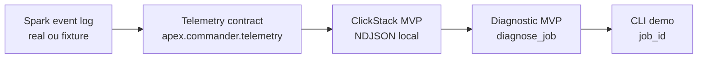

# Commander V0.1 Local Harness

Este playbook executa localmente o primeiro corte do fluxo pedido pelo Luan.

Branch local:

```text
local/luan-v01-commander
```

Regra desta branch:

```text
Nao fazer push enquanto a branch online avaliada estiver em revisao.
```

## O que este corte prova

Fluxo local:



Este corte materializa o contrato da V0.1:

- um `job_id` identifica a execucao;
- eventos Spark viram um envelope de telemetria;
- o store local simula o papel inicial do ClickStack;
- o diagnostico retorna um Finding deterministico;
- a CLI demonstra a experiencia "debuga esse job".

## O que ainda nao e

Este corte ainda nao e:

- um JVM `SparkListener` real injetado no Spark;
- ClickHouse/ClickStack real;
- CrewAI real;
- servidor MCP real;
- alteracao automatica de codigo;
- UI local de DAG/replay.

Essas pecas entram depois que a Crew validar o contrato local.

## Rodar a demo

Gerar um store local a partir do log versionado:

```powershell
$env:PYTHONUTF8='1'
uv run --offline --with-requirements requirements.txt python tools/commander_v01_demo.py real_log.ndjson .commander-v01-store.ndjson --job-id real-log-demo
```

Saida esperada:

```json
{
  "confidence": "medium",
  "job_id": "real-log-demo",
  "status": "finding",
  "title": "shuffle_skew_candidate"
}
```

## Rodar testes

```powershell
$env:PYTHONUTF8='1'
uv run --offline --with-requirements requirements.txt python -m pytest tests/test_commander_v01.py -q --basetemp .pytest-luan-v01
```

Rodar tudo:

```powershell
$env:PYTHONUTF8='1'
uv run --offline --with-requirements requirements.txt python -m pytest tests -q --basetemp .pytest-luan-v01-all
```

## Como evoluir para o desenho do Luan

| Ponto do Luan | Estado neste corte | Proxima troca |
| --- | --- | --- |
| Spark Env | Usa event log existente | Docker/Spark local gerando logs novos |
| SparkListener | Contrato por parser de event log | Listener JVM emitindo o mesmo envelope |
| ClickStack | NDJSON local | ClickHouse/ClickStack com schema versionado |
| CrewAI | Diagnostico deterministico | Agente lendo evidencias do store |
| MCP | CLI local por `job_id` | MCP tool `debug_job(job_id)` |
| Sugestao de correcao | Recomendacao textual | Patch/review com aprovacao humana |

## Gate 1: Contrato executavel do Luan

Este gate transforma a branch Codex em uma validacao local da arquitetura do Luan.

Componentes:

- `debug_job(job_id)`: retorna diagnostico deterministico e validacao de evidencia.
- `explain_evidence(job_id)`: mostra a telemetria armazenada para o job.
- `EvidenceValidator`: bloqueia findings fracos antes de qualquer agente/LLM.
- Baseline negativo: job balanceado nao pode gerar skew.
- `fix_preview`: gera diff sem alterar arquivo.

Rodar:

```powershell
$env:PYTHONUTF8='1'
uv run --offline --with-requirements requirements.txt python -m pytest tests/test_commander_v01.py tests/test_commander_evidence_validator.py tests/test_commander_mcp_contract.py tests/test_commander_fix_preview.py -q --basetemp .pytest-commander-gate1
```

Esperado:

```text
13 passed
```
