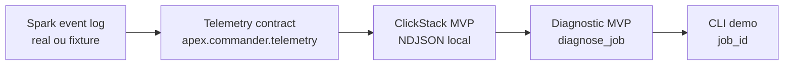

# Commander V0.1 Local Harness

Este playbook executa localmente o primeiro corte do fluxo pedido pelo Luan.

Branch local:

```text
local/luan-v01-commander
```

Regra desta branch:

```text
Nao fazer push enquanto a branch online avaliada estiver em revisao.
```

## O que este corte prova

Fluxo local:



Este corte materializa o contrato da V0.1:

- um `job_id` identifica a execucao;
- eventos Spark viram um envelope de telemetria;
- o store local simula o papel inicial do ClickStack;
- o diagnostico retorna um Finding deterministico;
- a CLI demonstra a experiencia "debuga esse job".

## O que ainda nao e

Este corte ainda nao e:

- um JVM `SparkListener` real injetado no Spark;
- ClickHouse/ClickStack real;
- CrewAI real;
- servidor MCP real;
- alteracao automatica de codigo;
- UI local de DAG/replay.

Essas pecas entram depois que a Crew validar o contrato local.

## Rodar a demo

Gerar um store local a partir do log versionado:

```powershell
$env:PYTHONUTF8='1'
uv run --offline --with-requirements requirements.txt python tools/commander_v01_demo.py real_log.ndjson .commander-v01-store.ndjson --job-id real-log-demo
```

Saida esperada:

```json
{
  "confidence": "medium",
  "job_id": "real-log-demo",
  "status": "finding",
  "title": "shuffle_skew_candidate"
}
```

## Rodar testes

```powershell
$env:PYTHONUTF8='1'
uv run --offline --with-requirements requirements.txt python -m pytest tests/test_commander_v01.py -q --basetemp .pytest-luan-v01
```

Rodar tudo:

```powershell
$env:PYTHONUTF8='1'
uv run --offline --with-requirements requirements.txt python -m pytest tests -q --basetemp .pytest-luan-v01-all
```

## Como evoluir para o desenho do Luan

| Ponto do Luan | Estado neste corte | Proxima troca |
| --- | --- | --- |
| Spark Env | Usa event log existente | Docker/Spark local gerando logs novos |
| SparkListener | Contrato por parser de event log | Listener JVM emitindo o mesmo envelope |
| ClickStack | NDJSON local | ClickHouse/ClickStack com schema versionado |
| CrewAI | Diagnostico deterministico | Agente lendo evidencias do store |
| MCP | CLI local por `job_id` | MCP tool `debug_job(job_id)` |
| Sugestao de correcao | Recomendacao textual | Patch/review com aprovacao humana |

## Gate 1: Contrato executavel do Luan

Este gate transforma a branch Codex em uma validacao local da arquitetura do Luan.

Componentes:

- `debug_job(job_id)`: retorna diagnostico deterministico e validacao de evidencia.
- `explain_evidence(job_id)`: mostra a telemetria armazenada para o job.
- `EvidenceValidator`: bloqueia findings fracos antes de qualquer agente/LLM.
- Baseline negativo: job balanceado nao pode gerar skew.
- `fix_preview`: gera diff sem alterar arquivo.

Rodar:

```powershell
$env:PYTHONUTF8='1'
uv run --offline --with-requirements requirements.txt python -m pytest tests/test_commander_v01.py tests/test_commander_evidence_validator.py tests/test_commander_mcp_contract.py tests/test_commander_fix_preview.py -q --basetemp .pytest-commander-gate1
```

Esperado:

```text
13 passed
```

## Gate 2: Detectores locais multiplos

O Gate 2 amplia `debug_job(job_id)` para retornar uma lista de findings validados, mantendo `finding` como campo legado para o primeiro finding.

Detectores locais:

- `shuffle_skew_candidate`
- `shuffle_spill_candidate`
- `gc_pressure_candidate`
- `oom_candidate`
- `plan_aqe_replan_candidate`

Contrato atualizado:

- `diagnose_findings(store_path, job_id)` retorna todos os findings deterministico locais;
- `debug_job(store_path, job_id)` retorna `findings` e `validations`;
- `debug_job(store_path, job_id)` preserva `finding` e `validation` para compatibilidade;
- `EvidenceValidator` aceita os cinco tipos de finding com regras especificas por tipo.

Rodar:

```powershell
$env:PYTHONUTF8='1'
uv run --offline --with-requirements requirements.txt python -m pytest tests/test_commander_detectors.py tests/test_commander_mcp_contract.py tests/test_commander_evidence_validator.py -q --basetemp .pytest-commander-gate2
```

Esperado:

```text
16 passed
```

Limite consciente deste gate:

- os thresholds ainda estao fixos no codigo;
- ainda nao ha ClickHouse real;
- ainda nao ha MCP server real;
- ainda nao ha aplicacao automatica de fix.

## Gate 3: Baseline negativo executavel

O Gate 3 transforma controle de falso positivo em contrato executavel.

Novo componente:

- `evaluate_negative_baseline(store_path, job_id)`: roda `diagnose_findings` contra um job que deveria ser saudavel.

Resultado esperado para job saudavel:

```json
{
  "job_id": "healthy-job",
  "status": "passed",
  "unexpected_findings": [],
  "unexpected_finding_count": 0
}
```

Resultado esperado quando qualquer detector dispara:

```json
{
  "job_id": "spill-job",
  "status": "failed",
  "unexpected_finding_count": 1
}
```

Rodar:

```powershell
$env:PYTHONUTF8='1'
uv run --offline --with-requirements requirements.txt python -m pytest tests/test_commander_negative_baselines.py -q --basetemp .pytest-commander-gate3
```

Esperado:

```text
2 passed
```

O que este gate prova:

- job com skew balanceado nao gera finding;
- spill abaixo do threshold nao gera finding;
- GC saudavel nao gera finding;
- menos de 3 updates AQE nao gera finding;
- se um detector dispara em baseline, o gate retorna `failed`.

## Gate 4: Adapter ClickHouse/ClickStack com fake client

O Gate 4 prepara a troca do NDJSON local por ClickHouse/ClickStack sem exigir servidor real nesta etapa.

Novos componentes:

- `ClickHouseTelemetryStore`: adapter injetavel que usa um client com `command`, `insert` e `query`;
- `query_envelopes(store, job_id)`: helper que permite ao Commander ler tanto path NDJSON quanto stores com `query_by_job_id`;
- fake client em teste cobrindo schema, insert, query e protecao contra nome de tabela inseguro.

Contrato preservado:

- `append_envelope(path, envelope)` e `query_by_job_id(path, job_id)` continuam funcionando com NDJSON;
- `diagnose_findings(store, job_id)` aceita o adapter fake;
- `explain_evidence(store, job_id)` aceita o adapter fake.

Rodar:

```powershell
$env:PYTHONUTF8='1'
uv run --offline --with-requirements requirements.txt python -m pytest tests/test_commander_clickhouse_adapter.py tests/test_commander_negative_baselines.py tests/test_commander_mcp_contract.py tests/test_commander_v01.py -q --basetemp .pytest-commander-gate4
```

Esperado:

```text
15 passed
```

Limite consciente deste gate:

- nao abre conexao de rede;
- nao instala driver ClickHouse;
- nao valida Docker/ClickHouse real;
- nao cria schema de findings separado.

## Gate 5: MCP/Tool Contract local

O Gate 5 cria uma camada local de ferramentas, pronta para ser embrulhada por MCP depois.

Novo componente:

- `CommanderToolContract(store)`: dispatcher local em processo.

Tools expostas:

| Tool | Seguranca | O que faz |
| --- | --- | --- |
| `debug_job` | `read_only` | retorna findings e validacoes para um `job_id` |
| `explain_evidence` | `read_only` | retorna a evidencia de telemetria mais recente |
| `evaluate_negative_baseline` | `read_only` | executa o gate de falso positivo para um `job_id` |
| `preview_fix` | `read_only` | retorna diff unificado sem alterar o arquivo |

Contrato de seguranca:

- `list_tools()` nao expõe `apply_fix`;
- `call_tool("apply_fix", ...)` falha com `unknown_tool`;
- `preview_fix` usa `build_fix_preview` e preserva o arquivo original.

Rodar:

```powershell
$env:PYTHONUTF8='1'
uv run --offline --with-requirements requirements.txt python -m pytest tests/test_commander_tool_contract.py tests/test_commander_mcp_contract.py tests/test_commander_fix_preview.py tests/test_commander_negative_baselines.py -q --basetemp .pytest-commander-gate5
```

Esperado:

```text
13 passed
```

Limite consciente deste gate:

- ainda nao ha servidor MCP stdio real;
- ainda nao ha `recommend_fix`;
- ainda nao ha `apply_fix`;
- nao ha escrita automatica em arquivo alvo.

## Gate 6: MCP stdio local read-only

O Gate 6 embrulha o `CommanderToolContract` em um servidor stdio local baseado em JSON-RPC.

Metodos suportados:

| Metodo | O que retorna |
| --- | --- |
| `initialize` | versao de protocolo, capacidades e `serverInfo` |
| `notifications/initialized` | notificacao sem resposta |
| `tools/list` | lista MCP das tools read-only |
| `tools/call` | resultado da tool em `content[0].text` como JSON |

Tools continuam as mesmas do Gate 5:

- `debug_job`
- `explain_evidence`
- `evaluate_negative_baseline`
- `preview_fix`

Rodar:

```powershell
$env:PYTHONUTF8='1'
uv run --offline --with-requirements requirements.txt python -m pytest tests/test_commander_mcp_stdio_server.py tests/test_commander_tool_contract.py tests/test_commander_mcp_contract.py -q --basetemp .pytest-commander-gate6
```

Esperado:

```text
16 passed
```

Limite consciente deste gate:

- nao usa SDK MCP externo;
- nao valida contra cliente MCP real;
- nao abre socket de rede;
- nao expoe `apply_fix`;
- nao altera arquivo alvo.

## Gate 7: ClickHouse real local

O Gate 7 valida persistencia real de telemetria em ClickHouse via HTTP, sem driver externo.

Novos componentes:

- `ClickHouseHttpClient`: client HTTP com `command`, `insert` e `query`;
- `tests/test_commander_clickhouse_http_client.py`: valida SQL, Basic Auth, JSONEachRow e parsing sem rede;
- `tests/test_commander_clickhouse_real_integration.py`: valida roundtrip real quando as variaveis de ambiente estao configuradas.

Rodar suite padrao do gate:

```powershell
$env:PYTHONUTF8='1'
uv run --offline --with-requirements requirements.txt python -m pytest tests/test_commander_clickhouse_http_client.py tests/test_commander_clickhouse_adapter.py tests/test_commander_clickhouse_real_integration.py -q --basetemp .pytest-commander-gate7
```

Esperado sem ClickHouse real configurado:

```text
8 passed, 1 skipped
```

Rodar contra ClickHouse real local:

```powershell
$env:APEX_CLICKHOUSE_REAL_URL='http://localhost:28123'
$env:APEX_CLICKHOUSE_REAL_USER='<usuario local>'
$env:APEX_CLICKHOUSE_REAL_PASSWORD='<senha local>'
uv run --offline --with-requirements requirements.txt python -m pytest tests/test_commander_clickhouse_real_integration.py -q
```

Esperado:

```text
1 passed
```

O teste real:

- cria uma tabela temporaria unica;
- executa `ensure_schema`;
- insere envelope de telemetria;
- consulta por `job_id`;
- roda `diagnose_findings` e `explain_evidence` sobre o store real;
- remove a tabela ao final.

Limite consciente deste gate:

- nao grava credenciais em arquivo;
- nao valida schema separado de findings;
- nao troca o store padrao NDJSON da CLI;
- nao altera branches remotas.

## Gate 8: Findings persistidos no ClickHouse

O Gate 8 adiciona uma trilha auditavel para decisoes do Commander.

Fluxo validado:

```text
telemetry envelope
  -> diagnose_findings
  -> EvidenceValidator
  -> commander_findings
  -> query por job_id
```

Novos componentes:

- `ClickHouseFindingStore`: schema, insert e query de findings;
- `persist_validated_findings`: valida cada finding antes de persistir;
- `tests/test_commander_clickhouse_findings.py`: fake-client tests sem rede;
- `tests/test_commander_clickhouse_findings_real_integration.py`: validacao real opt-in.

Rodar suite padrao do gate:

```powershell
$env:PYTHONUTF8='1'
uv run --offline --with-requirements requirements.txt python -m pytest tests/test_commander_clickhouse_findings.py tests/test_commander_clickhouse_findings_real_integration.py tests/test_commander_clickhouse_real_integration.py -q --basetemp .pytest-commander-gate8
```

Esperado sem ClickHouse real configurado:

```text
3 passed, 2 skipped
```

Rodar contra ClickHouse real local:

```powershell
$env:APEX_CLICKHOUSE_REAL_URL='http://localhost:28123'
$env:APEX_CLICKHOUSE_REAL_USER='<usuario local>'
$env:APEX_CLICKHOUSE_REAL_PASSWORD='<senha local>'
uv run --offline --with-requirements requirements.txt python -m pytest tests/test_commander_clickhouse_findings_real_integration.py -q
```

Esperado:

```text
1 passed
```

O teste real:

- cria uma tabela temporaria de telemetria;
- cria uma tabela temporaria de findings;
- persiste o envelope;
- calcula findings deterministico;
- valida findings;
- persiste findings validados;
- consulta findings por `job_id`;
- remove as tabelas ao final.

Limite consciente deste gate:

- findings ainda nao sao expostos como nova tool MCP dedicada;
- ainda nao ha `recommend_fix`;
- ainda nao ha `apply_fix`;
- nao altera branches remotas.
