# Apex Codex - Especificacao Tecnica Reprodutivel - 2026-07-15

Status: pacote final da branch Codex Round2 para avaliacao do juiz.

Branch publicada:

```text
https://github.com/luanmorenommaciel/apex/tree/gustocezar/feature/codex-desacoplamento-geradores
```

Branch de campeonato:

```text
https://github.com/gustocezar/apex-workspace/tree/codex-round2
```

Commit avaliado:

```text
6ba5238a78b863c8b665e735d1b30057cbf73803
```

## Objetivo

Provar uma versao local-first do Apex que captura telemetria Spark, detecta anomalias deterministicas, gera recomendacao, aplica fix guardado e reexecuta o job para comparar evidencia antes/depois.

Esta branch nao declara V1 produto completo. Ela declara um pacote executavel e auditavel de gates G0-G6, com uma pendencia operacional restante: aprovar `apex-commander` em uma IDE GUI real.

## Componentes

| Componente | Caminho | Estado |
|---|---|---|
| Detectores T1 | `apex/commander/detectors.py`, `apex/commander/diagnostic_mvp.py` | Validado nos 6 cenarios oficiais |
| EvidenceValidator | `apex/commander/evidence_validator.py` | Validado em G1/G4/G5 |
| ClickHouse schema/adapters | `docs/specs/apex_telemetry_v1.sql`, `apex/commander/clickhouse_store.py` | Schema canonico versionado |
| MCP stdio | `apex/commander/mcp_stdio_cli.py`, `apex/commander/mcp_stdio_server.py` | Validado por subprocesso |
| apply_fix guardado | `apex/commander/apply_verify.py`, `apex/commander/tool_contract.py` | Preview, token, hash, root e verify |
| Rerun/compare | `apex/commander/rerun_orchestrator.py`, `apex/commander/telemetry_compare.py` | Validado em G5 |
| Stack autonoma | `docker-compose.autonomous.yml`, `docker/autonomous/` | G3/G5 repetidos sem `plat-v0` |
| SparkListener JVM | `listener-jvm/` | JAR real, NDJSON e fail-safe |
| G6 oracle/drift | `tools/g6_oracle_drift_smoke.py`, `.github/workflows/scenario-gate.yml` | Local e remoto verdes |
| Loop agentico local | `apex/commander/agentic_loop.py`, `tools/agentic_validation_loop.py` | Sem LLM, sem mutacao, evidence-first |

## Gates E Evidencias

| Gate | Evidencia | Resultado |
|---|---|---|
| G0 build/testes | `evidence/g0-testes.log`, `evidence/ci-remote-gate-fix-tests.log` | Verde, suite final `163 passed, 2 skipped` |
| G1 baseline negativo | `evidence/g1-baseline.log` | Zero finding warning+ |
| G2 deteccao sintetica | `evidence/g2-cenarios.log` | 5 cenarios problematicos com severidade esperada |
| G3 dado real | `evidence/g3-real.log` | Spark real multicore, ratio 29.4x |
| G4 latencia T1 | `evidence/g4-t1.log` | 226.991 ms sem LLM obrigatorio |
| G5 detectar -> fix -> rerun -> limpo | `evidence/g5-ciclo.log` | finding 1 -> 0; shuffle 1.157.481 -> 0 |
| G6 drift remoto | `evidence/g6-remote-workflow-latest-summary.json` | Workflow remoto verde |

Workflow remoto:

```text
https://github.com/gustocezar/apex-workspace/actions/runs/29379009885
```

## Como Validar

```powershell
git rev-parse HEAD
uv run --with-requirements requirements.txt python -m pytest -q
uv run --with-requirements requirements.txt python tools/agentic_validation_loop.py --iterations 2 --output evidence/agentic-validation-loop-report.json
```

Resultados esperados:

- `git rev-parse HEAD` deve retornar `6ba5238a78b863c8b665e735d1b30057cbf73803`;
- pytest deve fechar com `163 passed, 2 skipped`;
- o loop agentico deve listar apenas `mcp_project_config: approve apex-commander in Claude Code/Cursor/VS Code GUI` como proxima acao.

## Diagrama End-to-End

```mermaid
flowchart LR
    Spark["Spark job"] --> EventLog["Event log S3A/MinIO"]
    Spark --> Listener["ApexSparkListener JVM"]
    EventLog --> Parser["Parser/Loader"]
    Listener --> Store["ClickHouse / store"]
    Parser --> Store
    Store --> T1["Detectores T1 + EvidenceValidator"]
    T1 --> Finding["Finding + confidence"]
    Finding --> MCP["MCP stdio apex-commander"]
    MCP --> Preview["preview diff"]
    Preview --> Apply["apply_fix guardado"]
    Apply --> Rerun["rerun controlado"]
    Rerun --> Compare["compare antes/depois"]
    Compare --> Judge["Evidencia para juiz"]
```



## Pendencias Reais

| Pendencia | Por que ainda existe | Proxima acao |
|---|---|---|
| IDE GUI real | Claude Code reconhece `.mcp.json`, mas ainda exige aprovacao interativa do servidor `apex-commander` | Aprovar na GUI e salvar transcript de `tools/list`, `preview_fix` e `apply_fix` |
| Crew.ai/Judge real | Decidido como camada futura para nao comprometer T1 deterministico | Implementar depois de preservar G0-G6 verdes |
| Versao Spark alvo | Codex autonomo usa Spark 4.0.0; Spike usa 4.1.2 | Commander escolher padrao antes da V1 final |

## Honestidade De Proveniencia

Esta branch declara explicitamente:

- CODEX-001: branch ja continha scorecard comparativo da rodada anterior;
- CODEX-007: o padrao de fix guardado adota o conceito `apply_fix` observado na solucao Cowork, nao e uma invencao paralela independente.

Esses pontos estao no `ISSUES.md` e devem ser considerados pelo juiz como fatos de proveniencia, nao como bugs funcionais.
