# Apex Codex - Especificacao Tecnica Reprodutivel - 2026-07-15

Status: pacote final da branch Codex Round2 para avaliacao do juiz.

Branch publicada:

```text
https://github.com/luanmorenommaciel/apex/tree/gustocezar/feature/codex-desacoplamento-geradores
```

Branch de campeonato:

```text
https://github.com/gustocezar/apex-workspace/tree/codex-round2
```

Referencia historica do pacote avaliado em 15/07:

```text
6ba5238a78b863c8b665e735d1b30057cbf73803
```

Para o estado atual da branch, use `git rev-parse HEAD` e consulte o README.

## Objetivo

Provar uma versao local-first do Apex que captura telemetria Spark, detecta anomalias deterministicas, gera recomendacao, aplica fix guardado e reexecuta o job para comparar evidencia antes/depois.

Esta branch nao declara V1 produto completo. Ela declara um pacote executavel e auditavel de gates G0-G6, agora com `apex-commander` aprovado e validado em Claude Code GUI real. Em 18/07, Spark 4.1.2 foi definido como alvo oficial, o SparkListener JVM foi promovido para caminho padrao dos jobs, G3/G5 foram reexecutados com sucesso na stack autonoma Spark 4.1.2 e o loop de regressao autonoma foi transformado em runner + workflow. O runner tambem foi executado localmente com sucesso em `20260718-real-local-6`. Em 19/07, a branch ganhou `crew_judge_diagnose` como camada Judge read-only e plugavel, com provider Crew.ai opcional. Depois da liberacao operacional de credenciais/quota, a execucao Crew.ai com LLM externo real foi observada com `provider=crew_ai`, `status=judged`, citacoes de evidencia existentes e decisao conservadora `manual_review`. A pendencia restante mais visivel e evoluir UI de produto navegavel e ampliar a matriz de casos do Judge.

Complemento de produto em 19/07: a UI local navegavel foi adicionada como MVP
read-only em `apex/commander/ui_server.py` e
`docs/presentations/apex-commander-ui-mvp.html`. Ela e vinculada somente a
loopback, expoe apenas `GET /`, `GET /api/health` e `GET /api/snapshot`, e usa
as evidencias locais sanitizadas. O fluxo mutavel continua exclusivamente no
MCP guardado; a proxima evolucao real e ampliar a matriz de casos do Judge e
decidir se uma UI autenticada/multiusuario e desejada.

Complemento de demo MCP: `GET /api/recommendations` e `GET /api/preview`
chamam o mesmo contrato deterministico do Commander para o `job-42` de
demonstracao. O preview usa apenas `examples/apex_ui_demo_skew_job.py`, ignora
caminhos fornecidos pelo navegador e remove o approval token antes de responder.
Para a apresentacao, `job-42` e o ID unico do caso; `before-job` e `after-job`
sao IDs das execucoes de telemetria antes/depois, mantidos distintos para que a
comparacao continue auditavel.

## Componentes

| Componente | Caminho | Estado |
|---|---|---|
| Detectores T1 | `apex/commander/detectors.py`, `apex/commander/diagnostic_mvp.py` | Validado nos 6 cenarios oficiais |
| EvidenceValidator | `apex/commander/evidence_validator.py` | Validado em G1/G4/G5 |
| ClickHouse schema/adapters | `docs/specs/apex_telemetry_v1.sql`, `apex/commander/clickhouse_adapter.py`, `apex/commander/clickhouse_findings.py` | Schema canonico e adaptadores versionados |
| MCP stdio | `apex/commander/mcp_stdio_cli.py`, `apex/commander/mcp_stdio_server.py` | Validado por subprocesso |
| apply_fix guardado | `apex/commander/apply_verify.py`, `apex/commander/tool_contract.py` | Preview, token, hash, root e verify |
| Rerun/compare | `apex/commander/rerun_orchestrator.py`, `apex/commander/telemetry_compare.py` | Validado em G5 e comparado via MCP GUI read-only |
| Stack autonoma | `docker-compose.autonomous.yml`, `docker/autonomous/` | G3/G5 repetidos em Spark 4.1.2 com listener oficial |
| SparkListener JVM | `listener-jvm/`; `docker/spark/spark-defaults.conf`; `docker/autonomous/spark/spark-defaults.conf` | JAR real, NDJSON, fail-safe e caminho oficial via `spark.jars` + `spark.extraListeners` |
| G6 oracle/drift | `tools/g6_oracle_drift_smoke.py`, `.github/workflows/scenario-gate.yml` | Local e remoto verdes |
| Loop CI autonoma | `scripts/f7_autonomous_stack_loop.py`, `.github/workflows/scenario-gate.yml`, `.github/workflows/autonomous-stack-loop.yml` | Execucao real local verde; contrato integrado ao workflow reconhecido; job real remoto manual em runner self-hosted |
| Loop agentico local | `apex/commander/agentic_loop.py`, `tools/agentic_validation_loop.py` | Sem LLM, sem mutacao, evidence-first |

## Gates E Evidencias

| Gate | Evidencia | Resultado |
|---|---|---|
| G0 build/testes | `evidence/g0-testes.log`, `evidence/ci-remote-gate-fix-tests.log` | Verde; validacao local mais recente da branch: `197 passed, 2 skipped` |
| G1 baseline negativo | `evidence/g1-baseline.log` | Zero finding warning+ |
| G2 deteccao sintetica | `evidence/g2-cenarios.log` | 5 cenarios problematicos com severidade esperada |
| G3 dado real | `evidence/g3-real.log` | Spark real multicore, ratio 29.4x |
| G4 latencia T1 | `evidence/g4-t1.log` | 226.991 ms sem LLM obrigatorio |
| G5 detectar -> fix -> rerun -> limpo | `evidence/g5-ciclo.log` | finding 1 -> 0; shuffle 1.157.481 -> 0 |
| G6 drift remoto | `evidence/g6-remote-workflow-latest-summary.json` | Workflow remoto verde |
| Telemetria MCP GUI | `evidence/g6-mcp-ide-gui-telemetry-compare-2026-07-18.log`; `evidence/f6-mcp-gui-telemetry-compare-local-2026-07-18.log`; `evidence/f6-mcp-gui-telemetry-compare-tests-2026-07-18.log` | `compare_job_telemetry` read-only retornou `status=improved`; validacao focada fechou com 24 testes |
| Spark 4.1.2 + listener oficial | `evidence/f7-spark412-official-listener-docker-build-2026-07-18.log`; `evidence/f7-spark412-autonomous-ps-2026-07-18.log`; `evidence/f7-spark412-g3-before-diagnosis-2026-07-18.log`; `evidence/f7-spark412-g5-compare-memory-2026-07-18.log`; `evidence/f7-spark412-final-focused-tests-2026-07-18.log` | Stack autonoma Spark 4.1.2 sobe; G3 detecta skew high ratio 29.4; G5 after-memory fecha finding_count 1 -> 0; suite focada 59 passed |
| Loop CI autonoma | `evidence/f7-autonomous-stack-loop-20260718-real-local-6.log`; `evidence/generated/f7-autonomous-loop/20260718-real-local-6/`; `evidence/f7-autonomous-stack-loop-real-local-tests-2026-07-18.log`; `evidence/f7-autonomous-stack-loop-scenario-gate-contract-tests-2026-07-18.log`; `scripts/f7_autonomous_stack_loop.py`; `.github/workflows/scenario-gate.yml` | Runner executou G3/G5 real local: before `app-20260718211145-0005` findings 2/skew 29.4; after `app-20260718211552-0006` finding_count 0/skew 0.0; contrato entrou no workflow reconhecido; execucao real remota pendente |

Workflow remoto:

```text
https://github.com/gustocezar/apex-workspace/actions/runs/29379009885
```

## Como Validar

```powershell
git rev-parse HEAD
uv run --with-requirements requirements.txt python -m pytest -q
uv run --with-requirements requirements.txt python tools/agentic_validation_loop.py --iterations 2 --output evidence/agentic-validation-loop-report.json
```

Resultados esperados:

- `git rev-parse HEAD` deve retornar o commit publicado mais recente da branch remota; compare com `git ls-remote origin refs/heads/gustocezar/feature/codex-desacoplamento-geradores`;
- pytest deve fechar com `197 passed, 2 skipped` na validacao local mais recente desta branch;
- o loop agentico deve fechar com `status=pass` e `next_actions=[]`.
- `compare_job_telemetry` via MCP GUI deve mostrar `before-job -> after-job` com `status=improved`, `finding_count 3 -> 0`, `max_skew_ratio 29.5 -> 1.0` e `total_spilled_bytes 2097152 -> 0`;
- a validacao focada de contrato MCP/telemetria deve fechar com `24 passed`.

## Diagrama End-to-End

```mermaid
flowchart LR
    Spark["Spark job"] --> EventLog["Event log S3A/MinIO"]
    Spark --> Listener["ApexSparkListener JVM"]
    EventLog --> Parser["Parser/Loader"]
    Listener --> Store["ClickHouse / store"]
    Parser --> Store
    Store --> T1["Detectores T1 + EvidenceValidator"]
    T1 --> Finding["Finding + confidence"]
    Finding --> MCP["MCP stdio apex-commander"]
    MCP --> Preview["preview diff"]
    Preview --> Apply["apply_fix guardado"]
    Apply --> Rerun["rerun controlado"]
    Rerun --> Compare["compare antes/depois"]
    Compare --> Judge["Evidencia para juiz"]
```



## Pendencias Reais

| Pendencia | Por que ainda existe | Proxima acao |
|---|---|---|
| IDE GUI real | Fechado no Claude Code com `apex-commander` conectado, `tools/list`, `recommend_fix`, `preview_recommendation` e `apply_fix` guardado | Manter transcript em `evidence/g6-mcp-ide-gui-smoke-2026-07-18.log` |
| Crew.ai/Judge real | `crew_judge_diagnose` implementado como tool read-only; provider Crew.ai opcional via `APEX_CREW_JUDGE_ENABLED=1`, fallback seguro quando nao configurado; execucao externa real observada em 19/07 | Ampliar casos de baixa confianca, evidencia incompleta e rejeicao pelo validator |
| Versao Spark alvo | Spark 4.1.2 definido como alvo oficial; compose raiz e autonomo alinhados; G3/G5 reexecutados; runner de loop autonomo construido e executado localmente | Acionar job `real-stack` em runner self-hosted preparado e anexar evidencia remota |

## Honestidade De Proveniencia

Esta branch declara explicitamente:

- CODEX-001: branch ja continha scorecard comparativo da rodada anterior;
- CODEX-007: o padrao de fix guardado adota o conceito `apply_fix` observado na solucao Cowork, nao e uma invencao paralela independente.

Esses pontos estao no `ISSUES.md` e devem ser considerados pelo juiz como fatos de proveniencia, nao como bugs funcionais.
