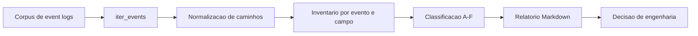

# Especificacao Tecnica - Inventario de Cobertura do Event Log v1

## Objetivo

Medir, a partir de logs reais, quais sinais o Spark registrou, quais campos o Apex
ja consome e quais lacunas precisam de parser, novos cenarios ou outra fonte de
telemetria.

O inventario evita tratar como ponto cego um campo que ja existe no event log.
Ele tambem impede a conclusao oposta: um campo ausente em uma amostra pequena nao
prova que o Spark nunca o emite.

## Escopo

Arquivos:

- [Script do inventario](../../tools/coverage_inventory.py)
- [Testes](../../tests/test_coverage_inventory.py)
- [Relatorio v1](../coverage/apex-coverage-report-v1.md)

Entrada:

```text
um ou mais arquivos ou diretorios de event log
```

Saida:

```text
relatorio Markdown com eventos, campos e classificacao A-F
```

O script inventaria cobertura. Ele nao diagnostica um job Spark, nao substitui
Watchers e nao prova cobertura global com uma unica aplicacao.

## Fluxo



## Classificacao

| Classe | Significado | Acao |
|---|---|---|
| A | Campo observado e consumido pelo Apex atual | Manter parser e testes |
| B* | Campo observado, valioso e ainda nao consumido | Priorizar parser ou Watcher |
| B | Outro campo observado e ainda nao consumido | Avaliar conforme o roadmap |
| C | Sinal dependente de configuracao, versao ou runtime | Testar matriz de ambientes |
| D | Sinal nao observado no corpus atual | Criar scenario e coletar evidencia |
| E | Informacao ausente do event log padrao | Usar AST, profiler ou outra fonte |
| F | Sinal inferivel, sem causalidade comprovada | Combinar evidencias e limitar confidence |

## Normalizacao

O schema bruto pode inflar a contagem quando um mapa usa chaves dinamicas ou
quando uma arvore repete o mesmo tipo de no.

O script aplica duas regras:

1. Agrupa chaves de mapas dinamicos como `<entry>`.
2. Colapsa profundidades repetidas de `sparkPlanInfo.children`.

Assim, a contagem representa caminhos de schema, nao nomes de propriedades ou a
profundidade acidental de um plano.

## Resultado do corpus v1

O corpus atual contem:

```text
fontes:          1
aplicacoes:      1
eventos:         57
tipos de evento: 18
```

Classificacao observada:

```text
A:   7 campos consumidos
B*: 32 caminhos valiosos ainda nao consumidos
B: 254 outros caminhos ainda nao consumidos
```

Os 32 itens de B* sao caminhos de campo. Eles nao equivalem a 32 features ou 32
Watchers. Varios caminhos pertencem ao mesmo sinal, como a arvore
`sparkPlanInfo` ou as metricas de shuffle.

## Achados para o roadmap

O corpus confirma que o Spark ja registra sinais que o Apex ainda nao extrai:

- spill em memoria e disco;
- CPU time e run time por task;
- GC, peak execution memory e result size;
- input, output e shuffle write;
- fetch wait e remote bytes read;
- callsite e scope de RDD;
- arvore estruturada `sparkPlanInfo`.

Esses sinais pedem parsing e validacao. Eles nao pedem uma nova forma de coleta.

O corpus ainda nao exercita AQE update, Structured Streaming, UDF, spill maior
que zero, perda de executor, retry ou tentativa especulativa. Esses casos
pertencem a classe D ate que um scenario produza evidencia.

## Execucao

No repositorio:

```bash
PYTHONPATH=. python3 tools/coverage_inventory.py real_log.ndjson
```

Para atualizar um relatorio:

```bash
PYTHONPATH=. python3 tools/coverage_inventory.py \
  real_log.ndjson \
  --md docs/coverage/apex-coverage-report-v1.md
```

Para analisar um corpus:

```bash
PYTHONPATH=. python3 tools/coverage_inventory.py \
  logs/join \
  logs/rdd \
  logs/udf \
  logs/streaming \
  logs/failure \
  --md docs/coverage/apex-coverage-report-corpus.md
```

## Criterios de validacao

O inventario deve:

- ler arquivo unico, arquivo comprimido ou diretorio aceito por `iter_events`;
- contar aplicacoes sem confundir fontes com aplicacoes;
- agrupar mapas dinamicos;
- reconhecer `sparkPlanInfo` em qualquer profundidade;
- manter zero spill e tentativa zero como sinal nao exercitado;
- avisar quando o corpus tem menos de duas aplicacoes;
- produzir a mesma classificacao para a mesma entrada.

## Limites

O relatorio descreve apenas o corpus informado. Para comparar Spark OSS,
Databricks Runtime, Photon e Serverless, o time precisa coletar amostras
separadas e registrar a versao e a configuracao de cada ambiente.

Databricks Serverless exige uma fonte complementar, como Query Profile ou
system tables. O adapter dessa fonte nao faz parte da v1.

## Relacao com o slice de skew

O slice `skew_on_join_30x` prova um diagnostico. Este inventario mede a superficie
de telemetria disponivel para os proximos diagnosticos.

```text
slice de skew       -> prova um caso de uso
inventario v1       -> mede campos e lacunas
novos scenarios     -> aumentam a evidencia empirica
novos Watchers      -> consomem sinais priorizados
```
