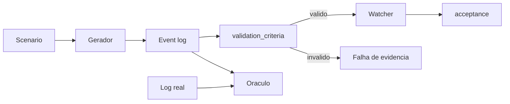
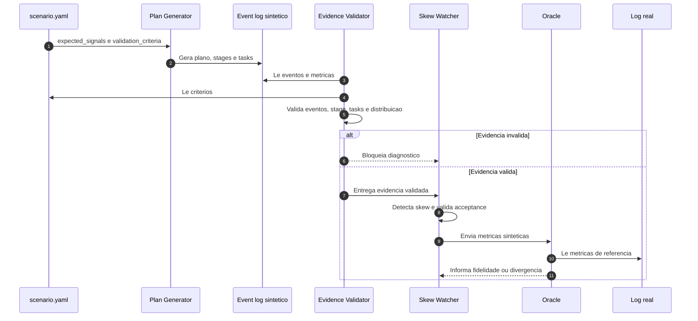

# Proposta Tecnica - `validation_criteria` para Scenarios Apex

## Status

```text
proposto para validacao da Crew A
nao implementado no scenario atual
```

## Problema

O scenario atual descreve os sinais esperados, a tolerancia do Oraculo e o
conteudo minimo do Finding. Ele ainda nao possui um gate explicito para rejeitar
evidencia estruturalmente ruim antes da execucao do Watcher.

Um log pode conter `skew_ratio` alto e ainda ser invalido para o estudo quando:

- o stage tem uma unica task;
- as tasks frias possuem zero registros;
- o operador de join nao corresponde ao scenario;
- faltam eventos obrigatorios;
- o stage analisado nao e o stage do join;
- o artefato sintetico colapsou a distribuicao.

Sem esse gate, o Watcher pode encontrar o sintoma esperado em uma simulacao que
nao representa o comportamento real.

## Objetivo

Adicionar ao contrato do scenario criterios executaveis para validar a qualidade
da evidencia antes do diagnostico.



## Separacao de responsabilidades

| Bloco | Pergunta respondida |
|---|---|
| `expected_signals` | Que comportamento o gerador pretende produzir? |
| `validation_criteria` | A evidencia gerada possui qualidade suficiente para diagnostico? |
| `acceptance` | O Finding emitido contem a causa e a recomendacao esperadas? |
| `oracle.tolerance` | O sintetico permanece proximo do log real? |

## Contrato proposto para o slice de skew

```yaml
validation_criteria:
  required_event_types:
    - SparkListenerSQLExecutionStart
    - SparkListenerStageCompleted
    - SparkListenerTaskEnd

  target_stage:
    source: join_stage
    min_tasks: 8
    min_nonzero_tasks: 8
    min_cold_tasks: 3
    forbid_single_task_collapse: true

  plan:
    expected_join_operator: SortMergeJoin

  distribution:
    metric: shuffle_read_records
    min_skew_ratio: 10
    require_nonzero_cold_median: true

  on_failure: fail_before_watcher
```

Este YAML e uma proposta para revisao. Os nomes e valores ainda nao fazem parte
do contrato oficial.

## Significado dos campos

| Campo | Regra |
|---|---|
| `required_event_types` | Exige eventos minimos para plano, stage e tasks |
| `target_stage.source` | Define como localizar o stage que sera validado |
| `min_tasks` | Impede validar uma distribuicao pequena demais |
| `min_nonzero_tasks` | Exige tasks com trabalho real |
| `min_cold_tasks` | Garante uma base para calcular a mediana fria |
| `forbid_single_task_collapse` | Rejeita o colapso que causou o ratio falso da versao anterior |
| `expected_join_operator` | Confirma que o plano corresponde ao scenario |
| `metric` | Declara a metrica usada pelo criterio |
| `min_skew_ratio` | Confirma que o anti-pattern foi produzido |
| `require_nonzero_cold_median` | Evita divisao por zero e ratio artificial |
| `on_failure` | Define que evidencia invalida bloqueia o Watcher |

## Sequencia proposta



## Casos de teste necessarios

| Caso | Resultado esperado |
|---|---|
| Stage com oito tasks e distribuicao valida | Gate permite executar o Watcher |
| Stage com uma task | Falha por `single_task_collapse` |
| Mediana fria igual a zero | Falha antes do calculo do ratio |
| Operador diferente de `SortMergeJoin` | Falha de plano |
| Evento `TaskEnd` ausente | Falha de evidencia incompleta |
| Ratio abaixo de 10x | Scenario nao reproduziu o anti-pattern |
| Baseline sem skew | Deve usar criterios proprios e nao exigir ratio de skew |

## Relacao com o baseline sem skew

`validation_criteria` nao deve conter regras universais para todos os scenarios.
O baseline sem skew precisa de outro contrato:

```yaml
validation_criteria:
  target_stage:
    min_tasks: 8
    forbid_single_task_collapse: true

  distribution:
    metric: shuffle_read_records
    max_skew_ratio: 3
    require_nonzero_cold_median: true

  on_failure: fail_before_watcher
```

Assim, o scenario de skew exige um ratio minimo, enquanto o baseline exige um
ratio maximo. O time consegue testar verdadeiro positivo e falso positivo com a
mesma estrutura.

## Decisoes para a Crew A

1. O gate deve executar dentro do Watcher ou em um validador separado?
2. Os criterios ficam em cada scenario ou parte deles vira um schema comum?
3. `min_tasks: 8` e regra deste slice ou default da plataforma?
4. O stage alvo deve ser informado ou descoberto pelo plano?
5. A falha deve bloquear o Watcher ou produzir um Finding de evidencia invalida?
6. O baseline sem skew entra na mesma entrega de implementacao?

## Criterio para aprovar esta proposta

A Crew A deve concordar com:

- a separacao entre intencao, qualidade da evidencia, Finding e Oraculo;
- os campos minimos do contrato;
- o comportamento em caso de evidencia invalida;
- os testes de verdadeiro positivo e falso positivo;
- o componente responsavel pela validacao.

Depois da aprovacao, a implementacao deve alterar o scenario, adicionar testes e
documentar a mensagem de erro de cada criterio.
