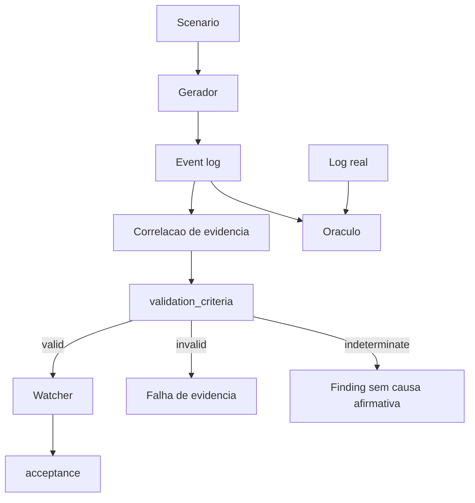
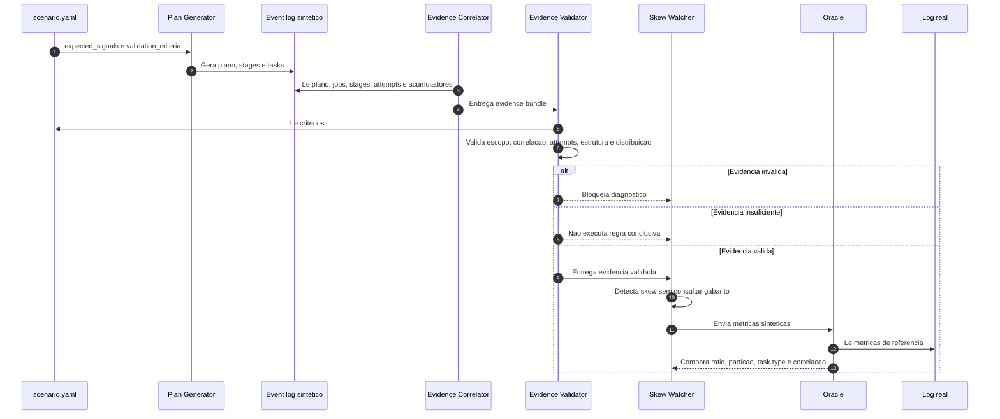

# Proposta Tecnica - `validation_criteria` para Scenarios Apex

## Status

```text
proposto para validacao da Crew A
schema YAML ainda nao implementado no scenario atual
parte das regras ja executa no apexlib, Watcher e Oracle
```

## Estado da implementacao

| Regra | Estado |
|---|---|
| Preservar tasks com zero | Implementado em `shuffle_tasks_by_stage` |
| Descartar tentativa falha | Implementado |
| Deduplicar retry e speculation | Implementado por particao e finish time |
| Invalidar single-task collapse e mediana zero | Implementado em `skew_metrics` |
| Correlacionar por acumuladores | Implementado quando `sparkPlanInfo` e `TaskInfo.Accumulables` existem |
| Expor fallback sem correlacao | Implementado como `indeterminate` no Watcher e warning no Oracle |
| Comparar hot partition e task type | Implementado como warning no Oracle |
| `Evidence Validator` separado | Nao implementado; gate ainda esta distribuido |
| Processamento incremental por aplicacao | Nao implementado |
| Contrato `validation_criteria` no YAML | Nao implementado |

## Problema

O scenario atual descreve os sinais esperados, a tolerancia do Oraculo e o
conteudo minimo do Finding. Ele ainda nao possui um gate explicito para rejeitar
evidencia estruturalmente ruim antes da execucao do Watcher.

Um log pode conter `skew_ratio` alto e ainda ser invalido para o estudo quando:

- o stage tem uma unica task;
- as tasks frias possuem zero registros;
- uma tentativa falha e o retry foram contados juntos;
- tasks especulativas duplicaram a mesma particao;
- o operador de join nao corresponde ao scenario;
- faltam eventos obrigatorios;
- o stage analisado nao e o stage do join;
- o stage foi escolhido por nome ou volume sem correlacao com o plano;
- eventos de mais de uma aplicacao foram agregados;
- o runtime materializou um log grande inteiro antes de analisar;
- o sintetico reproduziu ratio e volume, mas divergiu em particao ou tipo de task;
- a chave ou o valor quente vieram do scenario, nao da evidencia;
- o artefato sintetico colapsou a distribuicao.

Sem esse gate, o Watcher pode encontrar o sintoma esperado em uma simulacao que
nao representa o comportamento real.

## Objetivo

Adicionar ao contrato do scenario criterios executaveis para validar a qualidade
da evidencia antes do diagnostico.



O desenho completo de fluxo, arquitetura, sequencia, cadeia de valor e pontos de
ruptura esta em
[`architecture/validation-evidence-flow.md`](../architecture/validation-evidence-flow.md).

## Separacao de responsabilidades

| Bloco | Pergunta respondida |
|---|---|
| `expected_signals` | Que comportamento o gerador pretende produzir? |
| `validation_criteria` | A evidencia gerada possui qualidade suficiente para diagnostico? |
| `acceptance` | O Finding emitido contem a causa e a recomendacao esperadas? |
| `oracle.tolerance` | O sintetico permanece proximo do log real? |
| `evidence_status` | A evidencia e valida, invalida ou insuficiente? |
| `blind_evaluation` | A descoberta cega acertou sem consultar o gabarito? |

## Contrato proposto para o slice de skew

```yaml
validation_criteria:
  scope:
    require_single_application: true
    processing_mode: streaming
    encoding: utf-8

  required_event_types:
    - SparkListenerSQLExecutionStart
    - SparkListenerStageCompleted
    - SparkListenerTaskEnd

  target_stage:
    source: join_stage
    min_tasks: 8
    min_nonzero_tasks: 8
    min_cold_tasks: 3
    forbid_single_task_collapse: true

  attempts:
    require_successful_attempt: true
    deduplicate_by_partition: true
    reject_failed_attempt_metrics: true
    handle_speculative_tasks: true

  correlation:
    method: execution_job_stage_accumulator
    require_operator_accumulator_match: true
    allow_stage_name_match: false
    allow_largest_stage_fallback: false

  plan:
    expected_join_operator: SortMergeJoin

  distribution:
    metric: shuffle_read_records
    min_skew_ratio: 10
    require_nonzero_cold_median: true

  structural_fidelity:
    compare_hot_partition_index: true
    compare_task_type: true
    require_partition_identity_explained: true

  outcomes:
    invalid: fail_before_watcher
    indeterminate: emit_evidence_insufficient
```

Este YAML continua sendo uma proposta para revisao. Os nomes e valores ainda nao
fazem parte do contrato oficial. A implementacao atual prova o comportamento de
parte das regras, mas ainda precisa ser extraida para um `Evidence Validator`
dirigido por esse contrato. Os blocos `attempts`, `correlation` e `outcomes`
precisam de aceite explicito na issue #32.

## Significado dos campos

| Campo | Regra |
|---|---|
| `scope.require_single_application` | Impede misturar IDs de stage e task de aplicacoes distintas |
| `scope.processing_mode` | Exige agregacao incremental em vez de materializar o log inteiro |
| `scope.encoding` | Evita falha dos CLIs e subprocessos no Windows com `cp1252` |
| `required_event_types` | Exige eventos minimos para plano, stage e tasks |
| `target_stage.source` | Define como localizar o stage que sera validado |
| `min_tasks` | Impede validar uma distribuicao pequena demais |
| `min_nonzero_tasks` | Exige tasks com trabalho real |
| `min_cold_tasks` | Garante uma base para calcular a mediana fria |
| `forbid_single_task_collapse` | Rejeita o colapso que causou o ratio falso da versao anterior |
| `require_successful_attempt` | Exige uma tentativa efetiva para cada particao analisada |
| `deduplicate_by_partition` | Impede somar original, retry e tentativa especulativa |
| `reject_failed_attempt_metrics` | Nao usa tentativa falha para calcular skew |
| `correlation.method` | Liga execucao, job, stage, operador, acumulador e task |
| `require_operator_accumulator_match` | Confirma o stage pela intersecao entre metricas do plano e acumuladores das tasks |
| `allow_stage_name_match` | Impede que nome generico ou artificial decida o stage |
| `allow_largest_stage_fallback` | Evita atribuir ao join apenas o maior shuffle |
| `expected_join_operator` | Confirma que o plano corresponde ao scenario |
| `metric` | Declara a metrica usada pelo criterio |
| `min_skew_ratio` | Confirma que o anti-pattern foi produzido |
| `require_nonzero_cold_median` | Evita divisao por zero e ratio artificial |
| `compare_hot_partition_index` | Detecta sintetico que concentra trabalho em particao diferente do Spark real |
| `compare_task_type` | Detecta divergencia entre o stage consumidor real e o stage sintetico |
| `require_partition_identity_explained` | Exige hash compativel ou limite explicitamente declarado |
| `outcomes.invalid` | Define que evidencia contraditoria bloqueia o Watcher |
| `outcomes.indeterminate` | Define resposta sem causa raiz quando faltam dados |

## Sequencia proposta



## Casos de teste necessarios

| Caso | Resultado esperado |
|---|---|
| Stage com oito tasks e distribuicao valida | Gate permite executar o Watcher |
| Stage com uma task | Falha por `single_task_collapse` |
| Mediana fria igual a zero | Falha antes do calculo do ratio |
| Sete tasks zero e uma task ativa | Nao pode virar colapso com alta confianca |
| Tentativa falha seguida de retry | Usa somente a tentativa efetiva |
| Tentativa especulativa duplicada | Deduplica por stage, particao e attempt vencedor |
| Operador diferente de `SortMergeJoin` | Falha de plano |
| Evento `TaskEnd` ausente | Falha de evidencia incompleta |
| Stage com nome generico | Correlaciona por IDs e acumuladores |
| Acumulador do `SortMergeJoin` presente nas tasks | Confirma o stage pela intersecao de IDs |
| Correlacao operador-stage impossivel | Retorna `indeterminate` |
| Duas aplicacoes no mesmo input | Separa por `applicationId` ou rejeita o lote |
| Log grande | Processa incrementalmente sem lista completa de eventos |
| Windows sem `PYTHONUTF8=1` | Gate nao deve falhar ao imprimir status |
| Ratio igual, hot partition diferente | Oraculo aponta divergencia estrutural |
| `ShuffleMapTask` sintetica contra `ResultTask` real | Oraculo aponta divergencia estrutural |
| Hot key presente apenas no scenario | Descoberta nao pode emitir o valor |
| Ratio abaixo de 10x | Scenario nao reproduziu o anti-pattern |
| Baseline sem skew | Deve usar criterios proprios e nao exigir ratio de skew |

## Relacao com o baseline sem skew

`validation_criteria` nao deve conter regras universais para todos os scenarios.
O baseline sem skew precisa de outro contrato:

```yaml
validation_criteria:
  target_stage:
    min_tasks: 8
    forbid_single_task_collapse: true

  distribution:
    metric: shuffle_read_records
    max_skew_ratio: 3
    require_nonzero_cold_median: true

  on_failure: fail_before_watcher
```

Assim, o scenario de skew exige um ratio minimo, enquanto o baseline exige um
ratio maximo. O time consegue testar verdadeiro positivo e falso positivo com a
mesma estrutura.

## Decisoes para a Crew A

1. O gate deve executar dentro do Watcher ou em um validador separado?
2. Os criterios ficam em cada scenario ou parte deles vira um schema comum?
3. `min_tasks: 8` e regra deste slice ou default da plataforma?
4. O stage alvo deve ser informado ou descoberto pelo plano?
5. A falha deve bloquear o Watcher ou produzir um Finding de evidencia invalida?
6. O baseline sem skew entra na mesma entrega de implementacao?
7. A paridade estrutural de particao e task type bloqueia o gate ou gera warning?

## Recomendacao resultante da reavaliacao

| Decisao | Recomendacao tecnica |
|---|---|
| Componente responsavel | `Evidence Validator` separado do Watcher |
| Schema comum | escopo, integridade, attempts, correlacao, estrutura e estados de saida |
| Regra por scenario | thresholds, task minima e operador esperado |
| Stage alvo | descoberto pela evidencia; stage declarado apenas valida sintetico |
| Processamento | incremental e isolado por aplicacao |
| Fidelidade sintetica | inclui particao quente, task type e correlacao, nao apenas ratio |
| Evidencia invalida | bloqueia diagnostico e registra motivos |
| Evidencia insuficiente | retorna `indeterminate`, sem causa raiz afirmativa |
| Baseline sem skew | entra na mesma entrega para medir falso positivo |
| RAG e ClickHouse | recuperam referencias; Oraculo decide por regra deterministica |

Esta tabela orienta a discussao. Ela nao substitui a decisao da Crew A na issue
#32.

## Criterio para aprovar esta proposta

A Crew A deve concordar com:

- a separacao entre intencao, qualidade da evidencia, Finding e Oraculo;
- os campos minimos do contrato;
- o comportamento em caso de evidencia invalida;
- os testes de verdadeiro positivo e falso positivo;
- o componente responsavel pela validacao.

Depois da aprovacao, a implementacao deve alterar o scenario, adicionar testes e
documentar a mensagem de erro de cada criterio. A mesma mudanca deve atualizar
as cinco visoes exigidas em
[`architecture/validation-evidence-flow.md`](../architecture/validation-evidence-flow.md).
