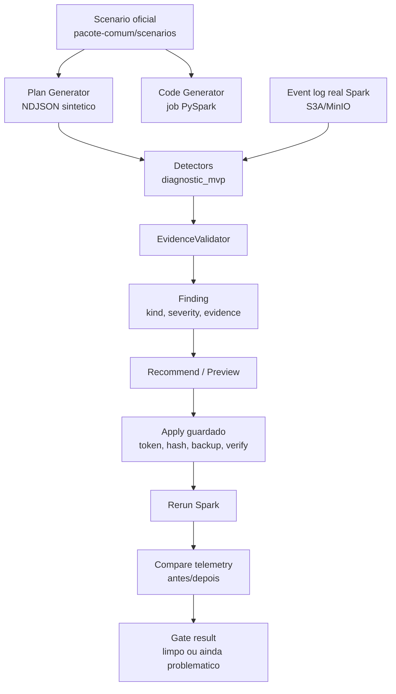
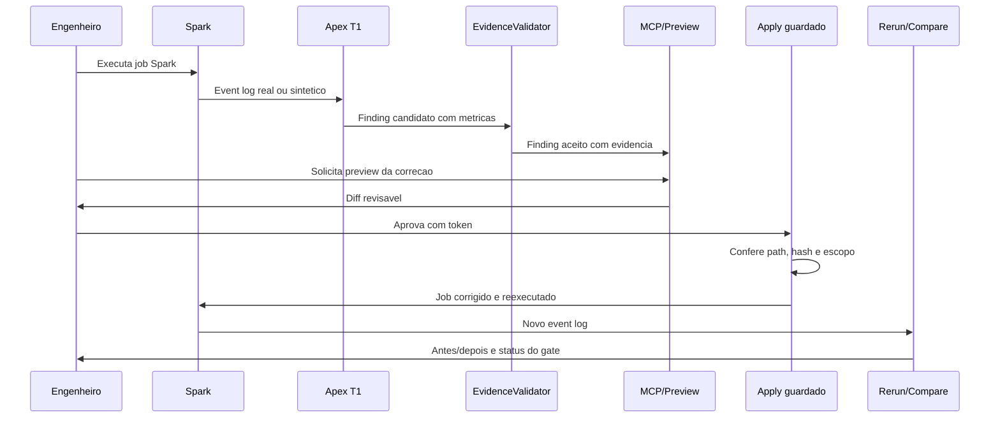

# Especificacao Tecnica - Apex Codex Round2

Data: 2026-07-14

Branch de trabalho: `codex-round2`

Base de avaliacao: `pacote-comum/apex-v1-spec-reproducivel.md`

## Objetivo

Esta especificacao descreve o estado tecnico atual da solucao Apex na linha
Codex Round2. O projeto evoluiu do slice inicial `skew_on_join_30x` v4 para uma
esteira local de diagnostico Spark com evidencia reproduzivel:

```text
scenario/log -> detector deterministico -> EvidenceValidator -> recomendacao
-> preview de diff -> apply guardado -> rerun Spark -> comparacao antes/depois
```

O objetivo nao e declarar que a V1 completa esta pronta. O objetivo e provar,
com logs e gates, que o Apex consegue transformar telemetria Spark em finding
acionavel e fechar o ciclo de correcao com seguranca.

## Leitura Executiva

O Apex Codex Round2 faz hoje:

| Capacidade | Estado | Evidencia |
|---|---|---|
| Gera/consome logs Spark sinteticos e reais | Validado | `evidence/g2-cenarios.log`, `evidence/g3-real.log` |
| Detecta 5 classes oficiais de problema | Validado | skew, GC, shuffle/spill, OOM, cartesian product em `evidence/g2-cenarios.log` |
| Mantem baseline negativo limpo | Validado | `evidence/g1-baseline.log` |
| Mede T1 deterministico sem LLM | Validado | 226.991 ms em `evidence/g4-t1.log` |
| Valida evidencias antes de recomendar | Implementado | `apex/commander/evidence_validator.py` |
| Recomenda e gera preview de correcao | Implementado | `apex/commander/recommendations.py`, `apex/commander/fix_preview.py` |
| Aplica correcao com guarda | Validado | token, hash, verify em `apex/commander/apply_verify.py` e `evidence/g5-ciclo.log` |
| Reexecuta e compara antes/depois | Validado | G5: finding 1 -> 0, shuffle read 1.157.481 bytes -> 0 |
| Expoe MCP stdio local | Implementado | `apex/commander/mcp_stdio_server.py` |
| ClickHouse adapter local | Implementado | `apex/commander/clickhouse_adapter.py`, `apex/commander/clickhouse_http_client.py` |

## Escopo Historico: Slice `skew_on_join_30x` v4

O slice v4 continua sendo a origem da linha de raciocinio. Ele provou que um
contrato declarativo consegue dirigir dois geradores:

- `generators/code_generator.py`: gera um job PySpark com sentinela e manifesto.
- `generators/plan_generator.py`: gera um event log sintetico sem executar Spark.

O Watcher valida o anti-pattern no scenario controlado e o Oraculo compara os
sinais agregados contra um log real do Spark.

Evidencia historica do slice:

```text
synthetic ratio: 27.9x
real ratio:      29.5x
watcher:         GATE VERDE
oracle:          sintetico fiel ao Spark real dentro da tolerancia
```

## Arquitetura Atual



Componentes principais:

| Componente | Arquivo/Pasta | Papel |
|---|---|---|
| Detectores deterministicos | `apex/commander/diagnostic_mvp.py` | Identifica skew, GC, shuffle/spill, OOM e cartesian product |
| Validador de evidencia | `apex/commander/evidence_validator.py` | Bloqueia findings com evidencia fraca ou incompleta |
| Modelos de telemetria | `apex/commander/telemetry.py` | Normaliza `job_id`, `app_id`, stages, tasks e plano |
| ClickHouse local/HTTP | `apex/commander/clickhouse_adapter.py`, `apex/commander/clickhouse_http_client.py` | Consulta e persiste telemetria/finding |
| MCP stdio | `apex/commander/mcp_stdio_server.py` | Expoe tools locais para agente/IDE |
| Recomendacoes | `apex/commander/recommendations.py` | Transforma finding validado em recomendacao |
| Preview de fix | `apex/commander/fix_preview.py` | Gera diff revisavel antes de alterar arquivo |
| Apply guardado | `apex/commander/apply_verify.py` | Exige approval token, confere hash e verifica apply |
| Rerun/compare | `apex/commander/rerun_compare.py`, `apex/commander/spark_rerun_template.py` | Reexecuta job e compara telemetria antes/depois |
| Evidencias | `evidence/` | Logs crus G0-G5, jobs gerados e event logs reais |

## Fluxo Funcional



## Gates Oficiais Fechados

| Gate | Objetivo | Resultado Codex Round2 |
|---|---|---|
| G0 | Build/testes e contrato inicial | Fechado com evidencia em `evidence/g0-testes.log` |
| G1 | Baseline negativo sem falso positivo | Fechado: baseline sem finding >= warning |
| G2 | 5 cenarios oficiais com severidade esperada | Fechado: skew high, GC critical, shuffle critical, OOM critical, cartesian critical |
| G3 | Dado real Spark multicore | Fechado: app novo `app-20260712053414-0001`, ratio real 29.4 |
| G4 | T1 < 1s sem LLM | Fechado: 226.991 ms, 0 chamada LLM obrigatoria |
| G5 | detectar -> fix -> rerun -> limpo | Fechado: 1 finding high -> 0 findings, shuffle read 1.157.481 bytes -> 0 |

## Caso De Uso Validado: Skew Em Join

Entrada:

```text
pacote-comum/scenarios/skew_on_join_30x.yaml
```

Execucao real usada no G3/G4:

```text
app_id: app-20260712053414-0001
event_log: evidence/generated/g3/g3_real_eventlog.zstd
finding: shuffle_skew_candidate
severity: high
ratio: 29.4
hot_records: 164956
median_cold_records: 5617
task_count: 8
```

Correcao aplicada no G5:

- habilitar AQE;
- habilitar skew join;
- permitir broadcast threshold;
- trocar join forcado `shuffle_merge` por `broadcast(customers)`;
- preservar diff revisavel e apply com token.

Resultado antes/depois:

| Metrica | Antes | Depois |
|---|---:|---:|
| `app_id` | `app-20260712053414-0001` | `app-20260712131734-0004` |
| Finding count | 1 | 0 |
| Severidade maxima | high | n/a |
| Shuffle read bytes | 1.157.481 | 0 |
| Shuffle read records | 200.100 | 0 |
| Skew ratio valido | 29.4 | 0 |

## Contrato De Seguranca Do Apply

O apply guardado nao edita codigo diretamente sem passar por controles:

| Controle | Papel |
|---|---|
| Preview antes do apply | Mostra diff antes de alterar arquivo |
| Approval token | Vincula aprovacao ao `job_id`, recomendacao, target e hashes |
| `apply_root` | Bloqueia path fora do workspace autorizado |
| Hash antes/depois | Garante que o arquivo aplicado e exatamente o previsto |
| Verify | Confirma que o conteudo final bate com o hash esperado |
| Rerun/compare | Prova se a correcao melhorou a telemetria |

Essa camada reduz o risco de um agente editar codigo arbitrariamente ou aplicar
uma recomendacao sem evidencia.

## Diferencial Do Projeto

O Apex Codex Round2 se diferencia de um dashboard passivo porque tenta fechar o
loop operacional:

```text
observar -> diagnosticar -> validar -> recomendar -> aplicar com guarda
-> reexecutar -> provar melhoria
```

Em relacao a ferramentas como DataFlint, o diferencial pretendido nao e ter
mais UI no curto prazo. O diferencial e ser local-first, auditavel, extensivel e
capaz de registrar cada decisao por evidencia, diff e resultado antes/depois.

## O Que Ainda Nao Esta Pronto

| Gap | Impacto |
|---|---|
| SparkListener JVM real fail-safe | Hoje a prova usa event logs e templates; listener real ainda precisa ser implementado |
| `docker compose up` autonomo da branch | G3/G5 validaram contra `plat-v0`/`spv0-*`; a branch ainda nao e plataforma completa independente |
| Crew.ai/Judge | Escalonamento LLM e decisao de baixa confianca continuam como design, nao entrega funcional |
| Tool chamada `apply_fix` | O ciclo existe como `apply_recommendation`; falta alinhar nome/contrato MCP comum |
| IDE real | MCP stdio existe, mas o ciclo nao foi validado dentro de Cursor/VS Code/Claude Code |
| Oraculo agendado G6 | Existe comparacao manual; falta drift/CI recorrente |

## Proximos Passos Recomendados Para O Commander

1. Decidir se a proxima fase prioriza plataforma propria (`docker compose` +
   SparkListener real) ou UX IDE (`apply_fix` MCP real).
2. Se a prioridade for V1 fundacao, integrar a plataforma Spike/plat-v0 de forma
   controlada, mantendo G0-G5 como gates obrigatorios.
3. Se a prioridade for produto, alinhar `apply_recommendation` para `apply_fix`
   e fazer smoke test com cliente MCP real.
4. Promover ADRs formais sobre:
   - origem do apply guardado;
   - papel do `plat-v0`;
   - politica de LLM opcional;
   - contrato de seguranca para auto-edicao.

## Artefatos De Referencia

| Artefato | Caminho |
|---|---|
| Plano F0 | `PLANO.md` |
| Catalogo de issues | `ISSUES.md` |
| Autoavaliacao F5 | `docs/autoavaliacao.md` |
| Evidencia G1 | `evidence/g1-baseline.log` |
| Evidencia G2 | `evidence/g2-cenarios.log` |
| Evidencia G3 | `evidence/g3-real.log` |
| Evidencia G4 | `evidence/g4-t1.log` |
| Evidencia G5 | `evidence/g5-ciclo.log` |
| Comparacao LLM/DataFlint | `docs/architecture/llm-solution-validation-framework-2026-07-13.md` |
