# Fase 1 - Fluxo macro em raias

## Objetivo

Esta visao responde quem e responsavel por cada parte do fluxo. As seis
pastas tecnicas foram agrupadas em quatro raias didaticas, sem esconder a
propriedade real de cada modulo.

| Raia didatica | Modulos reais | Responsabilidade |
|---|---|---|
| Ambiente Spark | `dev/`, `jar/` | gerar uma patologia e capturar sinais do Spark |
| Coleta | `collect/` | receber OTLP, limitar memoria e remover PII |
| Armazenamento | `infra/` | transformar e consultar dados por `job_id` |
| Servico e aprovacao | `engine/`, `serve/`, engenheiro | diagnosticar, propor e decidir |

```mermaid
flowchart LR
  subgraph A[Ambiente Spark: DEV e JAR]
    A1[Gerador deterministico\nhot key e cenarios] --> A2[Spark 4.1.2\njob executa]
    A2 --> A3[ApexPlugin\nSparkListener e AQE]
  end
  subgraph B[Coleta: COLLECT]
    B1[OTLP HTTP :4318] --> B2[memory_limiter]
    B2 --> B3[redacao e remocao de PII]
  end
  subgraph C[Armazenamento: INFRA]
    C1[otel_traces] --> C2[Materialized Views]
    C2 --> C3[spark_events\nplan_transitions\nfindings]
  end
  subgraph D[Servico e aprovacao: ENGINE e SERVE]
    D1[Watchers deterministicos] --> D2[Gate Crew/Judge opcional]
    D2 --> D3[MCP: analisar, comparar, buscar, sugerir]
    D3 --> D4[Engenheiro\nrevisa proposta]
  end
  A3 -->|OTLP/HTTP, spans apex.stage e apex.plan_transition| B1
  B3 -->|exporter ClickHouse| C1
  C3 -->|consulta parametrizada por job_id| D1
  D3 -->|JSON-RPC stdio, sem auto-apply| D4
```

## O que cruza cada fronteira

| De | Para | Dado | Protocolo | Regra de seguranca |
|---|---|---|---|---|
| DEV | JAR | aplicacao Spark e configuracao `spark.apex.*` | Spark plugin API | plugin fail-safe nao derruba o driver |
| JAR | COLLECT | `apex.stage`, `apex.plan_transition` | OTLP/HTTP Protobuf | plano e literais redigidos antes do envio |
| COLLECT | INFRA | spans OTLP normalizados | ClickHouse native exporter | PII removida, hash/HMAC quando aplicavel |
| INFRA | ENGINE | eventos, transicoes e findings por `job_id` | queries ClickHouse parametrizadas | nenhuma SQL e montada com input do usuario |
| ENGINE | SERVE | findings validados e comparacoes | ClickHouse + modelos tipados | LLM opcional nao substitui evidencia |
| SERVE | Humano | diagnostico e proposta de diff | MCP stdio JSON-RPC | `suggest_fix` retorna dados, nao grava |

## Como estudar esta fase

Comece pelo `job_id`: ele e a chave que acompanha a execucao desde o Spark ate
o MCP. Depois siga os dois sinais produzidos pelo JAR: evento de estagio e
transicao AQE. O primeiro descreve sintomas; o segundo descreve uma decisao do
proprio Spark, como `skew_split` ou `coalesce`.
