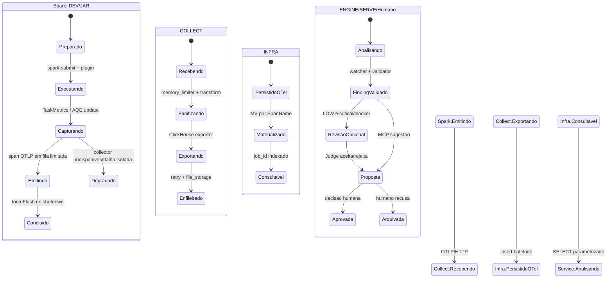

# Fase 2 - Estados distribuidos

Nao existe uma unica maquina de estados central. O estado muda em cada raia,
e uma transicao so e aceita quando a proxima camada recebeu o dado esperado.

## Estados que merecem atencao

| Estado | Dono | Entrada | Saida | Falha segura |
|---|---|---|---|---|
| `Capturando` | JAR | callbacks Spark | metricas agregadas por estagio | excecoes sao recuperadas; listener nao derruba job |
| `Emitindo` | JAR | evento sanitizado | span OTLP | fila limitada descarta antes de bloquear driver |
| `Sanitizando` | COLLECT | atributos OTLP | atributos removidos/mascarados | memoria limitada e retry controlado |
| `Materializado` | INFRA | `otel_traces` | tabelas de contrato | MV separa eventos e transicoes |
| `FindingValidado` | ENGINE | evento e regra | finding tipado | sem LLM no caminho deterministico |
| `RevisaoOpcional` | Crew/Judge | candidato validado | veredito com citacoes | falha do provider preserva Tier 1 |
| `Proposta` | SERVE | finding persistido | diff e PR body como dados | nao escreve disco, Git ou Spark |

## Transicoes intencionalmente proibidas

- JAR nao consulta ClickHouse nem decide correcao.
- Collector nao interpreta causa raiz; ele transporta e sanitiza.
- Crew/Judge nao cria finding sem evidencia Tier 1.
- MCP nao aplica codigo automaticamente.
- Nenhuma camada recebe segredo dentro de um span, finding ou resposta MCP.
