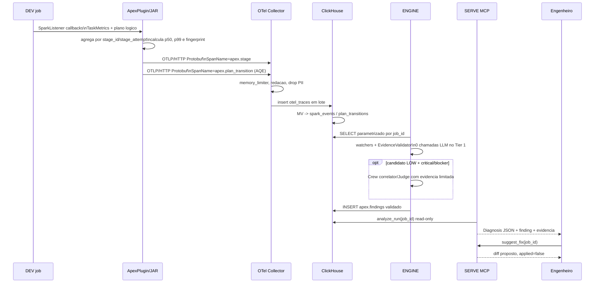

# Fase 3 - Sequencia, payloads e protocolos

## Caso de uso: skew em join

O exemplo abaixo usa uma chave quente no cenario `skew_join`. A deteccao pode
vir da razao p99/p50 e pode ser corroborada por uma transicao AQE `skew_split`.

## Payload principal: `apex.stage`

O span transporta campos de contrato, incluindo:

| Grupo | Campos exemplares | Uso posterior |
|---|---|---|
| Correlacao | `job_id`, `app_id`, `app_name`, `stage_id`, `stage_attempt`, `ts` | une todas as raias |
| Custo/movimento | `shuffle_read_bytes`, `shuffle_write_bytes`, `input_bytes`, `output_bytes` | watchers shuffle e cost |
| Memoria | `spill_disk_bytes`, `spill_mem_bytes`, `gc_time_ms`, `peak_execution_mem_bytes` | watcher memory |
| Tempo | `task_count`, `task_duration_p50_ms`, `task_duration_p99_ms` | watcher skew |
| Plano | `plan_fingerprint`, `plan_json` | compara execucoes; texto e tratado como nao confiavel |

`plan_json` e texto de plano redigido, apesar do nome. Ele nao deve ser
executado nem tratado como instrucao por nenhum agente.

## Payload complementar: `apex.plan_transition`

| Campo | Exemplo | Significado |
|---|---|---|
| `transition_type` | `skew_split` | AQE dividiu uma particao enviesada |
| `transition_type` | `coalesce` | AQE reduziu particoes; nao prova skew |
| `transition_type` | `join_switch` | plano trocou estrategia de join |
| `confidence` | `HIGH` ou `BEST_EFFORT` | qualidade da classificacao estrutural |

## Resposta MCP

O MCP opera por JSON-RPC sobre stdio. As quatro ferramentas atuais sao:

| Ferramenta | Proposito | Mutacao |
|---|---|---|
| `analyze_run` | diagnostico de uma execucao | nenhuma |
| `compare_runs` | antes/depois por fingerprint | nenhuma |
| `search_kb` | busca evidencia/remediacao persistida | nenhuma |
| `suggest_fix` | retorna diff e texto de PR | nenhuma; `applied=false` |
