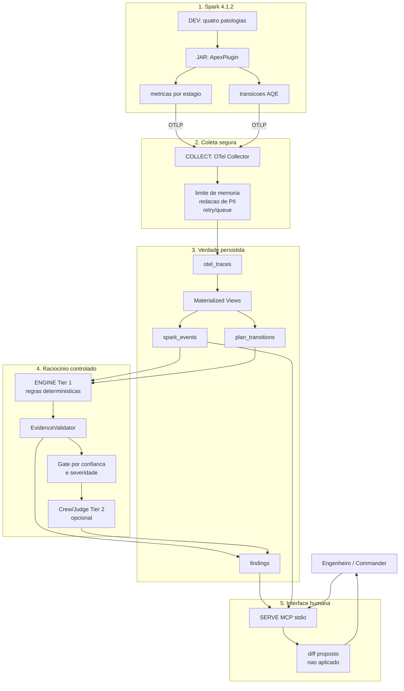

# Fase 4 - Arquitetura global para a Demo Luan

## Mapa consolidado

## Diferencial tecnico que a arquitetura tenta provar

1. O dado nasce no Spark, nao em uma interpretacao posterior de logs.
2. A decisao AQE e armazenada como sinal distinto do sintoma de performance.
3. A primeira resposta custa zero LLM e e reproduzivel.
4. A camada LLM e subordinada a evidencia, tem gate e falha de modo seguro.
5. A interface entrega proposta revisavel; a pessoa continua dona da mutacao.

## Roteiro de demonstracao em tres minutos

1. Mostre o fluxo global e diga que `job_id` e a chave comum.
2. Rode ou apresente uma evidencia de `skew_join`: evento Spark, tabela e finding.
3. Mostre `analyze_run` no MCP e a evidencia do estagio.
4. Mostre `suggest_fix`: ha diff, mas `applied=false` e aprovacao humana.
5. Feche com o gate E2E: DEV, JAR, COLLECT, INFRA, ENGINE e SERVE concordam.

## O que nao deve ser prometido na demo

- A rodada nova com Docker nao foi concluida enquanto o daemon estiver indisponivel.
- `suggest_fix` nao faz apply, rerun ou merge.
- O Crew/Judge externo depende de credencial fornecida pelo operador e continua opcional.
- Esta branch aguarda revisao do Commander; ela nao e a base central.
