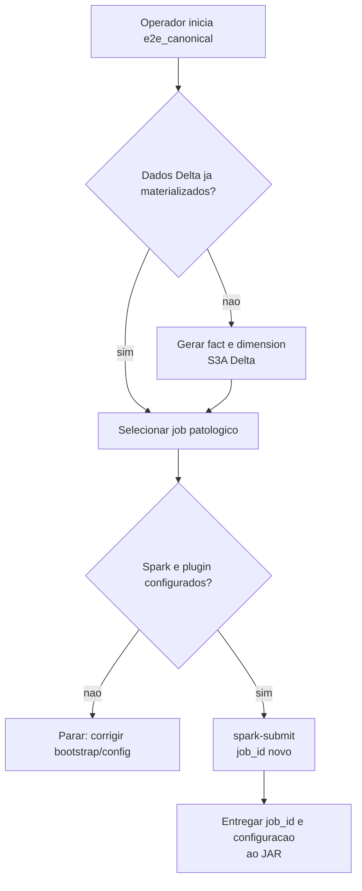
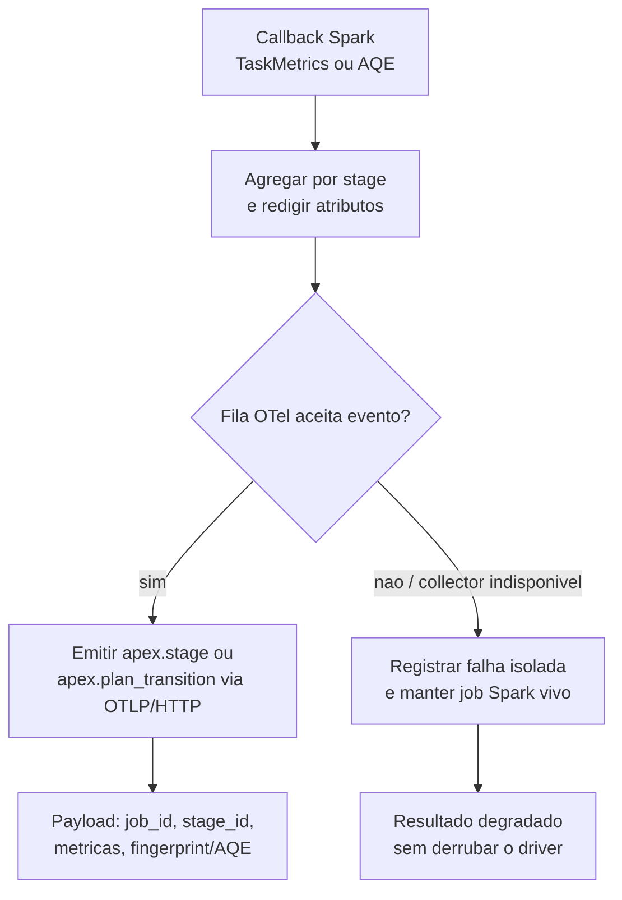
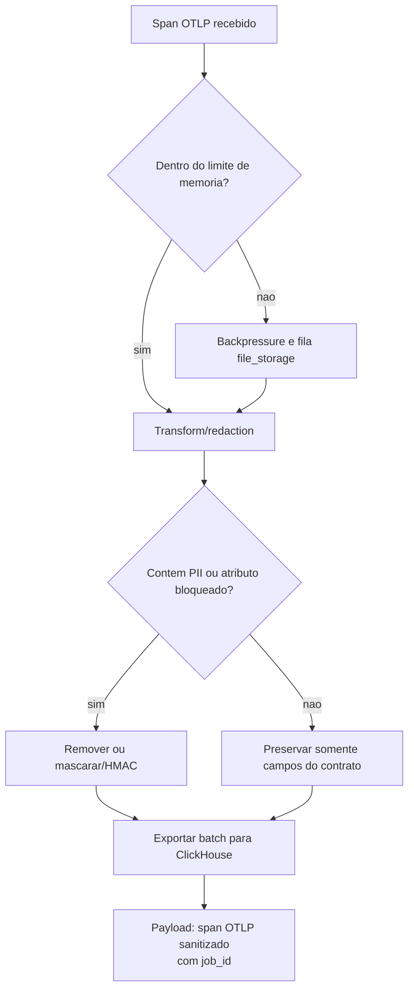
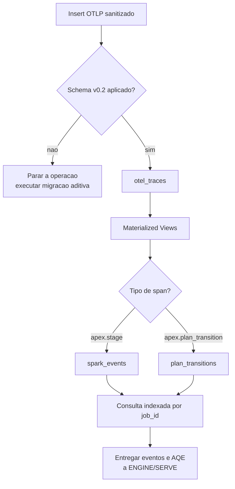
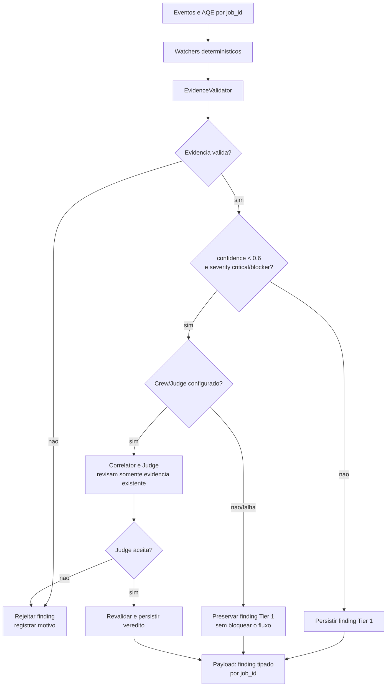
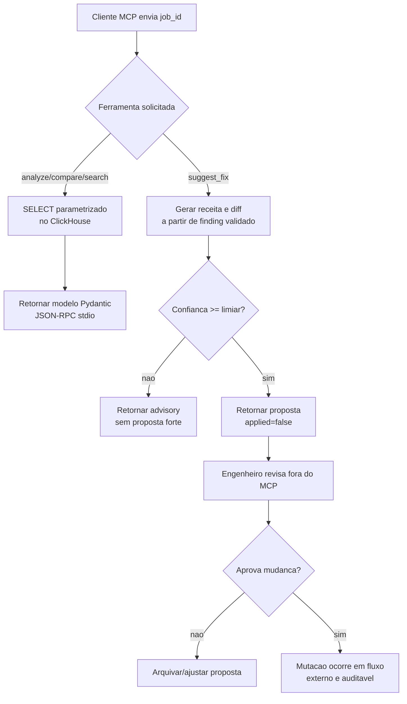

# Fase 7 - Decisoes por raia e visao global

Este mapa complementa o fluxo e a sequencia: cada losango mostra quem toma a
decisao, qual dado e usado e para onde o caso segue. Nenhuma decisao humana e
substituida por um modelo.

## 1. DEV - executar uma patologia?

## 2. JAR - emitir ou degradar com seguranca?

## 3. COLLECT - aceitar e sanitizar?

## 4. INFRA - persistir e tornar consultavel?

## 5. ENGINE - publicar, escalar ou rejeitar?

## 6. SERVE - informar ou propor?

## Decisao global - da telemetria a uma correcao humana

```mermaid
flowchart LR
  D[DEV\njob + job_id] -->|spark-submit e configuracao| J[JAR\nmetricas/AQE]
  J -->|OTLP/HTTP\nspan sanitizado| C[COLLECT\nredacao/backpressure]
  C -->|batch OTLP\nsem PII| I[INFRA\nClickHouse]
  I -->|SELECT parametrizado\neventos por job_id| E[ENGINE\nwatchers + validator]
  E -->|finding tipado\ne evidencia citada| S[SERVE\nMCP]
  S -->|JSON-RPC\ndiagnostico ou diff| H[Humano\nCommander/engenheiro]
  H -->|aprovacao externa\ncom auditoria| R[Repositorio/job corrigido]
  H -->|recusa ou evid. insuficiente| A[Sem mutacao\nregistrar decisao]

  classDef data fill:#dbeafe,stroke:#2563eb,color:#111827
  classDef decision fill:#fef3c7,stroke:#d97706,color:#111827
  classDef human fill:#dcfce7,stroke:#16a34a,color:#111827
  class D,J,C,I,E,S data
  class H,R,A human
```

## Regra de leitura

O `job_id` e a chave entre todas as raias. Os dados fluem automaticamente ate
o MCP; a decisao que muda codigo ou uma execucao fica deliberadamente fora do
servidor MCP e exige uma pessoa responsavel.
