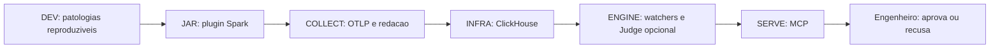

# APEX V1 - Caderno de estudo por raias

Este caderno explica a implementacao presente em `base-project-e2e-augusto`.
Ele complementa os briefs de construcao em `docs/lanes/`: aqueles documentos
definem o trabalho; estes explicam como estudar, operar e revisar o que existe.

## Ordem recomendada

1. [Visao macro em raias](01-swimlanes-macro.md)
2. [Estados distribuidos](02-estados-distribuidos.md)
3. [Sequencia e payloads](03-sequencia-payloads.md)
4. [Arquitetura global](04-arquitetura-global.md)
5. [Guia por raia](05-guia-por-raia.md)
6. [Matriz de testes e evidencias](06-testes-e-evidencias.md)

## Leitura rapida

APEX recebe metricas de um job Spark, transporta somente telemetria
sanitizada, persiste-a no ClickHouse, aplica diagnostico deterministico e a
entrega por MCP. CrewAI/Judge e uma camada opcional e rigidamente limitada:
ele pode revisar um candidato de baixa confianca e severidade alta, mas nao
pode inventar metricas, gravar arquivos ou aplicar uma correcao.

## Limites de honestidade

- Os testes locais e a evidencia de execucao real estao em
  [06-testes-e-evidencias.md](06-testes-e-evidencias.md).
- Uma nova rodada Docker-backed ainda depende de um daemon Docker responsivo.
- Esta branch nao modifica nem se auto-integra em `feat/base-project-e2e`.
- Nenhuma chave, senha, token ou dump de ambiente e documentado aqui.

Para o contrato de campos, consulte [CONTRACT.md](../../CONTRACT.md). Para o
estado de revisao, consulte [C10](../convergence/C10-AUGUSTO-E2E-READINESS-2026-07-24.md).
